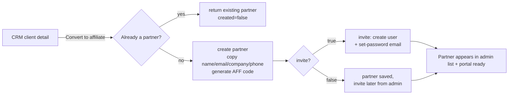
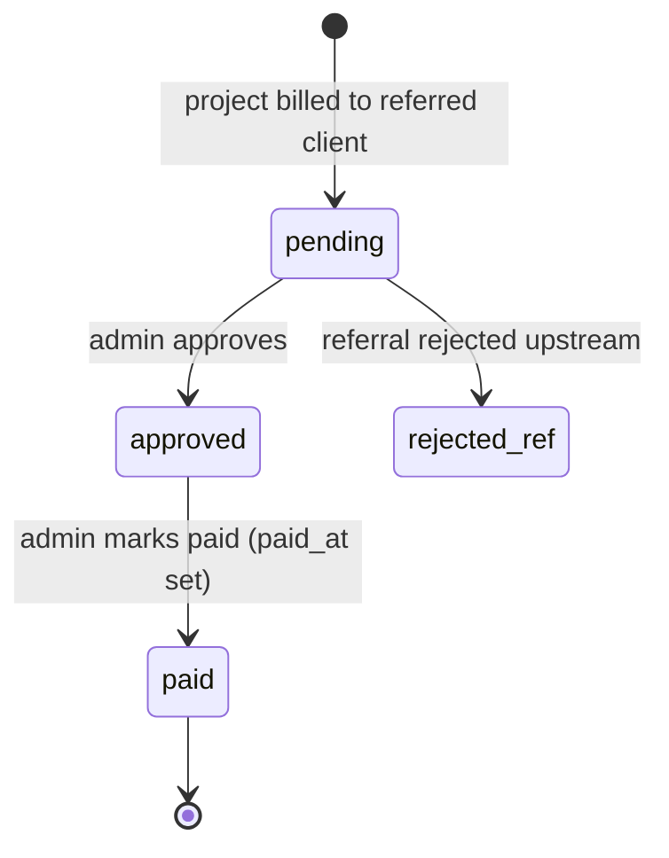

# Affiliate Extension — Backend

Affiliate program for Foundation: partners (companies or individuals) refer
clients, referred clients become CRM clients, and each project billed to a
referred client generates a **commission** that follows the lifecycle
`pending → approved → paid`.

- **Admin** (`admin` role) manages partners, referrals and commissions and can
  convert a CRM client into a partner in one action (`from-client`).
- **Affiliate partner** (`affiliate` role) has a self-service portal limited to
  their own data: profile (limited fields), referrals and commissions. A portal
  user can **only** access these portal endpoints — nothing else in the app.

## Module map

```
src/extensions/affiliate/
├── extension.module.ts        # NestJS module (auto-discovered by ExtensionLoader)
├── extension.manifest.ts      # metadata (deps: crm), contribution lists
├── controllers/
│   ├── affiliate-partner.controller.ts     # /v1/affiliate/partners (admin)
│   ├── affiliate-referral.controller.ts    # /v1/affiliate/referrals (admin)
│   ├── affiliate-commission.controller.ts  # /v1/affiliate/commissions (admin)
│   ├── affiliate-dashboard.controller.ts   # /v1/affiliate/dashboard (admin)
│   └── affiliate-portal.controller.ts      # /v1/affiliate/portal/* (affiliate|admin)
├── services/                  # one service per controller + dashboard/report
├── dto/                       # class-validator DTOs
├── emails/welcome.vue         # maizzle email template (invite mail)
└── infrastructure/persistence/entities/
    ├── affiliate-partner.entity.ts     # ext_affiliate_partner
    ├── affiliate-referral.entity.ts    # ext_affiliate_referral
    └── affiliate-commission.entity.ts  # ext_affiliate_commission
```

## Entities (ER)

```mermaid
erDiagram
    EXT_AFFILIATE_PARTNER ||--o{ EXT_AFFILIATE_REFERRAL : "has"
    EXT_AFFILIATE_REFERRAL ||--o{ EXT_AFFILIATE_COMMISSION : "generates"
    EXT_AFFILIATE_REFERRAL }o--|| EXT_CRM_CLIENT : "refers"
    EXT_AFFILIATE_PARTNER }o--o| EXT_CRM_CLIENT : "linked (from-client)"
    EXT_AFFILIATE_PARTNER }o--o| USER : "portal login"
    EXT_AFFILIATE_COMMISSION }o--|| EXT_CRM_PROJECT : "billed on"

    EXT_AFFILIATE_PARTNER {
        int id PK
        int clientId FK "SET NULL — CRM origin of the partner"
        int userId FK "SET NULL — portal user"
        varchar code UK "AFF-XXXXXX public referral code"
        varchar name
        varchar companyName
        varchar email UK
        varchar phone
        varchar iban
        decimal commission_rate "default 0.05"
        boolean is_active
        jsonb metadata
    }
    EXT_AFFILIATE_REFERRAL {
        int id PK
        int partnerId FK
        int clientId FK_UK "one referral per CRM client"
        int originId FK
        varchar status "pending|converted|rejected"
        timestamp referred_at
    }
    EXT_AFFILIATE_COMMISSION {
        int id PK
        int referralId FK
        int projectId FK "unique per referral"
        decimal base_amount
        decimal commission_rate
        decimal commission_amount "base_amount * rate"
        varchar status "pending|approved|paid"
        timestamp paid_at
    }
```

## Endpoints

All endpoints require `Authorization: Bearer <jwt>`; role enforced by
`RolesGuard`. `affiliate` users can **only** call the `portal/*` group.

| Method | Path | Role | Description |
|---|---|---|---|
| GET | `/v1/affiliate/partners` | admin | Paginated list (`page`,`limit`,`search` incl. code/email/name), with `referralsCount` |
| GET | `/v1/affiliate/partners/:id` | admin | Detail with referrals + client + commissions |
| POST | `/v1/affiliate/partners` | admin | Create partner (generates `code`) |
| POST | `/v1/affiliate/partners/from-client/:clientId` | admin | Convert CRM client → partner. Idempotent (`{ created }`). Body: `commissionRate`, `invite?` (default true) |
| PATCH | `/v1/affiliate/partners/:id` | admin | Update |
| DELETE | `/v1/affiliate/partners/:id` | admin | Soft delete |
| POST | `/v1/affiliate/partners/:id/invite` | admin | Create/reuse portal user + email set-password link |
| GET | `/v1/affiliate/referrals` | admin | List (`partnerId`,`status` filters) |
| POST | `/v1/affiliate/referrals` | admin | Create referral (links CRM client, tags origin) |
| PATCH | `/v1/affiliate/referrals/:id` | admin | Update status (`pending|converted|rejected`) |
| DELETE | `/v1/affiliate/referrals/:id` | admin | Delete referral |
| GET | `/v1/affiliate/commissions` | admin | List |
| GET | `/v1/affiliate/commissions/summary` | admin | Aggregates (`partnerId`,`status`,`dateFrom`,`dateTo`) |
| POST | `/v1/affiliate/commissions` | admin | Create commission on a project |
| PATCH | `/v1/affiliate/commissions/:id` | admin | Update status / mark paid |
| GET | `/v1/affiliate/dashboard` | admin | KPIs: totals, top partners, monthly series |
| GET | `/v1/affiliate/portal/me` | affiliate, admin | Own partner profile |
| PATCH | `/v1/affiliate/portal/me` | affiliate, admin | Edit allowlisted fields: `phone`, `iban`, `companyName` |
| GET | `/v1/affiliate/portal/referrals` | affiliate, admin | Own referrals (paginated) |
| POST | `/v1/affiliate/portal/referrals` | affiliate, admin | Refer a new lead (creates CRM client tagged with partner origin) |
| GET | `/v1/affiliate/portal/referrals/:id` | affiliate, admin | Own referral detail (ownership enforced) |
| GET | `/v1/affiliate/portal/commissions` | affiliate, admin | Own commissions |
| GET | `/v1/affiliate/portal/summary` | affiliate, admin | Own earnings totals (pending/approved/paid/paidThisMonth) |

Portal scoping uses `@CurrentUser()` → `user.id` → partner lookup (`userId`
FK). Partner `name`, `email` and `code` are never portal-editable.

## Invitation flow (set-password, no plaintext passwords)

The invite creates (or reuses) a **user** with role `affiliate` and emails a
time-limited **set-password link**. It reuses the platform reset-password flow:
the same `auth.forgotSecret` JWT (payload `{ forgotUserId }`), the same
`/password-change` frontend page, and the same `auth.forgotExpires` TTL.

```mermaid
sequenceDiagram
    actor Admin
    participant API as Affiliate API
    participant DB
    participant Mail as Email queue
    actor Affiliate

    Admin->>API: POST /v1/affiliate/partners/:id/invite
    API->>DB: user exists for partner.email?
    alt user does not exist
        API->>DB: create user (role=affiliate, random unusable password)
    end
    API->>API: sign JWT { forgotUserId } (auth.forgotSecret, TTL=forgotExpires)
    API->>Mail: welcome template with link ${frontendDomain}/password-change?hash=...&expires=...
    Mail-->>Affiliate: invitation email
    Affiliate->>Affiliate: opens link, sets new password
    Affiliate->>API: POST /v1/auth/email/reset-password (existing auth flow)
    Note over API,DB: partner.userId set during invite; portal queries scope by user.id
```

If the partner already logs in with another account for the same email, the
link still works to replace the unusable password: reset flow targets the user
by id.

## CRM → Affiliate conversion



Key rules:

- Idempotent by `clientId`; second call returns the existing partner with
  `created=false`.
- If another partner already exists with the same email, the CRM client gets
  **linked** to it instead of failing.
- Client without email is rejected (`BadRequestException`).
- `invite` fails are logged and do not roll back partner creation.

## Commission lifecycle



Portal partners see the same lifecycle as read-only totals (`summary`).
Referral status is separate: `pending → converted|rejected`, and one referral
per CRM client (`clientId` unique).

## Tests

```bash
pnpm vitest run src/extensions/affiliate   # from apps/back
```

Covers: code generation format/collisions, invite (user creation, link email
without password, duplicate-invite conflict), from-client (create+invite,
idempotency, no-email rejection).