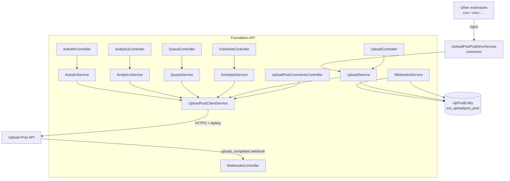
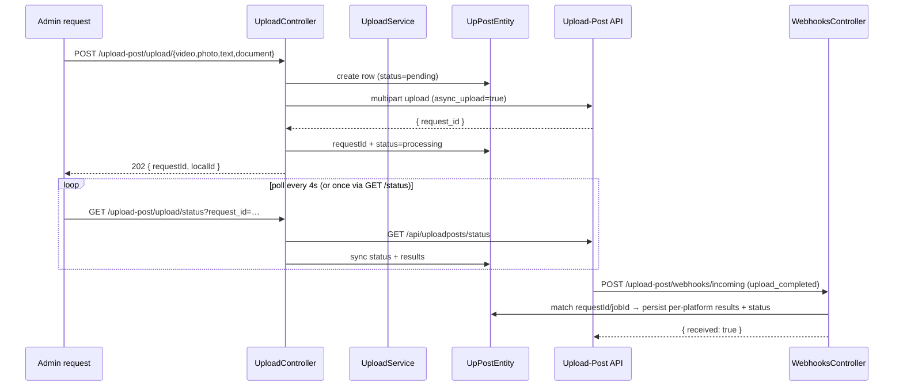
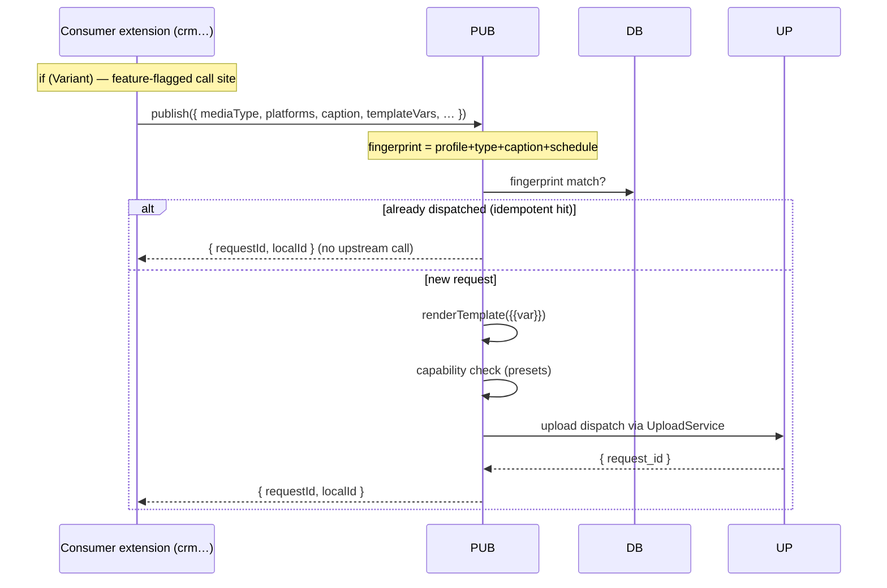

# Upload-Post Extension

Social media automation via the [Upload-Post API](https://docs.upload-post.com) — multi-platform publishing (TikTok, Instagram, YouTube, LinkedIn, Facebook, X, Threads, Pinterest, Reddit, Bluesky), scheduling, queueing, analytics, unified comments/DMs, AutoDM monitors, webhooks and weekly reports. Admin-only, except the inbound webhook receiver.

This README explains **how the extension is built** and how other extensions consume it
as a **publisher connector**.

---

## Module anatomy

```
src/extensions/upload-post/
├── extension.module.ts          ← Wiring. Discovered automatically — no app.module.ts edits.
├── extension.manifest.ts        ← Route + entity metadata for the platform registry.
├── extension.config.ts          ← registerAs('upload-post') — reads env vars.
├── upload-post.provider.ts      ← Validates UPLOAD_POST_API_KEY, exposes UploadPostConfig.
├── config/                      ← Config types + defaults.
├── controllers/                 ← Admin-only HTTP surface (one exception: webhooks/incoming).
├── dto/                         ← class-validator DTOs per endpoint group.
├── services/
│   ├── publisher.service.ts     ← Internal publish connector (injectable by other extensions).
│   ├── upload.service.ts        ← Upload flows + local UpPostEntity persistence.
│   ├── upload-post-client.service.ts  ← Thin 1:1 HTTP wrapper over Upload-Post REST.
│   ├── webhooks.service.ts      ← Inbound webhook handling → DB status sync.
│   ├── instagram.service.ts     ← Instagram media/comments/DMs.
│   ├── platforms.service.ts     ← Destination metadata (FB pages, LinkedIn pages, boards).
│   ├── schedule.service.ts      ← Scheduled-post CRUD (upstream jobs).
│   ├── queue.service.ts         ← Queue preview/settings.
│   ├── analytics.service.ts     ← KPIs + chart series.
│   ├── monthly-analytics.service.ts / weekly-report.service.ts
│   ├── autodm.service.ts        ← AutoDM lifecycle + logs.
│   └── content-ideas.service.ts ← Local idea backlog CRUD.
├── infrastructure/persistence/entities/   ← TypeORM entities (prefix ext_uploadpost_).
├── dto/                         ← Request DTOs.
└── __tests__/                   ← Vitest specs (see vitest.config.ts include list).
```

### Discovery & config

- **Auto-discovery**: any folder under `src/extensions/` containing `extension.module.ts`
  is loaded by `ExtensionLoaderModule`. Copy the folder in → it works; delete it → gone.
- **Config** (`extension.config.ts`): reads `UPLOAD_POST_API_KEY`, `UPLOAD_POST_PROFILE_USERNAME`,
  `UPLOAD_POST_WEBHOOK_SECRET`, weekly-report cron/email. For an unconfigured key the
  provider logs a warning and the extension is inert — the app still boots.
- **Entities** share the `ext_uploadpost_` table prefix; TypeORM discovers them via glob.
- **RBAC**: controllers are `AuthGuard('jwt') + RolesGuard + @Roles(RoleEnum.admin)`.
  `POST /upload-post/webhooks/incoming` is public and HMAC-validated instead.

### Environment variables

| Variable | Purpose |
|---|---|
| `UPLOAD_POST_API_KEY` | API key (required for any dispatch; without it the extension is inert) |
| `UPLOAD_POST_PROFILE_USERNAME` | Default Upload-Post profile used by uploads |
| `UPLOAD_POST_WEBHOOK_SECRET` | HMAC secret for `webhooks/incoming` signature validation |
| `UPLOAD_POST_WEEKLY_REPORT_CRON` | Weekly report schedule (default `0 9 * * 1`) |
| `UPLOAD_POST_WEEKLY_REPORT_EMAIL` | Weekly report recipient |

### Testing

```bash
cd apps/back
npx vitest run src/extensions/upload-post/__tests__   # this extension only
npx vitest run                                        # whole backend suite
```

---

## Architecture



## Upload + polling / webhook flow



## Connector publish sequence (cross-extension usage)

