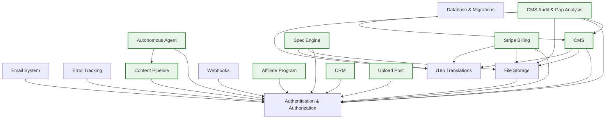

# Foundation — Architecture Overview

> ⚡ Auto-generated by `bin/sync-docs.js` on 2026-08-03 12:23:45 UTC.
> Edit individual docs in `docs/modules/`, `docs/extensions/`, `docs/custom/`, or `docs/research/` and re-run `pnpm docs:sync` to regenerate.

---

## Project Structure

```
foundation/
├── apps/
│   ├── back/     # NestJS API
│   └── front/    # Nuxt 3 SPA
├── docs/         # Documentation
│   ├── modules/        # Core module documentation
│   ├── extensions/     # Extension documentation
│   ├── custom/         # Client-specific customizations
│   └── research/       # Research documents
└── docker-compose.yml
```

---

## Module Registry

| ID | Name | Dependencies | Entities |
|----|------|--------------|----------|
| `auth` | Authentication & Authorization | — | User, Role, Session, ApiKey |
| `database` | Database & Migrations | — | Migration (typeorm_migrations table), Seed (idempotent, uses upsert) |
| `email` | Email System | auth | — |
| `error-logging` | Error Tracking | auth | — |
| `storage` | File Storage | auth | File |
| `translations` | i18n Translations | — | Lang |
| `webhooks` | Webhooks | auth | — |

---

## Extensions

| ID | Name | Parent | Dependencies |
|----|------|--------|--------------|
| `affiliate` | Affiliate Program | — | auth |
| `autonomous-agent` | Autonomous Agent | — | auth, content-pipeline |
| `cms-audit` | CMS Audit & Gap Analysis | cms | auth, storage, translations, cms |
| `cms` | CMS | — | auth, storage, translations |
| `content-pipeline` | Content Pipeline | — | auth |
| `crm` | CRM | — | auth |
| `spec-engine` | Spec Engine | — | auth, storage, translations |
| `stripe` | Stripe Billing | — | auth, storage, translations |
| `upload-post` | Upload Post | — | auth |

---

## Custom Documentation

No custom documents registered.

---

## Research Documents

None.

---

## Dependency Diagram



---

## Related Documentation

### Module Docs (canonical)
| [auth.md](./modules/auth.md) | Authentication & Authorization |
| [database.md](./modules/database.md) | Database & Migrations |
| [email.md](./modules/email.md) | Email System |
| [error-logging.md](./modules/error-logging.md) | Error Tracking |
| [storage.md](./modules/storage.md) | File Storage |
| [translations.md](./modules/translations.md) | i18n Translations |
| [webhooks.md](./modules/webhooks.md) | Webhooks |

### Extension Docs
| [affiliate.md](./extensions/affiliate.md) | Affiliate Program |
| [autonomous-agent.md](./extensions/autonomous-agent.md) | Autonomous Agent |
| [cms-audit.md](./extensions/cms-audit.md) | CMS Audit & Gap Analysis |
| [cms.md](./extensions/cms.md) | CMS |
| [content-pipeline.md](./extensions/content-pipeline.md) | Content Pipeline |
| [crm.md](./extensions/crm.md) | CRM |
| [spec-engine.md](./extensions/spec-engine.md) | Spec Engine |
| [stripe.md](./extensions/stripe.md) | Stripe Billing |
| [upload-post.md](./extensions/upload-post.md) | Upload Post |

### Reference Docs
| File | Topic |
|------|-------|
| [FRONTEND-LAYERS.md](./FRONTEND-LAYERS.md) | Nuxt layers, middleware, auth store |
| [EXTENSIONS-SYSTEM.md](./EXTENSIONS-SYSTEM.md) | Dynamic extension modules |
| [GENERATORS.md](./GENERATORS.md) | Hygen CLI generators |
| [CREATE-EXTENSION.md](./CREATE-EXTENSION.md) | How to create an extension |
| [TYPESCRIPT-GUIDELINES.md](./TYPESCRIPT-GUIDELINES.md) | TypeScript conventions |
| [TOOLS.md](./TOOLS.md) | Tool catalog & reference |
