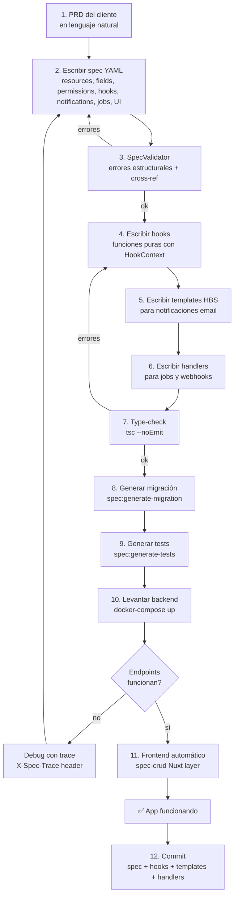

# Spec Engine — Guía de Uso

> Cómo construir una app entera solo con specs, paso a paso. Desde el PRD hasta la app funcionando.

---

## Índice

1. [Workflow completo](#1-workflow-completo)
2. [Paso 1: Leer el PRD](#paso-1)
3. [Paso 2: Escribir la spec YAML](#paso-2)
4. [Paso 3: Escribir hooks](#paso-3)
5. [Paso 4: Escribir templates](#paso-4)
6. [Paso 5: Escribir job handlers](#paso-5)
7. [Paso 6: Escribir webhook handlers](#paso-6)
8. [Paso 7: Validar](#paso-7)
9. [Paso 8: Generar migraciones](#paso-8)
10. [Paso 9: Generar tests](#paso-9)
11. [Paso 10: Frontend](#paso-10)
12. [Ejemplo completo: app de Tasks](#ejemplo-completo)
13. [Patrones y anti-patrones](#patrones)
14. [FAQ](#faq)

---

## 1. Workflow completo



---

## Paso 1: Leer el PRD

Antes de escribir spec, entiende qué necesita el cliente. Ejemplo de PRD:

> **Cliente**: Queremos un kanban de tareas. Las tasks tienen título, descripción, estado (pending, in_progress, review, done, blocked), prioridad (low, medium, high, urgent), assignee, fecha límite y posición en el board.
>
> **Permisos**: Admin puede todo. Customer solo ve sus tasks asignadas y puede actualizarlas.
>
> **Notificaciones**: Cuando se crea una task con assignee, enviar email al assignee.
>
> **Job**: Detectar tasks que llevan más de 24h en pending y avisar por email al admin.
>
> **Webhook**: Recibir alertas externas sobre tasks stale.
>
> **Dashboard**: Total de tasks, distribución por estado, tasks en el tiempo, urgentes abiertas.

De este PRD extraes:
- 1 recurso: task (8 campos)
- 1 recurso anidado: task-comment (3 campos)
- Permisos: admin full, customer row-level (assigneeId == user.id)
- 1 notificación email
- 1 job (stale detection, 60s interval)
- 1 webhook (HMAC)
- 1 dashboard (5 panels)

---

## Paso 2: Escribir la spec YAML

Crea `extensions/tasks/tasks.spec.yaml`:

```yaml
name: tasks
version: 1.0.0
displayName: Tasks

resources:
  - name: task
    table: ext_tasks_task
    fields:
      - name: title
        type: string
        required: true
        validation: { min: 2, max: 200 }
        ui: { display: text, formInput: text, link: true }

      - name: description
        type: text
        nullable: true
        ui: { display: truncate, truncateLength: 50, formInput: textarea }

      - name: status
        type: enum
        required: true
        default: pending
        enum: [pending, in_progress, review, done, blocked]
        ui:
          display: badge
          formInput: select
          colors:
            pending: '#f59e0b'
            in_progress: '#3b82f6'
            review: '#8b5cf6'
            done: '#22c55e'
            blocked: '#ef4444'

      - name: priority
        type: enum
        required: true
        default: medium
        enum: [low, medium, high, urgent]
        ui:
          display: badge
          formInput: select
          colors:
            low: '#6b7280'
            medium: '#3b82f6'
            high: '#f59e0b'
            urgent: '#ef4444'

      - name: assigneeId
        type: ref
        ref: user
        nullable: true
        refOnDelete: SET NULL
        ui: { display: avatar, formInput: select-async, labelField: firstName }

      - name: dueDate
        type: datetime
        nullable: true
        ui: { display: date, formInput: datepicker }

      - name: position
        type: integer
        default: 0
        ui: { display: text, formInput: text }

      - name: metadata
        type: json
        default: {}

    permissions:
      list: [admin, user]
      read: [admin, user]
      create: [admin]
      update: [admin, user]
      delete: [admin]
      fields:
        position: { read: [admin], write: [admin] }
        assigneeId: { read: [admin] }
      rowLevel:
        customer:
          filter: 'assigneeId == ${user.id}'

    hooks:
      beforeCreate: ./hooks/task-before-create.ts
      afterCreate: ./hooks/task-after-create.ts

    notifications:
      - name: notify-assignee
        trigger: { on: afterCreate, when: 'assigneeId != null' }
        channel: email
        template: ./templates/task-assigned.hbs
        to: '${app.notificationEmail}'
        subject: 'Nueva tarea asignada: ${entity.title}'

    jobs:
      - name: stale-tasks-detector
        schedule: interval
        value: 60s
        handler: ./handlers/stale-tasks.handler.ts
        queue: spec-jobs
        retries: 3

    webhooks:
      - name: stale-alert
        path: tasks/webhooks/stale
        method: POST
        auth: hmac
        handler: ./handlers/stale-webhook.handler.ts

    seeds:
      - { title: Setup repo, status: done, priority: high, position: 0 }
      - { title: Design schema, status: in_progress, priority: medium, position: 1 }
      - { title: Write docs, status: pending, priority: low, position: 2 }
      - { title: Deploy staging, status: blocked, priority: urgent, position: 3 }

    ui:
      icon: CheckSquare
      view: table
      sidebar:
        heading: Tasks
        items:
          - { title: All Tasks, icon: CheckSquare, link: /app/tasks, roles: [admin] }
          - { title: My Tasks, icon: User, link: /app/tasks/mine, roles: [user] }

views:
  - name: task-dashboard
    type: dashboard
    roles: [admin]
    panels:
      - { name: total-tasks, chart: stat, label: Total Tasks, query: { resource: task, aggregate: count } }
      - { name: by-status, chart: donut, query: { resource: task, groupBy: status, aggregate: count } }
      - { name: by-priority, chart: bar, query: { resource: task, groupBy: priority, aggregate: count } }
      - { name: urgent-open, chart: stat, label: Urgent Open, query: { resource: task, filter: 'priority == urgent && status != done', aggregate: count } }
      - { name: over-time, chart: line, query: { resource: task, groupBy: createdAt, groupByInterval: day, aggregate: count, timeRange: 30d } }
```

### Checklist de la spec

- [ ] Todos los `ref` targets existen (o son `user` para Foundation)
- [ ] Todos los hook/job/webhook handler paths apuntan a archivos que existen (o los crearás)
- [ ] Todos los template paths apuntan a `.hbs` que existen (o los crearás)
- [ ] Table names empiezan con `ext_`
- [ ] Permisos usan roles válidos: admin, customer, affiliate
- [ ] `rowLevel.filter` usa la sintaxis `field == ${user.id}`
- [ ] `enum` fields tienen `enum: [...]` con valores
- [ ] `required: true` fields tienen valor default en seeds o son proveídos por el cliente

---

## Paso 3: Escribir hooks

### beforeCreate hook

```typescript
// extensions/tasks/hooks/task-before-create.ts
import type { HookContext } from '@core/spec-engine/spec.types';

export default async function beforeCreate(
  data: Record<string, unknown>,
  ctx: HookContext,
): Promise<{ data: Record<string, unknown>; proceed: boolean; error?: string }> {
  ctx.logger.log('Running beforeCreate for task');

  // Auto-assign admin for urgent tasks without assignee
  if (data.priority === 'urgent' && !data.assigneeId) {
    ctx.trace.add('beforeCreate', {
      decision: 'auto-assign-admin',
      reason: 'priority=urgent and no assignee',
    });
    data.assigneeId = 1;

    // Set due date to 24h if not specified
    if (!data.dueDate) {
      data.dueDate = new Date(Date.now() + 24 * 60 * 60 * 1000).toISOString();
    }
  }

  // Validate banned words
  if (typeof data.title === 'string') {
    for (const word of ['TODO', 'FIXME']) {
      if (data.title.toUpperCase().includes(word)) {
        return { data, proceed: false, error: `Title cannot contain "${word}"` };
      }
    }
  }

  return { data, proceed: true };
}
```

### afterCreate hook

```typescript
// extensions/tasks/hooks/task-after-create.ts
import type { HookContext } from '@core/spec-engine/spec.types';

export default async function afterCreate(
  entity: Record<string, unknown>,
  ctx: HookContext,
): Promise<void> {
  ctx.logger.log(`Task created: id=${entity.id}, title=${entity.title}`);
  // Side effects only — errors don't block the response
}
```

### Reglas de los hooks

1. **Importa solo tipos**: `import type { HookContext } from '@core/spec-engine/spec.types'`
2. **Export default**: la función debe ser `export default async function ...`
3. **No uses `this`**: hooks son funciones puras, no métodos de clase
4. **No importes NestJS**: el HookContext provee todo (logger, services, repos)
5. **SanitizeHookOutput**: el engine stripa campos no definidos en spec después del hook
6. **Path containment**: el archivo debe estar dentro del directorio de la extensión

---

## Paso 4: Escribir templates

```handlebars
<!-- extensions/tasks/templates/task-assigned.hbs -->
<h1>Nueva tarea asignada</h1>
<p>Te han asignado una nueva tarea:</p>
<table style="width: 100%; border-collapse: collapse;">
  <tr>
    <td style="padding: 8px; border: 1px solid #e5e7eb; font-weight: bold;">Título</td>
    <td style="padding: 8px; border: 1px solid #e5e7eb;">{{entity.title}}</td>
  </tr>
  <tr>
    <td style="padding: 8px; border: 1px solid #e5e7eb; font-weight: bold;">Prioridad</td>
    <td style="padding: 8px; border: 1px solid #e5e7eb;">{{entity.priority}}</td>
  </tr>
  <tr>
    <td style="padding: 8px; border: 1px solid #e5e7eb; font-weight: bold;">Estado</td>
    <td style="padding: 8px; border: 1px solid #e5e7eb;">{{entity.status}}</td>
  </tr>
  <tr>
    <td style="padding: 8px; border: 1px solid #e5e7eb; font-weight: bold;">Fecha límite</td>
    <td style="padding: 8px; border: 1px solid #e5e7eb;">{{entity.dueDate}}</td>
  </tr>
</table>
<p>
  <a href="{{app.url}}/app/tasks/{{entity.id}}"
     style="display: inline-block; padding: 10px 20px; background-color: #3b82f6; color: white; text-decoration: none; border-radius: 4px;">
    Ver tarea
  </a>
</p>
```

### Context disponible en templates

```typescript
{
  entity: { id, title, status, priority, assigneeId, dueDate, ... },  // entity con relations cargadas
  user: { id, role: { id, name }, language, ... } | null,
  app: { url: "https://api.example.com", name: "Foundation", notificationEmail: "admin@example.com" }
}
```

---

## Paso 5: Escribir job handlers

```typescript
// extensions/tasks/handlers/stale-tasks.handler.ts
import type { HookContext } from '@core/spec-engine/spec.types';

export default async function staleTasksDetector(ctx: HookContext): Promise<void> {
  ctx.logger.log('Checking for stale tasks...');

  const taskRepo = ctx.getRepository('task');
  const staleThreshold = new Date(Date.now() - 24 * 60 * 60 * 1000); // 24h ago

  const staleTasks = await taskRepo
    .createQueryBuilder('task')
    .where('task.status = :status', { status: 'pending' })
    .andWhere('task.createdAt < :threshold', { threshold: staleThreshold })
    .andWhere('task.deletedAt IS NULL')
    .getMany();

  if (staleTasks.length === 0) {
    ctx.logger.log('No stale tasks found');
    return;
  }

  ctx.logger.warn(`Found ${staleTasks.length} stale tasks`);

  // Send notification email
  const notificationEmail = ctx.config('app.notificationEmail');
  if (notificationEmail) {
    await ctx.sendEmail({
      to: notificationEmail,
      subject: `${staleTasks.length} tareas pendientes sin actualizar`,
      text: `Hay ${staleTasks.length} tareas que llevan más de 24 horas en "pending"`,
      html: `<h2>Tareas pendientes</h2><p>Hay <strong>${staleTasks.length}</strong> tareas en estado "pending" por más de 24h</p>`,
    });
  }

  // Log to error tracker
  await ctx.logError(
    `${staleTasks.length} stale tasks detected`,
    'spec-engine:tasks:stale-detector',
    { count: staleTasks.length, taskIds: staleTasks.map(t => t.id) },
  );
}
```

---

## Paso 6: Escribir webhook handlers

```typescript
// extensions/tasks/handlers/stale-webhook.handler.ts
import type { HookContext } from '@core/spec-engine/spec.types';

export default async function staleWebhookHandler(
  payload: Record<string, unknown>,
  ctx: HookContext,
): Promise<void> {
  const taskIds = payload.taskIds || [payload.taskId];
  ctx.logger.log(`Received stale webhook for tasks: ${JSON.stringify(taskIds)}`);

  await ctx.logError(
    `Stale task alert received for ${Array.isArray(taskIds) ? taskIds.length : 1} task(s)`,
    'spec-engine:tasks:stale-webhook',
    { taskIds, staleSince: payload.staleSince },
  );
}
```

---

## Paso 7: Validar

```bash
# Type-check
cd apps/back && ./node_modules/.bin/tsc --noEmit

# Runtime validation (SpecLoader + SpecValidator)
cat > spec-test.ts << 'SCRIPT'
import { SpecLoader } from './src/core/spec-engine/spec-loader';
import { SpecValidator } from './src/core/spec-engine/spec-validator';
import * as path from 'path';
const extDir = path.resolve(__dirname, 'src/extensions');
const loaded = SpecLoader.load(extDir);
console.log('Specs:', loaded.length);
const result = SpecValidator.validateAll(loaded);
console.log('Validation:', result.valid ? 'PASS' : 'FAIL');
console.log('Errors:', result.errors.length, 'Warnings:', result.warnings.length);
result.errors.forEach(e => console.log('  ERROR:', e.message));
result.warnings.forEach(w => console.log('  WARN:', w.message));
SCRIPT
./node_modules/.bin/tsx spec-test.ts && rm -f spec-test.ts
```

---

## Paso 8: Generar migraciones

```bash
pnpm spec:generate-migration tasks
# → Lee la spec
# → Genera CREATE TABLE ext_tasks_task (...) en migrations/<timestamp>-SpecTasksInit.ts
# → Ejecuta: pnpm migration:run
```

En dev: `synchronize: true` (TypeORM auto-crea/altera tablas).
En prod: migraciones obligatorias.

---

## Paso 9: Generar tests

```bash
pnpm spec:generate-tests tasks
# → Genera extensions/tasks/__tests__/tasks.spec.test.ts
# Tests auto-generados:
#   - Cada campo required → "should reject missing <field>"
#   - Cada validación → "should reject <field> with invalid value"
#   - Cada enum → "should reject invalid <field> value"
#   - Cada permiso → "should allow/reject <role> to <action>"
#   - CRUD: create, read, update, delete
#   - Seeds: "should have N seed entries"
#   - Hooks/jobs/notifications: scaffold con TODO
```

---

## Paso 10: Frontend

El frontend es automático. El `spec-crud` Nuxt layer ya está activado en `nuxt.config.ts`:

```typescript
extends: [..., './modules/spec-crud', ...]
```

El frontend:
1. Lee `GET /api/v1/_spec/resources` para obtener metadata
2. Renderiza `SpecDataTable` con columnas desde fields + ui.display
3. Renderiza `SpecDataForm` con inputs desde fields + ui.formInput
4. Inyecta sidebar items desde spec.ui.sidebar (filtrados por rol)
5. Renderiza `SpecDashboard` con charts SVG para panels

### Cuándo necesitas frontend custom

Si necesitas un kanban con drag-and-drop o un dashboard custom:

```
extensions/tasks/
├── tasks.spec.yaml
├── frontend/                    ← Nuxt layer override
│   ├── pages/
│   │   └── app/tasks/
│   │       ├── index.vue        ← override: kanban en vez de table
│   │       └── dashboard.vue    ← página nueva
│   └── components/
│       └── KanbanBoard.vue
└── hooks/
```

El override layer pisa las páginas genéricas. El resto se renderiza desde metadata.

---

## Ejemplo completo: app de Tasks

### Estructura de archivos

```
extensions/tasks/
├── tasks.spec.yaml                    # 250 líneas — LA APP
├── hooks/
│   ├── task-before-create.ts           # 30 líneas
│   └── task-after-create.ts            # 5 líneas
├── handlers/
│   ├── stale-tasks.handler.ts          # 35 líneas
│   └── stale-webhook.handler.ts        # 15 líneas
└── templates/
    └── task-assigned.hbs              # 25 líneas

Total: ~360 líneas (1 YAML + 4 TS + 1 HBS)
```

### Lo que se genera automáticamente

```
Backend:
├── 2 entidades TypeORM dinámicas (task, task-comment)
├── 2 controllers NestJS dinámicos (10 endpoints CRUD)
├── 2 Zod validation schemas
├── 1 webhook controller dinámico
├── 1 job scheduler (BullMQ o setInterval)
├── 1 notification dispatcher
├── 1 trace builder por request
├── 1 error reporter (ErrorTracker + Telegram + GitHub)
├── 1 meta controller (GET /_spec/resources)

Frontend:
├── 1 composable (useSpecResource)
├── 1 DataTable component
├── 1 DataForm component
├── 1 Dashboard component
├── 1 FieldRenderer component
├── 1 FieldInput component
├── 3 páginas genéricas (list, new, edit)

Total generado en runtime: ~48 archivos equivalentes
Total escrito a mano: 6 archivos, ~360 líneas
```

### Ratio de compresión

```
Foundation + Hygen:  48 archivos × ~50 líneas = ~2.400 líneas
Spec Engine:          6 archivos × ~60 líneas = ~360 líneas

Compresión: 6.6x menos código
```

---

## Features avanzadas

### Filtros y sorting

```yaml
fields:
  - name: status
    type: enum
    enum: [pending, in_progress, done]
    ui:
      filterable: true
      sortable: true
      filterType: select
```

```
GET /tasks?filter[status]=pending,in_progress&sort=-createdAt,priority
```

Solo campos con `filterable`/`sortable: true` se aceptan. Validación contra spec previene SQL injection.

### Acciones custom

```yaml
actions:
  - name: assign
    method: POST
    path: ':id/assign'
    auth: [admin]
    input:
      - { name: assigneeId, type: ref, ref: user, required: true }
    handler: ./actions/assign.handler.ts
    ui:
      label: Asignar
      icon: UserPlus
      buttonLocation: row
```

```typescript
// actions/assign.handler.ts
export default async function assign(entityId: number, input: { assigneeId: number }, ctx: HookContext) {
  const taskRepo = ctx.getRepository('task');
  await taskRepo.update(entityId, input);
  return await taskRepo.findOne({ where: { id: entityId } });
}
```

### State machine

```yaml
fields:
  - name: status
    type: enum
    enum: [pending, in_progress, review, done, blocked]
    stateMachine:
      transitions:
        - { from: pending, to: in_progress, roles: [admin, user] }
        - { from: review, to: done, roles: [admin] }
        - { from: done, to: in_progress, roles: [admin] }
```

El engine valida transiciones automáticamente en update.

### ?include= relations

```yaml
fields:
  - name: assigneeId
    type: ref
    ref: user
    includeable: true
```

```
GET /tasks/1?include=assignee → { ..., assignee: { id: 42, firstName: "Adrián" } }
```

### Audit log

```yaml
audit:
  operations: [create, update, delete]
  fields: [status, assigneeId, priority]
```

El engine crea `ext_<resource>_audit` y loguea cambios automáticamente. `GET /tasks/:id/audit`.

### Acciones programadas

```yaml
scheduledActions:
  - name: reminder-3-days-before
    trigger: dueDate
    offset: -3d
    handler: ./actions/send-reminder.handler.ts
    cancelOnUpdate: true
```

BullMQ delayed job calculado desde `dueDate - 3d`. Se cancela y reprograma si la entity cambia.

### Campos computados

```yaml
fields:
  - name: commentCount
    type: computed
    compute: { type: count, relation: task-comment, foreignKey: taskId }
  - name: isOverdue
    type: computed
    compute: { type: expression, expression: 'dueDate != null && dueDate < now() && status != done' }
```

No se almacenan en DB. Se calculan en runtime en la response.

### Webhooks salientes

```yaml
outboundWebhooks:
  - name: task-events
    events: [task.created, task.updated, task.deleted]
    subscriptionModel: dynamic
```

`POST /tasks/webhooks/subscribe` registra URLs. El engine envía eventos con HMAC + SSRF protection.

### Soft delete restore

```yaml
softDelete: true
```

`POST /tasks/:id/restore` undo del soft delete. `GET /tasks?deleted=true` ve eliminados.

### Import/export CSV

```yaml
importConfig:
  format: csv
  mapping: { Titulo: title, Estado: status }
  uniqueKey: title

exportConfig:
  format: csv
  fields: [id, title, status, priority]
```

`POST /tasks/import` acepta CSV. `GET /tasks/export?format=csv` genera CSV.

---

## Patrones

### Patrones buenos

**1. Un hook hace una sola cosa**

```typescript
// ✅ Bien: hook que solo enriquece
export default async function beforeCreate(data, ctx) {
  if (data.priority === 'urgent' && !data.assigneeId) {
    data.assigneeId = 1;
  }
  return { data, proceed: true };
}

// ❌ Mal: hook que hace 5 cosas
export default async function beforeCreate(data, ctx) {
  // No hagas: asignar admin + enviar email + crear log + sync externo + validar todo
  // Si necesitas múltiples acciones, usa afterCreate + NotificationDispatcher
}
```

**2. La spec es la fuente de verdad**

```yaml
# ✅ Bien: permisos en la spec
permissions:
  create: [admin]
  rowLevel:
    customer:
      filter: 'assigneeId == ${user.id}'

# ❌ Mal: permisos en el hook
export default async function beforeCreate(data, ctx) {
  if (ctx.user.role.name !== 'admin') throw new Error('Not authorized');
  // No repliques lo que la spec ya hace declarativamente
}
```

**3. Notificaciones declarativas cuando sea posible**

```yaml
# ✅ Bien: notificación en la spec
notifications:
  - name: notify-assignee
    trigger: { on: afterCreate, when: 'assigneeId != null' }
    channel: email
    template: ./templates/task-assigned.hbs
    to: '${app.notificationEmail}'

# ❌ Mal: email enviado manualmente en el hook
export default async function afterCreate(entity, ctx) {
  await ctx.sendEmail({ to: '...', subject: '...', html: '...' });
  // Si puedes declararlo en la spec, hazlo. Reserva ctx.sendEmail
  // para casos que no encajan en el patrón trigger+template.
}
```

### Anti-patrones

**1. No poner lógica de UI en la spec**

```yaml
# ❌ Mal
ui:
  customComponent: '<KanbanBoard :columns="status" />'
  # Vue components NO van en la spec

# ✅ Bien
ui:
  view: kanban
  kanbanColumn: status
  # La spec dice QUÉ (kanban agrupado por status)
  # El componente Vue decide CÓMO (drag-and-drop, animaciones)
```

**2. No hacer queries complejas en hooks cuando existe QuerySpec**

```typescript
// ❌ Mal: aggregate manual en un hook
const count = await taskRepo.createQueryBuilder('task')
  .where('task.status = :status', { status: 'pending' })
  .getCount();
// Si esto es para un dashboard, usa QuerySpec en la spec

# ✅ Bien
panels:
  - name: pending-count
    chart: stat
    query: { resource: task, filter: 'status == pending', aggregate: count }
```

**3. No importar NestJS en hooks**

```typescript
// ❌ Mal
import { Injectable } from '@nestjs/common';
import { InjectRepository } from '@nestjs/typeorm';
// Los hooks son funciones puras, no services de NestJS

// ✅ Bien
import type { HookContext } from '@core/spec-engine/spec.types';
// HookContext provee todo: repositorios, servicios, config, logger
```

---

## FAQ

### ¿Puedo usar la spec sin Foundation?

No directamente. El spec engine consume los módulos de Foundation (IamModule, MailerModule, StorageModule, ErrorTrackerModule, BullMQ). Sin Foundation no hay servicios que orquestar.

### ¿Puedo mezclar extensiones spec-driven con extensiones tradicionales?

Sí. Ambas coexisten. `ExtensionLoaderModule.register()` carga extensiones `.ts` tradicionales. `SpecEngineModule.register()` carga specs YAML. Puedes tener `extensions/crm/` (tradicional) y `extensions/tasks/` (spec-driven) en la misma app.

### ¿Qué pasa si la spec tiene un error?

El `SpecValidator` valida la spec al arrancar. Si hay errores:
- Se loguean con detalles (qué campo, qué regla falló)
- El recurso con errores **no se materializa** (no se crea el controller)
- Otros recursos válidos sí se materializan
- La app arranca sin crash

### ¿Puedo cambiar la spec en runtime sin reiniciar?

En dev: sí, si usas `nest start --watch` — el watcher detecta cambios y reinicia.
En prod: no, necesitas reiniciar el proceso. Pero el `SpecPluginManager` puede instalar/desinstalar plugins sin tocar código.

### ¿Cómo debuggeo un hook que no se ejecuta?

1. Mira los logs al arrancar: `[HookExecutor] 🪩 Loaded hook: task.beforeCreate → ./hooks/task-before-create.ts`
2. Si no aparece, el path está mal o el archivo no existe
3. Si aparece pero no se ejecuta: mira el trace (`X-Spec-Trace` header en dev)
4. El trace muestra si la etapa `beforeHook` fue `pass`, `fail`, o `skip` (con razón)

### ¿Puedo tener relaciones entre recursos de diferentes extensiones?

Sí. `ref: client` funciona si `client` está definido en cualquier extensión cargada. El `SpecValidator` comprueba que el target del `ref` existe en el registry global de recursos.

### ¿Qué pasa con `ref: user`?

`user` es una entidad de Foundation (no spec-driven). El `EntityFactory` capitaliza `user` → `User` para que TypeORM encuentre la entity class correcta. El `SpecValidator` permite `ref: user` como caso especial.

### ¿Puedo usar TypeScript en vez de YAML para la spec?

Técnicamente sí: cambia `yaml.load()` por `require()` en `spec-loader.ts` y escribe la spec como un archivo `.ts` que exporta un objeto. Pero pierdes los comentarios, la legibilidad, y la validación con JSON Schema. No lo recomendamos.