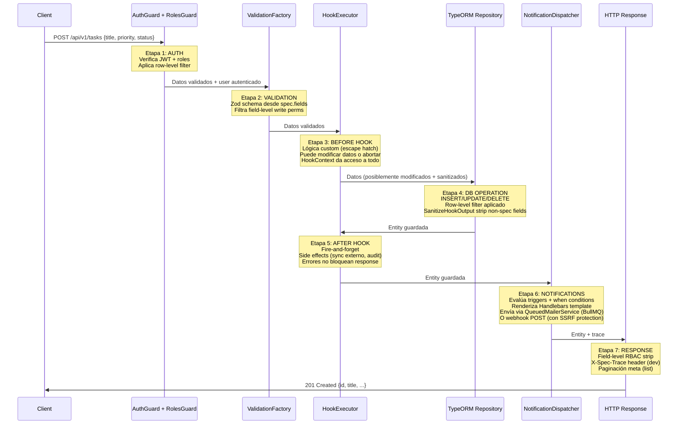
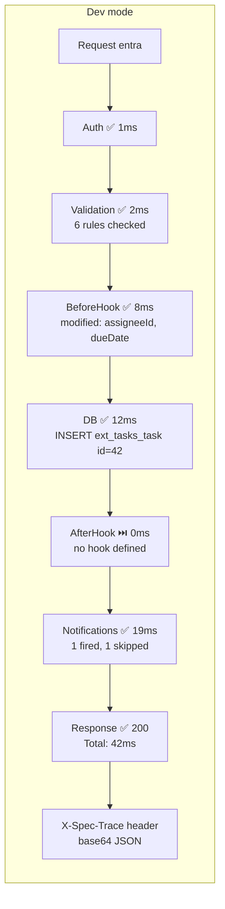
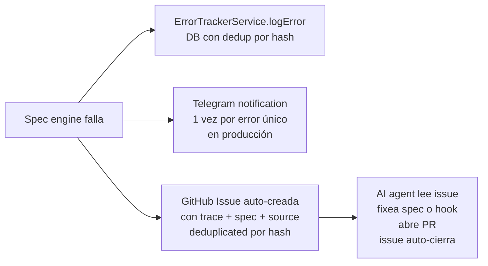
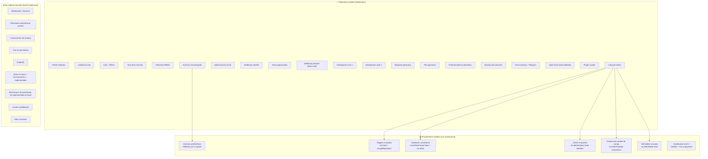
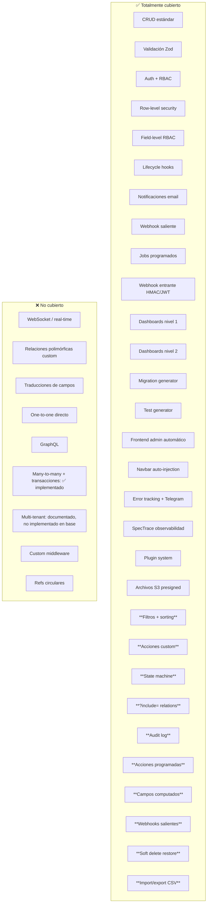

# Spec Engine — La Máquina de Hacer Apps

> **Elevator pitch**: Escribes 1 archivo YAML. El engine lo lee en runtime y materializa una app completa: API CRUD, validación, auth, permisos, hooks, notificaciones por email, jobs programados, webhooks, dashboards, y frontend — sin generar ni un solo archivo `.ts`.

---

## Índice

1. [La idea](#1-la-idea)
2. [Qué problema resuelve](#2-qué-problema-resuelve)
3. [El modelo de arquitectura](#3-el-modelo-de-arquitectura)
4. [Cómo funciona por dentro](#4-cómo-funciona-por-dentro)
5. [Una app entera solo con specs](#5-una-app-entera-solo-con-specs)
6. [Dónde está el límite](#6-dónde-está-el-límite)
7. [Comparación con alternativas](#7-comparación-con-alternativas)

---

## 1. La idea

Toma el sistema de mods de Hytale: todo es JSON — mobs, items, bloques, comportamientos. Cuando necesitas lógica custom, cuelgas un script. El JSON dice "cuando pase X, ejecuta este script". El script es Turing-complete pero el JSON es la fuente de verdad.

Ahora tráelo al mundo de las apps web. La spec es el JSON de Hytale. El engine es el runtime que la interpreta. Los hooks son los scripts de escape hatch.

```
┌─────────────────────────────────────────────────────┐
│  tasks.spec.yaml (1 archivo)                        │
│  ├── 2 recursos (task, task-comment)                │
│  ├── 8+3 campos con tipos, validación, UI hints     │
│  ├── Permisos RBAC por acción + campo + fila         │
│  ├── 2 hooks (beforeCreate, afterCreate)             │
│  ├── 2 notificaciones (email con Maizzle/HBS)        │
│  ├── 1 job (detecta tasks stale cada 60s)            │
│  ├── 1 webhook (recibe alertas externas con HMAC)   │
│  ├── 1 dashboard (5 panels: stat, donut, bar, line) │
│  └── Seeds (4 tasks demo)                           │
└──────────────────────┬──────────────────────────────┘
                       │ 1 archivo YAML entra
┌──────────────────────▼──────────────────────────────┐
│  SpecEngine (runtime interpreter)                    │
│  No genera código. Lee la spec y materializa:        │
│  • TypeORM EntitySchema dinámico (tabla + columnas) │
│  • NestJS Controller dinámico (5 rutas CRUD)          │
│  • Zod validation schema (desde field defs)           │
│  • Auth guard + RolesGuard (desde permissions)       │
│  • Row-level + field-level RBAC                       │
│  • HookExecutor (lifecycle hooks con HookContext)    │
│  • NotificationDispatcher (email + webhook)           │
│  • JobScheduler (BullMQ o setInterval)              │
│  • WebhookControllerFactory (HMAC/JWT auth)          │
│  • SpecTrace (7 etapas, observabilidad)              │
│  • SpecErrorReporter (ErrorTracker + Telegram + GH) │
│  • MetaController (GET /_spec/resources)             │
│  • SpecQueryBuilder (dashboards declarativos)        │
│  • MigrationGenerator (spec diff → ALTER TABLE)     │
│  • TestGenerator (spec → Jest scaffold)              │
│  • SpecValidator (JSON Schema + cross-ref)          │
│  • SpecPluginManager (instalar/desinstalar plugins)  │
└──────────────────────┬──────────────────────────────┘
                       │ Todo materializado en runtime
┌──────────────────────▼──────────────────────────────┐
│  NestJS App corriendo                                │
│  GET    /api/v1/tasks          → lista paginada      │
│  GET    /api/v1/tasks/:id      → una task             │
│  POST   /api/v1/tasks          → crear (Zod + hook)  │
│  PATCH  /api/v1/tasks/:id      → actualizar           │
│  DELETE /api/v1/tasks/:id      → soft delete          │
│  POST   /api/v1/tasks/webhooks/stale → webhook       │
│  GET    /api/v1/_spec/resources → metadata para UI   │
│  + Job corriendo cada 60s                             │
│  + Trace en X-Spec-Trace header (dev)                │
│  + Errores → ErrorTracker DB + Telegram + GitHub      │
└──────────────────────────────────────────────────────┘
```

---

## 2. Qué problema resuelve

### Antes: Foundation con Hygen (code generation)

Para crear un recurso "task" en Foundation hoy:

```
pnpm generate:resource -- --name=Task
```

Esto **genera 8 archivos `.ts`**:

```
src/custom/task/
├── task.module.ts           ← NestJS module wiring
├── task.controller.ts       ← 5 rutas CRUD a mano
├── task.service.ts          ← lógica de negocio
├── domain/task.ts           ← dominio con @Expose()
├── dto/create-task.dto.ts   ← class-validator DTO
├── dto/update-task.dto.ts   ← class-validator DTO
├── dto/find-all-task.dto.ts ← DTO de búsqueda
└── infrastructure/
    ├── persistence.module.ts
    ├── task.repository.ts
    └── entities/task.entity.ts ← TypeORM @Entity
```

**Problemas:**
- El código generado **drift** del generator. El generator se queda viejo.
- La IA debe mantener 8 archivos con imports cruzados y cross-references.
- 30+ decisiones simultáneas (imports correctos, DI tokens, decorators, relaciones).
- Si añades un campo, tocas 4 archivos (entity, domain, DTO create, DTO update).
- Para añadir permisos, escribes guards a mano.
- Para enviar un email, escribes un service + template + queue.
- Para un job, escribes un BullMQ processor + module registration.

### Después: Spec Engine (runtime interpretation)

Para crear un recurso "task":

```
Creas 1 archivo: extensions/tasks/tasks.spec.yaml
```

El engine lo lee en runtime. No genera nada. Materializa todo dinámicamente.

**Ventajas:**
- 0 archivos generados que pueden drift.
- La IA escribe 1 YAML validable contra schema — 5 decisiones secuenciales.
- Si la spec cambia, el comportamiento cambia. Punto.
- Añadir un campo = añadir 3 líneas al YAML.
- Permisos, notificaciones, jobs, webhooks — todo declarativo.
- Lógica custom = 1 función pura con contrato tipado (hook).

### La diferencia fundamental

```
Hygen (code gen):     spec mental → genera 8 .ts → esos .ts SON tu app → drift
Spec Engine (runtime): spec.yaml → engine lee en runtime → materializa → no hay .ts generados
```

Es la diferencia entre escribir SQL a mano y usar un ORM. El ORM no te genera archivos SQL que mantienes — interpreta tus entities en runtime.

---

## 3. El modelo de arquitectura

El spec engine combina tres patrones arquitectónicos establecidos:

### 3.1 Metadata-driven architecture

La app se define por datos, no por código. Salesforce factura billones con este modelo: defines objetos, campos, permisos, y la plataforma genera API + UI. No escribes controladores. Escribes metadata.

### 3.2 Declarative framework

Declaras el estado deseado, el framework lo materializa. Terraform hace esto con infraestructura: escribes "quiero una VPC con 3 subnets" y Terraform lo crea. No escribes los comandos de AWS.

### 3.3 Interceptor pipeline

Cada request pasa por una cadena de puntos de extensión definidos en metadata, no en código. NestJS ya lo tiene con interceptors y guards. La diferencia: los puntos de extensión están definidos en la spec.

### Diagrama de arquitectura completa

```mermaid
graph TB
    subgraph "Capa de Declaración (YAML)"
        SPEC[tasks.spec.yaml]
        HOOKS[hooks/*.ts — escape hatch]
        TEMPLATES[templates/*.hbs — emails]
        HANDLERS[handlers/*.ts — jobs/webhooks]
    end

    subgraph "Spec Engine (runtime interpreter)"
        SL[SpecLoader]
        SV[SpecValidator]
        EF[EntityFactory]
        VF[ValidationFactory]
        CF[ControllerFactory]
        HE[HookExecutor]
        ND[NotificationDispatcher]
        JS[JobScheduler]
        WF[WebhookControllerFactory]
        ST[SpecTrace]
        ER[SpecErrorReporter]
        MC[MetaController]
        QB[SpecQueryBuilder]
        PM[SpecPluginManager]
        MG[MigrationGenerator]
        TG[TestGenerator]
    end

    subgraph "Foundation Modules (existentes)"
        IAM[IamModule<br/>JWT + RBAC + Sessions + API Keys]
        MAIL[MailerService<br/>nodemailer + Handlebars]
        QUEUE[QueuedMailerService<br/>BullMQ + Redis]
        STORAGE[StorageModule<br/>S3 + presigned + local]
        ERRORS[ErrorTrackerService<br/>DB + dedup + GlobalExceptionFilter]
        CONFIG[ConfigService<br/>env vars tipadas]
        TYPEORM[TypeORM<br/>PostgreSQL 17]
        BULL[BullMQ<br/>Redis queues]
    end

    subgraph "Frontend (Nuxt layer)"
        CRUD[spec-crud layer<br/>SpecDataTable + SpecDataForm<br/>SpecDashboard + Sidebar]
    end

    SPEC --> SL
    SL --> SV
    SV -->|valida estructura<br/>+ cross-refs + conflictos| SPEC
    SL --> EF --> TYPEORM
    SL --> VF
    SL --> CF
    CF --> IAM
    CF --> HE
    HE --> HOOKS
    HE -->|on error| ER
    CF --> ND
    ND --> MAIL
    ND --> QUEUE
    ND --> TEMPLATES
    CF --> STORAGE
    SL --> JS
    JS --> BULL
    JS --> HANDLERS
    SL --> WF
    WF --> HANDLERS
    CF --> ST
    ST -->|X-Spec-Trace header| CRUDE[HTTP Response]
    ER --> ERRORS
    ER -->|Telegram| TG[Telegram Bot]
    ER -->|GitHub Issue| GH[GitHub Issues]
    SL --> MC
    MC -->|GET /_spec/resources| CRUD
    SL --> QB
    QB -->|SQL parameterizado| TYPEORM
    PM -->|install/uninstall| SPEC
    MG -->|spec diff → migration| TYPEORM
    TG -->|spec → Jest tests| SPEC
```



---

## 4. Cómo funciona por dentro

### 4.1 El pipeline de 7 etapas

Cada request HTTP a un recurso spec-driven pasa por 7 etapas. Cada etapa es independiente. Cada etapa usa módulos existentes de Foundation. El engine orquesta, nunca reemplaza.



### 4.2 Qué hace cada etapa

| Etapa | Input | Output | Usa de Foundation | Qué hace |
|---|---|---|---|---|
| 1. Auth | HTTP request + spec.permissions | User autenticado o 401/403 | AuthGuard('jwt'), RolesGuard, RoleEnum | Verifica JWT, comprueba roles, aplica row-level filter |
| 2. Validation | Request body + spec.fields | Datos validados o 400 | Zod (generado desde spec) | Valida tipos, required, enum, min/max, pattern. Filtra field-level write perms |
| 3. Before Hook | Datos validados + HookContext | {data, proceed} o abort | HookContext → ModuleRef → todos los servicios | Lógica custom: enriquecer, validar extra, modificar datos, abortar |
| 4. DB | Datos sanitizados | Entity guardada | TypeORM EntitySchema dinámico | INSERT/UPDATE/DELETE con row-level filter. SanitizeHookOutput strip non-spec fields |
| 5. After Hook | Entity guardada + HookContext | void (fire-and-forget) | HookContext → todos los servicios | Side effects: sync externo, audit, log. Errores no bloquean response |
| 6. Notifications | Entity + spec.notifications | Side effects (email, webhook) | QueuedMailerService, Handlebars, fetch | Evalúa triggers, renderiza templates, envía emails o webhooks |
| 7. Response | Entity + field-level RBAC | JSON | — | Strippa fields que el user no puede leer, añade X-Spec-Trace en dev |

### 4.3 HookContext — el puente entre hooks y Foundation

El hook es una función pura. No sabe nada de NestJS, DI, controllers, decorators. Recibe datos + un contexto que da acceso a todo Foundation:

```typescript
interface HookContext {
  // Datos de la operación
  operation: 'create' | 'update' | 'delete' | 'read';
  resource: string;
  user: AuthenticatedUser | null;

  // Acceso a repositorios (cualquier recurso spec-driven)
  getRepository(name: string): Repository<any>;

  // Acceso a servicios de Foundation
  getService<T>(token: string): T;
  // 'MailerService' → email síncrono
  // 'QueuedMailerService' → email async via BullMQ
  // 'EmailService' → gestión de queue
  // 'FilesService' → CRUD de archivos
  // 'ErrorTrackerService' → logging de errores
  // 'ConfigService' → config tipada

  // Config tipada
  config(key: string): any;

  // Helper de email
  sendEmail(data: EmailJobData): Promise<void>;

  // Logger
  logger: Logger;

  // Trace (observabilidad)
  trace: TraceWriter;

  // Abortar operación
  abort(message: string, statusCode?: number): never;

  // Log error a ErrorTracker
  logError(message: string, source?: string, metadata?: Record<string, unknown>): Promise<void>;
}
```

### 4.4 SpecTrace — observabilidad del pipeline

Cada request construye un trace estructurado de las 7 etapas:



En dev: `X-Spec-Trace` header con el trace comprimido en base64.
En prod: trace se loguea estructurado. Si la request falla (status ≥ 400), el trace se envía a ErrorTrackerService.

CLI: `pnpm spec:trace task create --body '{...}'` imprime el trace con colores.

### 4.5 Error reporting autónomo



---

## 5. Una app entera solo con specs

### 5.1 Qué cubre la spec

```mermaid
mindmap
  root((Spec YAML))
    Recursos
      Campos con tipos
        string, text, integer, decimal
        boolean, datetime, date
        enum, json, ref (FK), file, many-to-many
      Validación
        required, nullable, unique
        min, max, pattern, email, url
        enum values
      Permisos
        Por acción (list/read/create/update/delete)
        Por campo (read/write)
        Por fila (row-level filter)
      Hooks
        beforeCreate, afterCreate
        beforeUpdate, afterUpdate
        beforeDelete, afterDelete
        beforeQuery
      Notificaciones
        Email (Maizzle/Handlebars)
        Webhook (POST + SSRF protection)
      Jobs
        Cron o interval
        BullMQ o setInterval
        Retries + backoff
      Webhooks
        Inbound POST endpoint
        HMAC-SHA256 o JWT auth
      UI Hints
        Display (badge, date, avatar, truncate)
        FormInput (text, select, datepicker, file-upload)
        Sidebar items con visibilidad por rol
    Vistas / Dashboards
      Nivel 1: Declarativo
        stat, donut, bar, line
        QuerySpec → SQL
      Nivel 2: Híbrido
        Query declarativa + transform hook
        Component custom
      Nivel 3: Todo custom
        Handler + Vue component
    Seeds
      Datos iniciales
    Overrides
      Modificar plugins
```

### 5.2 Ejemplo: app CRM completa solo con specs

```yaml
# extensions/crm/crm.spec.yaml
name: crm
version: 1.0.0
displayName: CRM
description: Client relationship management

resources:
  # ─── Client ──────────────────────────────────────
  - name: client
    table: ext_crm_client
    fields:
      - name: name
        type: string
        required: true
        length: 200
        validation: { min: 2, max: 200 }
        ui: { display: text, formInput: text, link: true }
      - name: email
        type: string
        nullable: true
        validation: { email: true }
        ui: { display: text, formInput: text }
      - name: phone
        type: string
        nullable: true
        ui: { display: text, formInput: text }
      - name: statusId
        type: ref
        ref: status
        required: true
        refOnDelete: RESTRICT
        index: true
        ui: { display: badge, formInput: select-async, labelField: name }
      - name: originId
        type: ref
        ref: origin
        nullable: true
        refOnDelete: SET NULL
        ui: { display: text, formInput: select-async, labelField: name }
      - name: assigneeId
        type: ref
        ref: user
        nullable: true
        refOnDelete: SET NULL
        ui: { display: avatar, formInput: select-async, labelField: firstName }
      - name: metadata
        type: json
        default: {}
    permissions:
      list: [admin, user]
      read: [admin, user]
      create: [admin]
      update: [admin, user]
      delete: [admin]
      fields:
        assigneeId: { read: [admin] }
      rowLevel:
        customer:
          filter: 'assigneeId == ${user.id}'
    hooks:
      beforeCreate: ./hooks/client-before-create.ts
      afterCreate: ./hooks/client-after-create.ts
    notifications:
      - name: notify-assigned
        trigger: { on: afterCreate, when: 'assigneeId != null' }
        channel: email
        template: ./templates/client-assigned.hbs
        to: '${app.notificationEmail}'
        subject: 'Nuevo cliente asignado: ${entity.name}'
    ui:
      icon: Users
      view: table
      sidebar:
        heading: CRM
        items:
          - title: Clientes
            icon: Users
            link: /app/clients
            roles: [admin, user]
          - title: Mis clientes
            icon: User
            link: /app/clients/mine
            roles: [user]
    seeds:
      - name: Tech Corp
        statusId: 1
        originId: 1
        metadata: { industry: 'Technology', size: '50-200' }

  # ─── Status ────────────────────────────────────────
  - name: status
    table: ext_crm_status
    fields:
      - name: name
        type: string
        required: true
        ui: { display: badge, formInput: text }
      - name: color
        type: string
        default: '#6b7280'
        ui: { display: badge, formInput: text }
      - name: sortOrder
        type: integer
        default: 0
        ui: { display: text, formInput: text }
    permissions:
      list: [admin, user]
      read: [admin, user]
      create: [admin]
      update: [admin]
      delete: [admin]
    seeds:
      - name: Lead
        color: '#f59e0b'
        sortOrder: 0
      - name: Qualified
        color: '#3b82f6'
        sortOrder: 1
      - name: Client
        color: '#22c55e'
        sortOrder: 2
      - name: Churned
        color: '#ef4444'
        sortOrder: 3

  # ─── Origin ────────────────────────────────────────
  - name: origin
    table: ext_crm_origin
    fields:
      - name: name
        type: string
        required: true
        ui: { display: text, formInput: text }
      - name: sortOrder
        type: integer
        default: 0
    permissions:
      list: [admin, user]
      read: [admin, user]
      create: [admin]
      update: [admin]
      delete: [admin]
    seeds:
      - name: Web
        sortOrder: 0
      - name: Referral
        sortOrder: 1
      - name: Cold Call
        sortOrder: 2
      - name: Event
        sortOrder: 3

  # ─── Contact (nested under client) ────────────────
  - name: contact
    table: ext_crm_contact
    fields:
      - name: clientId
        type: ref
        ref: client
        required: true
        refOnDelete: CASCADE
        index: true
      - name: name
        type: string
        required: true
        ui: { display: text, formInput: text }
      - name: email
        type: string
        nullable: true
        validation: { email: true }
      - name: phone
        type: string
        nullable: true
      - name: role
        type: string
        nullable: true
        ui: { display: text, formInput: text }
    permissions:
      list: [admin, user]
      read: [admin, user]
      create: [admin]
      update: [admin]
      delete: [admin]

  # ─── Interaction (activity log) ───────────────────
  - name: interaction
    table: ext_crm_interaction
    fields:
      - name: clientId
        type: ref
        ref: client
        required: true
        refOnDelete: CASCADE
        index: true
      - name: contactId
        type: ref
        ref: contact
        nullable: true
        refOnDelete: SET NULL
      - name: type
        type: enum
        required: true
        enum: [call, email, meeting, note, task]
        default: note
        ui: { display: badge, formInput: select, colors: { call: '#3b82f6', email: '#8b5cf6', meeting: '#22c55e', note: '#6b7280', task: '#f59e0b' } }
      - name: subject
        type: string
        required: true
        ui: { display: text, formInput: text }
      - name: description
        type: text
        nullable: true
        ui: { display: truncate, truncateLength: 100, formInput: textarea }
      - name: date
        type: datetime
        required: true
        ui: { display: date, formInput: datepicker }
    permissions:
      list: [admin, user]
      read: [admin, user]
      create: [admin, user]
      update: [admin]
      delete: [admin]
    hooks:
      afterCreate: ./hooks/interaction-after-create.ts

  # ─── Project ───────────────────────────────────────
  - name: project
    table: ext_crm_project
    fields:
      - name: clientId
        type: ref
        ref: client
        required: true
        refOnDelete: CASCADE
        index: true
      - name: name
        type: string
        required: true
        ui: { display: text, formInput: text, link: true }
      - name: type
        type: enum
        enum: [pack_1, pack_2, pack_3, custom]
        nullable: true
        ui: { display: badge, formInput: select }
      - name: price
        type: decimal
        nullable: true
        ui: { display: text, formInput: text }
      - name: status
        type: string
        default: quoted
        ui: { display: badge, formInput: select }
      - name: paymentStatus
        type: string
        default: pending
        ui: { display: badge, formInput: select }
      - name: startDate
        type: date
        nullable: true
        ui: { display: date, formInput: datepicker }
      - name: endDate
        type: date
        nullable: true
        ui: { display: date, formInput: datepicker }
    permissions:
      list: [admin]
      read: [admin]
      create: [admin]
      update: [admin]
      delete: [admin]

# ─── Views / Dashboards ───────────────────────────────
views:
  - name: crm-dashboard
    displayName: CRM Dashboard
    type: dashboard
    roles: [admin]
    panels:
      - name: total-clients
        chart: stat
        label: Total Clients
        query: { resource: client, aggregate: count }

      - name: clients-by-status
        chart: donut
        query: { resource: client, groupBy: statusId, aggregate: count }

      - name: revenue-by-month
        chart: bar
        query:
          resource: project
          aggregate: sum
          aggregateField: price
          groupBy: startDate
          groupByInterval: month
          timeRange: 1y
          filter: 'paymentStatus == paid'

      - name: interactions-over-time
        chart: line
        query:
          resource: interaction
          groupBy: date
          groupByInterval: day
          aggregate: count
          timeRange: 30d

      - name: top-origins
        chart: bar
        query:
          resource: client
          groupBy: originId
          aggregate: count
          sort: { field: value, order: desc }
          limit: 5
```

Esa spec de ~250 líneas genera:
- 6 recursos con CRUD completo (5 rutas cada uno = 30 endpoints)
- Validación Zod en todos
- Auth + RBAC en todos
- 3 hooks (beforeCreate, afterCreate, afterCreate interaction)
- 1 notificación por email
- UI hints para frontend automático
- Dashboard con 5 panels
- 4+4+4 = 12 seeds

Con Foundation + Hygen serían ~48 archivos .ts. Con la spec son 250 líneas de YAML + 2-3 hooks de 20 líneas.

### 5.3 Cómo se integra con cada módulo de Foundation

```mermaid
graph LR
    subgraph "Spec Engine"
        SE[SpecEngineModule]
    end

    subgraph "IamModule"
        JWT[JwtStrategy]
        GUARD[RolesGuard]
        ROLES[RoleEnum: admin=1, user=2]
        DECOR[Roles decorator]
        USER[User Entity]
        SESSION[Session Entity]
        APIKEY[API Key Auth]
    end

    subgraph "MailerModule"
        MAILER[MailerService<br/>nodemailer + Handlebars]
    end

    subgraph "EmailQueueModule"
        QUEUE[QueuedMailerService<br/>BullMQ async + sync fallback]
        EMAIL[EmailService<br/>Queue management]
        PROCESSOR[EmailProcessor<br/>WorkerHost]
    end

    subgraph "StorageModule"
        FILES[FilesService<br/>Facade CRUD]
        S3[FilesS3Service<br/>S3 + presigned URLs]
        LOCAL[FilesLocalService<br/>Local driver]
        IMAGE[ImageProcessingService<br/>Sharp]
    end

    subgraph "ErrorTrackerModule"
        ET[ErrorTrackerService<br/>DB + dedup by hash]
        FILTER[GlobalExceptionFilter<br/>Auto-reports 5xx]
    end

    subgraph "ConfigModule"
        CS[ConfigService<br/>AllConfigType tipado]
    end

    SE -->|AuthGuard('jwt')| JWT
    SE -->|@Roles(...)| DECOR
    DECOR --> GUARD
    GUARD --> ROLES
    SE -->|HookContext.getService| MAILER
    SE -->|HookContext.sendEmail| QUEUE
    SE -->|field type: file| FILES
    FILES --> S3
    FILES --> LOCAL
    SE -->|SpecErrorReporter| ET
    SE -->|HookContext.config| CS
    SE -->|HookContext.logError| ET
    ET -->|logError dto| FILTER
```

**Auth**: El engine aplica `@UseGuards(AuthGuard('jwt'), RolesGuard)` a cada controller dinámico. `@Roles(...)` se mapea desde spec.permissions. Row-level filter se inyecta en queries TypeORM.

**Email**: `NotificationDispatcher` renderiza templates Handlebars y llama `QueuedMailerService.sendMail()` — el mismo path que Foundation usa para emails de auth (forgot password, etc.). Si Redis está disponible, va por BullMQ. Si no, síncrono.

**Archivos**: Campo `type: file` en spec → el engine usa `FilesS3PresignedService.create()` para generar presigned URL. En read, `FilesS3Service.getPresignedUrl()` devuelve URL firmada. Usa el `FileEntity`, los mismos drivers (local/S3/S3-presigned), y `ImageProcessingService` para optimización.

**Error tracking**: `SpecErrorReporter.report()` llama `ErrorTrackerService.logError()` con metadata completa (trace, spec hash, hook path). Dedup por hash. En prod, también abre GitHub issue y manda Telegram.

**Config**: `HookContext.config('app.notificationEmail')` usa `ConfigService.get()` con tipos de `AllConfigType`.

**Jobs**: `SpecJobRunner.register()` sigue el patrón de `EmailQueueModule` — si Redis disponible, BullMQ repeatable job. Si no, setInterval.

**TypeORM**: `EntityFactory` crea `EntitySchema` dinámico (sin decorators). TypeORM auto-descubre entities via glob pattern. Relations many-to-one para ref fields.

---

## 6. Dónde está el límite

### Lo que la spec cubre (80-90% de apps reales)

| Capability | Declarativo | Código (escape hatch) | No cubierto |
|---|---|---|---|
| CRUD estándar | ✅ Spec | — | — |
| Validación | ✅ Spec (Zod) | ✅ Hook | — |
| Permisos por rol | ✅ Spec | — | — |
| Row-level security | ✅ Spec | ✅ beforeQuery hook | — |
| Field-level RBAC | ✅ Spec | — | — |
| Lógica custom | — | ✅ Hook (función pura) | — |
| Notificaciones email | ✅ Spec | ✅ Hook (ctx.sendEmail) | — |
| Notificaciones webhook | ✅ Spec | — | — |
| Jobs programados | ✅ Spec | ✅ Handler (función pura) | — |
| Webhooks entrantes | ✅ Spec | ✅ Handler (función pura) | — |
| Dashboards simples | ✅ Spec (QuerySpec) | — | — |
| Dashboards complejos | ✅ Query base | ✅ Transform hook | — |
| Subida de archivos | ✅ Spec (field type: file) | — | — |
| Frontend admin | ✅ Spec (UI hints) | — | — |
| Frontend custom | — | ✅ Nuxt layer override | — |
| Migraciones | ✅ Spec diff → SQL | — | — |
| Testing | ✅ Auto-generado | ✅ Hook tests manuales | — |
| Real-time (WebSocket) | — | — | ❌ NestJS Gateway nativo |
| UI altamente custom | — | ✅ Vue component | — |
| Multi-tenant DB isolation | — | — | ❌ Require TypeORM tenant config |
| GraphQL | — | — | ❌ NestJS Resolver nativo |

### Lo que la spec NO cubre (límites reales)

| Escenario | Cubierto | Limitación | Workaround |
|---|---|---|---|
| **WebSocket / real-time** | ❌ | El spec engine solo genera HTTP REST controllers. No crea NestJS Gateways. No hay `type: websocket` en FieldType. | Escribir un NestJS Gateway tradicional en `extensions/<name>/` con `@WebSocketGateway()`. La spec define el recurso HTTP; el Gateway es código adicional. |
| **Relaciones polimórficas** | 🟡 Parcial | El `ref` apunta a un recurso específico (`ref: user`). No existe `ref: [user, client, task]` (polimorfismo). TypeORM EntitySchema no soporta `@ManyToOne` a múltiples targets. | Para archivos: el `FileEntity` de Foundation ya es polimórfico (`entityName` + `entityId` + `context`). El campo `type: file` usa este sistema. Para traducciones: el `TranslationEntity` usa `section` + `key` + `lang`. Para otros casos polimórficos: usar un campo `string` con el nombre de la entidad + un campo `integer` con el ID, validados en un hook. |
| **Archivos** | ✅ | `type: file` usa `FileEntity` (polimórfica: `entityName` + `entityId`). `FilesS3PresignedService` genera presigned URLs. `ImageProcessingService` optimiza. | Funciona. El FileEntity almacena el tipo de entidad y el ID, cualquier recurso spec-driven puede tener archivos. |
| **Traducciones (i18n)** | ❌ | No hay `type: translated` en FieldType. El `TranslationEntity` de Foundation usa su propio sistema (section + key + lang). El spec engine no genera endpoints de traducción. | Para campos traducibles: usar un campo `json` con `{ es: "...", en: "..." }` y renderizar el idioma correcto en el frontend. O usar el `TranslationsModule` de Foundation como extensión tradicional. |
| **Triggers cruzados entre recursos** | 🟡 Parcial | Las notificaciones se disparan por operaciones del MISMO recurso (`trigger.on: afterCreate` en `task`). No puedes disparar una notificación en `client` cuando se crea un `task`. | Usar un `afterCreate` hook en `task` que llame a `ctx.getRepository('client')` y luego `ctx.sendEmail()`. O usar BullMQ para encolar un job que procese el cross-trigger. |
| **Dependencias circulares entre recursos** | ❌ | Si `task` tiene `ref: project` y `project` tiene `ref: task`, el `EntityFactory` crea ambas relations, pero TypeORM puede tener problemas con circular loading. El `SpecValidator` no detecta ciclos de refs. | Evitar refs circulares. Usar lazy loading (`{ eager: false }` — que es el default). Si necesitas bidireccional, definir solo un lado y usar un hook para cargar el otro. |
| **Many-to-many** | ❌ | No hay `type: many-to-many` o `type: hasMany`. El `ref` crea many-to-one (FK). Para una relación N:M necesitas una tabla intermedia. | Crear un recurso intermedio: `task-tag` con `ref: task` + `ref: tag`. Es el patrón de tabla pivote como recurso. Funciona pero requiere 2 queries para cargar. |
| **One-to-one** | ❌ | No hay `type: one-to-one`. | Usar `ref` con `unique: true`. Funciona como un FK 1:1 a nivel de DB, pero la relation se carga como many-to-one. |
| **Queries con JOIN entre recursos** | 🟡 Parcial | `QuerySpec` no soporta JOINs. Cada query se ejecuta contra un solo recurso. No puedes hacer `SELECT tasks.*, clients.name FROM tasks JOIN clients`. | Para dashboards: hacer queries separadas por recurso y combinar en un transform hook. Para listas: usar un `beforeQuery` hook que añada `relations: ['client']` para que TypeORM cargue la relación. |
| **Transacciones multi-recurso** | ✅ | Por defecto `transactional: true` envuelve create/update/delete en TypeORM transaction. `ctx.transaction()` permite coordinar escrituras multi-recurso en hooks. | Ver SPEC-ENGINE-REFERENCE.md §11 (HookContext) y SPEC-ENGINE-DESIGN.md §19. |
| **Eventos de cambio de campo** | 🟡 Parcial | `trigger.on: afterUpdate` se dispara en cualquier update. No hay `when: 'status changed from pending to done'`. El `when` evalúa el estado actual, no el anterior. | En el `beforeUpdate` hook, comparar `existing.status` con `data.status`. Si cambió, guardar el valor anterior en `ctx.trace` o en metadata. El `afterUpdate` hook puede leer el trace. |
| **GraphQL** | ❌ | El spec engine genera REST controllers. No genera GraphQL resolvers. | Escribir NestJS GraphQL resolvers tradicional. O usar el `MetaController` para generar un schema GraphQL desde la metadata (futuro). |
| **Multi-tenant DB isolation** | 🟡 Documentado | No implementado en Foundation base. La spec engine documenta 5 pasos para habilitar row-level tenant filtering en apps copiadas: `companyId` en JWT + spec + `rowLevel` + `beforeQuery` hook + admin sin rowLevel. | Ver SPEC-ENGINE-DESIGN.md §21 / SPEC-ENGINE-REFERENCE.md §31. |
| **Soft delete con cascada** | 🟡 Parcial | `softDelete` en `task` no hace cascada a `task-comment`. Si `task` se soft-deletea, los comments siguen siendo visibles. | En el `afterDelete` hook de `task`, hacer `ctx.getRepository('task-comment').softDelete({ taskId: id })`. |
| **Validación condicional** | 🟡 Parcial | La validación Zod es estática (definida en la spec). No puedes decir "si priority=urgent, dueDate es required". | En el `beforeCreate` hook, validar condicionalmente y abortar con `ctx.abort()`. El Zod no lo cubre pero el hook sí. |
| **Custom middleware** | ❌ | No hay `middleware` en la spec. | Escribir NestJS middleware tradicional. La spec no reemplaza NestJS, lo extiende. |

### Diagrama de cobertura



### La regla de oro

> Si la lógica cabe en una función con input/output claro → hook.
> Si necesitas estado, múltiples servicios interactuando, o WebSocket → extensión tradicional de NestJS.

### ¿Cuándo usar spec engine vs extensión tradicional?

| Usa spec engine | Usa extensión tradicional |
|---|---|
| CRUD con validación y permisos | WebSocket / real-time |
| Notificaciones por email | GraphQL resolvers |
| Jobs programados | Multi-tenant DB isolation |
| Webhooks entrantes | Relaciones polimórficas complejas |
| Dashboards declarativos | — |
| Frontend admin automático | Middleware custom |
| Lógica custom vía hooks | Integraciones con APIs externas complejas |

Ambas coexisten. Puedes tener `extensions/crm/` (tradicional) y `extensions/tasks/` (spec-driven) en la misma app.

---

## 7. Las 10 features avanzadas

El spec engine va más allá de CRUD. Estas son las features que lo convierten en un producto real:

### 7.1 Filtros y ordenación en findAll

```yaml
fields:
  - name: status
    type: enum
    enum: [pending, in_progress, done]
    ui:
      filterable: true        # genera control de filtro en la tabla
      sortable: true           # columna clickable para ordenar
      filterType: select        # select | text | dateRange | boolean

  - name: createdAt
    type: datetime
    ui:
      sortable: true
      filterable: true
      filterType: dateRange
```

```
GET /tasks?filter[status]=pending,in_progress&sort=-createdAt,priority
```

Solo campos marcados como `filterable`/`sortable` se aceptan (seguridad: no se puede filtrar por campos que el user no puede ver).

### 7.2 Acciones custom (non-CRUD endpoints)

CRUD no cubre "asignar task", "duplicar cliente", "archivar proyecto":

```yaml
actions:
  - name: assign
    method: POST
    path: ':id/assign'
    auth: [admin]
    input:
      - { name: assigneeId, type: ref, ref: user, required: true }
    handler: ./actions/assign.handler.ts
    ui:
      label: Asignar
      icon: UserPlus
      buttonLocation: row        # row | bulk | header
      confirm: "¿Asignar esta tarea?"

  - name: bulk-assign
    method: POST
    path: 'bulk/assign'
    auth: [admin]
    input:
      - { name: taskIds, type: json, required: true }
      - { name: assigneeId, type: ref, ref: user, required: true }
    handler: ./actions/bulk-assign.handler.ts
    ui:
      label: Asignar selección
      icon: Users
      buttonLocation: bulk        # aparece cuando seleccionas filas

  - name: export-csv
    method: GET
    path: 'export/csv'
    auth: [admin]
    handler: ./actions/export.handler.ts
    ui:
      label: Exportar CSV
      icon: Download
      buttonLocation: header       # botón en la barra superior
```

El handler recibe `(entityId, input, ctx)` — mismo HookContext que los hooks. El frontend renderiza los botones desde `ui.buttonLocation`.

### 7.3 State machine para enums

```yaml
fields:
  - name: status
    type: enum
    enum: [pending, in_progress, review, done, blocked]
    stateMachine:
      transitions:
        - { from: pending, to: in_progress, roles: [admin, user] }
        - { from: in_progress, to: review, roles: [admin, user] }
        - { from: review, to: done, roles: [admin] }
        - { from: blocked, to: pending, roles: [admin] }
        - { from: done, to: in_progress, roles: [admin] }  # reopen
      ui:
        showTransitionButtons: true
```

El engine valida transiciones en `beforeUpdate`:
- Si `from → to` no está en las transitions → 400 `Invalid state transition`
- Si el user no tiene el rol permitido → 403

### 7.4 ?include= relations

Evita N+1 queries:

```yaml
fields:
  - name: assigneeId
    type: ref
    ref: user
    includeable: true        # se puede pedir con ?include=assignee
```

```
GET /tasks/1?include=assignee,comments
→ {
  id: 1, title: "Fix bug", assigneeId: 42,
  assignee: { id: 42, firstName: "Adrián", email: "..." },
  comments: [{ id: 1, content: "Working on it" }]
}
```

Solo relations de campos con `includeable: true` se aceptan. Sin `?include`, devuelve solo el FK.

### 7.5 Audit log

```yaml
audit: true
# o granular:
audit:
  operations: [create, update, delete]
  fields: [status, assigneeId, priority]  # solo auditar estos
  exclude: [metadata]                      # no auditar estos
```

El engine crea `ext_<resource>_audit` con: id, entityId, operation, field, oldValue, newValue, userId, timestamp.

`GET /api/v1/tasks/:id/audit` devuelve el historial de cambios.

### 7.6 Acciones programadas por entidad

```yaml
scheduledActions:
  - name: reminder-3-days-before
    trigger: dueDate         # campo de la entity
    offset: -3d              # 3 días antes del dueDate
    handler: ./actions/send-reminder.handler.ts
    cancelOnUpdate: true     # si la entity cambia, reprogramar
```

El engine programa un BullMQ delayed job con `delay` calculado desde `entity.dueDate - 3d`. Si `cancelOnUpdate` y la entity se actualiza, el job anterior se cancela y se reprograma.

### 7.7 Campos computados

```yaml
fields:
  - name: commentCount
    type: computed
    compute:
      type: count
      relation: task-comment
      foreignKey: taskId
    ui: { display: text, sortable: true }

  - name: isOverdue
    type: computed
    compute:
      type: expression
      expression: 'dueDate != null && dueDate < now() && status != done'
    ui: { display: badge, colors: { true: '#ef4444', false: '#22c55e' } }

  - name: fullName
    type: computed
    compute:
      type: template
      template: '${firstName} ${lastName}'
```

Los campos computados no se almacenan en DB. Se calculan en runtime en la response (Stage 7).

### 7.8 Webhooks salientes (subscriptions)

```yaml
outboundWebhooks:
  - name: task-events
    events: [task.created, task.updated, task.deleted]
    subscriptionModel: dynamic    # los externos se registran via POST /subscribe
```

- `POST /api/v1/tasks/webhooks/subscribe` — registro de webhook URL
- Cuando un evento ocurre, POST a todas las URLs suscritas
- HMAC signature en cada envío (igual que Stripe)
- SSRF protection (private IPs bloqueadas)

### 7.9 Soft delete con restore

```yaml
softDelete: true
# el engine añade automáticamente:
# POST /tasks/:id/restore → undoes soft delete
# GET /tasks?deleted=true → ver eliminados (admin only)
```

### 7.10 Import/export CSV

```yaml
importConfig:
  format: csv
  mapping: { Titulo: title, Estado: status }
  uniqueKey: title        # si existe, actualizar en vez de duplicar
  handler: ./import/task-import.handler.ts

exportConfig:
  format: csv
  fields: [id, title, status, priority, assigneeId, dueDate]
  handler: ./export/task-export.handler.ts
```

- `POST /api/v1/tasks/import` — acepta CSV, valida contra Zod, crea/actualiza
- `GET /api/v1/tasks/export?format=csv` — genera CSV con los campos especificados

### Diagrama de cobertura actualizado



---

## 8. Comparación con alternativas

| | Foundation + Hygen | Spec Engine | Salesforce | Directus | Hasura |
|---|---|---|---|---|---|
| Modelo | Code gen | Runtime interp | Metadata | Metadata | Metadata |
| Escribe | 8 archivos TS | 1 YAML | XML/config | UI clicks | YAML metadata |
| IA escribe | 🟡 difícil (imports) | ✅ trivial | N/A | N/A | N/A |
| Lógica custom | Service NestJS | Hook (función pura) | Apex (proprietario) | Custom endpoints | Actions (GraphQL) |
| Auth | NestJS guards | Spec permissions | Profiles | Policies | Permissions |
| Notificaciones | Service a mano | Spec declarative | Workflow + Apex | Flows | Actions |
| Frontend | Nuxt layer a mano | Spec UI hints + auto-gen | Lightning Components | Admin UI auto | No frontend |
| Jobs | BullMQ a mano | Spec declarative | Scheduled Apex | Cron tasks | Scheduled triggers |
| Migraciones | TypeORM CLI | Spec diff → SQL | Change Sets | Schema diff | Hasura migrations |
| Testing | Jest a mano | Auto-generado | Apex tests | — | — |
| Self-hosted | ✅ | ✅ | ❌ SaaS | ✅ | ✅/❌ |
| Open source | ✅ (Foundation) | ✅ (Foundation) | ❌ | ✅ | ✅ |
| Lenguaje | TypeScript | TypeScript + YAML | Apex | Node.js | Haskell |
| DB | PostgreSQL | PostgreSQL (via Foundation) | Proprietario | PostgreSQL | PostgreSQL |
| Coste | Gratis | Gratis | $$$/mes | Free/Cloud $$$ | Free/Cloud $$$ |
| Ventaja única | Full control | **IA-friendly** | Enterprise | UI builder | GraphQL auto |

**La ventaja única del spec engine**: está diseñado desde el primer día para que una IA lo use. La spec es la superficie de contacto entre el LLM y el runtime. Es estructurada, validable, declarativa. El LLM no necesita entender NestJS DI, TypeORM decorators, ni import paths.

---

## Siguiente: referencia técnica

- [SPEC-ENGINE-REFERENCE.md](./SPEC-ENGINE-REFERENCE.md) — formato spec completo, tipos, contratos, módulos
- [SPEC-ENGINE-GUIDE.md](./SPEC-ENGINE-GUIDE.md) — guía paso a paso para construir una app