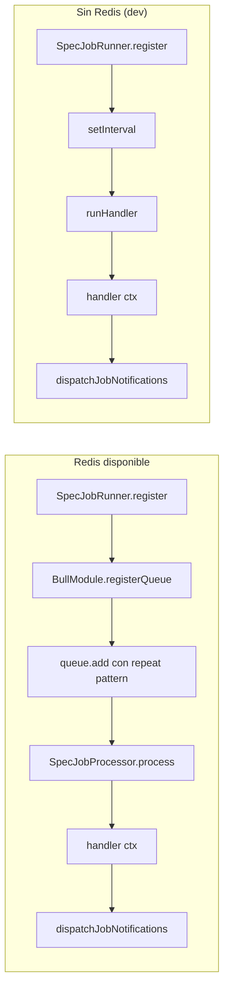
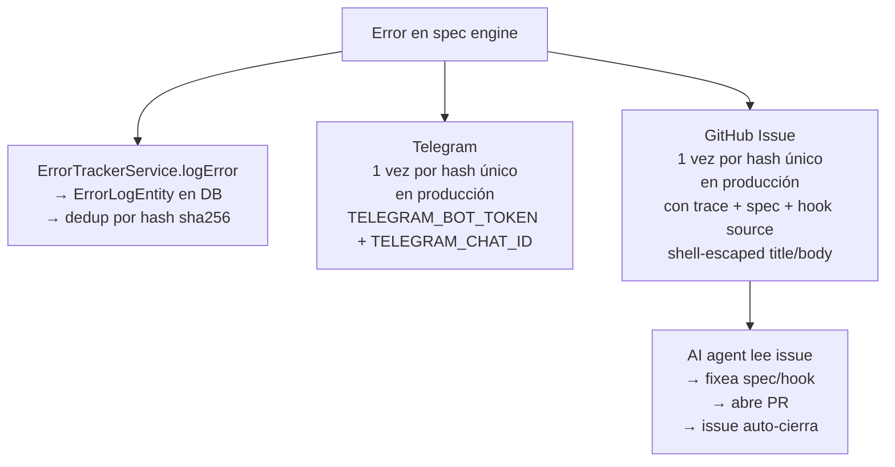
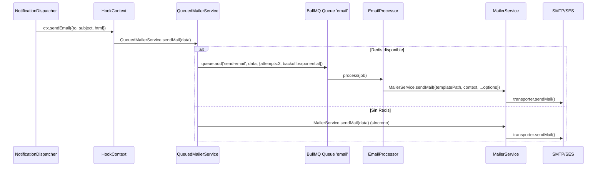
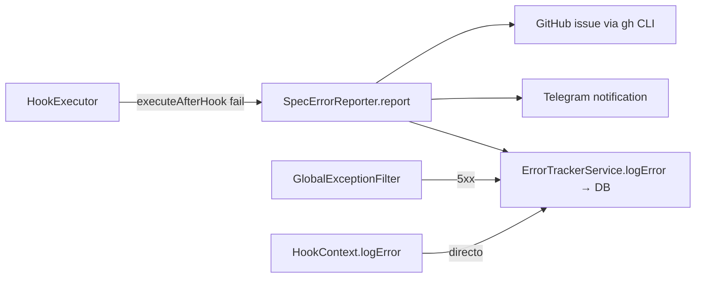
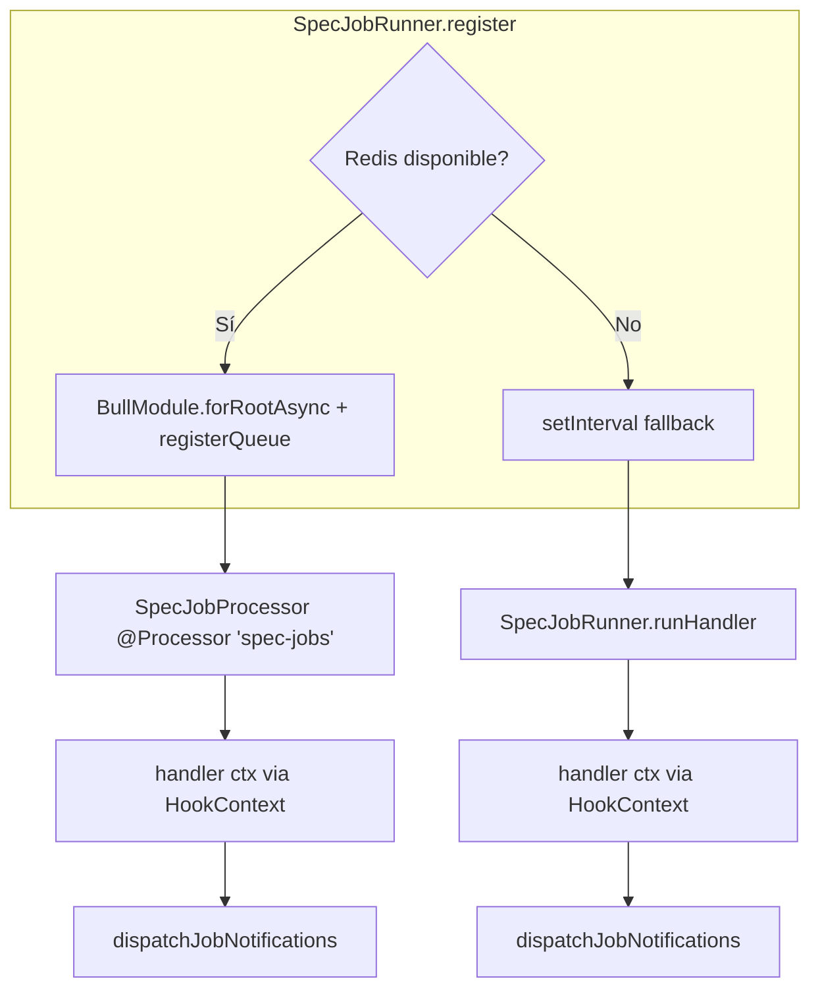

# Spec Engine — Referencia Técnica

> Documento técnico completo: formato spec, tipos, contratos, integración con módulos de Foundation, y API del HookContext.

---

## Índice

1. [Formato Spec YAML](#1-formato-spec-yaml)
2. [FieldSpec — tipos de campo](#2-fieldspec)
3. [PermissionSpec — RBAC](#3-permissionspec)
4. [HookSpec — lifecycle hooks](#4-hookspec)
5. [NotificationSpec — notificaciones](#5-notificationspec)
6. [JobSpec — jobs programados](#6-jobspec)
7. [WebhookSpec — webhooks entrantes](#7-webhookspec)
8. [ResourceUISpec — UI hints](#8-resourceuispec)
9. [ViewSpec — dashboards](#9-viewspec)
10. [QuerySpec — queries declarativas](#10-queryspec)
11. [HookContext — API completa](#11-hookcontext)
12. [SpecTrace — observabilidad](#12-spectrace)
13. [SpecErrorReporter — error reporting](#13-specerrorreporter)
14. [Integración con IamModule](#14-integración-con-iammodule)
15. [Integración con MailerModule + Maizzle](#15-integración-con-mailermodule)
16. [Integración con StorageModule](#16-integración-con-storagemodule)
17. [Integración con ErrorTrackerModule](#17-integración-con-errortrackermodule)
18. [Integración con BullMQ](#18-integración-con-bullmq)
19. [MetaController — API de metadata](#19-metacontroller)
20. [CLI tools](#20-cli-tools)

---

## 1. Formato Spec YAML

### Estructura top-level

```yaml
name: string                    # requerido, kebab-case, único
version: string                 # semver (ej: 1.0.0)
displayName?: string            # nombre para UI (ej: "Tasks")
description?: string
author?: string
config?:                        # variables de configuración de la extensión
  - name: string
    required: boolean
    default?: any
    description?: string
resources: ResourceSpec[]       # requerido, al menos 1
views?: ViewSpec[]              # dashboards
overrides?: OverrideSpec[]      # modificar plugins
```

### ResourceSpec

```yaml
resources:
  - name: string                # kebab-case, único dentro de la extensión
    table: string               # debe empezar con ext_<name>_
    displayName?: string
    description?: string
    timestamps?: boolean         # default: true (createdAt, updatedAt)
    softDelete?: boolean         # default: true (deletedAt)
    fields: FieldSpec[]          # requerido, al menos 1
    permissions?: PermissionSpec
    hooks?: HookSpec
    notifications?: NotificationSpec[]
    jobs?: JobSpec[]
    webhooks?: WebhookSpec[]
    seeds?: object[]             # datos iniciales
    ui?: ResourceUISpec           # hints para frontend
```

---

## 2. FieldSpec

### Tipos de campo

| Tipo | DB Column (TypeORM) | Zod Validation | UI Display | UI FormInput |
|---|---|---|---|---|
| `string` | varchar(255) | z.string() | text | text |
| `text` | text | z.string() | truncate | textarea |
| `integer` | int4 | z.number().int() | text | text |
| `decimal` | numeric(10,2) | z.number() | text | text |
| `boolean` | bool | z.boolean() | badge | select |
| `datetime` | timestamptz | z.coerce.date() | date | datepicker |
| `date` | date | z.string() | date | datepicker |
| `json` | jsonb | z.record(z.unknown()) | text | textarea |
| `enum` | varchar | z.enum([...]) | badge | select |
| `ref` | integer FK | z.number().int().positive() | avatar | select-async |
| `file` | varchar | z.string().uuid().nullable() | icon | file-upload |

### Estructura completa

```yaml
fields:
  - name: title                   # camelCase, requerido
    type: string                  # FieldType, requerido
    required?: boolean            # default: false
    nullable?: boolean            # default: !required
    unique?: boolean              # default: false → CREATE UNIQUE INDEX
    default?: any                 # valor por defecto
    length?: number               # string/enum: varchar length (default 255)
    precision?: number            # decimal: precision (default 10)
    scale?: number                 # decimal: scale (default 2)
    enum?: string[]               # enum: valores permitidos
    ref?: string                  # ref: recurso referenciado
    refOnDelete?: CASCADE | SET NULL | RESTRICT  # default: RESTRICT
    index?: boolean               # default: false → CREATE INDEX
    validation?:                  # validación a nivel de campo
      min?: number
      max?: number
      pattern?: string            # regex
      email?: boolean
      url?: boolean
    ui?: FieldUISpec              # hints para el frontend
    # ─── Específico de file ───
    storage?: local | s3 | s3-presigned  # default: de config
    allowedMimes?: string[]      # ej: [application/pdf, image/png]
    maxSize?: number              # bytes
    isPublic?: boolean            # default: false
    context?: string              # categorización del archivo
```

### FieldUISpec

```yaml
ui:
  display?: text | badge | date | avatar | truncate | icon | link
  formInput?: text | textarea | select | datepicker | file-upload | select-async
  link?: boolean                  # clickable en tabla → va al detail
  colors?: object                 # para badge: { pending: '#f59e0b', done: '#22c55e' }
  truncateLength?: number         # para truncate: default 50
  labelField?: string             # para ref select-async: campo a mostrar del target
```

### Mapeo a TypeORM EntitySchema

```typescript
// EntityFactory.create() genera:

// Para ref: assigneeId → ref: user
columns.assigneeId = { type: Number, nullable: true };
relations.assignee = {
  type: 'many-to-one',
  target: () => 'User',  // capitalizado para Foundation entities
  joinColumn: { name: 'assigneeId' },
  onDelete: 'SET NULL',
  nullable: true,
};
```

### Mapeo a Zod

```typescript
// ValidationFactory.createCreateSchema() genera:

// string con validation
z.string().min(2).max(200)

// enum
z.enum(['pending', 'in_progress', 'review', 'done', 'blocked'])

// ref
z.number().int().positive()

// file
z.string().uuid().nullable()

// datetime
z.coerce.date()

// json
z.record(z.unknown())
```

---

## 3. PermissionSpec

### Permisos por acción

```yaml
permissions:
  list?: Role[]       # quién puede ver la lista
  read?: Role[]       # quién puede ver un item individual
  create?: Role[]     # quién puede crear
  update?: Role[]     # quién puede actualizar
  delete?: Role[]     # quién puede eliminar
```

### Role type

```typescript
type Role = 'admin' | 'customer' | 'affiliate' | 'public';
```

Mapeo a RoleEnum de Foundation:
- `admin` → `RoleEnum.admin` (1)
- `customer` → `RoleEnum.customer` (2)
- `affiliate` → `RoleEnum.affiliate` (3)
- `public` → sin guard (advertencia: requiere configuración especial)

### Field-level RBAC

```yaml
permissions:
  fields:
    position:
      read: [admin]              # customer no puede ver position en responses
      write: [admin]             # customer no puede setear position en requests
    assigneeId:
      read: [admin]               # customer no puede ver assigneeId
```

**Cómo funciona:**
- **Read**: En la etapa 7 (Response), `applyFieldReadPerms()` stripa campos que el user no puede leer
- **Write**: En la etapa 2 (Validation), `applyFieldWritePerms()` stripa campos que el user no puede escribir

### Row-level security

```yaml
permissions:
  rowLevel:
    customer:
      filter: 'assigneeId == ${user.id}'
```

**Sintaxis soportada:**
- `field == ${user.id}` → `WHERE "assigneeId" = 42`
- `field != null` → `WHERE "field" IS NOT NULL`
- Patrones no reconocidos → **fail closed** (`WHERE id = -1`, niega todo)

**En findOne/update/delete**: el row-level filter se aplica al `WHERE` del `findOne` y del `softDelete`.

---

## 4. HookSpec

### Tipos de hook

```yaml
hooks:
  beforeCreate?: string          # path al handler, relativo a la spec
  afterCreate?: string
  beforeUpdate?: string
  afterUpdate?: string
  beforeDelete?: string
  afterDelete?: string
  beforeQuery?: string            # modifica FindOptions antes de findAll
```

### Contrato del before hook

```typescript
interface BeforeHook {
  (data: Record<string, unknown>, ctx: HookContext): Promise<BeforeHookResult>;
}

interface BeforeHookResult {
  data: Record<string, unknown>;  // datos (posiblemente modificados)
  proceed: boolean;               // false = aborta con 400
  error?: string;                 // mensaje si proceed=false
}
```

### Contrato del after hook

```typescript
interface AfterHook {
  (entity: Record<string, unknown>, ctx: HookContext): Promise<void>;
}
```

After hooks son **fire-and-forget**: errores se loguean pero no bloquean la response.

### Contrato del beforeQuery hook

```typescript
interface BeforeQueryHook {
  (options: FindManyOptions, ctx: HookContext): Promise<FindManyOptions>;
}
```

Permite modificar `where`, `take`, `skip`, `order`, `relations` antes de ejecutar el query.

### Ejemplo real

```typescript
// hooks/task-before-create.ts
import type { HookContext } from '@core/spec-engine/spec.types';

export default async function beforeCreate(
  data: Record<string, unknown>,
  ctx: HookContext,
): Promise<{ data: Record<string, unknown>; proceed: boolean; error?: string }> {
  // Auto-assign admin for urgent tasks
  if (data.priority === 'urgent' && !data.assigneeId) {
    ctx.trace.add('beforeCreate', {
      decision: 'auto-assign-admin',
      reason: 'priority=urgent and no assignee',
    });
    data.assigneeId = 1;
    if (!data.dueDate) {
      data.dueDate = new Date(Date.now() + 24 * 60 * 60 * 1000).toISOString();
    }
  }

  // Validate banned words
  if (typeof data.title === 'string') {
    const banned = ['TODO', 'FIXME'];
    for (const word of banned) {
      if (data.title.toUpperCase().includes(word)) {
        return { data, proceed: false, error: `Title cannot contain "${word}"` };
      }
    }
  }

  return { data, proceed: true };
}
```

### Seguridad de hooks

1. **SanitizeHookOutput**: después de un before hook, el controller stripa campos que no están en `spec.fields`. Un hook no puede inyectar `id`, `createdAt`, `deletedAt`, o campos arbitrarios.

2. **Path containment**: el handler se carga con `require()`, pero el path debe estar dentro del directorio de la extensión. `../../malicious` se rechaza.

3. **Production .ts → .js**: en producción, el `.ts` se reemplaza por `.js` antes de `require()`.

---

## 5. NotificationSpec

### Estructura

```yaml
notifications:
  - name: string                    # identificador único
    trigger:                        # cuándo disparar
      on: afterCreate | afterUpdate | afterDelete | job | webhook
      jobName?: string              # si on: 'job'
      webhookName?: string          # si on: 'webhook'
      when?: string                  # condición: 'priority == urgent && assigneeId != null'
    channel: email | webhook | sms
    # Para email:
    template?: string               # path a .hbs (relativo a spec)
    to?: string                      # expresión: '${app.notificationEmail}'
    subject?: string                 # expresión: 'Nueva tarea: ${entity.title}'
    # Para webhook:
    url?: string                     # expresión: '${entity.webhookUrl}'
    payload?: object                 # payload custom
```

### Evaluación de triggers

1. Filtra por `trigger.on` que coincida con la operación actual
2. Evalúa `when` condition contra datos de la entity
3. Para cada notificación que coincide, dispatcha al canal

### Evaluador de `when`

Parser seguro (no usa `eval`):

```
Soporta: &&, ||, ==, !=
Literales: null, true, false, números, strings (sin comillas), quoted strings
Ej: 'priority == urgent && assigneeId != null'
Ej: 'status == done || priority == low'
```

### Interpolación de expresiones

`to`, `subject`, `url`, y `payload` soportan `${expression}`:

```yaml
to: '${app.notificationEmail}'
subject: 'Nueva tarea: ${entity.title}'
```

El contexto de interpolación:
```typescript
{
  entity: { ... },      // entity guardada (con relations cargadas)
  user: { ... } | null, // usuario autenticado
  app: {
    url: string,
    name: string,
    notificationEmail: string,
  }
}
```

### Renderización de templates

1. Lee el archivo `.hbs` (relativo a la spec)
2. Compila con Handlebars
3. Renderiza con el contexto
4. Pasa HTML resultante a `QueuedMailerService.sendMail()`

### SSRF protection

Webhook URLs se validan contra IPs privadas antes de `fetch()`:
- `127.0.0.0/8`, `10.0.0.0/8`, `172.16.0.0/12`
- `192.168.0.0/16`, `169.254.0.0/16`
- `::1`, `fc00::/7`

### Prototype pollution protection

`resolveDotPath` bloquea `__proto__`, `constructor`, `prototype`.

---

## 6. JobSpec

### Estructura

```yaml
jobs:
  - name: string
    schedule: cron | interval
    value: string                   # cron: '*/5 * * * *' | interval: '60s', '5m', '1h'
    handler: string                 # path al handler (relativo a spec)
    queue?: string                   # BullMQ queue name (default: 'spec-jobs')
    retries?: number                 # default: 3
    backoff?: exponential | fixed    # default: exponential
```

### Contrato del handler

```typescript
interface JobHandler {
  (ctx: HookContext): Promise<void>;
}
```

Mismo HookContext que los lifecycle hooks — acceso a repositorios, servicios, config, logger, trace.

### Arquitectura dual mode



Sigue el patrón exacto de `EmailQueueModule`.

---

## 7. WebhookSpec

### Estructura

```yaml
webhooks:
  - name: string
    path: string                   # URL path (ej: 'tasks/webhooks/stale')
    method: POST
    auth: none | hmac | jwt
    handler: string                 # path al handler (relativo a spec)
```

### Auth modes

| Mode | Cómo funciona |
|---|---|
| `none` | Sin verificación. Cualquiera puede POST |
| `hmac` | Verifica HMAC-SHA256 del body con `WEBHOOK_HMAC_SECRET`. Header: `X-Signature-256` (hex). Timing-safe comparison. |
| `jwt` | Usa `AuthGuard('jwt')` de NestJS. Requiere JWT válido. |

### Contrato del handler

```typescript
type WebhookHandler = (payload: any, ctx: HookContext) => Promise<void>;
```

El handler recibe el body del request y un HookContext completo (con acceso a repositorios, servicios, etc.).

### Seguridad

- Path containment: el handler debe estar dentro del directorio de la extensión
- Empty-string `WEBHOOK_HMAC_SECRET` rechazado igual que unset
- .ts → .js en producción

---

## 8. ResourceUISpec

### Estructura

```yaml
ui:
  icon: string                      # nombre del icono (ej: CheckSquare)
  view: table | kanban | list       # vista admin default
  kanbanColumn?: string              # campo usado como columna del kanban
  kanbanOrder?: string               # campo para ordenar cards
  sidebar:                          # items del navbar
    heading: string
    items:
      - title: string
        icon: string
        link: string                 # ej: /app/tasks
        roles?: Role[]               # visibilidad por rol
```

### Cómo lo consume el frontend

`GET /api/v1/_spec/resources` devuelve toda la metadata incluyendo UI hints. El frontend `spec-crud` Nuxt layer lee esto y:

- **Sidebar**: inyecta items filtrados por rol del usuario
- **DataTable**: lee fields + ui.display para renderizar columnas
- **DataForm**: lee fields + ui.formInput para renderizar inputs
- **Kanban**: si `view: kanban`, usa `kanbanColumn` para agrupar

---

## 9. ViewSpec

### Nivel 1: Declarativo (70% de dashboards)

```yaml
views:
  - name: task-dashboard
    type: dashboard
    roles: [admin]
    panels:
      - name: total-tasks
        chart: stat
        label: Total Tasks
        query: { resource: task, aggregate: count }

      - name: tasks-by-status
        chart: donut
        query: { resource: task, groupBy: status, aggregate: count }

      - name: tasks-over-time
        chart: line
        query:
          resource: task
          groupBy: createdAt
          groupByInterval: day
          aggregate: count
          timeRange: 30d

      - name: urgent-open
        chart: stat
        label: Urgent Open
        query:
          resource: task
          filter: 'priority == urgent && status != done'
          aggregate: count
```

### Nivel 2: Híbrido (20%)

```yaml
panels:
  - name: burndown
    chart: custom
    component: ./frontend/components/BurndownChart.vue
    query:
      resource: task
      groupBy: createdAt
      groupByInterval: day
      aggregate: count
      timeRange: 14d
    transform: ./hooks/burndown-transform.ts
```

El engine ejecuta la query → pasa datos crudos al transform hook → hook devuelve datos transformados → frontend renderiza con componente custom.

### Nivel 3: Todo custom (10%)

```yaml
views:
  - name: team-analytics
    type: custom
    handler: ./handlers/team-analytics.handler.ts
    component: ./frontend/components/TeamAnalytics.vue
```

---

## 10. QuerySpec

### Estructura

```yaml
query:
  resource: string                  # recurso a queryar (ej: 'task')
  aggregate: count | sum | avg | min | max
  aggregateField?: string           # para sum/avg/min/max (ej: 'price')
  groupBy?: string                  # campo para agrupar
  groupByInterval?: hour | day | week | month  # para campos de fecha
  timeRange?: string                # '7d', '30d', '90d', '1y'
  filter?: string                   # 'priority == urgent && status != done'
  sort?: { field: string, order: asc | desc }
  limit?: number                    # top N
  having?: string                   # 'count > 5'
```

### Traducción a SQL

```sql
-- tasks-by-status (donut)
SELECT status, COUNT(*) as value
FROM ext_tasks_task
WHERE "deletedAt" IS NULL
GROUP BY status;

-- tasks-over-time (line, day, 30d)
SELECT DATE("createdAt") as label, COUNT(*) as value
FROM ext_tasks_task
WHERE "createdAt" > NOW() - INTERVAL '30 days'
  AND "deletedAt" IS NULL
GROUP BY DATE("createdAt")
ORDER BY "createdAt" ASC;

-- urgent-open (filter)
SELECT COUNT(*) as value
FROM ext_tasks_task
WHERE priority = 'urgent'
  AND status != 'done'
  AND "deletedAt" IS NULL;
```

### SQL injection prevention

- Todos los field names validados contra `/^[A-Za-z_][A-Za-z0-9_]*$/`
- Todos los valores van como bind parameters (`$1`, `$2`)
- `groupByInterval` y `timeRange` son whitelists hardcoded
- `LIMIT` validado como `Math.max(0, Math.floor(Number(limit)))`
- Filter parser es recursive-descent (no `eval`, no `Function()`)

---

## 11. HookContext

### API completa

```typescript
interface HookContext {
  // ─── Datos de la operación ───────────────────────────
  operation: string;                          // 'create' | 'update' | 'delete' | 'read' | 'webhook' | 'job'
  resource: string;                           // nombre del recurso
  user: AuthenticatedUser | null;             // usuario autenticado (null en jobs/webhooks sin auth)

  // ─── Acceso a repositorios ────────────────────────────
  getRepository(name: string): Repository<any>;
  // Repositorios de recursos spec-driven (ej: 'task', 'task-comment')
  // Usa getRepositoryToken(name) → ModuleRef.get()
  // Para entidades de Foundation (User, File), usar getService en su lugar

  // ─── Acceso a servicios de Foundation ─────────────────
  getService<T = any>(token: string): T;
  // Tokens disponibles:
  //   'MailerService'           → MailerService (email síncrono)
  //   'QueuedMailerService'     → QueuedMailerService (email async via BullMQ)
  //   'EmailService'            → EmailService (gestión de queue)
  //   'FilesService'            → FilesService (CRUD de archivos facade)
  //   'ErrorTrackerService'     → ErrorTrackerService (logging de errores)
  //   'ConfigService'           → ConfigService<AllConfigType> (config tipada)

  // ─── Config ───────────────────────────────────────────
  config(key: string): any;
  // Ejemplos:
  //   config('app.notificationEmail')  → string | undefined
  //   config('app.backendDomain')     → string
  //   config('mail.host')             → string | undefined
  //   config('worker.enabled')        → boolean
  //   config('file.driver')           → 'local' | 's3' | 's3-presigned' | 'b2'

  // ─── Helper de email ──────────────────────────────────
  sendEmail(data: EmailJobDataLike): Promise<void>;
  // Shortcut para QueuedMailerService.sendMail()
  // EmailJobDataLike = { to, subject, html?, text?, templatePath?, context?, from? }

  // ─── Logger ───────────────────────────────────────────
  logger: Logger;                             // NestJS Logger scoped

  // ─── Trace (observabilidad) ──────────────────────────
  trace: TraceWriter;
  // trace.add('beforeCreate', { decision: 'auto-assign', reason: 'urgent' })
  // trace.isActive() → boolean

  // ─── Abort ────────────────────────────────────────────
  abort(message: string, statusCode?: number): never;
  // Aborta la operación con HTTP error (default 400)

  // ─── Log error ────────────────────────────────────────
  logError(message: string, source?: string, metadata?: Record<string, unknown>): Promise<void>;
  // Loggea a ErrorTrackerService (DB con dedup)
}
```

### AuthenticatedUser

```typescript
interface AuthenticatedUser {
  id: number;
  role: {
    id: number;       // RoleEnum value (1=admin, 2=customer, 3=affiliate)
    name: string;     // 'admin' | 'customer' | 'affiliate'
    homeRoute?: string;
  };
  sessionId: string;
  language: string;
  iat: number;
  exp: number;
}
```

Matches `JwtPayloadType` de `@iam/auth/strategies/types/jwt-payload.type.ts`.

---

## 12. SpecTrace

### Estructura

```typescript
interface SpecTrace {
  requestId: string;
  resource: string;
  operation: 'create' | 'read' | 'update' | 'delete' | 'list' | 'webhook' | 'job';
  user: { id: number; role: string } | null;
  stages: TraceStage[];
  totalDurationMs: number;
}

interface TraceStage {
  stage: 'auth' | 'validation' | 'beforeHook' | 'db' | 'afterHook' | 'notifications' | 'response';
  status: 'pass' | 'fail' | 'skip';
  durationMs: number;
  input?: unknown;
  output?: unknown;
  error?: { message: string; code: string };
  meta?: Record<string, unknown>;
}
```

### Acceso

| Modo | Cómo |
|---|---|
| Dev | `X-Spec-Trace` response header (base64 JSON) |
| Dev | `?_trace=true` → response incluye `__trace` |
| Prod | Logueado estructurado (JSON) a debug level |
| Prod (error) | Enviado a ErrorTrackerService con contexto completo |
| CLI | `pnpm spec:trace task create --body '{...}' --user admin` |

---

## 13. SpecErrorReporter

### Flujo de errores



### Sensitive data scrubbing

Patrones de redacción (substring match, case-insensitive):
```
/password/i, /passwd/i, /secret/i, /token/i, /authorization/i, /auth/i,
/apikey/i, /api[_-]?key/i, /private[_-]?key/i, /refresh/i, /access/i,
/cookie/i, /session/i, /ssn/i, /credit/i, /cvv/i, /credential/i,
/bearer/i, /jwt/i, /secret[_-]?key/i
```

### Telegram message format

```
🚨 Spec Engine Error

<error message, escaped, truncated to 200 chars>

📦 Resource: <code>task</code>
⚡ Operation: <code>create</code>
🔧 Stage: <code>beforeHook</code>
🪩 Hook: <code>task-before-create.ts</code> (basename only)
🔑 Hash: <code>a1b2c3d4...</code>
📊 Occurrences: 1

Trace:
  ❌ beforeHook — TypeError: Cannot read property...
  Total: 42ms
```

---

## 14. Integración con IamModule

### Componentes consumidos

| Componente | Archivo | Uso en spec engine |
|---|---|---|
| `AuthGuard('jwt')` | `@nestjs/passport` | Aplicado a todos los controllers dinámicos |
| `RolesGuard` | `@iam/roles/roles.guard` | Verifica `@Roles()` metadata |
| `@Roles(...)` | `@iam/roles/roles.decorator` | Aplicado por método con RoleEnum values |
| `RoleEnum` | `@iam/roles/roles.enum` | Mapeo: admin=1, customer=2, affiliate=3 |
| `JwtPayloadType` | `@iam/auth/strategies/types/jwt-payload.type.ts` | Estructura de `req.user` → `AuthenticatedUser` |
| `OptionalAuthGuard` | `@iam/auth/guards` | Para endpoints que aceptan auth opcional |
| `ApiKeyGuard` | `@iam/auth/guards` | Para auth vía API Key |

### Decoradores disponibles de Foundation

| Decorador | Qué hace | Cuándo usar |
|---|---|---|
| `@JwtAuth()` | JWT required | Todos los endpoints spec-driven |
| `@AdminAuth()` | JWT + admin role | Admin-only endpoints |
| `@CustomerAuth()` | JWT + customer role | Customer endpoints |
| `@FlexibleAuth()` | JWT OR API Key | Endpoints que aceptan ambos |
| `@OptionalAuth()` | JWT OR API Key OR anonymous | Endpoints públicos con auth opcional |
| `@CurrentUser()` | Param decorator → user | En controllers manuales |
| `@RequiredUser()` | Param decorator → user (throw si null) | En controllers manuales |
| `@UserId()` | Param decorator → user.id | En controllers manuales |

### Cómo el spec engine mapea permisos

```yaml
# Spec
permissions:
  create: [admin]
  update: [admin, customer]
  rowLevel:
    customer:
      filter: 'assigneeId == ${user.id}'
  fields:
    position:
      read: [admin]
      write: [admin]
```

```
→ Engine materializa:

@UseGuards(AuthGuard('jwt'), RolesGuard)
class TaskSpecController {
  @Post()
  @Roles(RoleEnum.admin)  // [1]
  async create(...) { ... }

  @Patch(':id')
  @Roles(RoleEnum.admin, RoleEnum.customer)  // [1, 2]
  async update(...) {
    // Row-level: WHERE assigneeId = user.id (for customer role)
    // Field-level write: strip 'position' if user is customer
    // ...
  }

  @Get()
  @Roles(RoleEnum.admin, RoleEnum.customer)
  async findAll(...) {
    // Field-level read: strip 'position' from response if customer
  }
}
```

---

## 15. Integración con MailerModule

### Componentes consumidos

| Componente | Token DI | Uso |
|---|---|---|
| `MailerService` | class | Email síncrono (nodemailer + Handlebars) |
| `QueuedMailerService` | class | Email async (BullMQ si Redis, sino síncrono) |
| `EmailService` | class | Gestión de queue |
| `EmailProcessor` | class | WorkerHost que procesa jobs |

### Flujo de email desde la spec



### Template context

```typescript
interface EmailTemplateContext {
  entity: Record<string, unknown>;  // entity que disparó la notificación (con relations)
  user: AuthenticatedUser | null;
  app: {
    url: string;                    // app.backendDomain
    name: string;                   // app.name
    notificationEmail: string;      // app.notificationEmail
  };
}
```

### Maizzle integration

Foundation ya tiene Maizzle (`@maizzle/framework`):

1. Source templates en `apps/back/emails/` como `.mjml` o `.html`
2. Built por `pnpm maizzle:build` → `apps/back/build/` como `.hbs`
3. Spec referencia el `.hbs` compilado

---

## 16. Integración con StorageModule

### Componentes consumidos

| Componente | Token DI | Uso |
|---|---|---|
| `FilesService` | class | Facade CRUD de archivos |
| `FilesS3Service` | class | S3: create, update, delete, getPresignedUrl |
| `FilesS3PresignedService` | class | S3 presigned: create (genera PUT URL) |
| `FilesLocalService` | class | Local driver: create, update, delete |
| `ImageProcessingService` | class | Sharp: optimización de imágenes |

### Config de storage

```typescript
// config/file-config.type.ts
type FileConfig = {
  driver: 'local' | 's3' | 's3-presigned' | 'b2';
  accessKeyId?: string;
  secretAccessKey?: string;
  awsDefaultS3Bucket?: string;
  awsS3Region?: string;
  awsS3Endpoint?: string;
  maxFileSize: number;
  imageOptimizationEnabled: boolean;
  imageOptimizationQuality: number;
  imageOptimizationMaxWidth: number;
  imageOptimizationMaxHeight: number;
};
```

### Spec field type: file

```yaml
fields:
  - name: attachment
    type: file
    storage: s3-presigned        # default: de config file.driver
    allowedMimes: [application/pdf, image/png, image/jpeg]
    maxSize: 10485760            # 10MB
    isPublic: false
    context: 'task_attachment'
```

### Upload flow (presigned S3)

```
1. Client: POST /api/v1/tasks con { attachment: { name, type, size } }
2. Engine valida mime + size contra spec
3. FilesS3PresignedService.create():
   → crea FileEntity en DB (path, type, size, name)
   → genera presigned PUT URL (expira 3600s)
   → retorna { file, uploadSignedUrl }
4. Engine guarda task con attachment = file.id
5. Response: { ...task, attachment: { fileId, uploadUrl, path } }
6. Client sube archivo directamente a S3 via PUT a uploadUrl
```

### Read flow

```
1. Client: GET /api/v1/tasks/1
2. Engine ve attachment field de type 'file'
3. FilesS3Service.getPresignedUrl(file.path):
   → genera GET presigned URL (expira 3600s)
4. Response: { ...task, attachment: { fileId, url, name, type, size } }
```

---

## 17. Integración con ErrorTrackerModule

### Componentes consumidos

| Componente | Token DI | Uso |
|---|---|---|
| `ErrorTrackerService` | class | logError() → DB con dedup |
| `GlobalExceptionFilter` | class | Auto-reporta 5xx |
| `ErrorLogEntity` | class | Tabla error_log en DB |

### ErrorTrackerService.logError()

```typescript
async logError(dto: CreateErrorDto): Promise<ErrorLogEntity>
// CreateErrorDto = { message: string, source?: string, stack?: string, metadata?: Record<string, unknown> }
// Dedup: sha256(message + source + stack[:200])
// Si existe: occurrences += 1, lastOccurredAt = now()
// Si no: crea nuevo ErrorLogEntity
```

### SpecErrorReporter wiring



---

## 18. Integración con BullMQ

### Patrón dual mode (igual que EmailQueueModule)



### Redis config

```typescript
// config/worker-config.type.ts
type WorkerConfig = {
  host?: string;
  port?: number;
  db?: number;
  username?: string;
  password?: string;
  enabled: boolean;
};
// Env vars: WORKER_HOST, WORKER_PORT, WORKER_DB, WORKER_USERNAME, WORKER_PASSWORD
```

---

## 19. MetaController

### Endpoints

| Endpoint | Auth | Qué retorna |
|---|---|---|
| `GET /api/v1/_spec/resources` | JWT + admin | Todos los recursos con fields, permissions, UI hints |
| `GET /api/v1/_spec/resources/:name` | JWT + admin | Un recurso específico |
| `GET /api/v1/_spec/views` | JWT + admin | Todas las views/dashboards |
| `GET /api/v1/_spec/trace/:requestId` | JWT + admin | Trace por ID (stub) |

### Response shape

```json
{
  "resources": [
    {
      "name": "task",
      "displayName": "Task",
      "table": "ext_tasks_task",
      "route": "/api/v1/tasks",
      "fields": [
        { "name": "title", "type": "string", "ui": { "display": "text", "formInput": "text" } },
        { "name": "status", "type": "enum", "enum": ["pending", "done"], "ui": { "display": "badge", "colors": { ... } } }
      ],
      "permissions": { "list": ["admin", "customer"], ... },
      "ui": { "icon": "CheckSquare", "sidebar": { ... } },
      "hooks": { "beforeCreate": "./hooks/task-before-create.ts" },
      "notifications": [...],
      "jobs": [...],
      "webhooks": [...]
    }
  ],
  "views": [
    { "name": "task-dashboard", "panels": [...] }
  ]
}
```

---

## 20. CLI tools

### Migration generator

```bash
pnpm spec:generate-migration tasks
# Lee extensions/tasks/tasks.spec.yaml
# Diff contra spec_schema_version en DB
# Genera migrations/<timestamp>-SpecTasksInit.ts
# Contiene: CREATE TABLE, ALTER TABLE, CREATE INDEX
```

### Test generator

```bash
pnpm spec:generate-tests tasks
# Lee extensions/tasks/tasks.spec.yaml
# Genera extensions/tasks/__tests__/tasks.spec.test.ts
# Tests auto-generados: validation, permissions, CRUD, seeds
# Scaffolds con TODO: hooks, jobs, notifications
```

### Plugin manager

```bash
pnpm spec:add stripe           # copia plugins/stripe/ a extensions/stripe/
pnpm spec:remove stripe        # borra extensions/stripe/
pnpm spec:list                 # lista plugins instalados (spec-registry.json)
```

### Trace CLI

```bash
pnpm spec:trace task create --body '{"title":"test","priority":"urgent"}' --user admin
# Imprime trace con colores en consola
```