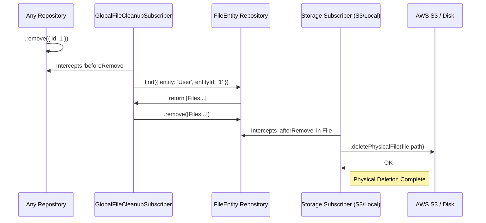

# Storage & Files Architecture

This document details the file management architecture in the backend, including upload (Local/S3) and automatic cleanup system (Garbage Collection) using polymorphic relationships and TypeORM Subscribers.

## Upload Structure (Uploaders)

The `FilesModule` dynamically loads a specific driver (`FilesLocalModule` or `FilesS3Module`) based on the `FILE_DRIVER` environment configuration.

Both drivers implement a common interface through the `'FILE_UPLOADER_SERVICE'` token, ensuring the application only interacts with a contract and abstracts where resources are physically stored.

- **Local (`FilesLocalService`)**: Saves files to the `/files/public` or `/files/private` folder on the server disk and exposes public ones through the API.
- **S3 (`FilesS3Service`)**: Saves files to a reserved AWS S3 bucket or compatible providers (MinIO, R2, etc.) and generates signed URLs for managed reading/deletion.

## Polymorphic Relationships (`FileEntity`)

Instead of having static columns for attachments (e.g., `avatarId`, `documentId`), files are associated polymorphically.
Each row in the `file` table stores information about who owns it using:

- `entity`: Name of the owner model/entity (e.g., `'User'`, `'Post'`).
- `entityId`: The UUID or identifier of the record it's linked to.

This allows attaching N files to any entity without modifying the target table structure.

## Automatic Cleanup (Garbage Collection & Subscribers)

To ensure consistency and prevent "ghost" files in S3 or on disk, we've implemented "cascading" cleanup guided by TypeORM Events.

### 1. `GlobalFileCleanupSubscriber`

Listens to **all** deletions in the database (via `beforeRemove`).

- **What it does:** Identifies which entity is being destroyed, finds all `FileEntity` records with matching `entityName` and `entityId`, and executes batch deletion (using `remove()`).
- **Why:** Unifies cleanup. If a user is deleted, there's no need to run file deletion logic in the user service; this subscriber detects it globally.

### 2. Hard Subscribers (S3 & Local)

We have two specific subscribers that only listen to `FileEntity` deletion (via `afterRemove`).

- **`FileS3Subscriber`**: Captures row deletion and uses the configured AWS S3 client to delete the remotely hosted file. Only loads when S3 driver is active.
- **`FileLocalSubscriber`**: Captures row deletion and uses native Node.js API (`fs`) to locate and delete the resource from local disk. Only loads when Local driver is active.

### Complete Flow

### ⚠️ Important Rules for the Flow to Work

> [!IMPORTANT]
> **None of these subscribers activate if you use direct `.delete()` or `QueryBuilder`**.
> For TypeORM to trigger the logic, entities must ALWAYS be retrieved and use the repository's `.remove()` or `.softRemove()` method.
