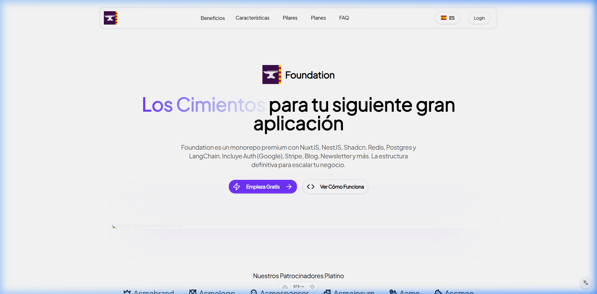
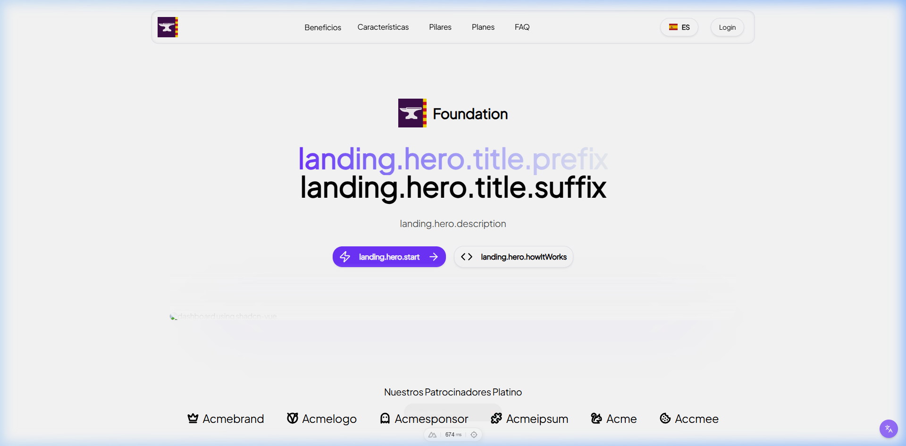
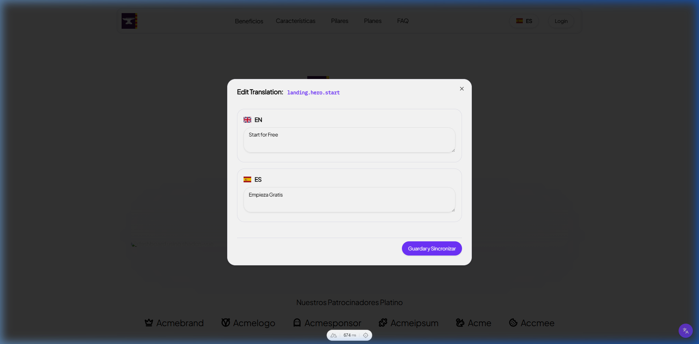

# Hybrid Translation System

This document outlines the architecture and workflow of the Hybrid Translation System in Foundation.

## Architecture

The system is designed to handle two types of content translation:
1.  **Static UI Labels**: Standard application text (buttons, headers, form labels). These are backed by JSON files for performance but managed in the database.
2.  **Dynamic Entity Content**: Translations for database records (e.g., Product descriptions, Article titles). These use a polymorphic relationship in the database.

### Database Schema

Two main entities manage the translations:

**Lang (`lang`)**
- `code`: ISO code (e.g., `en`, `es`).
- `name`: Display name.
- `isActive`: Toggle availability.

**Translation (`translation`)**
- `section`: Namespace for organization (e.g., `landing.hero`).
- `key`: Specific identifier (e.g., `title`).
- `content`: The translated text.
- `lang`: Foreign key to `Lang`.
- `entityName`: (Nullable) Name of the related entity (e.g., `Product`).
- `entityId`: (Nullable) ID of the related entity.

If `entityName` and `entityId` are `null`, the translation is considered **Static**. Otherwise, it is **Dynamic**.

## Workflows

### 1. Development (JSON -> DB)

Developers add new translation keys directly to the JSON files located in `apps/back/src/i18n/*.json`.

When the seed command runs:
```bash
npm run seed:run
```
The `TranslationSeedService`:
1.  Reads the JSON files.
2.  Flattens the structure (e.g., `{"landing": {"hero": "Title"}}` -> `landing.hero = Title`).
3.  Checks the database for existing keys (by `lang`, `section`, `key`).
4.  **Inserts only new keys.** Existing database values are preserved to respect admin edits.

### 2. Management (Frontend Admin UI)

Admins can manage translations via the Frontend Admin Panel:
- **Location**: Access the panel at `/admin/translations`
- **Grouping**: Translations are automatically grouped by `App Context + Section + Key`.
- **Creating**: Use the "Nueva Traducción" button to establish a brand-new translation key directly from the UI.
- **Editing**: Click the Accordion row to reveal all active languages and their corresponding translated text. Saving happens automatically `onBlur`.
- **Deleting**: Clearing out the translation text inside the textarea will effectively delete the translation from the database.

### 3. Management (CLI)

Developers can quickly scaffold new keys without relying on the UI by utilizing the built-in CLI command:
```bash
npm run i18n:add
```
> Within `apps/back`, this interactive script will prompt for the App Context (`front`/`back`), `section`, `key`, and the content for each available language. It saves them linearly to the generated DB structure.

### 4. Deployment / Static Generation (DB -> JSON)

To update the frontend with changes made in the Admin UI or CLI (for static labels), the JSON structure must be compiled.

**Admin UI Generation:** Click the 'Generate JSON' button inside `/admin/translations`.
**API Endpoint:** `POST /api/v1/translations/generate`

This service:
1.  Fetches all translations from the DB.
2.  Groups them by Language and Target Application.
3.  Writes the structured JSON files to `apps/front/locales/` or `apps/back/src/i18n/`.

### 5. Developer Tools (Dev Mode Toggle)

While developing locally (`NODE_ENV=development`), you will notice a floating **globe icon button** in the bottom right corner of the application:



When you click this toggle, it activates `i18n-show-keys` mode:
1. It intercepts all `$t()` translator calls globally.
2. It visually exposes the raw Translation Token Key directly in the UI layout (e.g., you will literally see `landing.hero.start` inside your buttons instead of "Empieza Gratis").



#### Interactive Inline Editing
Once the translation keys are visible, they become **clickable**. 

Clicking any exposed translation key opens the **Interactive Translation Editor** modal directly on top of your current page.



This modal allows you to:
- Instantly see the exact key you clicked.
- View and edit the translation values for *all active languages* concurrently.
- If a key doesn't exist in the database yet (e.g., standard fallback JSON), it intelligently pre-fills the textareas with the fallback text via Nuxt Vue-i18n.
- Press **"Guardar y Sincronizar"** (Save and Sync) to securely write the new/updated translations to the database, trigger a `.json` regeneration, and auto-reload the page so your changes reflect immediately in the live UI.

### 6. Dynamic Content Consumption

For dynamic content (e.g., a product description), use the API directly:

**Endpoint:** `GET /api/v1/translations/dynamic/:lang/:entityName/:entityId`

Response:
```json
{
  "description": "Translated product description",
  "name": "Translated Product Name"
}
```

## Adding a New Language

1. Go to `/admin/languages` and ensure the new language is officially created and marked "Active".
2. Add the language's ISO code to the `i18n.locales` array inside `apps/front/nuxt.config.ts`.
3. Translations associated with the language will now appear dynamically in the Translation Tables.
