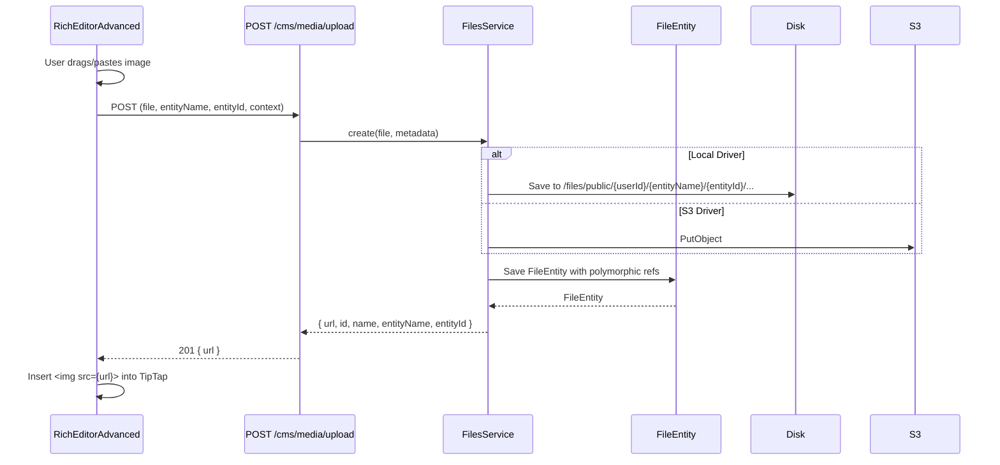

# CMS

## Overview

The CMS extension provides a complete content management system for the platform, including CMS pages (landing, generic, contact), blog posts with a rich TipTap editor, full SEO metadata per language, media management with entity linking, and automatic sitemap generation. It integrates deeply with the [storage](../modules/storage.md) module for file uploads and the [translations](../modules/translations.md) module for multilingual content.

The CMS is built as a first-class extension instead of a third-party integration, ensuring deep integration with the existing auth, storage, and translation systems. The rendering strategy (SSR for pages, SSG+SWR for blog) optimizes for both SEO and performance.

## Architecture

### Module Structure

```
apps/back/src/modules/cms/
├── blog/
│   ├── posts/
│   │   ├── posts.controller.ts      # CRUD + publish + preview endpoints
│   │   └── posts.service.ts         # Business logic with file cascade on delete
│   └── categories/
│       ├── categories.controller.ts
│       └── categories.service.ts
├── media/
│   └── media.controller.ts          # Upload with entity linking
├── seo/
│   └── seo.service.ts               # SEO metadata management
├── cms.module.ts                    # Module registration
└── cms-pages.controller.ts          # Page CRUD + public endpoints

apps/front/modules/cms/
├── composables/
│   ├── useCmsPages.ts               # Page API composable
│   ├── useCmsBlogPosts.ts           # Blog post API composable w/ preview support
│   └── useCmsCategories.ts          # Category API composable
├── components/cms/
│   └── RichEditorAdvanced.vue       # TipTap editor with image upload
├── pages/
│   ├── (app)/cms/                   # Admin SPA routes
│   │   ├── index.vue                # CMS dashboard
│   │   └── blog/
│   │       ├── posts/
│   │       │   ├── index.vue        # Post list with preview/view links
│   │       │   ├── create.vue       # Create post with language selector
│   │       │   ├── [id]/edit.vue    # Edit post with language selector
│   │       │   └── preview/
│   │       │       └── [id]/index.vue # Preview page (drafts visible)
│   │       └── categories/
│   │           └── index.vue        # Category management
│   └── (public)/[lang]/             # Public SSR/SSG routes
│       ├── page/[slug].vue          # Public CMS page (SSR)
│       ├── blog/index.vue           # Blog listing (SSG+SWR)
│       └── blog/[slug].vue          # Blog post (SSG+SWR, full SEO)
└── plugins/
    └── nav.ts                       # Sidebar menu injection for CMS
```

### Content Flow

```mermaid
flowchart TD
    subgraph "Admin (SPA)"
        A1[Create Page/Post]
        A2[Edit Content + SEO]
        A3[Manage Media]
        A4[Preview Draft]
        A5[Publish]
    end

    subgraph "Backend API"
        B1[POST /api/v1/cms/pages]
        B2[POST /api/v1/cms/blog/posts]
        B3[POST /api/v1/cms/media/upload]
        B4[GET /api/v1/translations/dynamic]
        B5[PATCH publish]
    end

    subgraph "Storage"
        S1[(PostgreSQL<br/>Pages, Posts, SEO)]
        S2[(File Storage<br/>Local/S3)]
    end

    subgraph "Public Site"
        P1[SSR: /[lang]/page/:slug]
        P2[SSG+SWR: /[lang]/blog]
        P3[SSG+SWR: /[lang]/blog/:slug]
    end

    subgraph "SEO & Discovery"
        SE1[Meta Tags + JSON-LD]
        SE2[OG Tags + Twitter Cards]
        SE3[Sitemap.xml]
    end

    A1 --> B1
    A2 --> B2
    A3 --> B3
    A2 --> B4
    A5 --> B5

    B1 --> S1
    B2 --> S1
    B3 --> S2

    S1 --> P1
    S1 --> P2
    S1 --> P3

    P1 --> SE1
    P2 --> SE3
    P3 --> SE1
    P3 --> SE2
```

## API / Public Interface

### Pages

| Method | Path | Description | Auth |
|--------|------|-------------|------|
| `GET` | `/api/v1/cms/pages` | List all pages (admin) | Admin |
| `POST` | `/api/v1/cms/pages` | Create a new page | Admin |
| `GET` | `/api/v1/cms/pages/:id` | Get page by ID | Admin |
| `PATCH` | `/api/v1/cms/pages/:id` | Update a page | Admin |
| `DELETE` | `/api/v1/cms/pages/:id` | Delete a page | Admin |
| `GET` | `/api/v1/cms/pages/public` | List published pages (public) | None |
| `GET` | `/api/v1/cms/pages/public/:slug` | Get published page by slug | None |

### Blog Posts

| Method | Path | Description | Auth |
|--------|------|-------------|------|
| `POST` | `/api/v1/cms/blog/posts` | Create a blog post | Admin |
| `GET` | `/api/v1/cms/blog/posts` | List posts (admin, filters) | Admin |
| `GET` | `/api/v1/cms/blog/posts/:id` | Get post by ID | Admin |
| `GET` | `/api/v1/cms/blog/posts/:id/preview` | Preview post (ignores `isPublished`) | Admin |
| `PATCH` | `/api/v1/cms/blog/posts/:id` | Update post | Admin |
| `PATCH` | `/api/v1/cms/blog/posts/:id/publish` | Toggle published status | Admin |
| `DELETE` | `/api/v1/cms/blog/posts/:id` | Delete post + associated files | Admin |
| `GET` | `/api/v1/cms/blog/posts/public` | List published posts (public) | None |
| `GET` | `/api/v1/cms/blog/posts/public/:slug` | Get published post by slug | None |

### Blog Categories

| Method | Path | Description | Auth |
|--------|------|-------------|------|
| `GET` | `/api/v1/cms/blog/categories` | List all categories | Admin |
| `POST` | `/api/v1/cms/blog/categories` | Create a category | Admin |
| `PATCH` | `/api/v1/cms/blog/categories/:id` | Update a category | Admin |
| `DELETE` | `/api/v1/cms/blog/categories/:id` | Delete a category | Admin |

### SEO

| Method | Path | Description | Auth |
|--------|------|-------------|------|
| `GET` | `/api/v1/cms/seo?pageId=:id&lang=:lang` | Get SEO metadata | Admin |
| `POST` | `/api/v1/cms/seo` | Create/update SEO metadata | Admin |

### Media Upload

```http
POST /api/v1/cms/media/upload
Content-Type: multipart/form-data
Authorization: Bearer {token}

Body (form-data):
  - file: Binary (required)
  - entityName?: string ("BlogPost", "Page")
  - entityId?: string (UUID)
  - context?: string ("content", "featured")
  - isPublic?: boolean (default: true)
```

Response:

```json
{
  "url": "http://localhost:3001/api/v1/files/public/uuid",
  "id": "uuid",
  "name": "image.png",
  "entityName": "BlogPost",
  "entityId": "uuid-del-post"
}
```

### Sitemap

| Method | Path | Description |
|--------|------|-------------|
| `GET` | `/api/sitemap/blog` | Blog posts sitemap XML source |
| `GET` | `/api/sitemap/cms-pages` | CMS pages sitemap XML source |

### Translation Endpoints (via translations module)

```http
GET /api/v1/translations/dynamic/:lang/:entityName/:entityId
```

Response:

```json
{
  "title": { "value": "Título del post" },
  "content": { "value": "<p>Contenido HTML</p>" },
  "excerpt": { "value": "Resumen del post" }
}
```

```http
POST /api/v1/translations
Content-Type: application/json

{
  "key": "title",
  "content": "Título del post",
  "langCode": "es",
  "entityName": "BlogPost",
  "entityId": "uuid-del-post",
  "section": "dynamic"
}
```

## Entities

### Page (`cms_page`)

| Column | Type | Description |
|--------|------|-------------|
| `id` | UUID (PK) | Primary key |
| `slug` | VARCHAR(255) | URL-friendly identifier (unique) |
| `route` | VARCHAR(255) | Full route path (e.g., `/es/home`) |
| `template` | ENUM | `landing`, `generic`, or `contact` |
| `order` | INT | Display/sort order |
| `isPublished` | BOOLEAN | Whether the page is publicly accessible |
| `publishedAt` | TIMESTAMP (nullable) | When the page was published |
| `createdAt` | TIMESTAMP | Auto-generated |
| `updatedAt` | TIMESTAMP | Auto-updated |

### BlogPost (`blog_post`)

| Column | Type | Description |
|--------|------|-------------|
| `id` | UUID (PK) | Primary key |
| `slug` | VARCHAR(255) | URL-friendly identifier (unique) |
| `tags` | TEXT[] | Array of tag strings |
| `categoryId` | UUID (FK → category.id) | Blog category |
| `authorId` | UUID (FK → user.id) | Post author |
| `isPublished` | BOOLEAN | Whether the post is publicly accessible |
| `publishedAt` | TIMESTAMP (nullable) | When the post was published |
| `createdAt` | TIMESTAMP | Auto-generated |
| `updatedAt` | TIMESTAMP | Auto-updated |

### Category (`blog_category`)

| Column | Type | Description |
|--------|------|-------------|
| `id` | UUID (PK) | Primary key |
| `name` | VARCHAR(255) | Category display name |
| `slug` | VARCHAR(255) | URL-friendly identifier |
| `description` | TEXT (nullable) | Category description |
| `createdAt` | TIMESTAMP | Auto-generated |
| `updatedAt` | TIMESTAMP | Auto-updated |

### SeoMetadata (`seo_metadata`)

| Column | Type | Description |
|--------|------|-------------|
| `id` | UUID (PK) | Primary key |
| `pageId` | UUID (FK → page.id) | Nullable (for page SEO) |
| `postId` | UUID (FK → blog_post.id) | Nullable (for post SEO) |
| `lang` | VARCHAR(5) | ISO language code |
| `metaTitle` | VARCHAR(255) | `<title>` tag content |
| `metaDescription` | TEXT | `<meta name="description">` |
| `keywords` | VARCHAR(500) | `<meta name="keywords">` |
| `ogImage` | VARCHAR(500) | Open Graph image URL |
| `canonicalUrl` | VARCHAR(500) | Canonical URL |
| `createdAt` | TIMESTAMP | Auto-generated |
| `updatedAt` | TIMESTAMP | Auto-updated |

## Rendering Strategy

| Route | Strategy | Why |
|-------|----------|-----|
| `/app/cms/**` | SPA (SSR: false) | Admin panel — fast client-side navigation |
| `/[lang]/page/:slug` | SSR (server-side) | SEO-critical — always serves fresh content |
| `/[lang]/blog` | SSG + SWR (stale-while-revalidate, 3600s) | Performance — regenerates hourly |
| `/[lang]/blog/:slug` | SSG + SWR (stale-while-revalidate, 3600s) | Performance — regenerates hourly |

**SSR**: Best for dynamic SEO content — renders on each request with fresh data.
**SSG + SWR**: Static generation at build time with automatic revalidation (1 hour TTL). Fastest for content that doesn't change minute-to-minute.

## SEO System

Every public page and blog post includes:

### 1. Meta Tags

```html
<title>{{ metaTitle || title }}</title>
<meta name="description" content="{{ metaDescription || excerpt }}">
<meta property="og:title" content="{{ metaTitle || title }}">
<meta property="og:description" content="{{ metaDescription || excerpt }}">
<meta property="og:image" content="{{ ogImage || featuredImage }}">
<meta property="og:url" content="{{ canonicalUrl }}">
<meta name="twitter:card" content="summary_large_image">
```

### 2. JSON-LD Schema

**BlogPost schema:**

```json
{
  "@context": "https://schema.org",
  "@type": "BlogPosting",
  "headline": "Post title",
  "description": "Post excerpt",
  "image": "https://example.com/image.jpg",
  "url": "https://example.com/en/blog/post-slug",
  "datePublished": "2025-01-15T10:30:00Z",
  "author": { "@type": "Person", "name": "Author Name" }
}
```

**WebPage schema** (for generic pages) and **WebSite schema** (for landing pages) follow the same pattern.

## TipTap Editor Integration

The `RichEditorAdvanced.vue` component provides a full-featured rich text editing experience:

**Props:**

```typescript
interface Props {
  modelValue?: string;           // HTML content
  entityName?: string;           // "BlogPost", "Page"
  entityId?: string;             // UUID
}
```

**Features:**
- TipTap v3 with extensions: StarterKit, Link, Image, Highlight, TextAlign, Typography
- Full toolbar: bold, italic, strike, code, highlight, headings (H1-H6), lists, blockquote, code block, text alignment, links, images, tables, horizontal rule, undo/redo
- **Drag & drop upload**: Files dropped in the editor auto-upload to `POST /cms/media/upload` with `entityName`/`entityId`
- **Paste image upload**: Images pasted from clipboard auto-upload to the same endpoint
- **File picker button**: Browser-native file picker replaces the default URL prompt

## Media Management

### Media Upload Flow



### File Path Convention

```
files/public/{userId}/{entityName}/{entityId}/{context}/{filename}
```

Examples:
- `files/public/42/BlogPost/abc-123/content/image.png` — inline blog image
- `files/public/42/BlogPost/abc-123/featured/hero.jpg` — featured image
- `files/public/42/Page/def-456/content/banner.png` — page content image

### Delete Cascade

When a BlogPost is deleted:

1. `BlogPostsService.remove()` finds all files with `entityName='BlogPost'` and `entityId=postId`
2. Calls `FilesService.delete()` on each file
3. Removes the BlogPost record
4. Physical files are cleaned up by storage subscribers

## Sitemap Auto-Generation

The sitemap is generated using `@nuxtjs/sitemap`:

- **Sources**: Backend endpoints provide URLs: `/api/sitemap/blog`, `/api/sitemap/cms-pages`
- **Frequency**: Auto-regenerated every hour (SWR)
- **Coverage**: All published pages and blog posts across all active languages

## Frontend Language Selector

Languages are loaded dynamically from the translations module:

```vue
<select v-model="currentLang" @change="loadTranslations">
  <option v-for="loc in locales" :key="loc.code" :value="loc.code">
    {{ loc.name }}
  </option>
</select>
```

- Languages come from `GET /api/v1/translations/langs` (via `i18n:registerModule` hook)
- Only active languages (`isActive: true`) are shown
- Changing language triggers `GET /translations/dynamic/{newLang}/BlogPost/{entityId}`

## Frontend Routes Structure

```
/app/cms                               → CMS Dashboard (SPA)
/app/cms/pages                         → Page list
/app/cms/pages/create                  → Create page
/app/cms/pages/:id/edit                → Edit page
/app/cms/blog/posts                    → Post list
/app/cms/blog/posts/create             → Create post (redirects to edit)
/app/cms/blog/posts/:id/edit           → Edit post with language selector
/app/cms/blog/posts/preview/:id        → Preview (works for drafts)
/app/cms/blog/categories               → Category management
/[lang]/page/:slug                     → Public page (SSR)
/[lang]/blog                           → Blog listing (SSG+SWR)
/[lang]/blog/:slug                     → Blog post (SSG+SWR, SEO)
```

### User Flows

**Create a Post:**

1. User navigates to `/app/cms/blog/posts/create`
2. Enters: slug, title, content (TipTap), excerpt, tags, category
3. Selects language from dynamic selector
4. Clicks "Create" → post created as draft → redirects to `/app/cms/blog/posts/{id}/edit`
5. In edit view: user can switch languages and edit translations independently
6. On save: translations are saved per `entityId` + `langCode`

**Upload Image in Editor:**

1. User drags & drops an image (or pastes, or clicks button)
2. Frontend → `POST /api/v1/cms/media/upload` with `entityName=BlogPost`, `entityId={postId}`, `context=content`
3. Backend → saves file to storage + creates FileEntity with polymorphic refs
4. Backend → responds `{ url, id, name, entityName, entityId }`
5. Frontend → inserts `` into TipTap editor

**Preview a Post:**

1. User clicks preview icon in the post list
2. Opens `GET /api/v1/cms/blog/posts/{id}/preview` (ignores `isPublished`)
3. Preview page renders with language selector
4. Changing language reloads translations

## Dependencies

- **auth** — All admin operations require admin role (`@AdminAuth()`)
- **storage** — Media uploads and featured images use the polymorphic file system
- **translations** — Page/blog content and SEO metadata use multilingual translations

## Conventions

| Convention | Rule |
|------------|------|
| SEO storage | `seo_metadata` table with `pageId`/`postId` + `lang` |
| Dynamic content translations | `TranslationEntity` with `entityName='Page'` or `'BlogPost'` |
| Sitemap | Auto-generated via `@nuxtjs/sitemap` with backend sources |
| Content permissions | Only admin role can create/edit/delete content |
| Media deletion | Delete cascade removes associated files automatically |
| Post lifecycle | Created as draft → edit translations → publish |
| Template types | `landing`, `generic`, `contact` for pages |
| Page rendering | SSR for SEO-critical public pages |
| Blog rendering | SSG + SWR for performance with hourly revalidation |
| Language loading | Dynamic from API — not hardcoded in config |

## Configuration

No specific env vars required. Depends on [storage](../modules/storage.md) (`FILE_DRIVER`, etc.) and [auth](../modules/auth.md) (`AUTH_JWT_SECRET`, etc.) configurations.

## Rationale

The CMS is built as a first-class extension instead of integrating a third-party CMS (WordPress, Strapi) to ensure deep, type-safe integration with the existing auth, storage, and translation systems. The polymorphic file linking means images are automatically cleaned up when their parent entity is deleted — no orphaned files. The rendering strategy matches content type to performance need: SSR for SEO-critical pages ensures search engines always see fresh content, while SSG+SWR for the blog provides near-instant load times with hourly updates. The TipTap editor with entity-linked image upload provides a seamless editing experience where images are automatically associated with their parent post.
