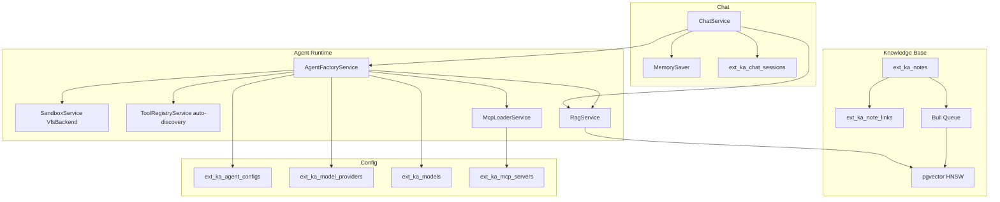

# Knowledge Agent

## Resumen

Extensión que convierte Foundation en un "Obsidian en base de datos" potenciado por un DeepAgent de LangChain. Combina knowledge base con notas markdown, RAG con pgvector, visor de grafo d3-force, runtime de agente con sandbox, y chat con sesiones persistentes por usuario.

## Componentes

1. **Knowledge Base** — PostgreSQL + pgvector. Notas markdown con frontmatter OKF, tags jsonb, soft-delete, `[[wikilinks]]` con extracción automática y backlinks.
2. **DeepAgent runtime** — `deepagents` npm package. `AgentFactoryService` construye el agente con config-hash cache (invalidación on PATCH), merge de tools nativas + MCP, sandbox VfsBackend.
3. **Sandbox Node VFS** — `@langchain/node-vfs` con deny-list (`.env`, `apps/`, `src/`, creds). QuickJS middleware para JS eval aislado (memory + timeout limits).
4. **Tools nativas** — auto-discovery via `agent.tools.ts` por extensión. `ToolRegistryService` hace `fs.readdirSync(extensionsDir)` + dynamic import, graceful skip si no existe. Tools KB: `list_notes`, `search_notes_semantic`, `get_note`, `create_note`, `update_note`, `delete_note`, `list_categories`. Servicios: `sql_query_readonly` (admin-only, ver Conventions), `execute_js` (JS aislado en QuickJS vía SandboxService — cómputo sin red/fs), `get_current_datetime` (reloj del servidor).deepagents añade built-ins del VFS: `ls`, `read_file`, `write_file`, `edit_file`, `delete`, `glob`, `grep`.
5. **MCP externos** — `MultiServerMCPClient` de `@langchain/mcp-adapters`. Config from `ext_ka_mcp_servers` (enabled). 3s timeout graceful (skip con warning). McpLoaderService se wirea en AgentFactoryService.
6. **Chat con sesiones** — `ext_ka_chat_sessions` per-user (user_id FK). `ChatService` con checkpointer (MemorySaver fallback, PostgresSaver requiere package aparte). SSE streaming via POST con `Observable<MessageEvent>` (NestJS `@Sse` solo soporta GET). Frontend consume via `fetch()` streaming + `getReader()`.
7. **Config en DB** — `ext_ka_agent_configs` (systemPrompt, model, provider, permissions jsonb, mcp_server_ids jsonb, user_id). `ext_ka_model_providers` + `ext_ka_models` admin-managed. API key solo se guarda como `api_key_ref` (env var name, NUNCA el valor).
8. **Visores** — Tree viewer (sidebar por tags/category) + grafo d3-force (`forceSimulation`, zoom/pan, drag, hover highlight, panel backlinks).

## Tablas

- `ext_ka_notes` — notas markdown (title, content_md, category_path ltree, tags jsonb, frontmatter jsonb, embedding vector(1536), user_id, soft-delete deleted_at)
- `ext_ka_note_links` — wikilinks (source_note_id, target_note_id FK CASCADE, unique)
- `ext_ka_agent_configs` — configs de agente por usuario (system_prompt, model, provider, permissions jsonb, mcp_server_ids jsonb, user_id)
- `ext_ka_chat_sessions` — sesiones de chat por usuario (user_id FK user CASCADE, agent_config_id FK SET NULL nullable, title)
- `ext_ka_model_providers` — providers admin-managed (provider enum, api_key_ref, base_url, enabled)
- `ext_ka_models` — models admin-managed (provider_id FK, model_id, display_name, context_window, active bool exclusive per provider)
- `ext_ka_mcp_servers` — MCP servers registry (agent_config_id FK CASCADE nullable, transport enum, url, api_key_ref, enabled)

Todas con prefijo `ext_ka_` para evitar colisiones con core y otras extensiones.

## Endpoints

### Knowledge Base
- `POST /ka/notes` — crear nota (user_id scoped, extrae `[[links]]`, encola embedding)
- `GET /ka/notes` — listar notas del usuario (filtros: search, categoryPath, depth)
- `GET /ka/notes/:id` — obtener nota (ownership check, null si no pertenece)
- `GET /ka/notes/:id/backlinks` — backlinks de la nota (ownership check, [] si no pertenece)
- `PATCH /ka/notes/:id` — actualizar nota (ownership check, re-embed si content cambia)
- `DELETE /ka/notes/:id` — soft delete (ownership check)
- `GET /ka/graph` — grafo del usuario (nodes + edges + filters: categoryPath, tag)

### Agent Configs (user-scoped)
- `POST /ka/agent-configs` — crear config (user_id scoped)
- `GET /ka/agent-configs` — listar configs del usuario
- `GET /ka/agent-configs/:id` — obtener config (ownership check)
- `PATCH /ka/agent-configs/:id` — actualizar (ownership check, invalida cache del agente)
- `DELETE /ka/agent-configs/:id` — eliminar (ownership check)

### Model Providers (admin mutations, any auth read)
- `POST /ka/model-providers` — **admin only** (`@Roles(RoleEnum.admin)` + RolesGuard)
- `GET /ka/model-providers` — any authenticated user (para populate selects)
- `GET /ka/model-providers/:id` — any authenticated user
- `PATCH /ka/model-providers/:id` — **admin only**
- `DELETE /ka/model-providers/:id` — **admin only**

### Models (admin mutations, any auth read)
- `POST /ka/models` — **admin only**
- `GET /ka/models` — any authenticated user (filtro opcional: providerId)
- `GET /ka/models/active` — any authenticated user (solo active=true)
- `GET /ka/models/:id` — any authenticated user
- `PATCH /ka/models/:id` — **admin only**
- `DELETE /ka/models/:id` — **admin only**

### MCP Servers (any auth user)
- `POST /ka/mcp-servers` — any authenticated user
- `GET /ka/mcp-servers` — any authenticated user
- `GET /ka/mcp-servers/:id` — any authenticated user
- `PATCH /ka/mcp-servers/:id` — any authenticated user
- `DELETE /ka/mcp-servers/:id` — any authenticated user

### Chat Sessions (user-scoped, SSE)
- `POST /ka/chat/sessions` — crear sesión (user_id scoped)
- `GET /ka/chat/sessions` — listar sesiones del usuario
- `GET /ka/chat/sessions/:id` — obtener sesión (ownership check, null si no pertenece — no leak)
- `PATCH /ka/chat/sessions/:id` — actualizar (ownership check, ForbiddenException cross-user)
- `DELETE /ka/chat/sessions/:id` — eliminar (ownership check, ForbiddenException cross-user)
- `POST /ka/chat/sessions/:sessionId/message` — enviar mensaje + stream SSE del agente (ownership check, RAG context injection, async iterable → Observable<MessageEvent> + sentinel `[DONE]`)

## Frontend

### Knowledge Base
- `/knowledge` — listado de notas (DataTable) + sidebar tree por tags/category
- `/knowledge/[id]` — editor TipTap + FormInput title + frontmatter editor + `[[wikilink]]` autocomplete
- `/knowledge/graph` — visor grafo d3-force (zoom/pan, drag, hover highlight, panel backlinks, search, filter by category/tag)

### Chat
- `/agent` — listado de sesiones (sessions list, new/delete/open)
- `/agent/[sessionId]` — chat UI estilo ChatGPT (message list, input, streaming indicators, markdown render con syntax highlight)

### Settings
- `/settings/agents` — agent configs (DataTable, FormInput systemPrompt, FormSelect model)
- `/settings/models` — models + providers admin (DataTable + forms con FormInput/FormSelect de @base/ui-app, admin-only gate via auth store `isAdmin`)
- `/settings/mcp-servers` — MCP servers CRUD (FormInput, FormSelect, FormSwitch)

## RBAC

| Controller | Acceso | Mecanismo |
|------------|--------|-----------|
| NoteController | any authenticated user | `@JwtAuth()` + `@UserId()` + ownership check en service (NotFoundException si cross-user) |
| GraphController | any authenticated user | `@JwtAuth()` + `@UserId()` (grafo scoped a user_id) |
| AgentConfigController | any authenticated user | `@JwtAuth()` + `@UserId()` + ownership check (null si cross-user, no leak) |
| ModelProviderController | GET any auth, mutations **admin only** | `@JwtAuth()` + `@Roles(RoleEnum.admin)` + `RolesGuard` en POST/PATCH/DELETE |
| ModelController | GET any auth, mutations **admin only** | `@JwtAuth()` + `@Roles(RoleEnum.admin)` + `RolesGuard` en POST/PATCH/DELETE |
| McpServerController | any authenticated user | `@JwtAuth()` |
| ChatSessionController | any authenticated user | `@JwtAuth()` + `@UserId()` + ownership check (ForbiddenException cross-user en mutaciones) |

## Arquitectura

## Seeds

Idempotent upsert (fixed UUIDs):
- Ollama Cloud provider (enabled)
- OpenRouter provider (enabled)
- Model `z-ai/glm-5.2` (active)
- Default agent config with base system prompt

## Convenciones

- **Prefijo tablas**: `ext_ka_` (evita colisiones con core y otras extensiones)
- **Auto-discovery**: copiar `agent.tools.ts` a una extensión → tools se registran automáticamente
- **Sandbox**: VfsBackend con deny-list declarativa, QuickJS para JS eval aislado
- **pgvector RAG**: HNSW index cosine, dim 1536, `embedding=NULL` excluido de search
- **API keys**: solo `api_key_ref` (env var name), NUNCA el valor de la key en DB
- **SQL tool admin-only**: `sql_query_readonly` NO filtra por `user_id` (solo defensas read-only) — se expone únicamente a agents de usuarios `RoleEnum.admin` (fail-closed, incluido en el hash del cache). El leak cross-user motivó el gate.
- **MCP por-server isolation**: cada server carga en su propio cliente con timeout individual (20s) y firma de conexión — un server muerto no tira los demás; `apiKeyRef` resuelve env var → `Authorization: Bearer` si no hay header explícito.
- **SSE via POST**: `Observable<MessageEvent>` (NestJS `@Sse` solo soporta GET)
- **Ownership check**: null para 404/403 en GET (no leak), ForbiddenException en mutaciones

## Dependencias

- `auth` — JWT auth + roles + UserId decorator
- `deepagents` — DeepAgent runtime (LangChain)
- `@langchain/ollama` — OllamaEmbeddings
- `@langchain/pgvector` — PGVectorStore
- `@langchain/mcp-adapters` — MultiServerMCPClient
- `@langchain/node-vfs` — sandbox VfsBackend
- `@langchain/langgraph` — MemorySaver checkpointer
- `bullmq` — embedding queue
- Frontend: `markdown-it`, `highlight.js`, `dompurify`, `d3-force`