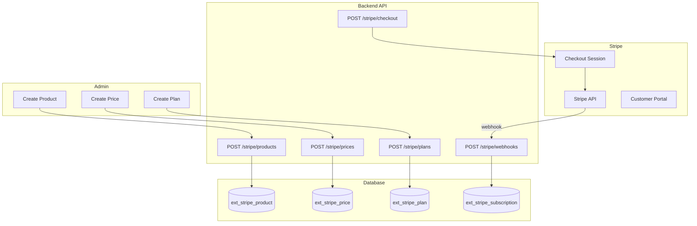

# Stripe Billing

## Overview

The Stripe Billing extension provides subscription management, product/plan catalogs, and usage-based billing via Stripe integration. It follows the Foundation extension auto-discovery pattern — drop the folder into `src/extensions/stripe/` and it works without any `app.module.ts` changes.

Key capabilities:
- **Product & Price catalog** synced with Stripe (or managed locally)
- **Plan management** with feature flags, user/storage limits
- **Subscription lifecycle** with Stripe Checkout and Customer Portal
- **PlanGuard middleware** for feature-gating endpoints based on the user's active plan
- **Webhook handling** for Stripe events (`customer.subscription.created`, `updated`, `deleted`)
- **Test environment** with simulated payments, subscriptions, and webhooks

## Architecture

### Module Structure

```
apps/back/src/extensions/stripe/
├── extension.module.ts          ← Auto-discovered module registration
├── extension.manifest.ts        ← Extension metadata, routes, entities
├── extension.config.ts          ← Stripe env config (registerAs)
├── stripe.provider.ts           ← Stripe SDK provider (conditional)
├── domain/
│   ├── product.ts               # Product domain object
│   ├── price.ts                 # Price domain object
│   ├── plan.ts                  # Plan domain object
│   ├── subscription.ts          # Subscription domain object
│   └── usage-record.ts          # Usage record domain object
├── dto/
│   ├── create-product.dto.ts
│   ├── update-product.dto.ts
│   ├── create-price.dto.ts
│   ├── create-plan.dto.ts
│   ├── update-plan.dto.ts
│   └── create-subscription.dto.ts
├── controllers/
│   ├── products.controller.ts
│   ├── prices.controller.ts
│   ├── plans.controller.ts
│   ├── subscriptions.controller.ts
│   ├── webhooks.controller.ts
│   └── stripe-test.controller.ts
├── services/
│   ├── stripe.service.ts          # Real Stripe SDK integration
│   ├── products.service.ts
│   ├── prices.service.ts
│   ├── plans.service.ts
│   ├── subscriptions.service.ts
│   └── webhooks.service.ts
├── middleware/
│   └── plan-guard.ts              # PlanGuard + @RequiredFeature decorator
└── infrastructure/persistence/entities/
    ├── product.entity.ts
    ├── price.entity.ts
    ├── plan.entity.ts
    ├── subscription.entity.ts
    └── usage-record.entity.ts
```

### Data Flow



## API / Public Interface

### Products

| Method | Path | Description | Auth |
|--------|------|-------------|------|
| `GET` | `/api/v1/stripe/products` | List all products | JWT |
| `GET` | `/api/v1/stripe/products/:id` | Get product by ID | JWT |
| `POST` | `/api/v1/stripe/products` | Create product | Admin |
| `PATCH` | `/api/v1/stripe/products/:id` | Update product | Admin |
| `DELETE` | `/api/v1/stripe/products/:id` | Delete product | Admin |

### Prices

| Method | Path | Description | Auth |
|--------|------|-------------|------|
| `GET` | `/api/v1/stripe/prices?productId=xxx` | List prices by product | None |
| `POST` | `/api/v1/stripe/prices` | Create price | Admin |

### Plans

| Method | Path | Description | Auth |
|--------|------|-------------|------|
| `GET` | `/api/v1/stripe/plans` | List all plans | JWT |
| `GET` | `/api/v1/stripe/plans/:id` | Get plan by ID | JWT |
| `POST` | `/api/v1/stripe/plans` | Create plan | Admin |
| `PATCH` | `/api/v1/stripe/plans/:id` | Update plan | Admin |

### Subscriptions

| Method | Path | Description | Auth |
|--------|------|-------------|------|
| `GET` | `/api/v1/stripe/subscriptions` | List user subscriptions | JWT + PlanGuard |
| `GET` | `/api/v1/stripe/subscriptions/me` | Get active subscription | JWT + PlanGuard |
| `GET` | `/api/v1/stripe/subscriptions/:id` | Get subscription by ID | JWT + PlanGuard |
| `POST` | `/api/v1/stripe/subscriptions` | Create subscription | JWT + PlanGuard |
| `PATCH` | `/api/v1/stripe/subscriptions/:id/resume` | Resume canceled subscription | JWT + PlanGuard |
| `DELETE` | `/api/v1/stripe/subscriptions/:id` | Cancel subscription | JWT + PlanGuard |

### Checkout & Portal

| Method | Path | Description | Auth |
|--------|------|-------------|------|
| `POST` | `/api/v1/stripe/checkout` | Create Stripe Checkout session | JWT |
| `POST` | `/api/v1/stripe/portal` | Create Customer Portal session | JWT |

### Webhooks

| Method | Path | Description | Auth |
|--------|------|-------------|------|
| `POST` | `/api/v1/stripe/webhooks` | Stripe webhook endpoint | Stripe Signature |

### Test Endpoints

| Method | Path | Description | Auth |
|--------|------|-------------|------|
| `POST` | `/api/v1/stripe/test/payment` | Simulate a payment | None |
| `GET` | `/api/v1/stripe/test/payments` | List test payments | None |
| `POST` | `/api/v1/stripe/test/subscription` | Simulate subscription | None |
| `POST` | `/api/v1/stripe/test/webhook/simulate` | Simulate webhook event | None |
| `GET` | `/api/v1/stripe/test/methods` | List test payment methods | None |

## Entities

### Product (`ext_stripe_product`)

| Column | Type | Description |
|--------|------|-------------|
| `id` | UUID (PK) | Primary key |
| `stripeId` | VARCHAR (nullable) | Stripe product ID |
| `name` | VARCHAR | Product name |
| `description` | TEXT (nullable) | Product description |
| `active` | BOOLEAN | Whether the product is active |
| `metadata` | JSONB (nullable) | Arbitrary metadata |
| `createdAt` | TIMESTAMP | Auto-generated |
| `updatedAt` | TIMESTAMP | Auto-updated |

### Price (`ext_stripe_price`)

| Column | Type | Description |
|--------|------|-------------|
| `id` | UUID (PK) | Primary key |
| `stripeId` | VARCHAR (nullable) | Stripe price ID |
| `productId` | UUID (FK) | Linked product |
| `currency` | VARCHAR | Currency code (default: `eur`) |
| `unitAmount` | INT | Price in cents |
| `type` | ENUM | `one_time` or `recurring` |
| `interval` | ENUM | `month` or `year` (nullable) |
| `active` | BOOLEAN | Whether the price is active |
| `createdAt` | TIMESTAMP | Auto-generated |
| `updatedAt` | TIMESTAMP | Auto-updated |

### Plan (`ext_stripe_plan`)

| Column | Type | Description |
|--------|------|-------------|
| `id` | UUID (PK) | Primary key |
| `name` | VARCHAR | Plan display name |
| `description` | TEXT (nullable) | Plan description |
| `priceId` | UUID (FK) | Linked price |
| `maxUsers` | INT (nullable) | Max users allowed |
| `maxStorage` | BIGINT (nullable) | Max storage in bytes |
| `features` | JSONB (nullable) | Array of feature strings |
| `isDefault` | BOOLEAN | Whether this is the default plan |
| `active` | BOOLEAN | Whether the plan is active |
| `createdAt` | TIMESTAMP | Auto-generated |
| `updatedAt` | TIMESTAMP | Auto-updated |

### Subscription (`ext_stripe_subscription`)

| Column | Type | Description |
|--------|------|-------------|
| `id` | UUID (PK) | Primary key |
| `stripeId` | VARCHAR (nullable) | Stripe subscription ID |
| `userId` | INT | Linked user |
| `planId` | UUID (FK) | Linked plan |
| `status` | ENUM | `active`, `past_due`, `canceled`, `incomplete`, `trialing` |
| `currentPeriodStart` | TIMESTAMP (nullable) | Start of current billing period |
| `currentPeriodEnd` | TIMESTAMP (nullable) | End of current billing period |
| `trialEnd` | TIMESTAMP (nullable) | Trial end date |
| `cancelAtPeriodEnd` | BOOLEAN | Whether to cancel at period end |
| `createdAt` | TIMESTAMP | Auto-generated |
| `updatedAt` | TIMESTAMP | Auto-updated |

### UsageRecord (`ext_stripe_usage_record`)

| Column | Type | Description |
|--------|------|-------------|
| `id` | UUID (PK) | Primary key |
| `subscriptionId` | UUID (FK) | Linked subscription |
| `stripeId` | VARCHAR (nullable) | Stripe usage record ID |
| `quantity` | INT | Usage quantity |
| `timestamp` | TIMESTAMP | When the usage occurred |
| `action` | ENUM | `set` or `increment` |
| `createdAt` | TIMESTAMP | Auto-generated |

## PlanGuard

`PlanGuard` is a NestJS guard that restricts access to endpoints based on the user's active subscription plan features.

### Decorator

```typescript
export const RequiredFeature = (feature: string) => { ... };
```

### Usage

```typescript
@Controller('stripe/subscriptions')
@UseGuards(AuthGuard('jwt'), PlanGuard)
@RequiredFeature('subscription')
export class SubscriptionsController { ... }
```

### How It Works

1. Reads the `feature` metadata from the handler or class via `Reflector`
2. If no feature is required, allows access
3. Fetches the active subscription for the current user
4. Loads the plan associated with that subscription
5. Checks if `plan.features` includes the required feature string
6. Returns `true` (allow) or `false` (deny)

## Webhook Setup

### Stripe CLI (Development)

```bash
brew install stripe/stripe-cli/stripe
stripe login
stripe listen --forward-to localhost:3001/api/v1/stripe/webhooks
```

### Webhook Secret

Set `STRIPE_WEBHOOK_SECRET` in your `.env` to the secret provided by `stripe listen`.

### Handled Events

| Event | Action |
|-------|--------|
| `customer.subscription.created` | Creates or updates local `SubscriptionEntity` |
| `customer.subscription.updated` | Updates status, period dates, cancel flags |
| `customer.subscription.deleted` | Sets status to `canceled` |

### Webhook Security

The `WebhooksController` verifies the `stripe-signature` header using `stripe.webhooks.constructEvent` with the configured `STRIPE_WEBHOOK_SECRET`.

## Frontend

### Routes

| Route | Description |
|-------|-------------|
| `/app/settings/plan` | Subscription management page |

### Composables

```typescript
import {
  useSubscriptionQuery,
  usePlansQuery,
  useCheckoutMutation,
  useCancelMutation,
  useResumeMutation,
} from '@/composables/useSubscription';
```

### Page Features

- **Current subscription card**: Shows plan name, status badge, billing period
- **Plan features list**: Lists features from the active plan
- **Usage bars**: Visual bars for `maxUsers` and `maxStorage`
- **Available plans**: Grid of all plans with "Contratar" checkout button
- **Actions**: Change plan (Customer Portal), Cancel, Resume

### StripeService (Frontend)

```typescript
const stripeService = new StripeService();
await stripeService.createCheckoutSession(planId);   // Redirects to Stripe
await stripeService.cancelSubscription(subId);
await stripeService.resumeSubscription(subId);
await stripeService.getCustomerPortal();              // Redirects to portal
```

## Dependencies

- **auth** — JWT authentication, user lookup, `RolesGuard` for admin endpoints
- **storage** — File uploads (if plan features include storage limits)
- **translations** — Multilingual plan names/descriptions (optional)

## Conventions

| Convention | Rule |
|------------|------|
| Table prefix | All tables prefixed with `ext_stripe_` |
| Entity relations | OneToOne for maximum flexibility (Product↔Price↔Plan) |
| Stripe conditional | Stripe SDK is optional — extension works without Stripe keys (test mode) |
| Webhook raw body | NestJS `rawBody` required for signature verification |
| Plan features | Stored as `string[]` in JSONB — use `@RequiredFeature('feature_name')` |
| Currency | Stored in cents, default `eur` |
| Subscription status | Maps Stripe status to enum: `active`, `past_due`, `canceled`, `incomplete`, `trialing` |

## Configuration

Required environment variables:

| Variable | Required | Description |
|----------|----------|-------------|
| `STRIPE_SECRET_KEY` | No | Stripe secret key (sk_...) |
| `STRIPE_PUBLISHABLE_KEY` | No | Stripe publishable key (pk_...) |
| `STRIPE_WEBHOOK_SECRET` | No | Webhook endpoint secret (whsec_...) |
| `FRONTEND_DOMAIN` | No | Domain for Stripe success/cancel URLs |

If Stripe keys are not provided, the extension operates in test mode using the `StripeTestController` endpoints.

## Rationale

Stripe Billing is built as an extension instead of a core module to allow optional adoption. The auto-discovery pattern means projects without billing needs pay zero overhead. The PlanGuard system provides a clean, decorator-based approach to feature gating that integrates naturally with NestJS guards. OneToOne relations between Product, Price, and Plan allow maximum flexibility for future pricing models while keeping the schema simple.
