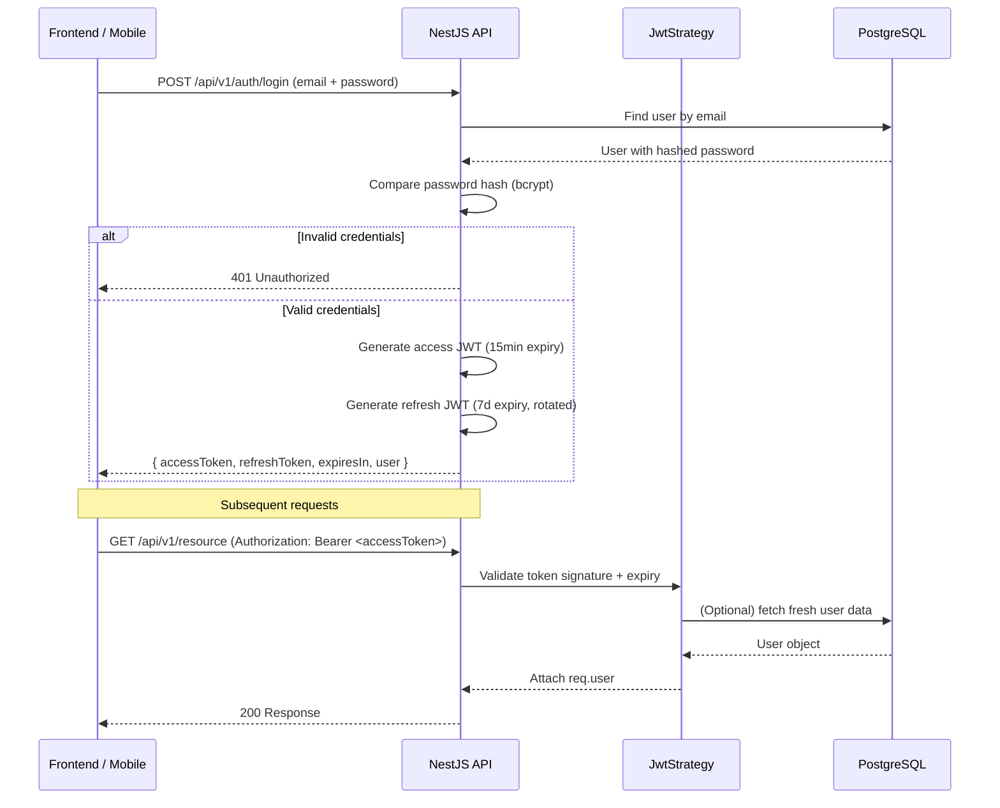
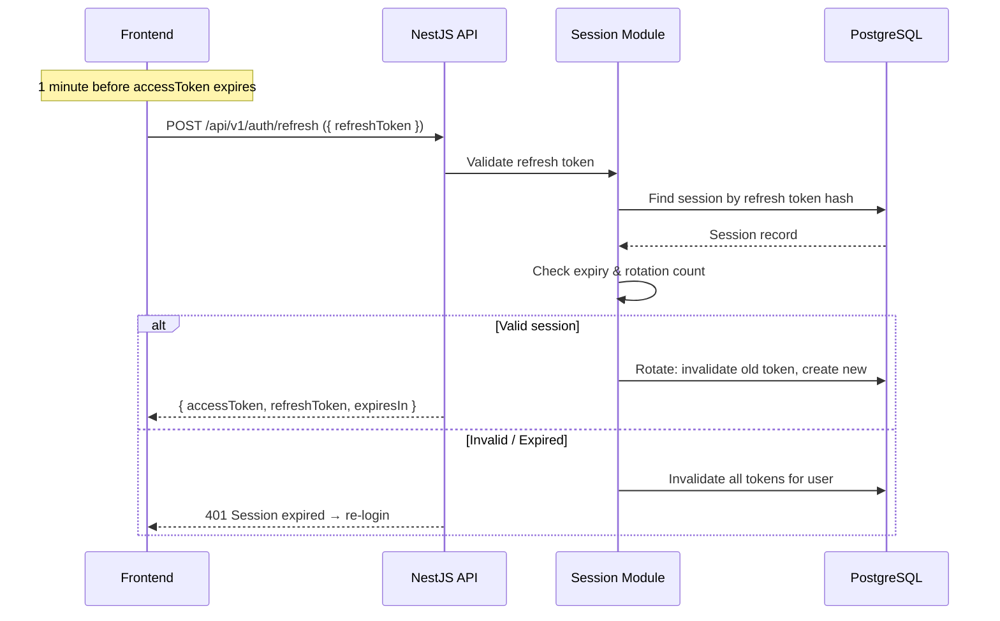
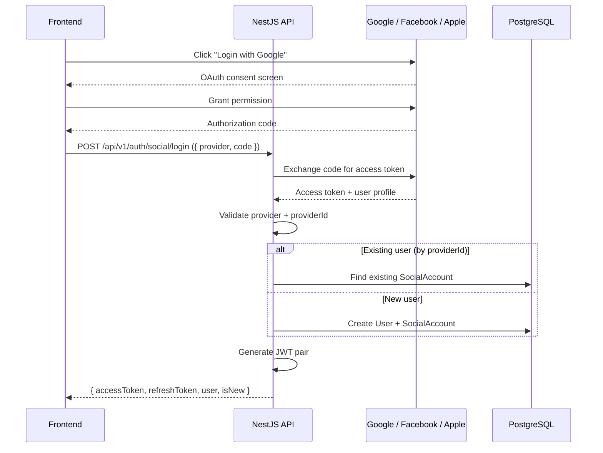

# Authentication & Authorization

## Overview

The auth module provides full authentication and authorization for both backend (NestJS guards + decorators) and frontend (Nuxt middleware + Pinia store). It supports JWT with refresh token rotation, API key authentication, role-based access control (RBAC), and social login providers (Google, Facebook, Apple).

The module lives under `src/modules/iam/` (Identity & Access Management), which groups all auth-related sub-modules into a single bounded context.

## Architecture

### Backend Module Structure

```
src/modules/iam/
├── auth/                              # JWT strategies, guards, decorators
│   ├── decorators/
│   │   ├── auth.decorator.ts          # @JwtAuth(), @ApiKeyAuth(), @FlexibleAuth(), @OptionalAuth(), @AdminAuth(), @CustomerAuth()
│   │   └── current-user.decorator.ts  # @CurrentUser(), @UserId()
│   ├── guards/
│   │   ├── jwt-auth.guard.ts          # Validates Bearer JWT
│   │   ├── api-key-auth.guard.ts      # Validates X-API-Key header
│   │   └── jwt-or-api-key.guard.ts    # Try JWT then API Key (FlexibleAuth / OptionalAuth)
│   └── strategies/
│       ├── jwt.strategy.ts            # Passport JWT strategy
│       └── api-key.strategy.ts        # Passport API Key strategy
├── auth-social/                       # OAuth2 social login strategies
│   ├── facebook.strategy.ts
│   ├── google.strategy.ts
│   └── apple.strategy.ts
├── auth-session/                      # Refresh token rotation & session management
├── roles/                             # RBAC
│   ├── roles.decorator.ts             # @Roles()
│   ├── roles.guard.ts                 # RolesGuard
│   └── roles.enum.ts                  # RoleEnum
├── api-keys/                          # Permanent machine-to-machine tokens
│   ├── domain/api-key.ts
│   ├── dto/api-key-response.dto.ts
│   ├── infrastructure/
│   │   ├── entities/api-key.entity.ts
│   │   ├── mappers/api-key.mapper.ts
│   │   └── api-key.repository.ts
│   ├── api-keys.controller.ts
│   ├── api-keys.service.ts
│   └── api-keys.module.ts
└── ...                                # User module (shared entity)
```

### JWT Authentication Flow



### Refresh Token Rotation Flow



### Social Login Flow (OAuth2)



### Guard Execution Order

When multiple decorators are applied to a single handler, NestJS runs guards in the order they appear (left-to-right, top-to-bottom):

```typescript
// Execution order: JwtAuthGuard → RolesGuard
@JwtAuth()
@Roles(RoleEnum.admin)
@Get('admin/users')
findAllUsers() { ... }
```

| Step | Guard | What it checks | On failure |
|------|-------|---------------|------------|
| 1 | `JwtAuthGuard` | Valid JWT in `Authorization: Bearer` header | 401 Unauthorized |
| 2 | `RolesGuard` | `req.user.role.id` matches one of the allowed roles | 403 Forbidden |
| 3 | (Controller method) | Ownership check (if applicable) | 403 Forbidden |

> The `RolesGuard` only enforces restrictions when `@Roles()` metadata is present. If no `@Roles()` is set, the guard passes through without checking.

## Public Interface / API

### Auth Decorators

Located in `src/modules/iam/auth/decorators/auth.decorator.ts`.

These are the **primary way to protect endpoints**. Use them directly on controllers or handler methods:

| Decorator | Guard(s) Applied | Description |
|-----------|-----------------|-------------|
| `@JwtAuth()` | `JwtAuthGuard` | Requires a valid JWT (`Authorization: Bearer <token>`) |
| `@ApiKeyAuth()` | `ApiKeyAuthGuard` | Requires `X-API-Key: <key>` header |
| `@FlexibleAuth()` | `FlexibleAuthGuard` | Accepts JWT **or** API Key |
| `@OptionalAuth()` | `OptionalAuthGuard` | User may be anonymous — no rejection on missing token |
| `@AdminAuth()` | `JwtAuthGuard` + `RolesGuard` | JWT + `admin` role required |
| `@CustomerAuth()` | `JwtAuthGuard` + `RolesGuard` | JWT + `customer` role required |

#### Usage Examples

```typescript
import { JwtAuth, AdminAuth, CustomerAuth, FlexibleAuth, OptionalAuth } from '@iam/auth/decorators/auth.decorator';

// Require a valid JWT (any authenticated user)
@JwtAuth()
@Get('profile')
getProfile(@Request() req) { return req.user; }

// Require admin role (pre-built shortcut)
@AdminAuth()
@Get('admin/users')
findAllUsers() { ... }

// Require customer role (pre-built shortcut)
@CustomerAuth()
@Get('my-orders')
getMyOrders() { ... }

// Accepts both JWT and API Keys (integration endpoints)
@FlexibleAuth()
@Get('data')
getData() { ... }

// No auth required — user may still be in req if token provided
@OptionalAuth()
@Get('public-feed')
getPublicFeed() { ... }
```

### Role-Only Decorator (`@Roles`)

Located in `src/modules/iam/roles/roles.decorator.ts`. Used when you need a role that isn't covered by the pre-built shortcuts:

```typescript
import { Roles } from '@iam/roles/roles.decorator';
import { RoleEnum } from '@iam/roles/roles.enum';

@JwtAuth()
@Roles(RoleEnum.admin)
@Delete(':id')
remove(@Param('id') id: string) { ... }
```

> **Prefer** `@AdminAuth()` / `@CustomerAuth()` shortcuts. Only use `@JwtAuth()` + `@Roles()` for custom role combinations.

### Available Roles

```typescript
// src/modules/iam/roles/roles.enum.ts
export enum RoleEnum {
  admin =    1,
  customer = 2,
}
```

### Getting the Authenticated User

```typescript
import { CurrentUser, UserId } from '@iam/auth/decorators/current-user.decorator';
import { User } from '@users/domain/user';

// Full user object
@JwtAuth()
@Get('me')
getMe(@CurrentUser() user: User) { return user; }

// Only user ID (lighter)
@JwtAuth()
@Delete('me')
deleteAccount(@UserId() userId: string) { ... }
```

### Ownership Patterns

#### Pattern 1 — Admin sees all, Customer sees own

```typescript
@JwtAuth()
@Get(':id')
async findOne(@Param('id') id: string, @CurrentUser() user: User) {
  const resource = await this.resourceService.findById(id);
  if (!resource) throw new NotFoundException();
  if (user.role.id !== RoleEnum.admin && resource.userId !== user.id) {
    throw new ForbiddenException();
  }
  return resource;
}
```

#### Pattern 2 — Guard helper (reusable)

```typescript
// src/common/helpers/ownership.helper.ts
import { ForbiddenException } from '@nestjs/common';
import { User } from '@users/domain/user';
import { RoleEnum } from '@iam/roles/roles.enum';

export function assertOwnerOrAdmin(user: User, ownerId: number | string) {
  if (user.role.id === RoleEnum.admin) return;
  if (String(user.id) !== String(ownerId)) {
    throw new ForbiddenException('Access denied: not the resource owner');
  }
}
```

#### Pattern 3 — Service-level enforcement (customer-scoped queries)

```typescript
@CustomerAuth()
@Get('me/orders')
async getMyOrders(@UserId() userId: number) {
  return this.ordersService.findByUser(userId);
}

// orders.service.ts
async findByUser(userId: number) {
  return this.orderRepository.findAll({ where: { userId } });
}
```

### Role + Ownership Decision Tree

```
Request arrives at endpoint
│
├─ @AdminAuth()         → only admins, no ownership check needed
├─ @CustomerAuth()      → only customers; use userId from token in queries
└─ @JwtAuth()           → any authenticated user
   │
   └─ in handler/service:
      ├─ user.role === admin  → allow
      └─ user.role === customer
         ├─ resource.userId === user.id  → allow
         └─ otherwise                   → ForbiddenException
```

### API Key Auth

API Keys are **long-lived, permanent credentials** for machine-to-machine integrations (Zapier, N8N, custom scripts). Located at `src/modules/iam/api-keys/`.

#### Key Format

```
ak_<random32chars><timestamp_base36>
```

Example: `ak_f3kx9mZ2pQrLv8tNcDwA1bYuoE4h7isJ1k4c2vw`

#### REST Endpoints

All endpoints require **JWT authentication** (users manage their own key).

| Method | Path | Description |
|--------|------|-------------|
| `GET` | `/v1/api-keys` | Get current API key (auto-creates one if none exists) |
| `POST` | `/v1/api-keys/regenerate` | Revoke current key and generate a new one |
| `DELETE` | `/v1/api-keys` | Revoke the current API key |

#### Using an API Key

```http
GET /v1/incidents HTTP/1.1
Host: api.example.com
X-API-Key: ak_f3kx9mZ2pQrLv8tNcDwA1bYuoE4h7isJ1k4c2vw
```

#### How the Guard Works

```
Request → ApiKeyAuthGuard
  → reads X-API-Key header
  → ApiKeyStrategy.validate()
    → ApiKeysService.validateApiKey(key)
      → queries api_keys table, compares hash
      → returns { id, email, role } user object → req.user
```

The `ApiKeyStrategy` attaches the **same `req.user` shape** as the JWT strategy, so all downstream code works identically regardless of auth method.

#### Security Considerations

| Concern | How it's handled |
|---------|-----------------|
| Key secrecy | Stored hashed; plain text only returned at creation |
| Key rotation | `POST /regenerate` atomically invalidates old key |
| Scope | One key per user; inherits the user's role and permissions |
| Revocation | Immediate — next request fails validation |

### Frontend Auth

#### Auth Store (`useAuthStore`)

Located in `apps/front/modules/auth/stores/auth.store.ts`. Persisted with `pinia-plugin-persistedstate`.

**State:**
- `token` — access JWT
- `refreshToken` — refresh JWT
- `tokenExpires` — Unix timestamp in ms
- `user` — full user object with role

**Key Getters:**

| Getter | Description |
|--------|-------------|
| `isAuthenticated` | `!!token` |
| `isTokenExpired` | `Date.now() >= tokenExpires` |
| `isAdmin` | `user.role.name === 'admin'` |
| `isCustomer` | `user.role.name === 'customer'` |
| `fullName` | `firstName + ' ' + lastName` |

**Automatic Token Refresh:** After login, `startRefreshTokenTimer()` schedules a `setTimeout` to refresh the access token **1 minute before expiry**.

#### Route Middleware

Three middleware files in `apps/front/modules/auth/middleware/`:

| Middleware | Type | Who is allowed | File |
|------------|------|---------------|------|
| `admin.global` | Global (auto) | Admins on `/app/*` | `middleware/admin.global.ts` |
| `auth` | Named | Any authenticated user | `middleware/auth.ts` |
| `guest` | Named | Unauthenticated users | `middleware/guest.ts` |

The `admin.global.ts` middleware:
1. Checks `isAuthenticated` → redirects to `/login` if not
2. Checks `isAdmin` → throws 403 if not admin
3. Checks `isTokenExpired` → attempts refresh, redirects to login on failure

#### Conditional UI Based on Role

```vue
<script setup>
const authStore = useAuthStore();
</script>

<template>
  <Button v-if="authStore.isAdmin">Manage Users</Button>
  <div v-if="authStore.isCustomer">Your Orders</div>
</template>
```

#### API Request Authentication

All API requests go through `fetchWrapper` (`apps/front/helpers/fetch-wrapper.ts`), which automatically attaches `Authorization: Bearer <token>`:

```typescript
import { fetchWrapper } from '@/helpers/fetch-wrapper';

const users = await fetchWrapper.get(`${apiUrl}/users`);
const created = await fetchWrapper.post(`${apiUrl}/products`, { name: 'Test' });
```

## Entities

### User (`user`)

| Column | Type | Description |
|--------|------|-------------|
| `id` | UUID (PK) | Primary key |
| `email` | VARCHAR(255) | Unique login email |
| `password` | VARCHAR(255) | bcrypt hashed password (nullable for social-only accounts) |
| `firstName` | VARCHAR(255) | Given name |
| `lastName` | VARCHAR(255) | Family name |
| `roleId` | INT (FK → role.id) | Role assignment |
| `statusId` | INT (FK → status.id) | Account status (active/inactive) |
| `provider` | VARCHAR(50) | Social provider (`google`, `facebook`, `apple`) — nullable |
| `socialId` | VARCHAR(255) | Provider-specific user ID — nullable |
| `createdAt` | TIMESTAMP | Auto-generated |
| `updatedAt` | TIMESTAMP | Auto-updated |

**Relationships:** `User` N:1 `Role`, N:1 `Status`, 1:N `Session`, 1:1 `ApiKey`, 1:N `SocialAccount`.

### Role (`role`)

| Column | Type | Description |
|--------|------|-------------|
| `id` | INT (PK) | 1 = admin, 2 = customer |
| `name` | VARCHAR(255) | Role name |

Seeded with fixed IDs — never deleted.

### Session / Refresh Token

| Column | Type | Description |
|--------|------|-------------|
| `id` | UUID (PK) | Primary key |
| `userId` | UUID (FK → user.id) | Owner |
| `hash` | VARCHAR(255) | Hashed refresh token |
| `expiresAt` | TIMESTAMP | Expiration timestamp |
| `createdAt` | TIMESTAMP | When session was created |
| `updatedAt` | TIMESTAMP | Last rotation timestamp |

### ApiKey (`api_key`)

| Column | Type | Description |
|--------|------|-------------|
| `id` | INT (PK) | Primary key |
| `key` | VARCHAR(255) | Hashed API key value (never plain text) |
| `userId` | UUID (FK → user.id) | Owner (one key per user) |
| `createdAt` | TIMESTAMP | Auto-generated |
| `updatedAt` | TIMESTAMP | Auto-updated |

## JWT Configuration

Configured in environment variables and loaded via NestJS `@nestjs/config`:

```env
# JWT
AUTH_JWT_SECRET=your-256-bit-secret
AUTH_JWT_TOKEN_EXPIRES_IN=15m

# Refresh Token
AUTH_REFRESH_SECRET=your-refresh-secret
AUTH_REFRESH_TOKEN_EXPIRES_IN=7d
```

| Parameter | Default | Description |
|-----------|---------|-------------|
| `AUTH_JWT_SECRET` | (required) | HMAC signing key for access tokens |
| `AUTH_JWT_TOKEN_EXPIRES_IN` | `15m` | Access token TTL |
| `AUTH_REFRESH_SECRET` | (required) | HMAC signing key for refresh tokens |
| `AUTH_REFRESH_TOKEN_EXPIRES_IN` | `7d` | Refresh token TTL |

## Social Auth Providers

| Provider | Strategy | Auth Flow |
|----------|----------|-----------|
| Google | `passport-google-oauth20` | OAuth2 with authorization code |
| Facebook | `passport-facebook` | OAuth2 with authorization code |
| Apple | `passport-apple` | OAuth2 with authorization code + JWT client secret |

## Dependencies

None — this is a foundational module. Every other module depends on auth for endpoint protection.

## Conventions

- **Prefer pre-built decorators** (`@AdminAuth()`, `@CustomerAuth()`) over combining `@JwtAuth()` + `@Roles()` manually
- **Ownership checks** follow the pattern: admins see all, customers see own resources
- **API keys** are hashed at rest; plain text only returned at creation
- **Frontend** uses `fetchWrapper` which auto-attaches `Authorization: Bearer` headers
- **Service-level enforcement** is preferred when the endpoint is customer-scoped (pass `userId` from token)

## Anti-Patterns

| Anti-Pattern | Why | Correct Approach |
|-------------|-----|-----------------|
| Using `@JwtAuth()` + `@Roles()` manually for admin-only endpoints | More verbose, error-prone | Use `@AdminAuth()` or `@CustomerAuth()` |
| Relying on `.delete()` with TypeORM for auth entities | Bypasses subscribers and hooks | Use `.remove()` after loading entities |
| Checking role inside controller logic with hardcoded IDs | Duplicates guard logic | Use `assertOwnerOrAdmin()` helper |
| Storing plain-text API keys | Security risk | Always hash at rest |

## Rationale

Separating auth into a dedicated IAM module keeps concerns isolated and reusable across modules. The decorator-based approach makes endpoint protection declarative and testable — each endpoint's security requirements are visible at a glance. Social auth strategies are pluggable: add a new provider by dropping in a new Passport strategy module. The dual auth model (JWT for interactive, API Keys for machine-to-machine) covers both human and programmatic access patterns with the same `req.user` interface.
