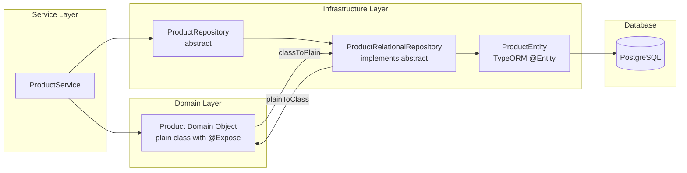

# Database & Migrations

## Overview

The database layer uses **TypeORM** with **PostgreSQL**. The architecture follows **Domain-Driven Design**: services work with Domain objects (plain classes with `@Expose()` decorators), while TypeORM entities are confined to the infrastructure layer. Transformations use `class-transformer`'s `plainToClass()`. This keeps business logic completely free from ORM concerns.

## Architecture

### Directory Structure

```
src/infrastructure/database/
├── migrations/         # TypeORM migration files (timestamp-prefixed)
├── seeds/              # Idempotent seeders
│   ├── run-seed.ts     # Entry point — runs all seeders in order
│   └── relational/     # Per-entity seeders (role, status, user)
│       ├── role/
│       ├── status/
│       └── user/
└── config/             # TypeORM data source configuration
```

### Module Persistence Pattern

Each feature module follows this layer-separated structure:

```
module/
├── domain/                     # Domain object (plain class with @Expose)
├── dto/                        # Create / Update / FindAll DTOs
└── infrastructure/
    ├── entities/               # TypeORM entity (maps to table)
    ├── mappers/                # Entity ↔ Domain mapping (legacy, being phased out)
    ├── persistence.module.ts   # Provides abstract repository via DI
    └── <name>.repository.ts    # Implements abstract repository, uses plainToClass()
```

### Domain-Driven Architecture



**Key rule:** The service layer ALWAYS works with the Domain object, never directly with the TypeORM entity. Transformation is handled by:

```typescript
// In the repository
import { plainToClass } from 'class-transformer';
import { Product } from '../domain/product';

async findById(id: string): Promise<NullableType<Product>> {
  const entity = await this.productRepository.findOne({ where: { id } });
  return entity ? plainToClass(Product, entity) : null;
}
```

### Resource Generation Workflow

From `apps/back/`:

```bash
# Step 1: Generate a new CRUD resource
pnpm generate:resource
# Prompts: resource name (e.g., "product"), destination (custom/ or modules/)

# Step 2: Register the module (if not auto-discovered)
# Edit src/app.module.ts — add ProductModule to imports

# Step 3: Generate a migration from schema diff
pnpm migration:generate AddProductTable

# Step 4: Run the migration
pnpm migration:run
```

#### What Gets Generated

```
src/modules/<group>/<resource>/
├── <resource>.module.ts           # NestJS module
├── <resource>.controller.ts       # REST controller
├── <resource>.service.ts          # Business logic
├── domain/
│   └── <resource>.ts              # Domain object with @Expose()
├── dto/
│   ├── create-<resource>.dto.ts   # Create validation
│   ├── update-<resource>.dto.ts   # Update validation
│   └── find-all-<resource>.dto.ts # Query params + pagination
└── infrastructure/
    ├── persistence.module.ts      # Provides repository
    ├── <resource>.repository.ts   # Uses plainToClass()
    └── entities/
        └── <resource>.entity.ts   # TypeORM entity
```

#### Adding a Property to an Existing Resource

```bash
pnpm add:property
# Prompts for: resource name, property name, kind (primitive/reference), type, nullable

# After running, ALWAYS generate a migration:
pnpm migration:generate AddPropertyColumn
```

This updates: entity, domain object (with `@Expose()` and `@Type()`), create/update DTOs, and mapper.

## Database Migrations

### Migration Commands

All commands run from `apps/back/`:

| Command | Description |
|---------|-------------|
| `pnpm migration:generate <Name>` | Compares entities against live DB, generates diff migration |
| `pnpm migration:create <path>` | Creates empty migration file for manual SQL |
| `pnpm migration:run` | Executes all pending migrations |
| `pnpm migration:revert` | Rolls back the last executed migration |

### Migration File Anatomy

```typescript
// src/infrastructure/database/migrations/1715028537217-AddProductPriceColumn.ts
import { MigrationInterface, QueryRunner } from "typeorm";

export class AddProductPriceColumn1715028537217 implements MigrationInterface {
  public async up(queryRunner: QueryRunner): Promise<void> {
    await queryRunner.query(`ALTER TABLE "product" ADD "price" numeric(10,2)`);
  }

  public async down(queryRunner: QueryRunner): Promise<void> {
    await queryRunner.query(`ALTER TABLE "product" DROP COLUMN "price"`);
  }
}
```

**Rules:**
- Migration class name = `{PascalName}{Timestamp}`
- Timestamp prefix ensures ordering
- Always **review generated migrations** before running them
- `.down()` must reverse `.up()` exactly
- For data migrations or complex SQL, create empty migrations manually

## Seed Patterns

### Location

```
src/infrastructure/database/seeds/
└── run-seed.ts           # Entry point
└── relational/
    ├── role/             # RoleSeedModule + RoleSeedService
    ├── status/           # StatusSeedModule + StatusSeedService
    └── user/             # UserSeedModule + UserSeedService
```

### Idempotent Seed Pattern

Seeds use `upsert` with fixed UUIDs — safe to run multiple times:

```typescript
// role-seed.service.ts
@Injectable()
export class RoleSeedService {
  constructor(
    @InjectRepository(RoleEntity)
    private repository: Repository<RoleEntity>,
  ) {}

  async run() {
    const count = await this.repository.count();
    if (count > 0) return; // Already seeded

    await this.repository.save([
      this.repository.create({ id: 1, name: 'admin' }),
      this.repository.create({ id: 2, name: 'customer' }),
    ]);
  }
}
```

**Key patterns:**
- Fixed IDs (never auto-generated for reference data)
- Check if already seeded before inserting
- `upsert` for safe re-runs without duplicate errors
- Seeds run in dependency order: roles → statuses → users

### Run Seeds

```bash
pnpm seed:run
```

## Repository Patterns

Each module has an **abstract repository** that the service injects:

```typescript
// domain/product.repository.ts (abstract)
export abstract class ProductRepository {
  abstract findById(id: string): Promise<NullableType<Product>>;
  abstract findAll(options: FindAllProductsDto): Promise<PaginatedResult<Product>>;
  abstract create(dto: CreateProductDto): Promise<Product>;
  abstract update(id: string, dto: UpdateProductDto): Promise<Product>;
  abstract remove(id: string): Promise<void>;
}
```

The concrete implementation extends it:

```typescript
// infrastructure/product.repository.ts
@Injectable()
export class ProductRelationalRepository extends ProductRepository {
  constructor(
    @InjectRepository(ProductEntity)
    private readonly productRepo: Repository<ProductEntity>,
  ) {}

  async findById(id: string): Promise<NullableType<Product>> {
    const entity = await this.productRepo.findOne({ where: { id } });
    return entity ? plainToClass(Product, entity) : null;
  }

  async create(dto: CreateProductDto): Promise<Product> {
    const entity = this.productRepo.create(dto);
    await this.productRepo.save(entity);
    return plainToClass(Product, entity);
  }
}
```

### Persistence Module

Wires the abstract repository to the concrete implementation:

```typescript
// infrastructure/persistence.module.ts
@Module({
  imports: [TypeOrmModule.forFeature([ProductEntity])],
  providers: [
    { provide: ProductRepository, useClass: ProductRelationalRepository },
  ],
  exports: [ProductRepository],
})
export class ProductRelationalPersistenceModule {}
```

The **Service** always injects the abstract `ProductRepository`:

```typescript
// product.service.ts
@Injectable()
export class ProductService {
  constructor(
    private readonly productRepository: ProductRepository, // abstract!
  ) {}
}
```

## DTO Patterns

### Create DTO

Uses `class-validator` decorators for validation:

```typescript
import { IsString, IsEmail, IsOptional, IsEnum, IsNumber } from 'class-validator';
import { ApiProperty } from '@nestjs/swagger';

export class CreateProductDto {
  @ApiProperty()
  @IsString()
  name: string;

  @ApiProperty({ required: false })
  @IsOptional()
  @IsString()
  description?: string;

  @ApiProperty()
  @IsNumber()
  price: number;
}
```

### Update DTO

Same fields, all optional:

```typescript
import { PartialType } from '@nestjs/swagger';
import { CreateProductDto } from './create-product.dto';

export class UpdateProductDto extends PartialType(CreateProductDto) {}
```

### FindAll DTO (Pagination)

```typescript
import { IsOptional, IsString, IsNumber, Min } from 'class-validator';
import { Type } from 'class-transformer';

export class FindAllProductsDto {
  @IsOptional()
  @Type(() => Number)
  @IsNumber()
  @Min(1)
  page?: number = 1;

  @IsOptional()
  @Type(() => Number)
  @IsNumber()
  @Min(1)
  limit?: number = 10;

  @IsOptional()
  @IsString()
  sort?: string;

  @IsOptional()
  @IsString()
  search?: string;
}
```

## Entity Conventions

### Naming

| Convention | Rule | Example |
|------------|------|---------|
| Table name | snake_case, plural | `products`, `users`, `blog_posts` |
| Entity class | PascalCase, singular | `ProductEntity`, `UserEntity` |
| Columns | snake_case in DB, camelCase in TS | `created_at` ↔ `createdAt` |
| Primary key | UUID (recommended) or auto-increment | `id` |

### Decorators

```typescript
import { Entity, Column, ManyToOne, JoinColumn } from 'typeorm';
import { RelationalEntityHelper } from '@infra/utils/relational-entity-helper';

@Entity({ name: 'product' })
export class ProductEntity extends RelationalEntityHelper {
  @Column({ type: 'varchar', length: 255 })
  name: string;

  @Column({ type: 'text', nullable: true })
  description?: string;

  @Column({ type: 'decimal', precision: 10, scale: 2 })
  price: number;

  @ManyToOne(() => CategoryEntity)
  @JoinColumn({ name: 'category_id' })
  category: CategoryEntity;
}
```

### Relationships

```typescript
// Many-to-One (Product → Category)
@ManyToOne(() => CategoryEntity, (category) => category.products)
@JoinColumn({ name: 'category_id' })
category: CategoryEntity;

// One-to-Many (Category → Products)
@OneToMany(() => ProductEntity, (product) => product.category)
products: ProductEntity[];

// Many-to-Many (Student ↔ Course)
@ManyToMany(() => CourseEntity)
@JoinTable({ name: 'student_courses' })
courses: CourseEntity[];
```

## Path Aliases Reference

### Backend (`apps/back/tsconfig.json`)

| Alias | Maps to | Usage |
|-------|---------|-------|
| `@src/*` | `src/*` | Root-level imports |
| `@iam/*` | `src/modules/iam/*` | Auth, roles, users |
| `@users/*` | `src/modules/users/*` | User domain |
| `@comms/*` | `src/modules/communications/*` | Email, notifications |
| `@billing/*` | `src/modules/billing/*` | Payments, invoices |
| `@storage/*` | `src/modules/storage/*` | File uploads |
| `@infra/*` | `src/infrastructure/*` | Database, utils, config |
| `@ext/*` | `src/extensions/*` | Auto-discovered extensions |

### Frontend (`apps/front/nuxt.config.ts`)

| Alias | Maps to |
|-------|---------|
| `@` | `apps/front/` |
| `@base` | `apps/front/modules/base` |
| `@cms` | `apps/front/modules/cms` |
| `@landing` | `apps/front/modules/landing` |

## Utility Helpers

Located in `src/infrastructure/utils/`:

| File | Purpose |
|------|---------|
| `types/nullable.type.ts` | `NullableType<T> = T \| null` |
| `types/maybe.type.ts` | `MaybeType<T> = T \| undefined` |
| `types/pagination-options.ts` | `IPaginationOptions` interface |
| `infinity-pagination.ts` | `infinityPagination(data, options)` helper |
| `dto/infinity-pagination-response.dto.ts` | Standardized paginated response DTO |
| `parse-filter.ts` | `buildWhereClause()` for dynamic TypeORM filters |
| `transformers/lower-case.transformer.ts` | Auto-lowercase column transformer |
| `validate-config.ts` | Validates `class-validator` on config objects |
| `serializer.interceptor.ts` | Excludes `@Exclude()` fields from responses |
| `relational-entity-helper.ts` | Base entity class with TypeORM helpers |

## Dependencies

None — the database module is foundational and consumed by all feature modules.

## Rationale

Domain-Driven persistence keeps business logic completely free from ORM concerns. Abstract repositories allow swapping TypeORM for another ORM (e.g., Prisma, Knex) without changing service code — only the concrete repository implementation changes. Idempotent seeds with fixed UUIDs ensure consistent reference data across all environments (dev, staging, production). The migration-as-code approach (generated from entity diffs) keeps schema changes in version control, reviewable in PRs.
