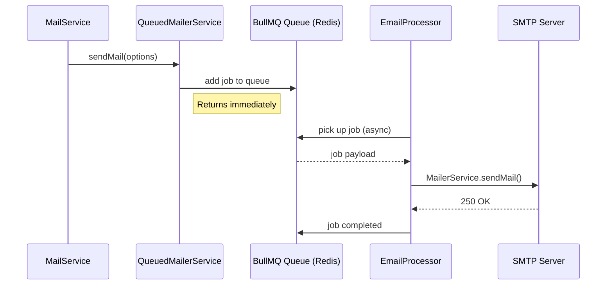

# Email System

## Overview

The email system handles transactional emails with three layers: a low-level Nodemailer wrapper (`MailerService`), a high-level `MailService` that builds email content with i18n subjects, and an `EmailQueueModule` for async delivery via BullMQ. This architecture provides reliable asynchronous delivery by default while allowing synchronous fallback for testing and immediate-confirmation flows.

## Architecture

### Layered Design

```mermaid
flowchart TD
    subgraph "Application Layer"
        A[AuthService]
        B[Other Services]
    end

    subgraph "Mail Service"
        MS[MailService]
    end

    subgraph "Delivery Layer"
        QMS[QueuedMailerService]
        M[MailerService - Nodemailer]
    end

    subgraph "Queue Layer"
        Q[BullMQ Queue]
        EP[EmailProcessor]
    end

    subgraph "Transport"
        SMTP[SMTP Server]
    end

    A --> MS
    B --> MS
    MS -->|async=true (default)| QMS
    MS -->|async=false| M
    QMS --> Q
    Q --> EP
    EP --> M
    M --> SMTP
```

### When Redis is Unavailable

If Redis is not configured (no `REDIS_URL`), `EmailQueueModule` logs `Redis enabled: false` and falls back to synchronous sending. No emails are lost — they just don't go through the queue.

## MailService API

Located at `src/modules/communications/mail/mail.service.ts`.

### Available Methods

| Method | Description | Template |
|--------|-------------|----------|
| `userSignUp(mailData, async?)` | Email confirmation link after registration | `activation.hbs` |
| `forgotPassword(mailData, async?)` | Password reset link | `reset-password.hbs` |
| `confirmNewEmail(mailData, async?)` | Confirm email address change | `confirm-new-email.hbs` |

All methods accept an `async` boolean (default: `true`). When `true`, the email goes through BullMQ. When `false`, it sends synchronously (useful in tests).

### Usage Example

```typescript
import { MailService } from '@comms/mail/mail.service';

@Injectable()
export class AuthService {
  constructor(private readonly mailService: MailService) {}

  async sendWelcomeEmail(user: User, hash: string) {
    await this.mailService.userSignUp({
      to: user.email,
      data: { hash },
    });
  }
}
```

### Adding a New Email Type

```typescript
async myNewEmail(mailData: MailData<{ link: string }>, async = true): Promise<void> {
  const i18n = I18nContext.current();
  const subject = await i18n?.t('my-module.emailSubject');

  const mailOptions = {
    to: mailData.to,
    subject: subject ?? 'Notification',
    text: mailData.data.link,
    templatePath: path.join(
      this.configService.getOrThrow('app.workingDirectory', { infer: true }),
      'src', 'modules', 'communications', 'mail', 'mail-templates', 'build',
      'my-new-template.hbs',
    ),
    context: {
      link: mailData.data.link,
      app_name: this.configService.get('app.name', { infer: true }),
    },
  };

  if (async) {
    await this.queuedMailerService.sendMail(mailOptions);
  } else {
    await this.mailerService.sendMail(mailOptions);
  }
}
```

## Email Templates (Maizzle)

Maizzle allows writing email templates with Tailwind CSS — it compiles to inline-styled HTML compatible with all major email clients (Gmail, Outlook, Apple Mail).

### Template Directory Structure

```
apps/back/src/modules/communications/mail/
└── mail-templates/
    ├── emails/              # Source templates (.hbs) — Maizzle format
    │   ├── activation.hbs
    │   ├── reset-password.hbs
    │   └── confirm-new-email.hbs
    ├── build/               # Compiled output (.hbs) — used by MailService
    │   ├── activation.hbs
    │   ├── reset-password.hbs
    │   └── confirm-new-email.hbs
    └── layouts/             # Shared Maizzle layouts
        └── main.hbs
```

> **Logo synchronization**: The email banner (`banner.svg`) and logo (`logo.svg`) in `apps/back/public/assets/` are synchronized from `apps/front/public/`. When the frontend branding changes, copy the updated assets to the backend to keep email branding consistent.

### Creating a New Template

1. Create the Maizzle source file:

```html
---
title: "My Notification"
preheader: "You have a new notification"
---

<x-main>
  <p>Hello {{ name }}!</p>
  <p>{{ message }}</p>
  <a href="{{ link }}">Click here</a>
</x-main>
```

2. Compile templates:

```bash
cd apps/back
npm run maizzle:build
```

This outputs compiled Handlebars (`.hbs`) files to `mail-templates/build/`.

### Template Conventions

| Rule | Description |
|------|-------------|
| Source files | `emails/*.hbs` (Maizzle) |
| Compiled output | `build/*.hbs` (Handlebars) |
| Layout inheritance | Use `<x-main>` tag to wrap content |
| CSS | Tailwind classes in source → inline styles in output |
| Variables | Handlebars `{{ variable }}` syntax in compiled templates |

## Email Queue (BullMQ)

### How It Works

1. `MailService` calls `QueuedMailerService.sendMail(options)` with email options
2. `QueuedMailerService` adds a job to the BullMQ queue
3. `EmailProcessor` (a BullMQ worker) picks up the job asynchronously
4. `EmailProcessor` calls `MailerService.sendMail()` which sends via Nodemailer over SMTP

### Queue Flow



### Module Registration

`EmailQueueModule` is self-registering — no extra config needed:

```typescript
// app.module.ts
import { EmailQueueModule } from '@comms/mail/email-queue.module';

@Module({
  imports: [
    EmailQueueModule.register(),
  ],
})
export class AppModule {}
```

## Local Development with Mailpit

For local development, use [Mailpit](https://github.com/axllent/mailpit) — an email testing tool with a web UI:

```bash
# Start Mailpit (Docker)
docker run -d --name mailpit \
  -p 1025:1025 \  # SMTP port
  -p 8025:8025 \  # Web UI
  axllent/mailpit
```

Configure your `.env`:

```env
MAIL_HOST=localhost
MAIL_PORT=1025
MAIL_USER=
MAIL_PASSWORD=
MAIL_IGNORE_TLS=true
MAIL_SECURE=false
MAIL_REQUIRE_TLS=false
```

Access the Mailpit web UI at `http://localhost:8025` to view all sent emails.

## SMTP Configuration

### Environment Variables

| Variable | Default | Description |
|----------|---------|-------------|
| `MAIL_HOST` | — | SMTP server hostname |
| `MAIL_PORT` | `587` | SMTP port (465 for SSL, 587 for TLS) |
| `MAIL_USER` | — | SMTP username |
| `MAIL_PASSWORD` | — | SMTP password |
| `MAIL_IGNORE_TLS` | `false` | Skip TLS verification |
| `MAIL_SECURE` | `false` | `true` for port 465 (SSL) |
| `MAIL_REQUIRE_TLS` | `true` | Reject if TLS not available |
| `MAIL_DEFAULT_EMAIL` | — | From address |
| `MAIL_DEFAULT_NAME` | `Foundation App` | From name |
| `REDIS_URL` | — | Required for BullMQ queue |

### Example SMTP Configurations

**Production (SendGrid):**

```env
MAIL_HOST=smtp.sendgrid.net
MAIL_PORT=587
MAIL_USER=apikey
MAIL_PASSWORD=SG.xxxxx
MAIL_SECURE=false
MAIL_REQUIRE_TLS=true
```

**Development (Mailpit):**

```env
MAIL_HOST=localhost
MAIL_PORT=1025
MAIL_IGNORE_TLS=true
MAIL_SECURE=false
MAIL_REQUIRE_TLS=false
```

## Dependencies

- **auth** — Email links contain auth tokens (email confirmation, password reset); user context required for template personalization

## Conventions

| Convention | Rule |
|------------|------|
| Async default | All `MailService` methods default to async delivery via BullMQ |
| Subject i18n | Email subjects use `nestjs-i18n` with `x-custom-lang` header |
| Template compilation | Run `npm run maizzle:build` after creating/editing templates |
| Local dev | Use Mailpit — never send real emails during development |
| SMTP required | SMTP config must be set in `.env` for production delivery |

## Rationale

The layered architecture separates concerns cleanly: Nodemailer handles transport protocol, MailService handles business logic and i18n, and BullMQ ensures reliable async delivery with retry capability. This means email sending never blocks the main request-response cycle. Internationalized subjects handle multi-language deployments transparently based on the request's language header. Maizzle-based templates provide the developer experience of Tailwind CSS while producing email-client-compatible HTML with inline styles.
