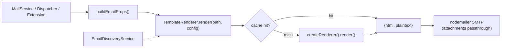

# Email System

## Overview

The email system handles transactional emails with a unified Maizzle v6 runtime renderer. Templates are `.vue` SFCs rendered on-demand via `createRenderer()` — no build step, no Handlebars. The `TemplateRenderer` service wraps the renderer with a cache layer, `EmailDiscoveryService` auto-discovers templates from three roots, and `buildEmailProps()` provides a unified config shape with i18n pre-resolution.

## Architecture

### Unified Pipeline



### Layered Design

```mermaid
flowchart TD
    subgraph "Application Layer"
        A[AuthService]
        B[Extension Services]
    end

    subgraph "Mail Service"
        MS[MailService]
        BEP[buildEmailProps]
    end

    subgraph "Renderer Layer"
        TR[TemplateRenderer]
        DISC[EmailDiscoveryService]
    end

    subgraph "Delivery Layer"
        QMS[QueuedMailerService]
        M[MailerService - Nodemailer]
    end

    subgraph "Queue Layer"
        Q[BullMQ Queue]
        EP[EmailProcessor]
    end

    subgraph "Transport"
        SMTP[SMTP Server]
    end

    A --> MS
    B --> MS
    MS --> BEP
    BEP --> TR
    MS -->|async=true (default)| QMS
    MS -->|async=false| M
    QMS --> Q
    Q --> EP
    EP --> TR
    EP --> M
    M --> SMTP
    TR --> DISC
```

### When Redis is Unavailable

If Redis is not configured (no `REDIS_URL`), `EmailQueueModule` logs `Redis enabled: false` and falls back to synchronous sending. No emails are lost — they just don't go through the queue.

## TemplateRenderer

Located at `src/modules/communications/mail/services/template-renderer.service.ts`.

Wraps Maizzle v6 `createRenderer()` (lazy, dynamic import from CJS). Caches render results by `path + sha256(stableStringify(config))` — cache hits return in <5ms (NFR-001).

### Key Design Deviations

1. **Plaintext**: `createRenderer().render()` returns `plaintext` as a config object, NOT the string. The actual plaintext is generated via `createPlaintext(html)`.
2. **Performance**: Raw first render is ~5-10s (cold Vite SSR server). The cache layer meets the <5ms cache-hit target. A warm-up plan (pre-render core templates on bootstrap) hides the first-render cost.
3. **Module Resolution**: apps/back uses classic `moduleResolution` which cannot read @maizzle/framework v6's `exports` field. An ambient module shim exists at `types/maizzle-framework.d.ts`.

## EmailDiscoveryService

Located at `src/modules/communications/mail/services/email-discovery.service.ts`.

Scans three roots for `.vue` email templates and returns `Map<name, absolutePath>`:

1. `apps/back/src/extensions/*/emails/*.vue` (extension-level, most specific)
2. `apps/back/src/modules/**/emails/*.vue` (module-level)
3. `packages/emails/emails/*.vue` (shared workspace)

Convention: NO `templates/` subfolder required. Drop a folder `emails/*.vue` in any extension or module and it's discovered automatically. Extension-level takes precedence over packages-level on name collision.

## buildEmailProps()

Located at `src/modules/communications/mail/services/build-email-props.helper.ts`.

Produces a unified `EmailProps` shape with camelCase fields (eliminates `app_url` vs `app.url` divergence). Pre-resolves i18n keys via `I18nService.t(key, { lang })` so templates receive plain strings, NOT `{{t "key"}}` helpers.

## MailService API

Located at `src/modules/communications/mail/mail.service.ts`.

### Available Methods

| Method | Description | Template |
|--------|-------------|----------|
| `userSignUp(mailData, async?)` | Email confirmation link after registration | `activation.vue` |
| `forgotPassword(mailData, async?)` | Password reset link | `reset-password.vue` |
| `confirmNewEmail(mailData, async?)` | Confirm email address change | `confirm-new-email.vue` |
| `contactFormNotification(name, email, message, lang?)` | Contact form to site owner | `contact-notification.vue` |

All methods accept an `async` boolean (default: `true`). When `true`, the email goes through BullMQ. When `false`, it sends synchronously (useful in tests).

## Email Templates (Maizzle v6)

Templates are `.vue` SFCs using Maizzle components (`<Html>`, `<Head>`, `<Body>`, `<Container>`, `<Text>`, `<Button>`) and `useConfig()` for per-render data. No build step — rendered on-demand at runtime.

### Template Locations

| Location | Purpose |
|----------|---------|
| `packages/emails/emails/` | Shared core templates (activation, reset-password, confirm-new-email, contact-notification, Layout) |
| `apps/back/src/extensions/*/emails/` | Extension-specific templates (tasks, stripe, affiliate) |
| `apps/back/src/modules/*/emails/` | Module-specific templates |

### Template Structure

```vue
<script setup>
import Layout from './Layout.vue'
import { useConfig, usePlaintext } from '@maizzle/framework'

usePlaintext()

const { subject, greeting, bodyText, buttonText, link } = useConfig()
</script>

<template>
  <Layout>
    <Html>
      <Head><title>{{ subject }}</title></Head>
      <Body class="bg-slate-50">
        <Container class="bg-white p-8 max-w-600px mx-auto">
          <Text>{{ greeting }}</Text>
          <Text>{{ bodyText }}</Text>
          <Button :href="link">{{ buttonText }}</Button>
        </Container>
      </Body>
    </Html>
  </Layout>
</template>

<style>
@import '@maizzle/tailwindcss';
@theme { --color-primary: #2563eb; }
</style>
```

### Creating a New Template

1. Create a `.vue` file in the appropriate `emails/` directory.
2. Use `useConfig()` to access per-render data (NOT `defineProps()`).
3. Use Maizzle components (`<Html>`, `<Body>`, `<Container>`, etc.).
4. Import the shared `Layout.vue` from `@emails/Layout.vue`.
5. The template is auto-discovered by `EmailDiscoveryService` — no manual registration needed.

## Email Queue (BullMQ)

### Job Data Shape

```typescript
interface EmailJobData {
  to: string | string[];
  subject: string;
  html?: string;           // pre-rendered fallback
  text?: string;
  templateName?: string;   // resolved by EmailDiscoveryService
  config?: Record<string, unknown>;  // Maizzle render config
  attachments?: unknown[];
  from?: string;
}
```

### Queue Flow

1. `MailService` calls `QueuedMailerService.sendMail(data)` with `templateName` + `config`
2. `QueuedMailerService` adds a job to the BullMQ queue
3. `EmailProcessor` picks up the job, resolves the template name via `EmailDiscoveryService`, renders via `TemplateRenderer`, and sends via Nodemailer

## NotificationDispatcher

Located at `src/core/spec-engine/notification-dispatcher.ts`.

Uses `TemplateRenderer` for `.vue` template rendering. Supports `attachments` in `NotificationSpec` (C-08) for PDF invoices. Unified `from` address: `mail.defaultName <mail.defaultEmail>` (D-06).

## SMTP Configuration

### Environment Variables

| Variable | Default | Description |
|----------|---------|-------------|
| `MAIL_HOST` | — | SMTP server hostname |
| `MAIL_PORT` | `587` | SMTP port (465 for SSL, 587 for TLS) |
| `MAIL_USER` | — | SMTP username |
| `MAIL_PASSWORD` | — | SMTP password |
| `MAIL_IGNORE_TLS` | `false` | Skip TLS verification |
| `MAIL_SECURE` | `false` | `true` for port 465 (SSL) |
| `MAIL_REQUIRE_TLS` | `true` | Reject if TLS not available |
| `MAIL_DEFAULT_EMAIL` | — | From address |
| `MAIL_DEFAULT_NAME` | `Foundation App` | From name |
| `REDIS_URL` | — | Required for BullMQ queue |

## Dependencies

- **auth** — Email links contain auth tokens (email confirmation, password reset); user context required for template personalization

## Conventions

| Convention | Rule |
|------------|------|
| Template format | `.vue` SFCs with Maizzle components + `useConfig()` |
| No build step | Templates rendered on-demand at runtime |
| No Handlebars | Eliminated — use TemplateRenderer |
| No inline HTML | Use `.vue` templates, not inline HTML strings |
| Auto-discovery | Drop `emails/*.vue` in any extension/module — no manual registration |
| Async default | All `MailService` methods default to async delivery via BullMQ |
| Subject i18n | Pre-resolved in `buildEmailProps()` via `nestjs-i18n` |
| Local dev | Use Mailpit — never send real emails during development |
| SMTP required | SMTP config must be set in `.env` for production delivery |