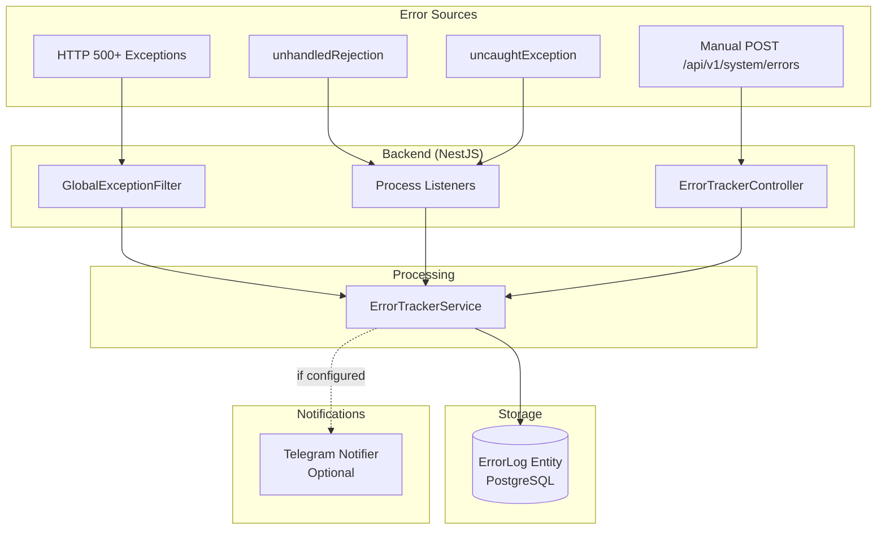
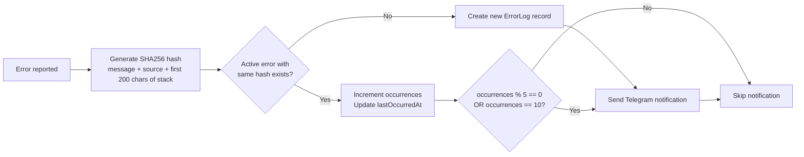

# Error Tracking

## Overview

A centralized error tracking module that captures, deduplicates, and manages critical errors (500+) from both backend and frontend. Features include automatic capture via hooks and middleware, deduplication by SHA256 hash, a visual admin dashboard with management capabilities, and optional Telegram notifications. The system is designed to replace third-party error tracking services (Sentry, Rollbar) for most use cases.

## Architecture

### Backend Capture Flow



### Frontend Capture Flow

```mermaid
flowchart TD
    subgraph "Error Sources"
        VUE[Vue Component Errors]
        PROMISE[Unhandled Promise Rejections]
        GLOBAL[window.onerror]
        MANUAL_FE[Manual reportError() call]
    end

    subgraph "Frontend Plugin"
        EH[error-handler.client.ts]
    end

    subgraph "Composable"
        UE[useErrors.ts]
    end

    subgraph "Backend API"
        API[POST /api/v1/system/errors]
    end

    VUE --> EH
    PROMISE --> EH
    GLOBAL --> EH
    MANUAL_FE --> UE
    UE --> API
    EH --> API
```

### Deduplication Logic



## API / Public Interface

### Backend Module Structure

```
apps/back/src/modules/error-tracker/
├── error-tracker.module.ts
├── error-tracker.service.ts         # Business logic: logError(), resolve(), delete()
├── error-tracker.controller.ts      # REST endpoints
├── test-error.controller.ts         # Test endpoints (trigger 500 for testing)
├── dto/
│   └── create-error.dto.ts          # { message, source?, stack?, metadata? }
├── entities/
│   └── error-log.entity.ts          # TypeORM entity
├── filters/
│   └── global-exception.filter.ts   # Captures 500+ HTTP exceptions
└── services/
    └── telegram-notifier.service.ts # Optional Telegram notifications
```

### Frontend Module Structure

```
apps/front/modules/error-tracker/
├── components/
│   └── ErrorDashboard.vue           # Visual dashboard component
├── composables/
│   └── useErrors.ts                 # reportError(), fetchErrors(), etc.
├── pages/
│   └── admin/
│       └── errors.vue               # Admin errors page
├── plugins/
│   ├── nav.ts                       # Adds "Errors" to admin sidebar
│   └── error-handler.client.ts      # Automatic Vue + browser error capture
└── nuxt.config.ts                   # Module config
```

### REST Endpoints

| Method | Path | Description | Auth |
|--------|------|-------------|------|
| `POST` | `/api/v1/system/errors` | Report an error | None (public) |
| `GET` | `/api/v1/system/errors` | List all errors | Admin |
| `DELETE` | `/api/v1/system/errors` | Delete all errors | Admin |
| `DELETE` | `/api/v1/system/errors/resolved` | Delete only resolved errors | Admin |
| `PATCH` | `/api/v1/system/errors/:id/resolve` | Mark error as resolved | Admin |
| `DELETE` | `/api/v1/system/errors/:id` | Delete a single error | Admin |
| `GET` | `/api/v1/system/test/error-500` | Trigger test 500 error | None |

### Manual Error Reporting (Frontend)

```typescript
const { reportError } = useErrors();

await reportError({
  message: "Error description",
  source: "Frontend - ComponentName",
  stack: error.stack,
  metadata: { route: window.location.pathname },
});
```

## Entities

### ErrorLog (`error_log`)

| Column | Type | Description |
|--------|------|-------------|
| `id` | UUID (PK) | Primary key |
| `message` | TEXT | Error message |
| `source` | VARCHAR(255) | Origin (`Backend - ModuleName`, `Frontend - ComponentName`) |
| `stack` | TEXT (nullable) | Full stack trace |
| `hash` | VARCHAR(64) | SHA256 hex digest for deduplication |
| `occurrences` | INT | How many times this error has occurred |
| `resolved` | BOOLEAN | `false` = Active, `true` = Resolved |
| `firstOccurredAt` | TIMESTAMP | When this error was first seen |
| `lastOccurredAt` | TIMESTAMP | When this error was last seen |
| `resolvedAt` | TIMESTAMP (nullable) | When error was marked resolved |
| `metadata` | JSONB (nullable) | Additional context (route, user agent, etc.) |
| `createdAt` | TIMESTAMP | Record creation time |
| `updatedAt` | TIMESTAMP | Record update time |

## Error Capture Details

### Backend

| Source | Handler | What it captures |
|--------|---------|-----------------|
| GlobalExceptionFilter | NestJS filter | All HTTP exceptions with status >= 500 |
| Process listeners | `process.on('unhandledRejection')` | Unhandled promise rejections |
| Process listeners | `process.on('uncaughtException')` | Uncaught exceptions |
| API endpoint | `POST /api/v1/system/errors` | Manually reported errors (via frontend) |

### Frontend

| Source | Handler | What it captures |
|--------|---------|-----------------|
| Vue error handler | `app.config.errorHandler` | Errors in Vue components |
| Promise rejections | `window.onunhandledrejection` | Unhandled promise rejections |
| Global errors | `window.onerror` | JavaScript runtime errors |

### Ignored vs Logged Errors

The system deliberately ignores client-side 4xx errors to avoid noise:

| Does NOT log | Does log |
|-------------|----------|
| 400 Bad Request | 500 Internal Server Error |
| 401 Unauthorized | 502 Bad Gateway |
| 403 Forbidden | 503 Service Unavailable |
| 422 Unprocessable Entity | unhandledRejection, uncaughtException |

## Telegram Notifications (Optional)

### Configuration

```env
TELEGRAM_BOT_TOKEN=your_bot_token_here
TELEGRAM_CHAT_ID=your_chat_id_here
```

### How It Works

- **New errors**: Notification sent immediately on first occurrence
- **Recurring errors**: Notification sent when `occurrences` is a multiple of 5 or equals 10 (avoids noise from frequent errors)
- **Format**: HTML message with error details, source, stack trace (first 500 chars)

### Setup

1. Search for @BotFather in Telegram
2. Send `/newbot` and follow instructions
3. Copy the token
4. Send any message to the bot
5. Get chat ID via: `https://api.telegram.org/bot<TOKEN>/getUpdates`
6. Set `TELEGRAM_BOT_TOKEN` and `TELEGRAM_CHAT_ID` in `.env`

## Dependencies

- **auth** — Dashboard access and management endpoints require admin authentication

## Conventions

| Convention | Rule |
|------------|------|
| Error levels | Only log critical errors (500+) — avoid noise from 4xx client errors |
| Deduplication | SHA256 hash from `message + source + first 200 chars of stack` |
| Notification frequency | First occurrence + multiples of 5 (5, 10, 15...) |
| Error states | Active (unresolved) / Resolved — managed via dashboard |
| Dashboard access | Requires admin role |

## Rationale

Centralized error tracking allows the team to monitor production issues without relying on third-party services (Sentry, Rollbar), keeping sensitive error data within the infrastructure. Deduplication by SHA256 fingerprint groups identical errors together, making it easy to identify frequency and prioritize fixes — a single error occurring 1000 times creates one record with `occurrences: 1000` instead of 1000 separate records. Smart Telegram notification frequency (multiples of 5) prevents alert fatigue while ensuring recurring errors aren't forgotten.
