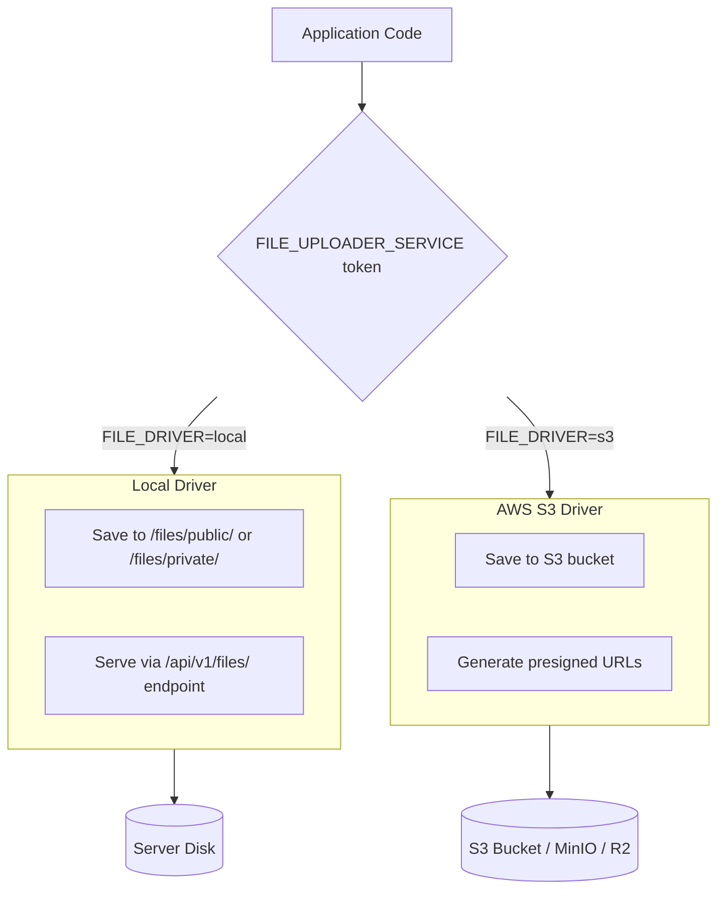
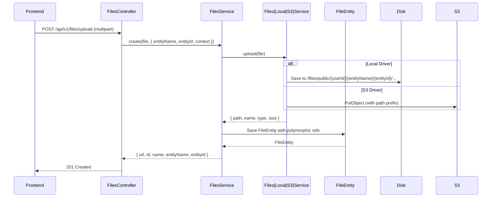
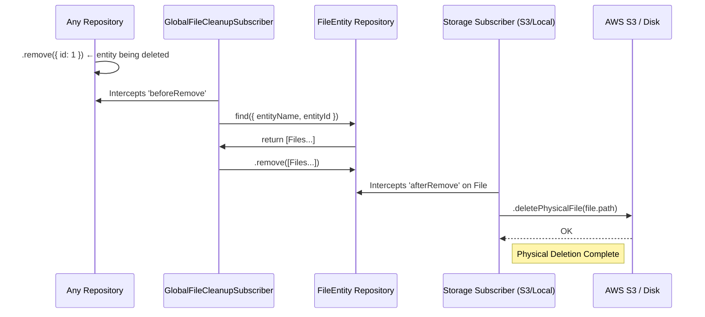

# File Storage

## Overview

The storage module manages file attachments using a **polymorphic relationship pattern**. Files can be stored locally on disk or on AWS S3 (and compatible providers like MinIO, R2), selected via the `FILE_DRIVER` environment variable. The driver-based architecture keeps the application agnostic to the storage backend — switching between local and S3 requires only an env change.

This module powers all file-related features: user avatars, blog post images, CMS media uploads, document attachments, and any other entity that needs file association.

## Architecture

### Driver Architecture



The `FilesModule` dynamically loads the correct driver through the `FILE_UPLOADER_SERVICE` DI token:

```typescript
// files.module.ts
@Module({})
export class FilesModule {
  static register(): DynamicModule {
    const driver = process.env.FILE_DRIVER ?? 'local';

    const provider = driver === 's3'
      ? FilesS3Module
      : FilesLocalModule;

    return {
      module: FilesModule,
      imports: [provider],
      exports: [provider],
    };
  }
}
```

### Polymorphic File Relationships

Instead of static columns for attachments (e.g., `avatarId`, `documentId`), files use a polymorphic pattern. Each row in the `file` table stores:

- **`entity`** — Name of the owner model (e.g., `'User'`, `'BlogPost'`, `'Page'`)
- **`entityId`** — UUID or identifier of the linked record

This allows attaching N files to any entity **without modifying the target table schema**. For example, a `BlogPost` can have multiple images (featured, content, thumbnails) all linked via `entityName='BlogPost'` + `entityId=<post-uuid>`.

```typescript
// FileEntity schema (simplified)
@Entity({ name: 'file' })
export class FileEntity {
  @PrimaryGeneratedColumn('uuid')
  id: string;

  @Column()
  path: string;           // Relative path or API URL

  @Column()
  name: string;           // Original filename

  @Column()
  type: string;           // MIME type (image/png, application/pdf, etc.)

  @Column({ type: 'int' })
  size: number;           // File size in bytes

  @Column({ default: true })
  isPublic: boolean;      // Accessible without auth?

  @Column({ nullable: true })
  entityName?: string;    // e.g., 'User', 'BlogPost', 'Page'

  @Column({ nullable: true })
  entityId?: string;      // UUID of the linked record

  @Column({ nullable: true })
  context?: string;       // e.g., 'avatar', 'featured', 'content'

  @CreateDateColumn()
  createdAt: Date;

  @UpdateDateColumn()
  updatedAt: Date;
}
```

### Upload Flow



### Local Storage Conventions

| Directory | Purpose | Access |
|-----------|---------|--------|
| `/files/public/` | Avatar, featured images, blog content images | Public URL |
| `/files/private/` | Documents, sensitive attachments | Requires auth |

Files are organized by ownership metadata:

```
files/
├── public/
│   └── {userId}/
│       ├── {entityName}/
│       │   └── {entityId}/
│       │       └── {context}/
│       │           └── {filename}
│       └── avatar.png
└── private/
    └── ...
```

### S3 Signed URLs

When using the S3 driver, files are not served directly. Instead, presigned URLs are generated for managed access:

```typescript
// FilesS3Service
async getPresignedUrl(fileId: string): Promise<string> {
  const file = await this.fileRepo.findOne({ where: { id: fileId } });
  const command = new GetObjectCommand({
    Bucket: this.config.get('storage.s3.bucket'),
    Key: file.path,
  });
  return await getSignedUrl(this.s3Client, command, { expiresIn: 3600 });
}
```

### Automatic Cleanup (Garbage Collection)

The cleanup system works in two layers to ensure no orphaned files remain in storage.

#### Layer 1: `GlobalFileCleanupSubscriber`

Listens to **all** entity deletions (`beforeRemove` event):

1. Intercepts any repository `.remove()` call
2. Identifies the entity type and ID being deleted
3. Finds all `FileEntity` records with matching `entityName` and `entityId`
4. Calls `.remove()` on those `FileEntity` records

```typescript
@EventSubscriber()
export class GlobalFileCleanupSubscriber implements EntitySubscriberInterface {
  async beforeRemove(event: RemoveEvent<any>): Promise<void> {
    const entityName = event.metadata.name;
    const entityId = event.entity?.id;
    if (!entityId) return;

    const files = await event.manager.find(FileEntity, {
      where: { entityName, entityId },
    });
    if (files.length > 0) {
      await event.manager.remove(files);
    }
  }
}
```

#### Layer 2: Driver-Specific Subscribers

These listen to `FileEntity` deletion (`afterRemove`) and delete physical files:

| Subscriber | Active when | What it does |
|------------|-------------|--------------|
| `FileS3Subscriber` | `FILE_DRIVER=s3` | Deletes from S3 bucket via `DeleteObjectCommand` |
| `FileLocalSubscriber` | `FILE_DRIVER=local` | Deletes from disk via `fs.unlink` |

#### Complete Cleanup Flow



#### ⚠️ Critical Rule

> **None of these subscribers activate if you use direct `.delete()` or `QueryBuilder`.** For TypeORM to trigger subscriber hooks, entities must ALWAYS be retrieved and use the repository's `.remove()` or `.softRemove()` method.

```typescript
// ✅ CORRECT — triggers subscribers
const user = await userRepo.findOne({ where: { id } });
await userRepo.remove(user);

// ❌ WRONG — bypasses subscribers entirely
await userRepo.delete(id);
await queryBuilder.delete().from('user').where('id = :id', { id }).execute();
```

## API / Public Interface

### File Upload Endpoint

```http
POST /api/v1/files/upload
Content-Type: multipart/form-data
Authorization: Bearer {token}

Body (form-data):
  - file: Binary (required)
  - entityName?: string
  - entityId?: string
  - context?: string
  - isPublic?: boolean (default: true)
```

### Response

```json
{
  "id": "uuid",
  "url": "http://localhost:3001/api/v1/files/public/uuid",
  "name": "image.png",
  "type": "image/png",
  "size": 102400,
  "entityName": "BlogPost",
  "entityId": "uuid-del-post",
  "context": "content",
  "isPublic": true
}
```

### Serving Local Files

```http
GET /api/v1/files/public/{fileId}
```

### S3 Presigned URL

```http
GET /api/v1/files/{fileId}/presigned-url
Authorization: Bearer {token}

Response: { "url": "https://bucket.s3.amazonaws.com/...?X-Amz-Signature=..." }
```

## Entities

### File (`file`)

| Column | Type | Description |
|--------|------|-------------|
| `id` | UUID (PK) | Primary key |
| `path` | VARCHAR(500) | Storage path or API URL |
| `name` | VARCHAR(255) | Original filename |
| `type` | VARCHAR(100) | MIME type |
| `size` | INT | File size in bytes |
| `isPublic` | BOOLEAN | `true` = accessible without auth |
| `entityName` | VARCHAR(100) (nullable) | Polymorphic owner entity name |
| `entityId` | VARCHAR(100) (nullable) | Polymorphic owner entity ID |
| `context` | VARCHAR(50) (nullable) | Usage context (`avatar`, `featured`, `content`) |
| `createdAt` | TIMESTAMP | Auto-generated |
| `updatedAt` | TIMESTAMP | Auto-updated |

## Dependencies

- **auth** — File upload/access requires authentication for private files; public files are accessible without auth

## Conventions

| Convention | Rule |
|------------|------|
| Cleanup method | Always use `repository.remove()` — `delete()` and `QueryBuilder` skip subscribers |
| Entity cleanup | Rely on `GlobalFileCleanupSubscriber` rather than manual deletion in services |
| File path pattern | `{public|private}/{userId}/{entityName}/{entityId}/{context}/{filename}` |
| S3 access | Use presigned URLs for controlled reading/deletion |
| File size limit | Configured via `MAX_FILE_SIZE` env var (default 10MB) |
| Allowed types | Configured via `ALLOWED_MIME_TYPES` env var |

## Configuration

| Env Variable | Default | Description |
|-------------|---------|-------------|
| `FILE_DRIVER` | `local` | `local` or `s3` |
| `MAX_FILE_SIZE` | `10485760` (10MB) | Maximum upload size in bytes |
| `AWS_S3_REGION` | — | S3 region (required for S3 driver) |
| `AWS_S3_BUCKET` | — | S3 bucket name (required for S3 driver) |
| `AWS_S3_ACCESS_KEY_ID` | — | S3 access key |
| `AWS_S3_SECRET_ACCESS_KEY` | — | S3 secret key |

## Rationale

The polymorphic file pattern avoids altering schema for each new attachable entity — you can add file support to any entity by including `entityName` + `entityId` in the upload request, with zero database schema changes. The driver-based storage allows zero-code switching between local development (no cloud costs) and production S3 (scalable, durable). Automatic cleanup subscribers prevent ghost files in storage — if a user or blog post is deleted, all associated files are cleaned up automatically without explicit service-level deletion logic.
