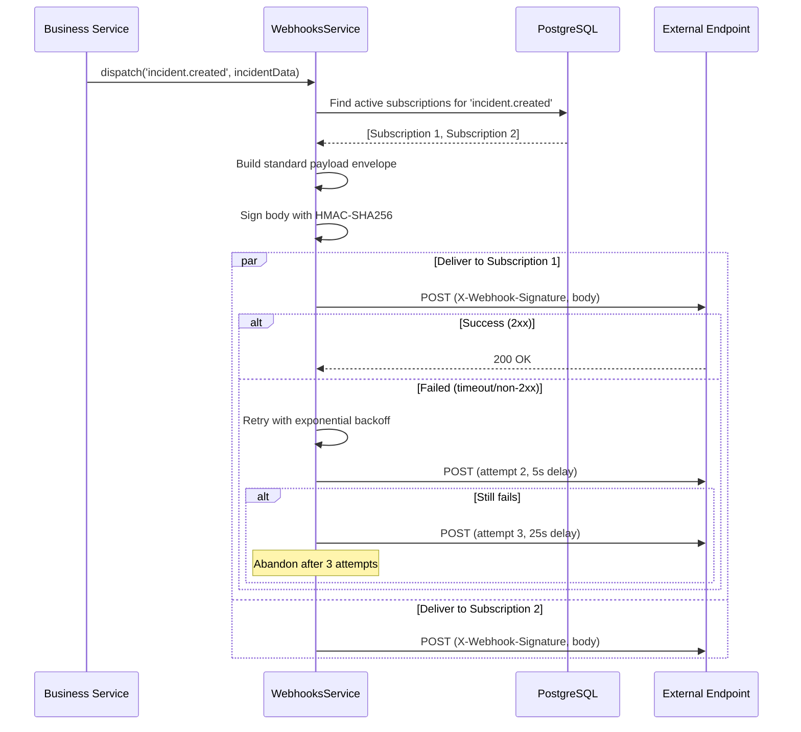

# Webhooks

## Overview

The webhooks module enables the platform to **push real-time event notifications** to external systems (Zapier, N8N, Slack, custom services) via HTTP POST requests with signed JSON payloads. This eliminates the need for external systems to poll the API — they receive events as they happen.

**Use cases:**
- Notify Slack when an incident is created
- Trigger Zapier workflows on user registration
- Sync data to N8N when a property is updated
- Custom integrations with partner systems

## Architecture

### Module Structure

```
src/modules/webhooks/
├── domain/
│   └── webhook-subscription.ts     # Domain: endpoint URL + events + secret
├── dto/
│   ├── create-webhook.dto.ts       # Create validation
│   └── webhook-payload.dto.ts      # Standard envelope
├── infrastructure/
│   ├── entities/
│   │   └── webhook-subscription.entity.ts  # TypeORM entity
│   └── webhook-subscription.repository.ts  # Data access
├── webhooks.controller.ts          # REST endpoints
├── webhooks.service.ts             # dispatch(), deliver(), sign(), retry()
└── webhooks.module.ts              # Module definition
```

### Event Dispatch Flow



### Standard Payload Envelope

Every event dispatch follows the same structure:

```json
{
  "id": "evt_01HZ3KF9GWBMX72A4N8DTRQ5C6",
  "event": "incident.created",
  "createdAt": "2025-07-01T10:30:00.000Z",
  "data": {
    "id": 123,
    "title": "Water leak in unit 4B",
    "status": "PENDIENTE",
    "urgency": "HIGH"
  }
}
```

| Field | Type | Description |
|-------|------|-------------|
| `id` | string | Unique event ID (ULID/UUID) — for idempotency |
| `event` | string | Event name in `resource.action` format |
| `createdAt` | ISO 8601 | Timestamp of when the event was triggered |
| `data` | object | The relevant resource payload |

### Event Naming Convention

Events follow `resource.action` dot-notation:

```
incident.created     → New incident submitted
incident.updated     → Incident fields changed  
incident.resolved   → Status changed to RESUELTO
user.registered     → New account created
user.updated        → Profile modified
property.created    → New property added
```

## API / Public Interface

### Webhook Subscription Entity

```typescript
// domain/webhook-subscription.ts
export class WebhookSubscription {
  id: number;
  url: string;                   // Destination URL
  secret: string;                // HMAC signing secret (hashed at rest)
  events: string[];              // ['incident.created', 'incident.resolved']
  isActive: boolean;             // Enable/disable subscription
  userId: number;                // The user who owns this subscription
  createdAt: Date;
  updatedAt: Date;
}
```

### REST Endpoints

All endpoints require **JWT authentication**. Users manage only their own subscriptions.

| Method | Path | Description |
|--------|------|-------------|
| `GET` | `/v1/webhooks` | List subscriptions for current user |
| `POST` | `/v1/webhooks` | Create a new subscription |
| `PATCH` | `/v1/webhooks/:id` | Update URL or subscribed events |
| `DELETE` | `/v1/webhooks/:id` | Delete a subscription |
| `POST` | `/v1/webhooks/:id/test` | Send a test ping to the endpoint |

#### Create Payload

```json
{
  "url": "https://hooks.example.com/my-handler",
  "events": ["incident.created", "incident.resolved"],
  "secret": "my-signing-secret"
}
```

### Dispatching Events from Services

```typescript
// In any business service
import { WebhooksService } from '@webhooks/webhooks.service';

@Injectable()
export class IncidentsService {
  constructor(
    private readonly incidentRepository: IncidentRepository,
    private readonly webhooksService: WebhooksService,
  ) {}

  async create(dto: CreateIncidentDto, userId: number) {
    const incident = await this.incidentRepository.create({ ...dto, userId });

    // Fire-and-forget (non-blocking)
    void this.webhooksService.dispatch('incident.created', incident);

    return incident;
  }
}
```

### Test Endpoint

```http
POST /v1/webhooks/:id/test HTTP/1.1
Authorization: Bearer <token>
```

Sends a synthetic test event:

```json
{
  "id": "evt_test_ping",
  "event": "webhook.test",
  "createdAt": "2025-07-01T10:30:00.000Z",
  "data": { "message": "This is a test ping from Foundation" }
}
```

Response returns the HTTP status code received from the external endpoint.

## WebhooksService Implementation

```typescript
@Injectable()
export class WebhooksService {
  async dispatch(event: string, data: unknown): Promise<void> {
    const subs = await this.subscriptionRepo.findByEvent(event);
    const payload = {
      id: generateEventId(),      // ULID
      event,
      createdAt: new Date().toISOString(),
      data,
    };

    await Promise.allSettled(
      subs.map((sub) => this.deliver(sub, payload)),
    );
  }

  private async deliver(sub: WebhookSubscription, payload: object, attempt = 1) {
    const body = JSON.stringify(payload);
    const signature = this.sign(body, sub.secret);

    try {
      const res = await fetch(sub.url, {
        method: 'POST',
        headers: {
          'Content-Type': 'application/json',
          'X-Webhook-Signature': signature,
          'X-Webhook-Event': payload.event,
          'X-Webhook-ID': payload.id,
        },
        body,
        signal: AbortSignal.timeout(10_000),
      });

      if (!res.ok) throw new Error(`HTTP ${res.status}`);
    } catch (err) {
      if (attempt < 3) {
        const delay = 5_000 * attempt ** 2;
        await new Promise(r => setTimeout(r, delay));
        return this.deliver(sub, payload, attempt + 1);
      }
    }
  }

  private sign(body: string, secret: string): string {
    return `sha256=${createHmac('sha256', secret).update(body).digest('hex')}`;
  }
}
```

## Headers Sent with Every Delivery

| Header | Example | Description |
|--------|---------|-------------|
| `Content-Type` | `application/json` | Always JSON |
| `X-Webhook-Signature` | `sha256=abc123...` | HMAC-SHA256 of the raw body |
| `X-Webhook-Event` | `incident.created` | The event type |
| `X-Webhook-ID` | `evt_01HZ3KF9...` | Unique event ID for dedup |

## Signature Verification (Receiver Side)

External systems **MUST** verify the signature to ensure authenticity:

### Node.js

```typescript
import { createHmac, timingSafeEqual } from 'crypto';

function verifyWebhook(body: string, signature: string, secret: string): boolean {
  const expected = `sha256=${createHmac('sha256', secret).update(body).digest('hex')}`;
  const sigBuffer = Buffer.from(signature);
  const expBuffer = Buffer.from(expected);
  if (sigBuffer.length !== expBuffer.length) return false;
  return timingSafeEqual(sigBuffer, expBuffer);
}

// Express/NestJS handler
app.post('/my-handler', (req, res) => {
  const sig = req.headers['x-webhook-signature'] as string;
  if (!verifyWebhook(JSON.stringify(req.body), sig, process.env.WEBHOOK_SECRET!)) {
    return res.status(401).send('Invalid signature');
  }
  res.sendStatus(200);
});
```

### Python

```python
import hashlib, hmac

def verify_webhook(body: bytes, signature: str, secret: str) -> bool:
    expected = "sha256=" + hmac.new(
        secret.encode(), body, hashlib.sha256
    ).hexdigest()
    return hmac.compare_digest(expected, signature)
```

## Retry Policy

| Attempt | Delay | Condition |
|---------|-------|-----------|
| 1 | Immediate | First delivery |
| 2 | 5 seconds | HTTP error or timeout |
| 3 | 25 seconds | HTTP error or timeout |
| — | Abandoned | After 3 failed attempts |

> Receivers must respond with `2xx` within **10 seconds**. Anything else (timeout, 4xx, 5xx) triggers a retry.

## Idempotency

Each webhook delivery includes a unique `id` (`X-Webhook-ID` header and `id` field in the body). External receivers should track processed IDs:

```typescript
const processedIds = new Set<string>();

function handleWebhook(payload: WebhookPayload) {
  if (processedIds.has(payload.id)) return; // Already processed
  processedIds.add(payload.id);
  // ... process event
}
```

## Security Checklist

| Item | Status | Description |
|------|--------|-------------|
| Payload signing | ✅ | HMAC-SHA256 on every delivery |
| Secret storage | ✅ | Secrets hashed at rest (never plain text) |
| Delivery timeout | ✅ | 10-second per attempt |
| Exponential backoff | ✅ | Retries spaced at 5s, 25s |
| Event idempotency | ✅ | Unique ULID per event |
| Delivery logs | 🔲 | (Future) View last N deliveries + status |
| Auto-deactivate | 🔲 | (Future) Disable after N consecutive failures |

## Integration Examples

### N8N

1. Create a **Webhook** node in N8N → copy the URL
2. `POST /v1/webhooks` with that URL and desired events
3. Configure N8N workflow to process `event` + `data` fields

### Zapier

1. Create a **Webhooks by Zapier** trigger → copy the webhook URL
2. `POST /v1/webhooks` with that URL
3. Zapier auto-detects payload shape on first event

### Custom Script

```bash
curl -X POST https://api.example.com/v1/webhooks \
  -H "Authorization: Bearer <your_jwt>" \
  -H "Content-Type: application/json" \
  -d '{
    "url": "https://yourserver.com/hooks/foundation",
    "events": ["incident.created"],
    "secret": "super-secret-key"
  }'
```

## Dependencies

- **auth** — Webhook subscriptions are user-scoped; JWT/WEB authentication required for CRUD operations

## Conventions

| Convention | Rule |
|------------|------|
| Payload signing | Always sign with HMAC-SHA256 using the subscription secret |
| Event naming | `resource.action` dot-notation, lowercase |
| Retry policy | Attempt 1: immediate, Attempt 2: 5s, Attempt 3: 25s |
| Timeout | Receivers must respond within 10 seconds |
| Idempotency | Each event has a unique ULID `id` |
| Dispatch | Fire-and-forget — never `await` in the calling service |

## Rationale

Webhook dispatch is fire-and-forget (non-blocking) to avoid slowing down the primary request-response cycle. HMAC signing ensures authenticity without requiring mutual TLS — any receiver with the shared secret can verify the payload. Exponential backoff prevents thundering herd problems if multiple receivers fail simultaneously. The unique event ID allows receivers to handle retries idempotently without processing the same event twice.
