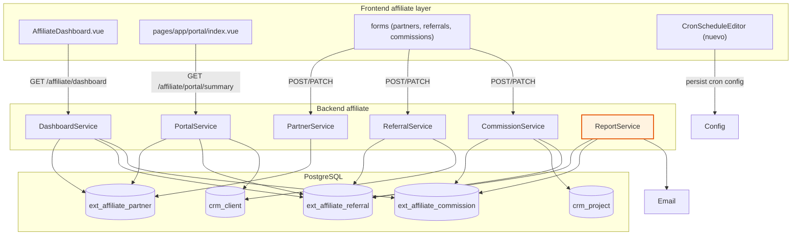

# Arquitectura

## Estado actual — Backend (`apps/back/src/extensions/affiliate/`)

```
extensions/affiliate/
├── extension.manifest.ts          metadata + dependencies.extensions=['crm']
├── extension.module.ts            NestJS module (imports CRM + IAM entities)
├── controllers/
│   ├── affiliate-partner.controller.ts      /affiliate/partners (admin CRUD + invite)
│   ├── affiliate-referral.controller.ts     /affiliate/referrals (admin CRUD)
│   ├── affiliate-commission.controller.ts   /affiliate/commissions (admin CRUD + /summary)
│   ├── affiliate-dashboard.controller.ts    /affiliate/dashboard (admin, GET)
│   └── affiliate-portal.controller.ts       /affiliate/portal/* (affiliate role)
├── services/
│   ├── affiliate-partner.service.ts         CRUD + invite (crea user + envía email)
│   ├── affiliate-referral.service.ts        tracking de referidos
│   ├── affiliate-commission.service.ts      cálculo + lifecycle (pending→approved→paid)
│   ├── affiliate-dashboard.service.ts       5 KPIs agregados (admin)
│   ├── affiliate-portal.service.ts          self-service partner
│   └── affiliate-report.service.ts          @Cron('0 23 28-31 * *') reporte mensual email
├── dto/                            create/update partner/referral/commission + portal
└── infrastructure/persistence/entities/
    ├── affiliate-partner.entity.ts          ext_affiliate_partner
    ├── affiliate-referral.entity.ts         ext_affiliate_referral
    └── affiliate-commission.entity.ts       ext_affiliate_commission
```

**Entities clave**:
- `AffiliatePartner`: `commissionRate` (decimal 0-1, default 0.05), `isActive`, `userId` (FK a portal user), `clientId` (FK a CRM client opcional). **No tiene campo `code`** (ver Q-002).
- `AffiliateReferral`: `partnerId`, `clientId` (unique — un cliente solo puede ser referido una vez), `originId` (FK a CRM origin), `status` (`pending`|`converted`|`rejected`).
- `AffiliateCommission`: `referralId`, `projectId` (unique juntos), `baseAmount`, `commissionRate`, `commissionAmount`, `status` (`pending`|`approved`|`paid`), `paidAt`.

**Cronjob**: `AffiliateReportService.handleMonthlyReport()` — `@Cron('0 23 28-31 * *')` con guard de "es último día del mes". Envía email HTML con newReferrals, convertedReferrals, commissionsApproved, commissionsPaid. Email destino: `app.notificationEmail` || `AFFILIATE_REPORT_EMAIL`.

## Estado actual — Frontend (`apps/front/extensions/affiliate/`)

```
extensions/affiliate/
├── nuxt.config.ts                 layer config
├── types.ts                       tipos TS (Partner, Referral, Commission, Dashboard, Portal)
├── composables/useAffiliate.ts    wrapper de API (partners, referrals, commissions, dashboard, portal)
├── components/
│   └── AffiliateDashboard.vue     4 .stat crudos + 2 tablas (topPartners, recentCommissions)
├── pages/app/affiliate/           admin
│   ├── index.vue                  usa AffiliateDashboard
│   ├── partners/{index,new,[id]}.vue
│   ├── referrals/index.vue
│   └── commissions/index.vue
├── pages/app/portal/              afiliado
│   ├── index.vue                  sin dashboard (solo links)
│   ├── profile.vue
│   ├── referrals/{index,new}.vue
│   └── commissions/index.vue
└── plugins/
    ├── nav.ts                     sidebar admin + portal
    ├── settings-nav.ts            inyecta "Mi perfil" en settings (affiliate role)
    └── dashboard-widgets.ts       inyecta widget affiliate-summary en CRM dashboard
```

## Flujo de datos (Mermaid)



## Componentes afectados

| Capa | Archivo | Cambio |
|------|---------|--------|
| Back | `affiliate-dashboard.service.ts` | Añadir KPIs: conversionRate, mrrAttributed, churnedReferrals, monthlyTrend, statusDistribution, topPartners (con revenue + count) |
| Back | `affiliate-dashboard.controller.ts` | Sin cambio (ya expone GET) |
| Back | `affiliate-portal.service.ts` | `getPartnerSummary()` ya tiene 4 KPIs — exponer también `monthlyTrend` |
| Back | `affiliate-portal.controller.ts` | Añadir GET `/affiliate/portal/dashboard` con summary + trend |
| Back | `affiliate-report.service.ts` | Mover cron a config-driven (`@Cron(config.affiliate.reportCron)`) + endpoint admin para editar |
| Back | `affiliate-partner.service.ts` | Auto-generate `code` al crear (ver Q-002) |
| Back | entity `affiliate-partner.entity.ts` | Añadir columna `code: string` unique (ver Q-002 + migration) |
| Front | `components/AffiliateDashboard.vue` | Reescribir con StatCard/TrendChart/BarChartCard/DonutChartCard/GaugeChartCard |
| Front | `pages/app/portal/index.vue` | Añadir dashboard con 4 StatCards + TrendChart |
| Front | `pages/app/affiliate/partners/new.vue` | auto-generate code, LinkedSelect no aplica (partner no depende de otro) |
| Front | `pages/app/affiliate/referrals/index.vue` | LinkedSelect partner→cliente |
| Front | `pages/app/affiliate/commissions/new.vue` (nuevo) | LinkedSelect referral→project + previsualización cálculo |
| Front | `pages/app/affiliate/settings.vue` (nuevo) | CronScheduleEditor + CronNextRunsPreview para reporte |
| Front | `composables/useAffiliate.ts` | Añadir `getPortalDashboard()`, `updateReportCron()` |

## Matriz componente-base × uso en affiliate

| Componente base (FR ref) | Dónde se usa | Props/uso |
|--------------------------|--------------|-----------|
| `StatCard` (FR-001) | `AffiliateDashboard.vue`, `portal/index.vue` | `value`, `label`, `delta`, `icon` |
| `TrendChart` (FR-002) | `AffiliateDashboard.vue` (comisiones pagadas/mes), `portal/index.vue` (propio trend) | `data: {x:month, y:amount}[]`, `mode="area"` |
| `BarChartCard` (FR-003) | `AffiliateDashboard.vue` (top partners revenue) | `data: {label, value}[]`, `orientation="horizontal"` |
| `DonutChartCard` (FR-004) | `AffiliateDashboard.vue` (comisiones por estado) | `data: {label, value, color}[]`, `centerValue` total |
| `GaugeChartCard` (FR-005) | `AffiliateDashboard.vue` (conversionRate) | `value: 0-100`, `unit="%"` |
| `CronScheduleEditor` (FR-010) | `affiliate/settings.vue` (reporte mensual) | `mode="monthly"`, `v-model:cron` |
| `CronNextRunsPreview` (FR-013) | `affiliate/settings.vue` | `:cron`, `:count=5` |
| `LinkedSelect` (FR-021) | `referrals/index.vue` (partner→cliente), `commissions/new.vue` (referral→project) | `optionsA`, `optionsB(a)`, `autoFill` |

## Decisiones técnicas

### D-01 — KPIs nuevos en backend (✅ Always)
Extender `AffiliateDashboardService.getDashboard()` con: `conversionRate` (converted/total), `mrrAttributed` (suma de commissionAmount de converted con proyecto activo — definición en Q-006), `churnedReferrals` (rejected/total), `monthlyTrend` (12 meses), `statusDistribution` (count por estado). Sin cambiar entidades.

### D-02 — Cron config-driven (⚠️ Ask first)
Mover `@Cron('0 23 28-31 * *')` a `@Cron(config.affiliate.reportCron)` requiere `extension.config.ts` con `registerAs('affiliate')`. Ver Q-005 (¿cron se aplica en vivo o requiere restart?).

### D-03 — Auto-generate de partner code (⚠️ Ask first)
Añadir columna `code` a `ext_affiliate_partner` (unique, generado tipo `AFF-XXXXXX`). Requiere migration. Ver Q-002.