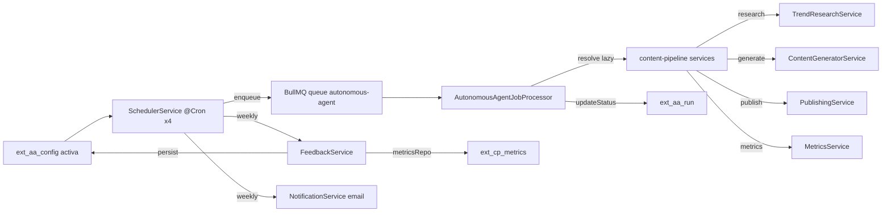

# Arquitectura

## Estado actual

### Backend — `apps/back/src/extensions/autonomous-agent/`

```
extension.manifest.ts        # name, routes, entities, config key
extension.module.ts          # ScheduleModule + BullModule.registerQueue
extension.config.ts          # registerAs('autonomous-agent') env defaults
config/autonomous-agent-config.type.ts
controllers/
  agent-config.controller.ts # CRUD configs + pause/resume (admin)
  agent-run.controller.ts    # List/get runs (admin)
services/
  agent-config.service.ts    # CRUD, findActive, pause/resume
  agent-run.service.ts       # CRUD, updateStatus, findRecentByProject
  pipeline-orchestrator.service.ts  # enqueue research/generate/publish/metrics
  scheduler.service.ts       # @Cron x4 → enqueue jobs
  job-processor.ts           # BullMQ WorkerHost → content-pipeline services
  feedback.service.ts        # runFeedbackLoop → ext_aa_config.feedbackData
  notification.service.ts    # QueuedMailerService (email)
infrastructure/persistence/entities/
  aa-config.entity.ts        # ext_aa_config (cron x4, autoApprove, feedbackData jsonb)
  aa-run.entity.ts           # ext_aa_run (runType, status, duration, output jsonb)
dto/
  create-config.dto.ts       # projectId + cron x4 + autoApprove + notify
  update-config.dto.ts       # sin projectId, sin feedbackData (system-managed)
  find-all-config.dto.ts     # page, limit, projectId, status
  find-all-run.dto.ts        # page, limit, projectId, runType, status
```

**Tablas**: `ext_aa_config` (una por proyecto, `projectId` unique), `ext_aa_run` (una por ejecución de phase).

### Frontend — `apps/front/extensions/autonomous-agent/`

```
nuxt.config.ts               # layer config (components global, imports)
types.ts                     # ConfigEntity, RunEntity, ProjectEntity, payloads
composables/useAutonomousAgent.ts  # API wrapper
components/AutonomousAgentDashboard.vue  # widget inyectado en /app
plugins/nav.ts               # inyecta sidebar "Autonomous Agent"
plugins/dashboard-widgets.ts # inyecta widget en dashboard principal
pages/app/autonomous-agent/
  index.vue                  # dashboard con 4 KPIs crudos
  runs.vue                   # DataTable de runs con filtros
  configs/index.vue          # DataTable de configs
  configs/create.vue         # form con 4 FormInput cron crudos
  configs/[id].vue           # edit + pause/resume + delete
```

## Flujo agente → pipeline → output



## Componentes afectados por este PRD

| Archivo | Cambio |
|---------|--------|
| `pages/app/autonomous-agent/index.vue` | Refactor dashboard → StatCard, TrendChart, BarChartCard, DonutChartCard, GaugeChartCard |
| `components/AutonomousAgentDashboard.vue` | Refactor widget → StatCard mínimo |
| `pages/app/autonomous-agent/configs/create.vue` | Reemplazar 4 FormInput cron por CronScheduleEditor + CronNextRunsPreview; añadir LinkedSelect project→step; auto-suggest |
| `pages/app/autonomous-agent/configs/[id].vue` | Igual que create + bloque CronNextRunsPreview con next runs |
| `composables/useAutonomousAgent.ts` | Añadir `getDashboardStats()`, `getCostRollup()` |
| `controllers/agent-run.controller.ts` | Añadir `GET /runs/stats` (agregación) |
| `services/agent-run.service.ts` | Añadir `getStats()` (counts por status, cost rollup) |
| `apps/front/i18n/locales/{es,en}/autonomous-agent.json` | NUEVO namespace |

## Matriz de uso — componentes base → uso acá

| FR base | Componente | Dónde se usa | Notas |
|---------|-----------|--------------|-------|
| FR-001 | StatCard | `index.vue` (6+), `[id].vue` (2) | activeAgents, runsToday, successRate, totalConfigs, costTokens, throughput |
| FR-002 | TrendChart | `index.vue` (1-2) | runs/día últimos 30d, tokens/día |
| FR-003 | BarChartCard | `index.vue` (1) | distribución por runType |
| FR-004 | DonutChartCard | `index.vue` (1) | distribución por status |
| FR-005 | GaugeChartCard | `index.vue` (1), `[id].vue` (1) | success rate global y por config |
| FR-010 | CronScheduleEditor | `create.vue` (4), `[id].vue` (4) | uno por phase (research/generate/publish/metrics) |
| FR-011 | WeekdayPicker | subcomponente de CronScheduleEditor | weekly mode |
| FR-012 | TimeWindowPicker | [NEEDS CLARIFICATION] `create.vue` | Q-003: ¿ventanas de ejecución? |
| FR-013 | CronNextRunsPreview | `create.vue` (4), `[id].vue` (4) | preview bajo cada editor |
| FR-020 | KeyValueEditor | [NEEDS CLARIFICATION] `[id].vue` | Q-004: ¿editor de feedbackData avanzado? |
| FR-021 | LinkedSelect | `create.vue` (1) | project → pipeline step |

## Decisiones técnicas

### D-01: Reutilizar componentes base, no crear charts inline (✅ Always)
**Decisión**: consumir `@base/ui-app/components/charts/*` y `scheduling/*` del PRD base.
**Razón**: evita duplicación, respeta la regla ORO del proyecto, theming consistente.
**Alternativas descartadas**: charts inline como hoy (duplicación, sin theme).

### D-02: Agregación de costo en backend, no en frontend (✅ Always)
**Decisión**: añadir `GET /autonomous-agent/runs/stats` que agrega `output.promptTokens + completionTokens` por config/proyecto/rango.
**Razón**: el frontend no debe sumar jsonb crudo; el backend ya tiene el repositorio.
**Alternativas descartadas**: agregación en cliente (N+1, lento).

### D-03: CronScheduleEditor reemplaza FormInput cron (✅ Always)
**Decisión**: 4 instancias de CronScheduleEditor (una por phase) con `mode` derivado del cron actual.
**Razón**: el admin no debe saber cron; el editor produce el string.
**Alternativas descartadas**: mantener FormInput + tooltip (no resuelve UX).

### D-04: Auto-suggest via templates estáticos (⚠️ Ask first)
**Decisión**: un mapa `agentType → defaultCrons` en el frontend (no backend) que auto-fill los 4 editores al elegir un template ("daily", "weekly", "aggressive").
**Razón**: simples defaults visuales, no requiere backend nuevo.
**Alternativas descartadas**: templates en backend (over-engineering).
**Trade-off**: templates hardcoded en frontend. Si crecen, mover a config. Q-002.

### D-05: LinkedSelect project → step sin backend nuevo (✅ Always)
**Decisión**: LinkedSelect con `optionsA` = proyectos (de content-pipeline), `optionsB` = runTypes fijos (research/generate/publish/metrics) filtrados por... [NEEDS CLARIFICATION — Q-005: ¿qué filtra B según A? hoy todos los runTypes aplican a todo proyecto]. Si no hay filtrado real, LinkedSelect degrada a 2 FormSelect independientes.
**Razón**: respetar patrón base si aporta valor.
**Alternativas**: 2 FormSelect si no hay dependencia real.