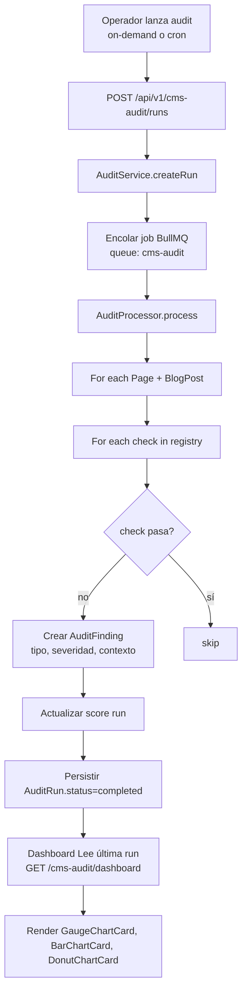

# Arquitectura

## Estado actual

**NO existe** `apps/back/src/extensions/cms-audit/`. La carpeta no está creada. La auditoría hoy es un documento manual (`docs/extensions/cms-audit.md`) generado por un humano. No hay código de auditoría, no hay entidades de audit run, no hay endpoints, no hay dashboard frontend.

La extensión `cms` parent SÍ existe en `apps/back/src/extensions/cms/` con subdirectorios `blog/`, `media/`, `pages/`, `seo/`, `sitemap/`. Entidades: `Page` (`ext_cms_page`), `BlogPost` (`ext_cms_blog_post`), `BlogCategory`, `Tag`, `SeoMetadata` (`ext_cms_seo_metadata`). Frontend en `apps/front/extensions/cms/`.

## Arquitectura propuesta

```
apps/back/src/extensions/cms-audit/
├── extension.manifest.ts              dependencies: [auth, storage, translations, cms]
├── extension.module.ts                registra AuditService, AuditProcessor, controllers
├── extension.config.ts                registerAs('cms-audit') — defaults, cron default
├── audit/
│   ├── audit.controller.ts            REST: POST /run, GET /runs, GET /runs/:id, GET /dashboard
│   ├── audit.service.ts               orquesta checks, persiste AuditRun
│   ├── audit-checks/                  registry de checks (Strategy pattern)
│   │   ├── audit-check.registry.ts
│   │   ├── seo-meta-present.check.ts
│   │   ├── jsonld-present.check.ts
│   │   ├── jsonld-type.check.ts        detecta Article vs BlogPosting
│   │   ├── translations-complete.check.ts
│   │   ├── hreflang-valid.check.ts
│   │   ├── canonical-present.check.ts
│   │   ├── og-image-present.check.ts
│   │   ├── robots-policy-valid.check.ts
│   │   ├── sitemap-integrated.check.ts  verifica endpoints consumidos por frontend
│   │   └── hardcode-table.check.ts     detecta query a "page" vs "ext_cms_page"
│   └── audit.processor.ts             @Processor('cms-audit') — jobs pesados async
├── dashboard/
│   └── dashboard.service.ts           agrega resultados → DTO para frontend
├── dto/
│   ├── create-audit-run.dto.ts
│   ├── audit-dashboard.dto.ts
│   └── audit-run-result.dto.ts
└── infrastructure/persistence/entities/
    ├── audit-run.entity.ts            ext_cms_audit_run
    └── audit-finding.entity.ts        ext_cms_audit_finding

apps/front/extensions/cms-audit/
├── pages/app/cms/audit/
│   ├── index.vue                      dashboard (GaugeChartCard score, StatCards, BarChartCard gaps)
│   ├── runs.vue                        histórico (DataTable)
│   └── runs/[id].vue                  detalle de run (tabla de findings, filtros por tipo)
├── components/
│   ├── AuditDashboard.vue             layout de cards
│   ├── AuditRunForm.vue               form crear audit (LinkedSelect scope+profile, CronScheduleEditor)
│   └── AuditFindingTable.vue           tabla findings con filtros
└── composables/
    ├── useCmsAudit.ts                  TanStack Query hooks
    └── useCmsAuditDashboard.ts
```

## Flujo de auditoría



## Componentes afectados

| Componente | Path | Cambio |
|------------|------|--------|
| `cms` parent (read-only) | `apps/back/src/extensions/cms/` | NO se modifica. cms-audit LO consume via repositorios públicos. |
| RBAC | `@iam/auth` | Nuevo permiso `cms-audit:read`, `cms-audit:run`. |
| i18n | `apps/front/i18n/locales/{es,en}/cms-audit.json` | NUEVO archivo de strings. |
| Sidebar nav | `apps/front/extensions/cms-audit/plugins/nav.ts` | Inyecta item "Auditoría CMS" bajo CMS. |
| Extension loader | `apps/back/src/core/foundation.module.ts` | Auto-discovery — no se toca. |

## Matriz de uso — componentes base referenciados

| FR base | Componente | Uso en cms-audit |
|---------|------------|------------------|
| FR-001 | `StatCard` | KPIs: páginas auditadas, gaps totales, score promedio, última run |
| FR-002 | `TrendChart` | Evolución de score entre runs (histórico) |
| FR-003 | `BarChartCard` | Gaps por tipo (SEO meta, JSON-LD, traducciones...) |
| FR-004 | `DonutChartCard` | Distribución de findings por severidad (critical/warning/info) |
| FR-005 | `GaugeChartCard` | Score global del CMS 0-100% |
| FR-006 | `CronScheduleEditor` | Configurar audit recurrente (semansal/mensual) |
| FR-007 | `WeekdayPicker` | Subcomponente de CronScheduleEditor |
| FR-009 | `CronNextRunsPreview` | Preview próximas audits |
| FR-011 | `LinkedSelect` | Seleccionar `cms target` (cms) + `audit profile` (full/seo-only/i18n-only) |

## Decisiones técnicas

### D-01: Auditoría async via BullMQ (✅ Always)
Auditar miles de páginas + checks es pesado. Se encola en BullMQ (`@nestjs/bullmq` ya instalado). El endpoint POST `/runs` retorna 202 con runId; el dashboard pollea status.
**Trade-off**: latencia (no inmediato) vs no bloquear event loop. Mitigado: preview de progreso via `GET /runs/:id`.

### D-02: Checks como Strategy registry (✅ Always)
`AuditCheckRegistry` inyecta todos los `*.check.ts` que implementan interfaz `AuditCheck`. Añadir check nuevo = crear archivo + registrar. No toca `AuditService`.
**Trade-off**: boilerplate vs extensibilidad.

### D-03: Tabla de findings `ext_cms_audit_finding` (✅ Always)
Persistir cada finding individual permite historico, filtrado y export futuro. Alternativa descartada: solo guardar JSON aggregate en `run.result` — no permite queries por tipo.

### D-04: On-demand + Scheduled (⚠️ Ask first)
Ambos modos soportados. Scheduled via `@nestjs/schedule` (ya instalado) con cron dinámico (configurado por el operador y persistido en `ext_cms_audit_run_config`).
`[NEEDS CLARIFICATION]` — ver Q-001.