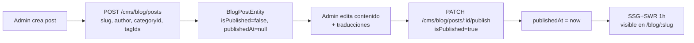
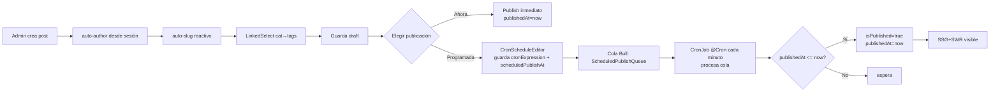

# Arquitectura

## Estado actual

Backend (`apps/back/src/extensions/cms/`):

```
cms/
├── extension.manifest.ts        manifest con 5 entidades + 15 permisos RBAC
├── extension.module.ts          orquesta PagesModule, BlogModule, SeoModule, MediaModule, SitemapModule
├── pages/                       CRUD pages + reorder + preview + public
├── blog/
│   ├── posts/                   BlogPostEntity (slug, isPublished, publishedAt, featuredImage, author, category, tags)
│   ├── categories/              BlogCategoryEntity
│   └── tags/                    TagEntity (N:M con posts)
├── media/                       upload con entity linking
├── seo/                         SeoMetadataEntity + JSON-LD factories
└── sitemap/                     /sitemap/blog, /sitemap/pages
```

Frontend (`apps/front/extensions/cms/`):

```
cms/
├── components/CmsDashboard.vue          4 stat cards planos
├── components/cms/RichEditorAdvanced.vue TipTap + drag&drop upload
├── composables/useCmsBlogPosts.ts       TanStack Query CRUD + publish + translations batch
├── pages/app/cms/                        admin SPA: index, blog/posts/{create,[id]/edit,preview}, categories, tags, media
└── pages/{blog,page}/                    público SSR/SSG
```

Stack ya disponible: `@nestjs/schedule` 6.1, `@nestjs/bullmq` 11, `bullmq` (queues), TypeORM, PostgreSQL.

## Flujo actual (post → publish)



No hay estado intermedio (draft→review), no hay programación.

## Flujo propuesto (con scheduling)



## Componentes afectados

| Archivo | Cambio |
|---------|--------|
| `apps/back/src/extensions/cms/blog/posts/infrastructure/entities/blog-post.entity.ts` | Añadir `cronExpression?: string`, `scheduledPublishAt?: Date` |
| `apps/back/src/extensions/cms/blog/posts/posts.service.ts` | Método `schedule(id, cronExpression)` + `processScheduled()` |
| `apps/back/src/extensions/cms/blog/posts/dto/create-post.dto.ts` | Aceptar `cronExpression?` opcional |
| NUEVO `apps/back/src/extensions/cms/blog/posts/scheduled-publish.processor.ts` | Bull processor + `@Cron` |
| `apps/front/extensions/cms/components/CmsDashboard.vue` | Reemplazar por StatCard/BarChartCard/DonutChartCard/TrendChart |
| NUEVO `apps/front/extensions/cms/components/cms/PostScheduleEditor.vue` | Wraps CronScheduleEditor + WeekdayPicker + CronNextRunsPreview |
| `apps/front/extensions/cms/pages/app/cms/blog/posts/create.vue` | Auto-author, auto-excerpt, LinkedSelect, fix reactividad slug |
| `apps/front/extensions/cms/composables/useCmsBlogPosts.ts` | Añadir `schedulePost(id, cron)` |

## Matriz de uso (FR base → CMS)

| FR base | Componente | Dónde se usa en CMS |
|---------|-----------|---------------------|
| FR-001 | StatCard | Dashboard: publicados, borradores, programados, (views) |
| FR-002 | TrendChart | Dashboard: publicaciones por día (30 días) |
| FR-003 | BarChartCard | Dashboard: posts por categoría, posts por autor |
| FR-004 | DonutChartCard | Dashboard: distribución por estado (pub/borrador/programado) |
| FR-006 | CronScheduleEditor | `PostScheduleEditor.vue` en create/edit post |
| FR-007 | WeekdayPicker | Subcomponente de CronScheduleEditor |
| FR-009 | CronNextRunsPreview | `PostScheduleEditor.vue` — próximas 5 publicaciones |
| FR-011 | LinkedSelect | Form create/edit post: categoría (A) → tags filtrados (B) |

## Decisiones técnicas

### D-01: Bull queue + @Cron para scheduling (✅ Always)
**Decisión**: Usar `@nestjs/bullmq` ya instalado para encolar publicaciones programadas + `@nestjs/schedule` para un cronjob por minuto que desencole y publique.
**Razón**: Ambos ya en `package.json`. Bull da persistencia (Redis) y reintentos. `@Cron('* * * * *')` da cadencia fina.
**Alternativas descartadas**: setTimeout en proceso (se pierde al reiniciar), solo Bull sin cron (no dispara por sí solo).
**Trade-off**: Añade dependencia Redis (ya requerido por Bull en otros módulos). Aceptable.

### D-02: CronExpression como string en entidad (✅ Always)
**Decisión**: Guardar `cronExpression: string` (5 fields estándar) + `scheduledPublishAt: Date` precalculado (próxima ejecución).
**Razón**: Cron estándar es portable y parseable por `cron-parser`. `scheduledPublishAt` evita recalcular en cada tick.
**Trade-off**: Si el cron se edita, hay que recalcular `scheduledPublishAt`. Mitigado en service.

### D-03: Auto-author desde authStore (✅ Always)
**Decisión**: Al crear post, si `form.author` vacío, rellenar con `${user.firstName} ${user.lastName}` desde `useAuthStore()`.
**Razón**: Reduce fricción; el autor real casi siempre es quien crea el post.
**Trade-off**: Override manual siempre disponible (no forzar).