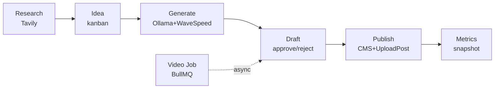

# Arquitectura

## Estado actual

### Backend — `apps/back/src/extensions/content-pipeline/`

```
extensions/content-pipeline/
├── extension.module.ts        BullModule.registerQueue('content-pipeline', 'content-pipeline-video')
├── controllers/
│   ├── project.controller.ts   CRUD projects (admin)
│   ├── idea.controller.ts      CRUD ideas, kanban, research, generate
│   ├── draft.controller.ts     CRUD drafts, approve/reject/publish, video enqueue (HTTP 202)
│   ├── metrics.controller.ts   GET /metrics/dashboard (DashboardSummary)
│   ├── template.controller.ts  Templates list + async generate
│   └── cta-video.controller.ts CTA video CRUD
├── services/
│   ├── project.service.ts      CRUD projects, findActive()
│   ├── idea.service.ts         CRUD ideas, kanban reorder
│   ├── draft.service.ts        CRUD drafts, generateVideo, generateCarouselVideo
│   ├── trend-research.service  Tavily research
│   ├── content-generator       Ollama Cloud content gen
│   ├── image-generator         WaveSpeed AI
│   ├── seo-optimizer           SEO + JSON-LD
│   ├── affiliate-injector      Affiliate links (soft dep)
│   ├── publishing.service      CMS + Upload-Post (soft dep)
│   ├── video-generator         FFmpeg MP4 + xfade
│   ├── html-renderer           Chromium HTML→PNG
│   ├── carousel-generator      Branded HTML carousel
│   ├── video-template.service  10 templates + CTA concat
│   ├── cta-video.service       CTA video CRUD
│   ├── metrics.service         Snapshots + DashboardSummary (post-publish)
│   ├── video-queue.service     BullMQ enqueue facade
│   └── video-job.processor     @Processor WorkerHost
├── infrastructure/persistence/entities/
│   ├── project.entity.ts       ext_cp_project
│   ├── idea.entity.ts          ext_cp_idea
│   ├── draft.entity.ts         ext_cp_draft
│   ├── metrics.entity.ts       ext_cp_metrics
│   └── cta-video.entity.ts     ext_cp_cta_video
└── dto/                         create/update/find-all/reorder/reject/generate-*
```

### Frontend — `apps/front/extensions/content-pipeline/`

```
extensions/content-pipeline/
├── nuxt.config.ts              Layer registration
├── types.ts                    Tipos front (DashboardData mismatch con backend)
├── plugins/nav.ts              Nav items
├── plugins/dashboard-widgets.ts
├── composables/useContentPipeline.ts  API wrapper (useApi local, NO @/composables/useApi)
├── components/ContentPipelineDashboard.vue  Dashboard widget ad-hoc
└── pages/app/content-pipeline/
    ├── index.vue               Dashboard ad-hoc (.stat + barras custom)
    ├── projects/index.vue      DataTable projects
    ├── projects/create.vue     Form create
    ├── projects/[id].vue       Project detail (tabs)
    ├── projects/[id]/ideas.vue Kanban ideas
    ├── projects/[id]/drafts.vue DataTable drafts
    ├── drafts/[id].vue         Draft review (RichEditor + approve/reject/publish)
    ├── templates.vue           Video templates
    ├── video-jobs.vue          Video jobs status
    └── cta-videos.vue          CTA videos CRUD
```

## Pipeline stages (estado real)

El pipeline es asíncrono con 5 stages conceptuales:



**Cola BullMQ**: `content-pipeline-video` con 3 job types: `generate-video`, `generate-carousel-video`, `generate-template`. Retry: 3 intentos, backoff exponencial 10s, complete retained 24h, fail 7d.

## Componentes afectados

| Componente | Path | Cambio |
|-----------|------|--------|
| `MetricsController` | `controllers/metrics.controller.ts` | Añadir `GET /operational-dashboard` |
| `MetricsService` | `services/metrics.service.ts` | Añadir `operationalDashboard()` (stages, throughput, queue, latencia) |
| `VideoQueueService` | `services/video-queue.service.ts` | Exponer `getQueueStats()` (waiting, active, completed, failed, delayed) |
| Dashboard page | `pages/app/content-pipeline/index.vue` | Refactor a componentes base |
| Dashboard widget | `components/ContentPipelineDashboard.vue` | Refactor a componentes base |
| Create project | `pages/app/content-pipeline/projects/create.vue` | Añadir LinkedSelect + KeyValueEditor |
| Schedules page | `pages/app/content-pipeline/schedules.vue` | **NUEVO** — CronScheduleEditor + WeekdayPicker + CronNextRunsPreview |
| `types.ts` | `extensions/content-pipeline/types.ts` | Alinear `DashboardData` con backend real |
| `useContentPipeline` | `composables/useContentPipeline.ts` | Añadir `getOperationalDashboard()`, `getQueueStats()` |

## Matriz de uso — FR base → content-pipeline

| FR base | Componente | Dónde se consume | FR-CP que lo usa |
|---------|-----------|------------------|------------------|
| FR-001 | `StatCard` | Dashboard operativo | FR-CP-001 |
| FR-002 | `TrendChart` | Throughput items/hora, latencia temporal | FR-CP-002 |
| FR-003 | `BarChartCard` | Tiempo promedio por stage, top fuentes | FR-CP-003 |
| FR-004 | `DonutChartCard` | Distribución de status de drafts | FR-CP-004 |
| FR-005 | `GaugeChartCard` | Success rate (jobs completed / total) | FR-CP-005 |
| FR-006 | `CronScheduleEditor` | Página schedules | FR-CP-020 |
| FR-007 | `WeekdayPicker` | Schedule semanal (sub de CronScheduleEditor) | FR-CP-020 |
| FR-009 | `CronNextRunsPreview` | Página schedules (sub de CronScheduleEditor) | FR-CP-021 |
| FR-010 | `KeyValueEditor` | Config de steps del pipeline | FR-CP-015 |
| FR-011 | `LinkedSelect` | Source + destination en create-project | FR-CP-014 |

## Decisiones técnicas con trade-offs

### D-CP-01: Endpoint operativo separado vs extender `/metrics/dashboard` (✅ Always)

**Decisión**: crear `GET /content-pipeline/operational-dashboard` nuevo. NO modificar `/metrics/dashboard` (que retorna performance post-publish).
**Razón**: métricas operativas (queue, throughput, latencia) y de performance (views, clicks, revenue) son dominios distintos. Mezclar rompe Single Responsibility y confunde al consumidor.
**Alternativas descartadas**: unificar en un mega-endpoint (payload híbrido confuso).

### D-CP-02: Queue stats via BullMQ Admin API vs endpoint dedicado (✅ Always)

**Decisión**: `VideoQueueService.getQueueStats()` expone `getWaitingCount()`, `getActiveCount()`, `getCompletedCount()`, `getFailedCount()`, `getDelayedCount()` de BullMQ. Nuevo endpoint `GET /content-pipeline/queue/stats`.
**Razón**: BullMQ ya expone estos counts nativamente. No hay coste adicional.
**Alternativas descartadas**: scraping de jobs (lento, no escala).

### D-CP-03: Auto-suggest de steps — catálogo de templates vs IA (⚠️ Ask first)

**Decisión**: catálogo estático de templates de steps mapeado por `contentType` (recipe, comparison, tips, review, listicle, guide). Seleccionar `contentType` sugiere steps preconfigurados.
**Razón**: determinístico, sin coste de IA, predecible para operador.
**Alternativas descartadas**: IA que sugiera steps (coste, latencia, no determinístico). `[NEEDS CLARIFICATION]` — ver Q-CP-005.

### D-CP-04: Scheduling — ¿en content-pipeline o solo en autonomous-agent? (⚠️ Ask first)

**Decisión**: añadir página `schedules.vue` en content-pipeline para pipelines recurrentes standalone (sin autonomous-agent). Persistir cron en `ext_cp_project` (nueva columna `scheduleCron`).
**Razón**: pipelines pueden correr independientemente de autonomous-agent. Operador puede schedular sin orquestador completo.
**Alternativas descartadas**: forzar uso de autonomous-agent (acoplamiento innecesario). `[NEEDS CLARIFICATION]` — ver Q-CP-006.

### D-CP-05: Front uses local `useApi` instead of `@/composables/useApi` (✅ Always)

**Observación**: `composables/useContentPipeline.ts` define `useApi()` local en vez de consumir el composable central del proyecto. **No se modifica en este PRD** (fuera de scope, deuda técnica). Consumer de dashboard usa `useContentPipeline()`.