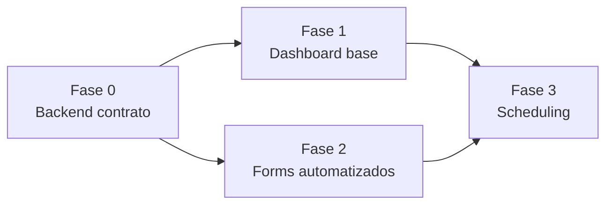

# Fases de Migración

El dashboard y forms actuales son ad-hoc. Este PRD refactoriza a componentes base. Fases incrementales, cada una independiente y deployable.

## Fase 0 — Alineación de contrato (backend)

**Objetivo**: cerrar el mismatch front-back (R-CP-04).

**Entregables**:
- `MetricsService.operationalDashboard()` nuevo método con payload tipado: `kpis`, `throughputSeries`, `stageTimes`, `topSources`, `draftsByStatus`, `successRate`.
- `MetricsController` expone `GET /content-pipeline/operational-dashboard`.
- `VideoQueueService.getQueueStats()` + `GET /content-pipeline/queue/stats`.
- Tipos compartidos en `types.ts` alineados con payload real.
- Cache en memoria 60s para `operationalDashboard()` (⚠️ Ask first — ver Q-CP-010).

**Criterios de salida**:
- Endpoint responde < 500ms con 10.000 snapshots.
- Payload tipado, sin `any`.
- Tests unitarios de `operationalDashboard()` y `getQueueStats()`.

**Riesgos**: queries pesadas en `stageTimes` (requiere agregar por stage). Mitigación: cache + índices en `ext_cp_draft` (`status`, `createdAt`).

**Rollback**: el endpoint `/metrics/dashboard` existente NO se toca. Rollback = no consumir el nuevo endpoint.

## Fase 1 — Refactor dashboard a componentes base (frontend)

**Objetivo**: reemplazar dashboard ad-hoc por componentes del catálogo base.

**Entregables**:
- `pages/app/content-pipeline/index.vue` refactorizado: importa `StatCard`, `TrendChart`, `BarChartCard`, `DonutChartCard`, `GaugeChartCard` de `@base/ui-app/components/charts/`.
- `components/ContentPipelineDashboard.vue` (widget) refactorizado a `StatCard` grid.
- `useContentPipeline.ts` añade `getOperationalDashboard()`, `getQueueStats()`.
- Eliminar `.stat` + lucide inline, barras custom de "Ideas by Status" → `BarChartCard`.
- i18n keys en `apps/front/i18n/locales/{es,en}/content-pipeline.json`.

**Criterios de salida**:
- ≥6 `StatCard` renderizados con data real (no 0 por mismatch).
- `TrendChart` throughput, `BarChartCard` stage times + top sources, `DonutChartCard` drafts status, `GaugeChartCard` success rate.
- `pnpm lint` + `pnpm check-types` verdes en apps/front.
- 0 componentes custom donde existe base.

**Riesgos**: catálogo base no implementado aún. Mitigación: Fase 1 depende de PRD base `docs/prds/base-ui-components/` completado.

**Rollback**: mantener `index.vue` anterior en git history. Revert commit.

## Fase 2 — Forms automatizados (frontend)

**Objetivo**: forms de crear/editar project e idea con auto-suggest + LinkedSelect + KeyValueEditor.

**Entregables**:
- `pages/app/content-pipeline/projects/create.vue` añade `LinkedSelect` source→destination (FR-CP-014).
- `pages/app/content-pipeline/projects/[id].vue` (edit) añade `KeyValueEditor` para config de steps (FR-CP-015).
- Auto-suggest de steps al seleccionar `contentType` (FR-CP-010) — catálogo estático en `composables/useStepTemplates.ts`.
- Auto-fill de config desde template de pipeline (FR-CP-011).

**Criterios de salida**:
- `LinkedSelect` funciona: cambiar source resetea destination.
- `KeyValueEditor` valida keys duplicadas.
- Auto-suggest cubre los 6 contentTypes.
- Tests component de cada form.

**Riesgos**: catálogo estático rígido (R-CP-06). Mitigación: `KeyValueEditor` permite override manual.

**Rollback**: forms anteriores sin los componentes base siguen funcionando (sin auto-suggest).

## Fase 3 — Scheduling standalone (backend + frontend)

**Objetivo**: pipelines recurrentes sin autonomous-agent.

**Entregables**:
- Migración: añadir `scheduleCron: string | null` y `scheduleEnabled: boolean` a `ext_cp_project` (⚠️ Ask first).
- `PATCH /content-pipeline/projects/:id/schedule` (FR-CP-032) con validación de sintaxis cron.
- `pages/app/content-pipeline/schedules.vue` nueva con `CronScheduleEditor` + `WeekdayPicker` + `CronNextRunsPreview` (FR-CP-020, FR-CP-021).
- `SchedulerService` que lee `scheduleCron` y encola jobs (⚠️ Ask first — ver Q-CP-006 sobre dynamic cron).

**Criterios de salida**:
- Editor produce cron válido, se persiste, preview muestra próximas 5 ejecuciones.
- `PATCH` valida sintaxis (400 si inválido).
- `FormSwitch` activa/desactiva schedule.
- Tests unitarios de validación de cron.

**Riesgos**: `@Cron` dinámico no soportado nativamente (R-CP-05). Mitigación: `SchedulerService` con `@nestjs/schedule` dinámico o polling del worker.

**Rollback**: columna nullable. Si `scheduleEnabled=false`, no se encola nada.

## Dependencias entre fases

Fase 0 bloquea todo. Fase 1 y 2 pueden paralelizarse tras Fase 0. Fase 3 requiere Fase 1 + Fase 2.