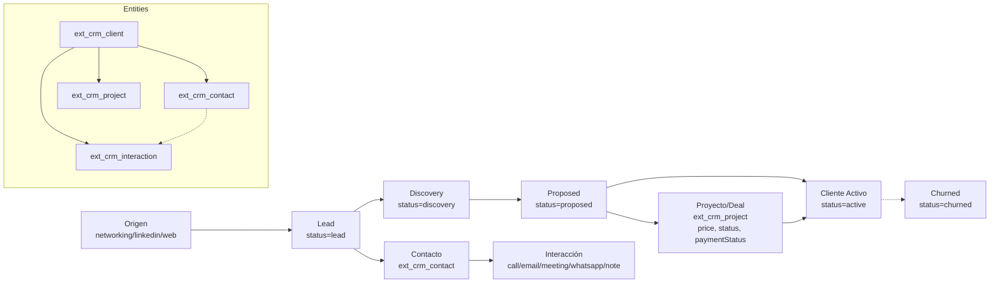

# Arquitectura

## Estado actual — Backend (`apps/back/src/extensions/crm/`)

```
extensions/crm/
├── extension.manifest.ts          metadata, dependencies: { extensions: [] }
├── extension.module.ts            NestJS module (auto-discovered)
├── controllers/
│   ├── crm-client.controller.ts       GET/POST/PATCH/DELETE  crm/clients
│   ├── crm-contact.controller.ts      GET/POST/PATCH/DELETE  crm/clients/:clientId/contacts
│   ├── crm-interaction.controller.ts  crm/clients/:clientId/interactions
│   ├── crm-project.controller.ts      crm/projects
│   ├── crm-origin.controller.ts       crm/origins
│   ├── crm-status.controller.ts       crm/statuses
│   └── crm-dashboard.controller.ts    GET crm/dashboard (admin-only)
├── services/
│   ├── crm-client.service.ts          CRUD + validación fiscal
│   ├── crm-contact.service.ts         CRUD por cliente
│   ├── crm-interaction.service.ts     CRUD + historial
│   ├── crm-project.service.ts         CRUD + movimiento pipeline
│   ├── crm-origin.service.ts          CRUD catálogo
│   ├── crm-status.service.ts          CRUD estados configurables
│   └── crm-dashboard.service.ts       Agregados (totalClients, byStatus, byOrigin, projectsByStatus, recentInteractions)
├── dto/                                create-*/update-* con class-validator
├── infrastructure/persistence/entities/
│   ├── crm-client.entity.ts           ext_crm_client (name, companyName, nif, email, phone, address, city, region, country, statusId FK, originId FK, metadata jsonb, isActive, softDelete)
│   ├── crm-contact.entity.ts          ext_crm_contact (clientId FK CASCADE, name, role, email, phone, isPrimary, metadata)
│   ├── crm-interaction.entity.ts      ext_crm_interaction (clientId FK CASCADE, contactId FK SET NULL, type enum, subject, body, interactionDate)
│   ├── crm-project.entity.ts          ext_crm_project (clientId FK CASCADE, name, type enum pack_1..custom, price decimal, status varchar, paymentStatus varchar, startDate, endDate, metadata)
│   ├── crm-origin.entity.ts           ext_crm_origin (name unique, label, type, isActive, sortOrder)
│   └── crm-status.entity.ts           ext_crm_status (name unique, label, color, sortOrder, isActive, isDefault)
└── seeds/crm-seed.service.ts          Upsert idempotente de 5 statuses (lead/discovery/proposed/active/churned) + 7 origins (networking/linkedin/web_form/gbp/cold_email/referral/other)
```

**Tablas**: `ext_crm_client`, `ext_crm_contact`, `ext_crm_interaction`, `ext_crm_origin`, `ext_crm_project`, `ext_crm_status`. Prefijo `ext_crm_` ✅.

**RBAC**: todos los controllers usan `@UseGuards(AuthGuard('jwt'), RolesGuard)` + `@Roles(RoleEnum.admin)`. Solo admin accede.

**Sin colas**: CRM no usa Bull. `bullmq` está instalado pero CRM no lo consume.

**Sin cronjobs**: CRM no tiene `@Cron` decorators. `@nestjs/schedule` instalado pero CRM no lo usa.

## Estado actual — Frontend (`apps/front/extensions/crm/`)

```
extensions/crm/
├── nuxt.config.ts                  layer config (compatibilityVersion 4)
├── types.ts                        tipos TS (Client, Contact, Interaction, Project, Origin, Status, DashboardData)
├── composables/useCrm.ts           wrapper de $fetch con auth Bearer — 26 métodos (getClients, createClient, getDashboard, etc.)
├── components/CrmDashboard.vue     dashboard con stat cards DaisyUI manuales + pipeline cards + orígenes con barras HTML manuales + tabla proyectos + timeline interacciones
├── plugins/nav.ts                  inyecta "CRM" en sidebar (admin-only, watch isAdmin para cleanup)
├── plugins/dashboard-widgets.ts    widget injection point (useState('crm:dashboardWidgets')) — ver DECOUPLING.md §15
└── pages/app/crm/
    ├── index.vue                       dashboard
    ├── clients/index.vue              lista clientes
    ├── clients/new.vue                form crear (FormInput + FormSelect base, NO LinkedSelect, NO auto-fill)
    ├── clients/[id].vue               detalle/edit
    ├── projects/index.vue | new.vue | [id].vue
    └── settings/origins.vue | statuses.vue
```

**Problemas observados en `CrmDashboard.vue`**:
- KPIs: `stat` cards DaisyUI manuales → reemplazar por `StatCard` (FR-001 base).
- Pipeline: cards compactas inline → reemplazar por `BarChartCard` horizontal (FR-003 base).
- Orígenes: barras HTML `div` con width% → reemplazar por `BarChartCard` (FR-003 base).
- Proyectos por status: `<table>` manual → mantener como tabla o migrar a `BarChartCard` (decisión en FR).
- Interacciones recientes: `<ul timeline>` DaisyUI → mantener (es contenido, no chart).

**Problemas en `clients/new.vue`**:
- `companyName` se tipea manual → auto-fill desde dominio de email.
- `statusId` + `originId` son `FormSelect` sueltos → no son dependientes, OK. Pero `LinkedSelect` aplica en crear interacción (cliente→contacto).

## Flujo CRM (lead → cliente → deal → activo)



**Estados del pipeline** (seed): `lead` (default) → `discovery` → `proposed` → `active` → `churned`. Colores: `#6c8cff`, `#36c2a8`, `#f5a623`, `#3cb878`, `#e0604e`.

## Componentes afectados

| Componente | Cambio | Tipo |
|------------|--------|------|
| `CrmDashboard.vue` | Refactor total: StatCard/TrendChart/BarChartCard/DonutChartCard en vez de stat/barras manuales | Refactor |
| `clients/new.vue` | Auto-fill `companyName` desde email domain | Feature |
| `interactions/new` (a crear) | `LinkedSelect` cliente→contacto | Feature nueva |
| `projects/new.vue` | `LinkedSelect` cliente→(status actual del cliente) | Refactor menor |
| `composables/useCrm.ts` | Añadir `getDashboardTrends(range)`, `getMrr()` | Extensión |
| `services/crm-dashboard.service.ts` | Añadir `getTrends(range)`, `getMrr()`, `getConversionRate()` | Extensión |
| `controllers/crm-dashboard.controller.ts` | Añadir `GET /crm/dashboard/trends`, `GET /crm/dashboard/mrr` | Extensión |
| `crm-client.entity.ts` | (⚠️ Ask first Q-004) añadir `ownerId` FK a User para round-robin | Migración |
| `i18n/locales/{es,en}/crm.json` | Nuevo namespace `crm` | Nuevo |

## Matriz de uso — FR-NNN del catálogo base → CRM

| FR base | Componente | Dónde se consume en CRM | Tier |
|---------|-----------|--------------------------|------|
| FR-001 | `StatCard` | `CrmDashboard.vue` (4 KPIs: total clientes, activos, pipeline value, MRR) | ✅ Always |
| FR-002 | `TrendChart` | `CrmDashboard.vue` (trend clientes nuevos 30d, trend interacciones 30d) | ✅ Always |
| FR-003 | `BarChartCard` | `CrmDashboard.vue` (pipeline por stage horizontal, clientes por origen) | ✅ Always |
| FR-004 | `DonutChartCard` | `CrmDashboard.vue` (distribución status: lead/discovery/proposed/active/churned) | ✅ Always |
| FR-021 | `LinkedSelect` | `interactions/new` (cliente→contacto), `projects/new` (cliente→status) | ✅ Always |
| FR-006 | `CronScheduleEditor` | `settings/scheduling.vue` (si Q-003 aprobado) | ⚠️ Ask first |
| FR-007 | `WeekdayPicker` | subcomponente de CronScheduleEditor | ⚠️ Ask first |
| FR-013 | `CronNextRunsPreview` | `settings/scheduling.vue` (preview reporte semanal) | ⚠️ Ask first |

## Decisiones técnicas

### D-01: Refactor `CrmDashboard.vue` sobre catálogo base (✅ Always)
Reemplazar stat/barras/timeline manuales por `StatCard`/`BarChartCard`/`DonutChartCard`/`TrendChart`. Razón: regla R-01 catálogo (≥2 consumers) y DoD CRM (cero charts inline). Alternativa descartada: mantener dashboard actual (deuda técnica).

### D-02: Auto-fill `companyName` via composable local (✅ Always)
`useAutoFillCompany(email, companyName)` composable en `extensions/crm/composables/`. Watch `email`, extrae dominio, capitaliza, sugiere `companyName` solo si está vacío. NO es componente base (muy específico de CRM). Alternativa descartada: endpoint backend de enriquecimiento (ver Q-002).

### D-03: Trends endpoint vs cálculo frontend (✅ Always)
Nuevo endpoint `GET /crm/dashboard/trends?range=30d|90d` retorna series temporales pre-agregadas (`{date, newClients, interactions, pipelineValue}[]`). Razón: no mandar crudo al frontend, reducir payload, cacheable. Alternativa descartada: frontend agrega desde lista de clientes (N+1, lento).

### D-04: MRR desde `CrmProjectEntity` (✅ Always)
`MRR = SUM(price) WHERE status='active' AND paymentStatus='paid'`. Cálculo en `CrmDashboardService.getMrr()`. Mostrar en `StatCard` con `unit='€'`. Alternativa descartada: tabla separada de suscripciones (no existe, fuera de scope).

### D-05: Scheduling (⚠️ Ask first — Q-003)
Si se aprueba: `CronScheduleEditor` (FR-006 base) en `settings/scheduling.vue` para weekly report (cron `0 9 * * 1` default) + follow-up reminders (cron custom). Backend añade `@Cron` en `CrmReportService` (nuevo) + `bullmq` queue para emails. Trade-off: 2 deps ya instaladas, pero requiere `extension.config.ts` con `CRM_WEEKLY_REPORT_CRON`, `CRM_WEEKLY_REPORT_EMAIL`. Ver Q-003.