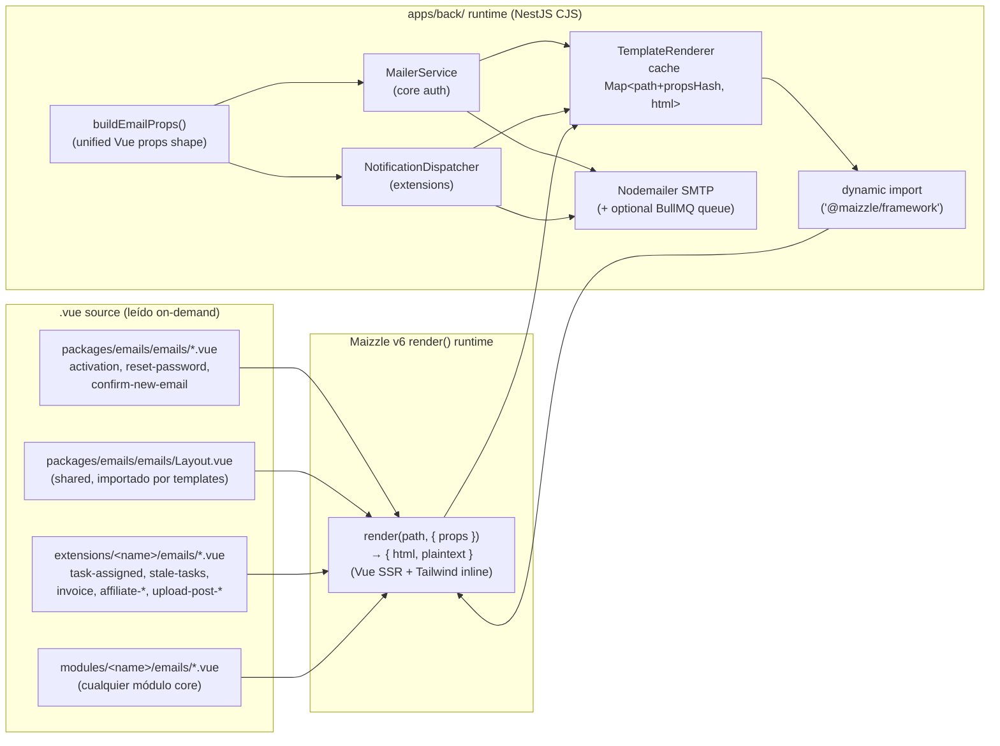
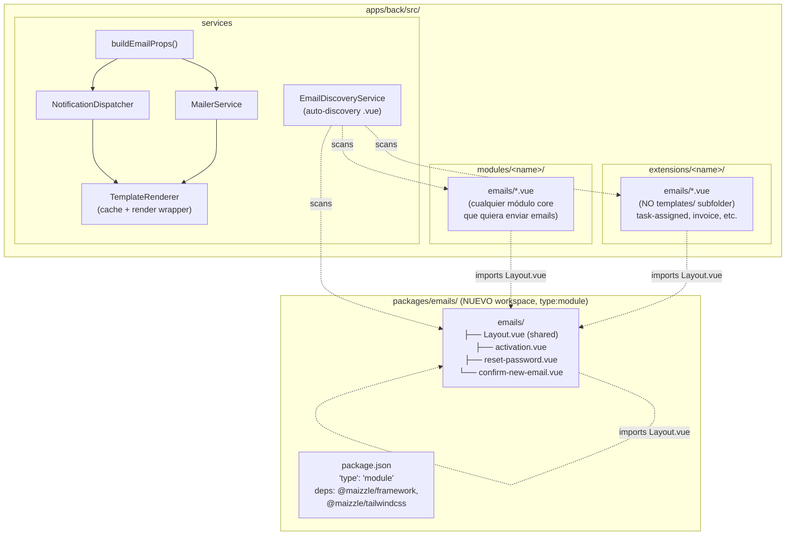

# Arquitectura

## Diagrama target — pipeline unificado (runtime, NO build step)



> El flujo: templates `.vue` (Vue SFCs + Tailwind 4) son **source**, leídos del disco on-demand. NO hay build step, NO hay `build/`, NO hay Handlebars. En runtime, `TemplateRenderer` recibe `(path, props)` → verifica cache `Map<path+propsHash, html>` → si miss, hace `dynamic import('@maizzle/framework')` → llama `render(path, { props })` que compila el SFC con Vue SSR + Tailwind inline → retorna `{ html, plaintext }` → cachea → `MailerService`/`NotificationDispatcher` lo pasan a Nodemailer SMTP (con queue BullMQ opcional via `WORKER_HOST`).

## Diagrama target — estructura de archivos



> **Sin subcarpeta `templates/`** (decisión del usuario): los `.vue` viven directamente en `emails/` (ej: `extensions/tasks/emails/task-assigned.vue`, NO `extensions/tasks/templates/emails/`). El core `Layout.vue` vive en `packages/emails/emails/Layout.vue` y los templates lo importan via alias `@emails/Layout.vue` (Q-010) o path relativo. Auto-discovery escanea `extensions/*/emails/` + `modules/*/emails/` + `packages/emails/emails/`.

## Renderer unificado `TemplateRenderer`

Un solo servicio wraps `render()` de Maizzle v6 con cache. Elimina el `fs.readFile` + `Handlebars.compile` duplicado en `MailerService` (`infrastructure/mailer/mailer.service.ts`), `EmailProcessor` (`modules/communications/email-queue/email.processor.ts:77-78`), y `NotificationDispatcher` (`core/spec-engine/notification-dispatcher.ts:425-467` + cache `Map` en línea 109). Elimina Handlebars por completo.

```typescript
// apps/back/src/modules/communications/mail/template-renderer/template-renderer.service.ts
import { Injectable, Logger } from '@nestjs/common';
import { createHash } from 'node:crypto';

interface RenderResult {
  html: string;
  plaintext?: string;
}

interface CacheEntry {
  html: string;
  plaintext?: string;
  // SFC compilation is cached internally by Maizzle render() across calls
  // with the same path, so we only cache the final (path+props) -> html result.
}

@Injectable()
export class TemplateRenderer {
  private readonly logger = new Logger(TemplateRenderer.name);
  private readonly cache = new Map<string, CacheEntry>();
  // Lazy-load @maizzle/framework once (dynamic import from CJS apps/back/)
  private maizzleRender: typeof import('@maizzle/framework')['render'] | null = null;

  /**
   * render() from @maizzle/framework compiles the .vue (Vue SSR + Tailwind
   * inline) on-demand and returns { html, plaintext }. Dynamic data is passed
   * as Vue props — NO Handlebars, NO {{handlebars}} runtime, NO build step.
   * https://maizzle.com/docs/deploy/nodemailer
   */
  async render(
    templatePath: string,
    props: Record<string, unknown>,
  ): Promise<RenderResult> {
    const key = this.cacheKey(templatePath, props);
    const cached = this.cache.get(key);
    if (cached) {
      this.logger.debug(`Cache hit: ${templatePath}`);
      return cached;
    }

    this.logger.log(`Rendering template: ${templatePath}`);
    const render = await this.loadRender();
    const result = await render(templatePath, { props });

    const entry: CacheEntry = { html: result.html, plaintext: result.plaintext };
    this.cache.set(key, entry);
    return entry;
  }

  clearCache(templatePath?: string): void {
    if (templatePath) {
      for (const key of this.cache.keys()) {
        if (key.startsWith(templatePath + '::')) this.cache.delete(key);
      }
    } else {
      this.cache.clear();
    }
  }

  private async loadRender() {
    if (!this.maizzleRender) {
      // Dynamic import from CJS apps/back/ into ESM @maizzle/framework.
      // packages/emails/ is the ESM-native owner of the framework dep.
      const mod = await import('@maizzle/framework');
      this.maizzleRender = mod.render;
    }
    return this.maizzleRender;
  }

  private cacheKey(path: string, props: Record<string, unknown>): string {
    // Stable hash of props — order-independent via JSON.stringify of sorted keys.
    const propsHash = createHash('sha256')
      .update(this.stableStringify(props))
      .digest('hex').slice(0, 16);
    return `${path}::${propsHash}`;
  }

  private stableStringify(value: unknown): string {
    // Sort object keys recursively for stable hash regardless of key order.
    return JSON.stringify(value, (_k, v) =>
      v && typeof v === 'object' && !Array.isArray(v)
        ? Object.keys(v).sort().reduce<Record<string, unknown>>((acc, k) => {
            acc[k] = (v as Record<string, unknown>)[k];
            return acc;
          }, {})
        : v,
    );
  }
}
```

> Cache key = `path + sha256(stableStringify(props))`. Hit si mismo path + mismos props. Para emails con props únicos (ej: reset-password con hash único por request), el cache siempre miss en ese path+props — pero Maizzle v6 cachea internamente el SFC compilado, así que solo la interpolación de props se repite (rápido en v6). Ver R-CACHE-1 y Q-011.

## Props unificado `buildEmailProps()`

Un helper produce el mismo shape de Vue props para ambos pipelines. Elimina `app_url` vs `app.url`, `app_name` vs `app.name`. Las strings i18n se pre-resuelven aquí (no hay helper `{{t}}` en templates).

```typescript
// apps/back/src/modules/communications/mail/build-email-props.helper.ts
import { ConfigService } from '@nestjs/config';
import { I18nService } from 'nestjs-i18n';

export interface EmailProps {
  appName: string;        // from mail.defaultName
  appUrl: string;         // from app.url (frontend base URL)
  notificationEmail: string;  // from app.notificationEmail (recipient-only)
  subject: string;        // pre-resolved (i18n) — passed as prop
  greeting?: string;      // pre-resolved i18n string
  bodyText?: string;     // pre-resolved i18n string
  buttonText?: string;   // pre-resolved i18n string
  link?: string;
  title?: string;
  user?: { name: string; email: string };
  entity?: Record<string, unknown>;  // spec-engine: the entity being notified about
  lang: string;           // 'es' | 'en'
  // Extension-specific props passed through as-is.
  [key: string]: unknown;
}

export function buildEmailProps(
  config: ConfigService,
  i18n: I18nService,
  partial: Partial<EmailProps> & { lang?: string },
): EmailProps {
  const lang = partial.lang ?? 'es';
  // Pre-resolve i18n strings here — templates receive plain strings as props.
  const subject = partial.subject ?? i18n.t(partial.subjectKey ?? '', { lang });
  const greeting = partial.greeting ?? (partial.greetingKey ? i18n.t(partial.greetingKey, { lang }) : undefined);

  return {
    appName: config.get<string>('mail.defaultName'),
    appUrl: config.get<string>('app.url'),
    notificationEmail: config.get<string>('app.notificationEmail'),
    subject,
    greeting,
    bodyText: partial.bodyText,
    buttonText: partial.buttonText,
    link: partial.link,
    title: partial.title,
    user: partial.user,
    entity: partial.entity,
    lang,
    ...partial,  // extension-specific props pass through
  };
}
```

> El shape usa `appName`/`appUrl` (camelCase, idiomático Vue props). Los templates `.vue` reciben estos via `defineProps()`. La migración de `app_url` → `appUrl` se hace en los templates core durante Fase 1. Las strings i18n se pre-resuelven en este helper (FR-050) — el template recibe `<p>{{ greeting }}</p>` donde `greeting` ya es un string traducido, NO `{{t "key"}}` en el template.

## Workspace `packages/emails/`

Maizzle framework vive en un workspace ESM-native. `apps/back/` lo consume via dynamic `import()`.

```json
// packages/emails/package.json
{
  "name": "@foundation/emails",
  "type": "module",
  "private": true,
  "dependencies": {
    "@maizzle/framework": "^6.x",
    "@maizzle/tailwindcss": "^1.x"
  }
}
```

> `apps/back/` hace `dynamic import('@maizzle/framework')` — Node soporta dynamic import desde CJS a ESM. Si hubiera fricción (R-DYNAMIC-1), `packages/emails/` expone una API boundary (servicio compilado) que `apps/back/` consume (Q-009). Verificado: `pnpm-workspace.yaml` ya incluye `packages/*`, así que `packages/emails/` es descubierto automáticamente.

## Ejemplo template `.vue` — `activation.vue`

```vue
<!--
  packages/emails/emails/activation.vue
  Maizzle v6 render() runtime: Vue SFC, <script setup> for props,
  Tailwind 4 in <style>. NO Handlebars, NO {{handlebars}}.
  Dynamic data enters as Vue props via render(path, { props }).
-->
<script setup>
import Layout from './Layout.vue'

defineProps({
  appName: { type: String, required: true },
  appUrl: { type: String, required: true },
  subject: { type: String, default: '' },
  greeting: { type: String, default: '' },
  bodyText: { type: String, default: '' },
  buttonText: { type: String, default: '' },
  link: { type: String, default: '' },
  title: { type: String, default: '' },
  user: { type: Object, default: () => ({ name: '', email: '' }) },
})
</script>

<template>
  <Layout :app-name="appName" :app-url="appUrl">
    <h1>{{ title }}</h1>
    <p>{{ greeting }}</p>
    <p>{{ bodyText }}</p>
    <Button :href="link">
      {{ buttonText }}
    </Button>
  </Layout>
</template>

<style>
/* Tailwind 4 CSS-first config via @theme — @maizzle/tailwindcss */
@import "@maizzle/tailwindcss";

@theme {
  --color-primary: #2563eb;
}
</style>
```

> `{{ title }}`, `{{ greeting }}`, etc. son **interpolación Vue de props** — NO Handlebars. `render()` compila el SFC, interpola los props, inlines Tailwind, y retorna HTML final. Cero `{{handlebars}}` en cualquier output.

## Ejemplo `Layout.vue` compartido

```vue
<!--
  packages/emails/emails/Layout.vue
  Shared layout — imported by core emails AND extension/module emails.
  Extension template imports: `import Layout from '@emails/Layout.vue'`
  (alias Q-010) or relative path.
-->
<script setup>
defineProps({
  appName: { type: String, default: '' },
  appUrl: { type: String, default: '' },
})
</script>

<template>
  <html>
    <head>
      <meta charset="utf-8" />
      <title>{{ appName }}</title>
    </head>
    <body style="font-family: sans-serif; background: #f8fafc;">
      <div style="max-width: 600px; margin: 0 auto; padding: 24px;">
        <slot />
        <footer style="margin-top: 32px; font-size: 12px; color: #64748b;">
          <a :href="appUrl">{{ appName }}</a>
        </footer>
      </div>
    </body>
  </html>
</template>
```

## Ejemplo `extensions/stripe/emails/invoice.vue`

```vue
<!--
  extensions/stripe/emails/invoice.vue
  Stripe invoice email — rendered via NotificationDispatcher (NOT MailService).
  Stripe stops importing MailService (FR-060, FR-061).
-->
<script setup>
import Layout from '@emails/Layout.vue'

defineProps({
  appName: { type: String, required: true },
  appUrl: { type: String, required: true },
  greeting: { type: String, default: '' },      // pre-resolved i18n
  subject: { type: String, default: '' },        // pre-resolved i18n
  bodyText: { type: String, default: '' },        // pre-resolved i18n
  buttonText: { type: String, default: '' },      // pre-resolved i18n
  link: { type: String, default: '' },
  invoice: {
    type: Object,
    default: () => ({ number: '', amount: '', currency: '', dueDate: '' }),
  },
})
</script>

<template>
  <Layout :app-name="appName" :app-url="appUrl">
    <h1>{{ title || subject }}</h1>
    <p>{{ greeting }}</p>
    <p>{{ bodyText }}</p>
    <table>
      <tr><td>Invoice</td><td>{{ invoice.number }}</td></tr>
      <tr><td>Amount</td><td>{{ invoice.amount }} {{ invoice.currency }}</td></tr>
      <tr><td>Due</td><td>{{ invoice.dueDate }}</td></tr>
    </table>
    <Button :href="link">{{ buttonText }}</Button>
  </Layout>
</template>
```

## Auto-discovery por convención

El renderer escanea por convención. Drop folder → funciona.

```typescript
// apps/back/src/modules/communications/mail/email-discovery/email-discovery.service.ts
import { Injectable, Logger } from '@nestjs/common';
import { glob } from 'node:fs/promises';
import { resolve } from 'node:path';

@Injectable()
export class EmailDiscoveryService {
  private readonly logger = new Logger(EmailDiscoveryService.name);

  // Convention: NO templates/ subfolder — directly emails/.
  // Scans: extensions/*/emails/ + modules/*/emails/ + packages/emails/emails/
  async findAll(): Promise<Map<string, string>> {
    const patterns = [
      'apps/back/src/extensions/*/emails/*.vue',
      'apps/back/src/modules/*/emails/*.vue',
      'packages/emails/emails/*.vue',
    ];
    const found = new Map<string, string>();  // templateName -> absolutePath
    for (const pattern of patterns) {
      // Use glob (Node 22+) or fast-glob — see implementation choice in Fase 3.
      for await (const entry of this.glob(pattern)) {
        const name = entry.replace(/\.vue$/, '').split('/').pop()!;
        found.set(name, resolve(entry));
        this.logger.debug(`Discovered email template: ${name} -> ${entry}`);
      }
    }
    return found;
  }

  async resolveByName(name: string): Promise<string | null> {
    const all = await this.findAll();
    return all.get(name) ?? null;
  }

  private async *glob(pattern: string): AsyncIterable<string> {
    // Implementation: fast-glob or Node fs.glob (Node 22+).
    // See Q-009 / Fase 3 decision.
    yield* [];  // placeholder — implement in Fase 3
  }
}
```

> Drop `extensions/foo/emails/bar.vue` → `EmailDiscoveryService.findAll()` lo encuentra → `TemplateRenderer.render(path, props)` lo puede renderizar. Sin `app.module.ts` edits, sin config manual. La convención es `extensions/*/emails/` + `modules/*/emails/` + `packages/emails/emails/` (sin `templates/` subfolder).

## Uso de `render()` — ejemplo end-to-end

```typescript
// Caller (MailerService or NotificationDispatcher) — post-refactor
import { render } from '@maizzle/framework'  // via TemplateRenderer which wraps this
import nodemailer from 'nodemailer'

// TemplateRenderer.render() does this internally:
const { html, plaintext } = await render('packages/emails/emails/activation.vue', {
  props: {
    appName: 'Foundation',
    appUrl: 'https://app.example.com',
    subject: 'Activá tu cuenta',
    greeting: 'Hola Juan',
    bodyText: 'Confirmá tu email para activar tu cuenta.',
    buttonText: 'Activar cuenta',
    link: 'https://app.example.com/activate?token=abc123',
    title: 'Bienvenido a Foundation',
    user: { name: 'Juan', email: 'juan@example.com' },
    lang: 'es',
  },
})

await transporter.sendMail({
  from: '"Foundation" <noreply@example.com>',
  to: 'juan@example.com',
  subject: 'Activá tu cuenta',
  html,
  text: plaintext,
})
```

> Fuente: verificación de la `render()` API en https://maizzle.com/docs/deploy/nodemailer. `render(path, { props })` retorna `{ html, plaintext }`. `TemplateRenderer` wraps esto con cache + dynamic import lazy-load.

## Diferencias con estado actual

| Aspecto | Estado actual | Target |
|---------|---------------|--------|
| Pipelines | 2 paralelos (core Maizzle v5 + spec-engine Handlebars) | 1 unificado (`TemplateRenderer` + `buildEmailProps`) |
| Templating | Maizzle v5.5.0 build-time (`.hbs`, `<x-main>`, `<yield/>`, Tailwind 3) + Handlebars runtime | Maizzle v6 `render()` runtime (`.vue` SFCs, Vue SSR, Tailwind 4 inline) — **NO build step** |
| Runtime interpolation | Handlebars 4.7.8 (preserva `{{vars}}` post-Maizzle) | **Eliminado** — datos dinámicos son Vue props via `render(path, { props })` |
| Handlebars dep | `handlebars 4.7.8` en `apps/back/package.json` | **Eliminado** — cero handlebars en deps |
| `.hbs` files | 6 archivos (4 core + 2 tasks) | **Eliminados** — cero `.hbs` en repo |
| Config | `maizzle.config.js` (CJS) + `tailwind.email.config.js` | **Eliminados** — `render()` no requiere config de build |
| `flatten-maizzle-output.js` | Presente (aplana output anidado v5) | **Eliminado** — no hay build output |
| `tailwindcss-preset-email` | `^1.4.0` en deps | **Eliminado** — reemplazado por `@maizzle/tailwindcss` (Tailwind 4) en `packages/emails/` |
| Build output `build/` | Ausente de git (bug crítico) | **NO existe** — `render()` lee `.vue` on-demand |
| Renderer | Duplicado (3 lugares: `mailer.service.ts`, `email.processor.ts:77-78`, `notification-dispatcher.ts:425-467` con cache en :109) | Unificado `TemplateRenderer` (wraps `render()`, cache por `path+propsHash`) |
| Context/props shape | Divergente (`app_url` vs `app.url`, `app_name` vs `app.name`) | Unificado `buildEmailProps()` (`appName`, `appUrl`, `notificationEmail`) |
| `from` | Core: `mail.defaultName <mail.defaultEmail>`; spec-engine: `app.notificationEmail` raw | Unificado `mail.defaultName <mail.defaultEmail>` en ambos; `app.notificationEmail` = recipient-only |
| Cache | Core: NINGUNO; spec-engine: `Map<path, compiled>` | Unificado en `TemplateRenderer` (`Map<path+propsHash, html>`) |
| i18n | Core: `nestjs-i18n` por método; spec-engine: NINGUNO (hardcode Spanish); helper `{{t}}` runtime | Pre-resuelto en `buildEmailProps()` — strings como Vue props, NO helper en template |
| Extension patterns | 3 inconsistentes (A: core MailService, B: dispatcher + .hbs, C: inline HTML) | 1 unificado: `extensions/<name>/emails/*.vue` via dispatcher |
| `invoicePaymentConfirmed` | HTML inline en `MailService`, sync send | **ELIMINADO** de `MailService`; stripe usa `extensions/stripe/emails/invoice.vue` via dispatcher |
| Stripe + MailService | `stripe.service.ts:8` importa `MailService` | **Eliminado** — stripe usa dispatcher, no importa `MailService` |
| Extension templates location | `extensions/<name>/templates/*.hbs` (con `templates/` subfolder) | `extensions/<name>/emails/*.vue` (**sin** `templates/` subfolder) |
| Layout compartido | `mail-templates/layouts/main.hbs` (core only) | `packages/emails/emails/Layout.vue` importado por todos los templates via alias `@emails/Layout.vue` (Q-010) |
| Tailwind frontend | Tailwind 4.1.3 + DaisyUI 5 (verificado) — coexiste naturalmente con `@maizzle/tailwindcss` (Tailwind 4) en workspaces separados | Sin cambios en frontend |

## Decisiones con trade-offs

### D-01: Workspace `packages/emails/` para Maizzle framework + Layout compartido

**Decisión**: crear workspace `packages/emails/` con `"type": "module"`, deps `@maizzle/framework` + `@maizzle/tailwindcss`. El core `Layout.vue` + templates core (`activation.vue`, `reset-password.vue`, `confirm-new-email.vue`) viven aquí. `apps/back/` consume via dynamic `import('@maizzle/framework')`.

**Contexto**: `@maizzle/framework` v6 es ESM-first. NestJS backend compila a CJS. Un workspace ESM-native (`packages/emails/` con `"type": "module"`) es el patrón documentado por Maizzle y aísla la fricción ESM/CJS. `apps/back/` no añade `@maizzle/framework` a sus deps directas — lo consume via dynamic import desde el workspace. `pnpm-workspace.yaml` ya incluye `packages/*`, así que el workspace se descubre automáticamente.

**Alternativas descartadas**:
- *Embedded en `apps/back/`*: `apps/back/package.json` añade `@maizzle/framework` y corre `render()` via dynamic import. Menos indirection, pero mezcla ESM-first deps en el package CJS del backend (fricción potencial, R-DYNAMIC-1).
- *Sin workspace, sin shared package*: cada app/extensión instala Maizzle. Duplicación, sin Layout compartido central.

**Trade-off**: workspace = aislamiento ESM nativo + Layout compartido central + patrón oficial Maizzle, pero un package más y path indirection para el alias `@emails/Layout.vue` (Q-010). Resuelve R-ESM-1 (v1) — el workspace ESM nativo elimina la fricción.

### D-02: Auto-discovery por convención `extensions/*/emails/` + `modules/*/emails/` + `packages/emails/emails/`

**Decisión**: el renderer escanea tres roots por convención para `.vue` files. **Sin** subcarpeta `templates/` — directamente `emails/`. Drop folder → funciona.

**Contexto**: el usuario dijo explícitamente "quitaría el nombre de templates y sería ej: extensions/*/emails". Extensiones Y módulos core pueden tener carpeta de emails. Auto-discovery por convención (no config manual) alinea con el patrón de extensiones auto-discovered del monorepo (`extension.module.ts` auto-discovered por `ExtensionLoaderModule`).

**Alternativas descartadas**:
- *`templates/emails/` subfolder*: el usuario lo descartó — más indirection innecesaria.
- *Config manual de paths*: rompe auto-discovery, agrega acoplamiento.
- *Solo extensions, no modules*: el usuario quiere que módulos core también puedan tener `emails/`.

**Trade-off**: auto-discovery por glob scanning (Node `fs.glob` Node 22+ o `fast-glob`) tiene costo de I/O en startup. Mitigado con cache de discovery (scan una vez en startup, refresh lazy). Se gana: drop folder → funciona, cero config.

### D-03: NO build step — `render()` on-demand

**Decisión**: NO hay build step para email HTML. Los `.vue` son source, `render()` los lee del disco on-demand en runtime. La decisión v1 de "commitear build/" queda OBSOLETA.

**Contexto**: la verificación de la `render()` API de Maizzle v6 (https://maizzle.com/docs/deploy/nodemailer) confirma que `render(path, { props })` compila el SFC + Tailwind inline en runtime. No hay `build/` output. El bug crítico de v5 (build roto en fresh checkout) desaparece eliminando el build step — no hay nada que commitear ni nada que olvidar correr.

**Alternativas descartadas**:
- *Commitear `build/` (v1 approach)*: OBSOLETO. Era el fix al bug del build roto, pero con `render()` no hay build.
- *Hook prebuild/predev*: añade latencia a `pnpm dev`, frágil si falla. Innecesario — no hay build.
- *Build-time compile + Handlebars runtime (v1 approach)*: doble trabajo, deuda técnica, `build/` que commitear. Eliminado.

**Trade-off**: `render()` runtime tiene costo de CPU en el primer render de cada template (compila Vue SFC + Tailwind). Mitigado con cache (`TemplateRenderer` cachea `html` por `path+propsHash`; Maizzle v6 cachea internamente el SFC compilado). Benchmark en Fase 0 (NFR-001, R-PERF-1, Q-011). Se gana: cero build step, cero `build/` en repo, fresh checkout siempre funciona, cero Handlebars.

### D-04: Renderer unificado (`TemplateRenderer`) que wraps `render()`

**Decisión**: un servicio `TemplateRenderer` con cache (`Map<path+propsHash, html>`), que wraps `render()` de `@maizzle/framework` via dynamic import. Usado por ambos pipelines (`MailerService` y `NotificationDispatcher`). Elimina `fs.readFile` + `Handlebars.compile` duplicado en los 3 lugares.

**Contexto**: hoy hay 3 lugares que hacen `fs.readFile` + `Handlebars.compile`: `MailerService.sendMail()` (`mailer.service.ts`), `EmailProcessor.process()` (`email.processor.ts:77-78`), y `NotificationDispatcher.renderTemplate()` (`notification-dispatcher.ts:425-467`, con cache `Map` en :109). Un renderer unificado elimina la duplicación, centraliza el cache, y unifica el manejo de props.

**Alternativas descartadas**:
- *Mantener 3 renderers*: duplicación persiste, drift continúa.
- *Usar `@nestjs-modules/mailer`*: NO instalado. Añadirlo es scope creep. El renderer unificado es simple (cache + dynamic import + `render()`).

**Trade-off**: un renderer unificado significa que un bug afecta TODOS los emails (R-RENDER-1, blast radius). Mitigado con tests de renderer (cache hit/miss, props injection, dynamic import). Se gana DRY, un solo cache, un solo lugar para props shape.

## Principios arquitecturales

1. **Una fuente de verdad**: un `TemplateRenderer`, un `buildEmailProps()`, un `from`. Sin divergencia.
2. **Runtime rendering, no build step**: `render()` compila `.vue` on-demand con Vue SSR + Tailwind inline. Cero build, cero `build/`, cero Handlebars.
3. **Datos dinámicos como Vue props**: `render(path, { props })` — NO `{{handlebars}}` runtime, NO helper `{{t}}` en templates. i18n se pre-resuelve en `buildEmailProps()`.
4. **Templates desde cualquier sitio**: `extensions/*/emails/` + `modules/*/emails/` + `packages/emails/emails/` con auto-discovery. Drop folder → funciona.
5. **Layout compartido via import**: `packages/emails/emails/Layout.vue` importado por todos los templates via alias `@emails/Layout.vue` (Q-010), no duplicado.
6. **ESM-native en workspace**: `packages/emails/` con `"type": "module"`. `apps/back/` CJS consume via dynamic import.
7. **Cache por path + propsHash**: `TemplateRenderer` cachea `html` final. Maizzle v6 cachea internamente el SFC compilado. Hit si mismo path + mismos props.
8. **Sin big-bang**: migración incremental por fases (ver `06-migration-phases.md`).