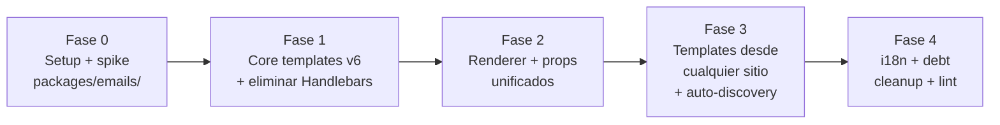

# Fases de Migración

## Principio

**Incremental, sin big-bang.** Cada fase desplegable y reversible. Los emails core (auth) no se rompen en ninguna fase. 5 fases.

```
Fase 0 → Fase 1 → Fase 2 → Fase 3 → Fase 4
Setup    Core      Renderer   Templates     i18n + debt
+ spike  templates  + Context  desde          cleanup
         + elim    + props    cualquier     + lint
         Handlebars unificado  sitio +
                              auto-discovery
```

## Dependencias entre fases



- Fase 1 requiere Fase 0 (workspace `packages/emails/` creado, spike resuelto, `render()` verificado).
- Fase 2 requiere Fase 1 (templates core en v6 funcionando, Handlebars eliminado).
- Fase 3 requiere Fase 2 (`TemplateRenderer` unificado disponible para extensiones).
- Fase 4 requiere Fase 3 (extensiones migradas, base para i18n props + lint).

---

## Fase 0 — Setup + Spike

**Objetivo**: `packages/emails/` workspace creado, `render()` API spike desde `apps/back/`, benchmark de performance, `Layout.vue` base, smoke test 1 template `.vue` renderado via `render()`.

### Entregables

- [ ] Crear workspace `packages/emails/` (FR-070): `package.json` con `"name": "@foundation/emails"`, `"type": "module"`, `"private": true`, deps `@maizzle/framework ^6.x` + `@maizzle/tailwindcss ^1.x`. `pnpm-workspace.yaml` ya incluye `packages/*` — se descubre automáticamente.
- [ ] **Spike Q-009 (API boundary)**: `dynamic import('@maizzle/framework')` desde `apps/back/` CJS. Si funciona → `TemplateRenderer` importa directo. Si falla → `packages/emails/` expone API boundary (servicio compilado) que `apps/back/` consume. Documentar decisión.
- [ ] **Spike Q-010 (Layout alias)**: decidir mecanismo para `@emails/Layout.vue` — tsconfig path mapping en `apps/back/tsconfig.json` (paths: `@emails/*` → `../../packages/emails/emails/*`), o `packages/emails/package.json` exports, o path relativo. Documentar decisión.
- [ ] **Spike Q-011 (render performance)**: benchmark `render('test.vue', { props: { name: 'Juan' } })` first render y cache hit. Verificar < 500ms first render (NFR-001, R-PERF-1). Si > 2s, documentar plan de warm-up (pre-render de templates comunes en startup).
- [ ] **Spike Q-012 (props serialization)**: verificar que los props pasados a `render()` son serializables (strings, numbers, arrays, objects plain). Si hay Date objects en context actual, documentar conversión a ISO string en `buildEmailProps()`.
- [ ] Crear `packages/emails/emails/Layout.vue` base (FR-042) — `<slot/>`, `appName`/`appUrl` props, Tailwind 4 `@theme` en `<style>`.
- [ ] Smoke test: crear `packages/emails/emails/activation-spike.vue` (migración simple de `activation.hbs`), llamar `render()` desde un script en `apps/back/` via dynamic import, verificar `{ html, plaintext }` retornado con HTML final (Tailwind inlined, props interpolados, cero `{{handlebars}}`).
- [ ] Spike R-DYNAMIC-1: confirmar que `dynamic import('@maizzle/framework')` desde NestJS CJS funciona (o API boundary).
- [ ] Spike R-VUE-RUNTIME-1: medir memory/bundle del backend con `@maizzle/framework` en runtime. Documentar impacto.
- [ ] Verificar NFR-007: `pnpm --filter front build` sigue funcionando tras crear `packages/emails/` con `@maizzle/tailwindcss` (frontend Tailwind 4.1.3 intacto).

### Criterios de salida

- `packages/emails/` workspace existe con `package.json` type:module + deps `@maizzle/framework` + `@maizzle/tailwindcss`.
- `dynamic import('@maizzle/framework')` desde `apps/back/` CJS funciona (o API boundary adoptada y documentada — Q-009).
- `render('packages/emails/emails/activation-spike.vue', { props })` retorna `{ html, plaintext }` con HTML final, cero `{{handlebars}}`.
- Benchmark: first render < 500ms, cache hit < 5ms (NFR-001, Q-011). Si > 2s, plan de warm-up documentado.
- `@emails/Layout.vue` alias resuelve (Q-010 decisión documentada).
- `pnpm --filter front build` sin regresión (NFR-007).
- Q-009, Q-010, Q-011, Q-012 RESUELTAS con decisión documentada.
- `pnpm check-types` pasa en `apps/back` + `packages/emails`.
- Sin impacto en emails actuales (Maizzle v5 + Handlebars siguen funcionando — no se tocan aún).

### Riesgos

- R-PERF-1: first render > 2s → plan de warm-up (pre-render en startup).
- R-DYNAMIC-1: dynamic import falla → API boundary en `packages/emails/`.
- R-VUE-RUNTIME-1: memory/bundle impacto alto → documentar, evaluar mitigación.

### Rollback

- Eliminar `packages/emails/` workspace. Revertir cualquier cambio en `apps/back/tsconfig.json` (alias `@emails`). Emails v5 + Handlebars siguen funcionando (no se tocaron). El bug de fresh checkout (build/ ausente) persiste pero no se introdujo nuevo fallo.

---

## Fase 1 — Migrar core templates a v6 + eliminar Handlebars

**Objetivo**: 4 templates core migrados a `.vue` en `packages/emails/`, Handlebars eliminado de los callers core, `.hbs` files eliminados, deps legacy eliminadas, emails de auth funcionando via `render()`.

### Entregables

- [ ] `activation.hbs` → `packages/emails/emails/activation.vue` (FR-002) — Vue SFC, `defineProps({ appName, appUrl, subject, greeting, bodyText, buttonText, link, title, user, lang })`, `<Layout>` import, Tailwind 4 `<style>`.
- [ ] `reset-password.hbs` → `packages/emails/emails/reset-password.vue` (FR-002).
- [ ] `confirm-new-email.hbs` → `packages/emails/emails/confirm-new-email.vue` (FR-002).
- [ ] `layouts/main.hbs` → `packages/emails/emails/Layout.vue` (FR-042) — `<slot/>` reemplaza `<yield/>>`, Tailwind 4 `@theme` en `<style>`.
- [ ] Eliminar `apps/back/src/modules/communications/mail/mail-templates/` (los 4 `.hbs` + `layouts/main.hbs` + `maizzle.config.js`) — FR-002, FR-006.
- [ ] **Eliminar dependencia `handlebars`** de `apps/back/package.json` (FR-001, NFR-003) — remover línea `"handlebars": "4.7.8"`.
- [ ] Eliminar `apps/back/tailwind.email.config.js` + dependencia `tailwindcss-preset-email` (FR-005).
- [ ] Eliminar `apps/back/scripts/flatten-maizzle-output.js` + scripts `maizzle:build`/`maizzle:serve` de `apps/back/package.json` (FR-004).
- [ ] Eliminar `tailwindcss` 3.4.17 (dev) de `apps/back/package.json` — Tailwind 4 via `@maizzle/tailwindcss` en `packages/emails/`.
- [ ] Refactor `MailerService.sendMail()` (`infrastructure/mailer/mailer.service.ts`) para usar `TemplateRenderer.render(path, props)` — versión inicial de `TemplateRenderer` creada aquí (FR-020, FR-021). Eliminar `fs.readFile` + `Handlebars.compile`.
- [ ] Refactor `EmailProcessor.process()` (`modules/communications/email-queue/email.processor.ts:77-78`) para usar `TemplateRenderer.render(path, props)` (FR-022). Eliminar `fs.readFile` + `Handlebars.compile`.
- [ ] `buildEmailProps()` helper creado en `apps/back/src/modules/communications/mail/build-email-props.helper.ts` (FR-030) — versión inicial con shape `EmailProps` (`appName`, `appUrl`, `notificationEmail`, etc.).
- [ ] `MailService.userSignUp()`, `forgotPassword()`, `confirmNewEmail()` refactorizados para construir props via `buildEmailProps()` y delegar a `MailerService`/`QueuedMailerService` con `TemplateRenderer` (FR-023).
- [ ] Smoke test: `pnpm dev` + registro de usuario → email de activación enviado desde `packages/emails/emails/activation.vue` via `render()`.
- [ ] Smoke test: reset password → email enviado desde `packages/emails/emails/reset-password.vue`.
- [ ] Smoke test: confirm new email → email enviado desde `packages/emails/emails/confirm-new-email.vue`.
- [ ] Comparación visual pre/post: email de activación v5 vs v6 (paridad razonable).
- [ ] `invoicePaymentConfirmed` NO se migra aquí (se hace en Fase 4 — sigue como HTML inline por ahora, no toca stripe todavía).

### Criterios de salida

- `rg "handlebars" apps/back/package.json` sin resultados (NFR-003).
- `rg "\.hbs$" apps/back/src/` sin resultados (NFR-004).
- `rg "Handlebars.compile\|import Handlebars\|from 'handlebars'" apps/back/src/infrastructure/mailer/ apps/back/src/modules/communications/email-queue/` sin resultados (FR-003, FR-021, FR-022).
- `apps/back/scripts/flatten-maizzle-output.js` no existe (FR-004).
- `apps/back/tailwind.email.config.js` no existe (FR-005).
- `packages/emails/emails/activation.vue`, `reset-password.vue`, `confirm-new-email.vue`, `Layout.vue` existen.
- `render()` renderiza los 3 templates core con props — emails enviados correctamente.
- `pnpm check-types` + `pnpm lint` pasan en `apps/back` + `packages/emails`.
- `pnpm --filter front build` sigue funcionando (NFR-007).

### Riesgos

- Migración de templates `.hbs` → `.vue` drift funcional → comparación visual pre/post.
- `buildEmailProps()` shape no cubre todos los casos del context actual → iterar en Fase 1.
- `MailerService`/`EmailProcessor` refactor rompe envío → smoke tests por método.

### Rollback

- Revertir commits de Fase 1. `handlebars` dep, `.hbs` files, `maizzle.config.js`, `tailwind.email.config.js`, `flatten-maizzle-output.js` vuelven. `MailerService`/`EmailProcessor` vuelven a `fs.readFile` + `Handlebars.compile`. Los `.vue` en `packages/emails/` se pueden mantener (no rompen nada) o eliminar. El bug de fresh checkout (build/ ausente) vuelve.

---

## Fase 2 — Unificar renderer + props

**Objetivo**: `TemplateRenderer` con cache por `path+propsHash` completo, `buildEmailProps()` helper unificado, `NotificationDispatcher` refactorizado para usar `TemplateRenderer`, props shape unificado, `from` unificado.

### Entregables

- [ ] `TemplateRenderer` service completo en `apps/back/src/modules/communications/mail/template-renderer/template-renderer.service.ts` (FR-020) con cache `Map<string, { html, plaintext }>` keyed por `path + sha256(stableStringify(props))`, dynamic import lazy-load de `render()` de `@maizzle/framework`.
- [ ] `buildEmailProps()` helper completo (FR-030) con shape `EmailProps` unificado, pre-resolución de i18n strings via `I18nService.t(key, { lang })` (FR-050).
- [ ] `NotificationDispatcher.renderTemplate()` (`core/spec-engine/notification-dispatcher.ts:425-467`) refactorizado para usar `TemplateRenderer.render(path, props)` (FR-024) — eliminar `fs.readFile` (línea 437), `Handlebars.compile` (línea 447), y el cache `Map<string, CachedTemplate>` propio (línea 109).
- [ ] Eliminar `import Handlebars from 'handlebars'` de `notification-dispatcher.ts` (línea 38).
- [ ] Props shape unificado: `MailService` y `NotificationDispatcher` usan `buildEmailProps()` (FR-031). Templates migrados (Fase 1) ya referencian `{{ appName }}`/`{{ appUrl }}` (no `app_name`/`app_url`).
- [ ] `from` unificado en `mail.defaultName <mail.defaultEmail>` en ambos pipelines (FR-032). `NotificationDispatcher` ya NO usa `app.notificationEmail` como `from`.
- [ ] `app.notificationEmail` redefinido como recipient-only (FR-033) — admin alerts, notificaciones internas.
- [ ] Tests de `TemplateRenderer`: cache hit (segunda call mismo path+props no re-renderiza), cache miss (props distintos → re-renderiza), dynamic import lazy-load (una sola vez), clearCache, props injection (`buildEmailProps()` produce shape correcto).

### Criterios de salida

- `rg "Handlebars.compile\|import Handlebars\|from 'handlebars'" apps/back/src/` sin resultados (FR-003 global — cero Handlebars en todo el backend).
- `rg "fs.readFile" apps/back/src/infrastructure/mailer/ apps/back/src/modules/communications/email-queue/ apps/back/src/core/spec-engine/` sin resultados (FR-021, FR-022, FR-024).
- `rg "app_url\|app_name" apps/back/src/modules/communications/mail/ apps/back/src/core/spec-engine/` sin resultados en paths migrados (FR-031) — todos usan `appName`/`appUrl`.
- `NotificationDispatcher` NO tiene cache `Map` propio (línea 109 eliminada) — grep `templateCache` sin resultados en `notification-dispatcher.ts`.
- `TemplateRenderer` cache hit ratio > 95% tras warm-up (log métrica, NFR-002).
- Emails core (activación, reset, confirm) enviados correctamente via `TemplateRenderer`.
- Email de task (spec-engine) enviado correctamente via `TemplateRenderer`.
- `from` en ambos pipelines es `mail.defaultName <mail.defaultEmail>` (inspección header del email).
- Tests de `TemplateRenderer` pasan (cache hit/miss, dynamic import, clearCache, props injection).
- `pnpm check-types` + `pnpm lint` pasan en `apps/back`.

### Riesgos

- Blast radius renderer unificado (R-RENDER-1) → mitigado con tests.
- Context shape unificado rompe template existente → templates ya migrados en Fase 1 usan el nuevo shape.
- `NotificationDispatcher` refactor puede romper notificaciones de extensiones → smoke test por extensión (tasks, affiliate, upload-post).

### Rollback

- Revertir commits de Fase 2. `NotificationDispatcher` vuelve a su rendering path propio (`fs.readFile` + `Handlebars.compile` + cache `Map`). `buildEmailProps` removido. `TemplateRenderer` removido. Handlebars dep vuelve (si se eliminó en Fase 1, se re-añade). Context divergente vuelve (aceptable en rollback — estado pre-Fase 2).

> **Nota**: Fase 1 + Fase 2 pueden merge-earse juntas si el equipo prefiere un solo PR cohesivo ( Handlebars eliminado + renderer unificado + props unificado). Decisión operacional.

---

## Fase 3 — Templates desde cualquier sitio + auto-discovery

**Objetivo**: `EmailDiscoveryService` escanea `extensions/*/emails/` + `modules/*/emails/` + `packages/emails/emails/`, migrar tasks templates (`.hbs` → `.vue`), migrar affiliate/upload-post inline HTML a `.vue` via dispatcher, crear `extensions/stripe/emails/invoice.vue`, eliminar `MailService.invoicePaymentConfirmed()`, stripe deja de importar `MailService`.

### Entregables

- [ ] `EmailDiscoveryService` creado en `apps/back/src/modules/communications/mail/email-discovery/email-discovery.service.ts` (FR-043, FR-072) — escanea los 3 roots por convención con glob (Node `fs.glob` Node 22+ o `fast-glob`), cache de discovery en startup.
- [ ] `NotificationDispatcher` configurado para usar `EmailDiscoveryService.resolveByName(name)` → `TemplateRenderer.render(path, props)` (FR-024 + FR-043).
- [ ] Migrar `extensions/tasks/templates/task-assigned.hbs` → `extensions/tasks/emails/task-assigned.vue` (FR-040) — Vue SFC, import `@emails/Layout.vue`, defineProps.
- [ ] Migrar `extensions/tasks/templates/stale-tasks.hbs` → `extensions/tasks/emails/stale-tasks.vue` (FR-040).
- [ ] Eliminar `extensions/tasks/templates/` (los 2 `.hbs` + carpeta `templates/`).
- [ ] Migrar HTML inline strings de `extensions/affiliate/` → `extensions/affiliate/emails/*.vue` via dispatcher (FR-062) — pattern C → pattern unificado.
- [ ] Migrar HTML inline strings de `extensions/upload-post/` → `extensions/upload-post/emails/*.vue` via dispatcher (FR-062).
- [ ] **Crear `extensions/stripe/emails/invoice.vue`** (FR-060) — Vue SFC, import `@emails/Layout.vue`, props: `appName`, `appUrl`, `greeting`, `subject`, `bodyText`, `buttonText`, `link`, `invoice: { number, amount, currency, dueDate }`.
- [ ] **Eliminar `MailService.invoicePaymentConfirmed()`** (`mail.service.ts:189`) (FR-060).
- [ ] **Stripe deja de importar `MailService`** (FR-061): eliminar `import { MailService } from '@comms/mail/mail.service'` de `stripe.service.ts:8`, eliminar inyección `@Optional() private readonly mailService: MailService` (`:24`), eliminar fallback `this.mailService` (`:601`). Stripe usa `NotificationDispatcher` con `extensions/stripe/emails/invoice.vue`.
- [ ] `invoicePaymentConfirmed` routed via queue BullMQ via dispatcher (FR-063) — no sync.
- [ ] Smoke test: notificación de task asignado enviada desde `extensions/tasks/emails/task-assigned.vue` via `TemplateRenderer`.
- [ ] Smoke test: notificación de affiliate enviada desde template `.vue` (no inline HTML).
- [ ] Smoke test: notificación de upload-post enviada desde template `.vue` (no inline HTML).
- [ ] Smoke test: stripe invoice event → email enviado desde `extensions/stripe/emails/invoice.vue` via dispatcher + queue.
- [ ] Smoke test: error de sintaxis en `extensions/tasks/emails/broken.vue` → render de tasks falla con log claro, PERO render de `affiliate/emails/` + `packages/emails/emails/activation.vue` siguen OK (aislamiento, R-EXT-1).
- [ ] Smoke test: drop `extensions/test/emails/dropped.vue` → `EmailDiscoveryService.findAll()` lo encuentra → `TemplateRenderer.render()` lo renderiza (auto-discovery).

### Criterios de salida

- `extensions/{tasks,affiliate,upload-post,stripe}/emails/*.vue` existen (FR-040).
- `extensions/tasks/templates/` no existe (migrado a `extensions/tasks/emails/`).
- `rg "MailService" apps/back/src/extensions/stripe/` sin resultados (FR-061).
- `MailService.invoicePaymentConfirmed()` no existe (`rg "invoicePaymentConfirmed" apps/back/src/modules/communications/mail/mail.service.ts` sin resultados) (FR-060).
- `EmailDiscoveryService.findAll()` retorna templates de `extensions/*/emails/` + `modules/*/emails/` + `packages/emails/emails/` (FR-072).
- `rg "innerHTML\|<html.*string\|<body" apps/back/src/extensions/affiliate apps/back/src/extensions/upload-post` sin resultados (FR-062).
- `rg "\.hbs$" apps/back/src/` sin resultados (NFR-004 — los 2 `.hbs` de tasks eliminados).
- Emails de tasks + affiliate + upload-post + stripe invoice enviados correctamente via `TemplateRenderer` + discovery.
- Extension isolation verificado (R-EXT-1): error en `tasks/emails/` no rompe `affiliate/emails/`.
- Auto-discovery verificado: drop folder → funciona.
- `pnpm check-types` + `pnpm lint` pasan en `apps/back`.

### Riesgos

- R-EXT-1: extension template error aísla extensión → try/catch por-notificación en dispatcher, log claro.
- Migración de inline HTML a templates puede introducir drift funcional → comparación visual de emails pre/post.
- `NotificationDispatcher` path dinámico via discovery puede fallar si extensión no tiene `emails/` → fallback a error claro con mensaje "no emails/ folder in extension <name>".
- Stripe decoupling de `MailService` puede romper si hay otros usos → grep `MailService` en stripe confirmar solo `:8,24,601`.

### Rollback

- Revertir commits de Fase 3. Extensiones vuelven a sus patrones previos (tasks `.hbs` en `templates/`, affiliate/upload-post inline HTML, stripe importa `MailService` con `invoicePaymentConfirmed` inline). `EmailDiscoveryService` removido. `NotificationDispatcher` vuelve a leer de paths estáticos. `MailService.invoicePaymentConfirmed()` vuelve. Los `.vue` en `extensions/*/emails/` se pueden mantener o eliminar.

---

## Fase 4 — i18n + debt cleanup

**Objetivo**: i18n pre-resuelto como props para extensiones, migrar todos los inline HTML restantes, lint rules (cero `.hbs`, cero inline HTML, cero handlebars import), docs.

### Entregables

- [ ] i18n pre-resuelto en `buildEmailProps()` (FR-050) — `I18nService.t(key, { lang })` para todas las strings traducibles. Keys i18n registradas en `apps/back/src/i18n/` (es/en) para tasks, affiliate, upload-post, stripe.
- [ ] Templates de extensiones reciben strings traducidos como props (FR-051) — `{{ greeting }}`, `{{ bodyText }}`, etc. son props pre-resueltos, NO `{{t "key"}}` en template.
- [ ] Migrar cualquier inline HTML restante en `apps/back/src/` (grep final) a templates `.vue` via dispatcher.
- [ ] Lint rule (eslint custom rule o grep gate en CI) para prohibir:
  - `.hbs` files en `apps/back/src/` (NFR-004).
  - HTML inline en `extensions/` y `MailService` (NFR-005, FR-060, FR-062).
  - `import Handlebars` o `Handlebars.compile` en `apps/back/src/` (NFR-003).
- [ ] Smoke test: email de task con `lang=en` renderiza strings en inglés (props pre-resueltos) (NFR-006).
- [ ] Smoke test: email de invoice con `lang=en` → strings en inglés.
- [ ] `docs/extensions/{tasks,affiliate,upload-post,stripe}.md` actualizados con sección "Email templates" describiendo `emails/*.vue` + import `@emails/Layout.vue` + dispatcher.
- [ ] `docs/modules/email.md` (o `docs/modules/mail.md` si existe) actualizado con la nueva arquitectura (`TemplateRenderer`, `buildEmailProps`, `render()` runtime, auto-discovery, `packages/emails/`).
- [ ] Si `astro-public` ya implementó `contact-notification.hbs` en v5, reescribirlo en v6 como `contact-notification.vue` (R-ASTRO-1, decisión usuario).
- [ ] Doc futura newsletter en `docs/extensions/web.md` (fase futura, no implementada).

### Criterios de salida

- `rg "{{t " apps/back/src/` sin resultados (FR-050 — cero helper `{{t}}` en templates).
- Email de task con `lang=en` → strings en inglés (NFR-006).
- Email de invoice con `lang=en` → strings en inglés.
- `rg "innerHTML\|<html.*string\|<body" apps/back/src/extensions apps/back/src/modules/communications/mail/mail.service.ts` sin resultados (NFR-005, lint rule).
- `rg "\.hbs$" apps/back/src/` sin resultados (NFR-004, lint rule).
- `rg "handlebars" apps/back/package.json` sin resultados (NFR-003, lint rule).
- `rg "Handlebars.compile\|import Handlebars" apps/back/src/` sin resultados (lint rule).
- `docs/extensions/{tasks,affiliate,upload-post,stripe}.md` con sección "Email templates".
- `pnpm check-types` + `pnpm lint` pasan en `apps/back` (lint rules nuevas pasan).
- Todos los gates de `08-definition-of-done.md` cumplidos.

### Riesgos

- i18n keys missing en `src/i18n/` → fallback a español (aceptable, log warning).
- Lint rule nueva puede tener false positives → afinar regla, excluir casos válidos.
- `contact-notification.vue` rework si `astro-public` ya merge-eó v5 → coordinación.

### Rollback

- Revertir commits de Fase 4. i18n vuelve a hardcode Spanish en templates de extensiones. Lint rules removidas. Docs vuelven a estado previo. El `TemplateRenderer` + `packages/emails/` + extensiones migradas (Fases 0-3) permanecen (no se revierten).

---

## Timeline (estimación rough)

| Fase | Esfuerzo | Duración estimada |
|------|----------|-------------------|
| 0 | Setup `packages/emails/` + spike (Q-009, Q-010, Q-011, Q-012, R-PERF-1, R-DYNAMIC-1, R-VUE-RUNTIME-1) | 1-2 días |
| 1 | Migrar core templates v6 + eliminar Handlebars + deps legacy | 2-4 días |
| 2 | Unificar renderer + props + `NotificationDispatcher` refactor | 2-3 días |
| 3 | Templates desde cualquier sitio + auto-discovery + stripe decoupling | 3-5 días |
| 4 | i18n props + debt cleanup + lint rules + docs | 2-3 días |

> Estimaciones rough. Ajustar tras Fase 0 (spike puede revelar complejidad adicional si R-PERF-1 desfavorable — render > 2s requiere plan de warm-up).