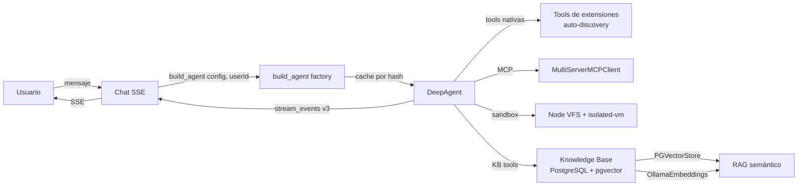

# Knowledge Agent — Arquitectura

## Componentes propuestos (8)

### Componente 1: Knowledge Base (PostgreSQL + pgvector)

- **Tabla `ext_ka_notes`**: `id` (uuid PK), `title` (varchar), `content_md`
  (text), `category_path` (ltree o path string indexado, jerarquía tipo
  `frontend/frameworks/react`), `tags` (jsonb array, transversales),
  `frontmatter` (jsonb, formato OKF: `type`, `sources`, `generated`),
  `embedding` (`vector(1536)`), `user_id` (FK a `iam` user, ownership),
  `created_at`, `updated_at`, `deleted_at` (soft delete), `deleted_by`
  (auditoría).
- **Tabla `ext_ka_note_links`**: `source_note_id`, `target_note_id`. Links
  extraídos del markdown (sintaxis `[[wiki-link]]` o `[text](rel:path)`),
  usados para backlinks y grafo.
- `PGVectorStore` de `langchainjs` para RAG semántico.
- Embeddings con `OllamaEmbeddings`.
- Re-embeddar cuando se edita una nota (si `content_md` cambia).
- **Formato OKF** (inspirado en OpenWiki): frontmatter con `type`, `tags`,
  `sources`, `generated`, `okf_version`.
- Frontend: TipTap editor que serializa a MD → guarda en DB → re-embedda.

### Componente 2: DeepAgent runtime (`deepagents` npm)

- `createDeepAgent` con factory function `build_agent(agent_config_id, userId)`
  que carga `systemPrompt` + tools + model desde DB.
- **Model string**: `"ollama:X"` o `"openrouter:z-ai/glm-5.2"` — configurable
  por agente en DB.
- **Agent.md dinámico**: tabla `ext_ka_agent_configs` (`id`, `name`,
  `system_prompt`, `model`, `provider`, `permissions` jsonb, `mcp_servers`
  jsonb).
- Reconstrucción por request con **cache por config hash** (no reconstruir si
  el hash no cambió).
- **Tools del agente**:
  - `search_notes_tree(categoryPath, depth)` — tree search por niveles, navega
    jerarquía de categorías eficientemente.
  - `search_notes_semantic(query, topK)` — RAG con pgvector, búsqueda semántica
    opt-in.
  - `create_note(title, content_md, category_path, tags?)` — crea nota,
    auto-genera embedding.
  - `update_note(note_id, content_md?, category_path?, tags?)` — edita nota,
    re-embedda si `content_md` cambia.
  - `delete_note(note_id)` — soft delete (`deleted_at`), con auditoría
    (`deleted_by`).
  - `execute(command, args)` — ejecuta comandos aislados en sandbox Node VFS.
  - Tools nativas de extensiones (auto-discovery).
  - Tools de MCP externos (`MultiServerMCPClient`).

### Componente 3: Sandbox Node VFS (dev + prod)

- `execute` tool con `SandboxBackend` Node VFS.
- **Permisos declarativos**: allow/deny + glob paths. Deny a `.env`, creds y
  código del proyecto.
- **Working dir aislado**: temp dir por session.
- `isolated-vm` para eval liviano (math, loops, scripts) sin shell/network.
- **Sin infra externa.** Node VFS para todo (dev + prod).

### Componente 4: Tools nativas de extensiones (auto-discovery)

- Cada extensión exporta tools como array de objetos LangChain `Tool` en
  `agent.tools.ts`.
- Convención: `<extension>/agent.tools.ts` → `export const tools: Tool[] = [...]`.
- Orchestrator module colecciona vía **glob auto-discovery** (mismo patrón que
  `ExtensionLoaderModule` de Foundation).
- Tools se mergean en el agente como **array unificado**. Cero overhead,
  in-process.
- El agente ve todas las tools como un array, sin distinguir origen.

### Componente 5: MCP externos configurables

- Tabla `ext_ka_mcp_servers` (`id`, `agent_config_id`, `name`, `transport`
  enum `http|stdio`, `url`, `api_key_ref`, `enabled`).
- `MultiServerMCPClient` de `@langchain/mcp-adapters` carga servers al
  construir el agente.
- Tools de MCP se mergean con tools nativas en el array unificado.
- Solo para servicios externos de terceros. Configurables desde UI.

### Componente 6: Chat con sesiones por usuario

- `PostgresSaver` checkpointer de LangGraph = sesiones persistentes en
  PostgreSQL.
- Tabla `ext_ka_chat_sessions` (`id`, `agent_config_id`, `user_id` FK,
  `title`, `created_at`, `updated_at`).
- **Aislamiento por usuario**: `user_id` en todas las queries; verificar
  ownership en cada endpoint.
- Un usuario **NO** puede ver, acceder o linkear a sesiones de otro usuario
  (403).
- El agente corre con `userId` en el state de LangGraph.
- **Streaming SSE** desde NestJS hacia Nuxt (`stream_events v3`).
- **Render rich**: `markdown-it` + `highlight.js` + `DOMPurify` (código, HTML,
  markdown) estilo ChatGPT.

### Componente 7: Config en DB (modelo/proveedor/api)

- Tabla `ext_ka_model_providers` (`id`, `name`, `provider` enum
  `ollama|openrouter`, `api_key_ref`, `base_url`, `enabled`).
- Tabla `ext_ka_models` (`id`, `provider_id`, `model_id`, `display_name`,
  `context_window`, `active`).
- Frontend cambia modelo/proveedor por agente. El agente se reconstruye con el
  nuevo model string.

### Componente 8: Visores (árbol + grafo)

- **Visor árbol**: sidebar jerárquico mostrando `category_path`.
  Expandir/colapsar. Click en nota → abre editor.
- **Visor grafo**: `d3-force` portado a Vue 3. Usa `d3-force`, `d3-selection`,
  `d3-zoom` + SVG.
  - Force simulation: `forceLink` (links entre notas), `forceManyBody`
    (repulsión), `forceCollide` (no overlap), `forceX`/`forceY` (centrado).
  - Zoom/pan con `d3-zoom`.
  - Nodos con radio según degree (conexiones).
  - Hover: highlight vecinos, dim resto.
  - Selected: halo glow, panel lateral con backlinks.
  - Search + filter por categoría.
  - Drag para fijar posición.
  - Panel lateral: título, tags, vínculos bidireccionales (backlinks).
  - Datos del endpoint `/api/knowledge/graph` (nodos + edges).

## Diagrama de flujo

## Paths propuestos

### Backend (`apps/back/src/extensions/knowledge-agent/`)

| Path                                         | Rol                                       |
|----------------------------------------------|-------------------------------------------|
| `extension.module.ts`                        | Auto-discovered module                    |
| `agent.tools.ts`                             | Tools exportadas a otros agentes (convención) |
| `domain/note.ts`                             | Dominio nota                              |
| `domain/agent-config.ts`                     | Dominio config de agente                  |
| `infrastructure/persistence/entities/...`    | Entities TypeORM                          |
| `infrastructure/persistence/relational/...`  | Repositories + mappers                    |
| `application/agent.factory.ts`               | `build_agent(agent_config_id, userId)`    |
| `application/sandbox/node-vfs.sandbox.ts`    | Sandbox Node VFS                          |
| `application/sandbox/isolated-vm.eval.ts`    | Eval con isolated-vm                      |
| `application/tools/*.tool.ts`                | Tools del agente (search, create, etc.)   |
| `application/mcp/multi-server.client.ts`     | MultiServerMCPClient loader               |
| `presentation/knowledge.controller.ts`       | CRUD notas + graph endpoint               |
| `presentation/chat.controller.ts`            | Chat SSE + sesiones                       |
| `presentation/config.controller.ts`          | Config UI endpoints                       |
| `seeds/...`                                  | Seeds idempotentes                        |

### Frontend (`apps/front/modules/knowledge/` como Nuxt layer)

| Path                                       | Rol                                       |
|--------------------------------------------|-------------------------------------------|
| `pages/index.vue`                           | Layout: sidebar árbol + editor + grafo    |
| `pages/chat/[sessionId].vue`               | Vista de chat                             |
| `pages/admin/agents/[id].vue`              | Config de agente                          |
| `components/TipTapEditor.vue`               | Editor markdown → TipTap                  |
| `components/NoteTreeView.vue`              | Visor árbol de categorías                 |
| `components/GraphView.vue`                 | Visor grafo d3-force                      |
| `components/ChatStream.vue`                 | Chat con streaming SSE                    |
| `components/RichMessage.vue`               | Render rich (markdown-it + hljs + DOMPurify) |
| `composables/useKnowledgeGraph.ts`         | Fetch + cache de grafo                    |
| `composables/useChatStream.ts`             | SSE client + state de sesión              |