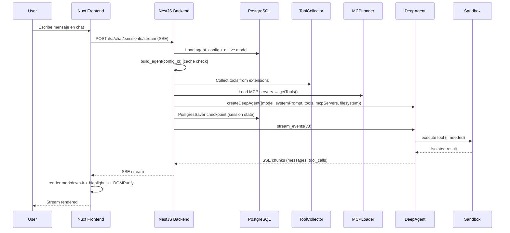

# Arquitectura

## Estado actual

**No existe.** Extensión greenfield. No hay código previo de knowledge-agent en `apps/back/src/extensions/` ni en `apps/front/extensions/`.

## Arquitectura propuesta — 7 componentes

```mermaid
flowchart TD
  subgraph Front[Nuxt Frontend]
    TipTap[TipTap Editor<br/>RichEditor base]
    Tree[Visor Arbol<br/>sidebar jerárquico]
    Graph[Visor Grafo<br/>d3-force]
    Chat[Chat UI<br/>SSE + render rich]
    Admin[Admin Panel<br/>modelos, MCP, agent configs]
  end

  subgraph Back[NestJS Backend]
    KB[Knowledge Base Service<br/>CRUD notas + embedding + categorías/tags]
    TreeSearch[Tree Search Tool<br/>search_notes_tree]
    SemSearch[Semantic Search Tool<br/>search_notes_semantic]
    RAG[RAG Service<br/>PGVectorStore similarity search]
    AgentFactory[Agent Factory<br/>build_agent config_id]
    Sandbox[Sandbox Service<br/>execute tool aislado]
    ToolCollector[Tool Collector<br/>auto-discovery agent.tools.ts]
    MCP[MCP Loader<br/>MultiServerMCPClient]
    ChatSvc[Chat Service<br/>PostgresSaver + SSE stream]
    ConfigSvc[Config Service<br/>modelos, providers, agent configs]
  end

  subgraph DB[(PostgreSQL + pgvector)]
    Notes[ext_ka_notes<br/>content_md + frontmatter + embedding]
    Sessions[ext_ka_chat_sessions]
    AgentCfg[ext_ka_agent_configs]
    MCPSrv[ext_ka_mcp_servers]
    Models[ext_ka_models]
    Providers[ext_ka_model_providers]
  end

  TipTap -->|save| KB
  Tree -->|query| KB
  Graph -->|query links/backlinks| KB
  Chat -->|stream| ChatSvc
  Admin -->|CRUD| ConfigSvc

  KB -->|embed on save| RAG
  RAG --> Notes
  AgentFactory -->|load config| AgentCfg
  AgentFactory -->|load tools| ToolCollector
  AgentFactory -->|load MCP tools| MCP
  AgentFactory -->|resolve model| Models
  MCP --> MCPSrv
  ChatSvc --> AgentFactory
  ChatSvc --> Sessions
  Sandbox -->|isolated exec| AgentFactory
```

### Componente 1 — Knowledge Base (PostgreSQL + pgvector)

Tabla `ext_ka_notes`: `id`, `title`, `content_md` (text), `frontmatter` (jsonb OKF: type, title, description, tags, sources, generated, okf_version), `embedding` (vector(1536)), `createdAt`, `updatedAt`.

- **RAG**: `PGVectorStore` (langchainjs) con extensión `pgvector` de PostgreSQL. Embeddings con `OllamaEmbeddings` (configurable).
- **Frontend**: `RichEditor` (TipTap, base `@base/ui-app`) serializa a markdown. Visor árbol (sidebar jerárquico por tags/categorías). Visor grafo (vue-flow o cytoscape — nodos = notas, edges = links `[[]]`, backlinks desde query SQL reversa).
- **Formato OKF**: inspirado en OpenWiki. YAML frontmatter con `type`, `title`, `description`, `tags`, `sources`, `generated`, `okf_version`. Links entre notas en markdown estándar `[[]]`.
- **Re-embeddar**: cuando se edita una nota, se regenera el embedding.

### Componente 2 — DeepAgent runtime (deepagents npm)

`createDeepAgent({ model, systemPrompt, tools, filesystem, mcpServers })` con factory function `build_agent(agent_config_id)`:

1. Carga `systemPrompt` desde `ext_ka_agent_configs` (agent.md dinámico en DB, no archivo fijo).
2. Carga `tools` desde `ToolCollector` (tools de extensiones) + `MCPLoader` (tools de MCP externos).
3. Resuelve `model` string desde `ext_ka_models` → `"provider:model"` (ej: `"ollama-cloud:glm-5.2"`, `"openrouter:z-ai/glm-5.2"`).
4. Cache por config hash. No hot-swap — se reconstruye por request si config cambió.

### Componente 3 — Sandbox de comandos aislados

`execute` tool con `SandboxBackend` (deepagents):

- **Dev**: Node VFS (virtual filesystem).
- **Prod**: Daytona (cloud microVM) [NEEDS CLARIFICATION: ver Q-04 — ¿Daytona o Modal serverless?].
- **Permisos declarativos**: deny a `.env`, creds, código del proyecto (`apps/`, `packages/`, `src/`). Allow paths explícitos (tmp, workspace sandbox).
- **Eval liviano**: `isolated-vm` (QuickJS Node-native) para math/scripts sin overhead de microVM.

### Componente 4 — Tools de extensiones (auto-discovery)

Cada extensión puede exportar tools en archivo convención: `<extension>/agent.tools.ts` → exporta array de LangChain tools.

- **Orchestrator module** (`ToolCollector`) colecciona via glob auto-discovery (mismo patrón que `ExtensionLoaderModule` — no tocar `app.module.ts`).
- Tools se mergean en el agente al construirlo.
- Convención: si el archivo no existe, la extensión simplemente no aporta tools (graceful).

### Componente 5 — MCP externos configurables

Tabla `ext_ka_mcp_servers`: `id`, `agent_config_id` (FK), `name`, `transport` (enum: http | stdio), `url`, `api_key_ref` (referencia a env var, no valor directo), `enabled`, `createdAt`.

- `MultiServerMCPClient({ server: { transport, url } }).getTools()` → array de tools → mergear con tools custom en `build_agent`.
- Configurable desde frontend admin panel.

### Componente 6 — Chat con sesiones

`PostgresSaver` checkpointer (langchainjs) = sesiones persistentes en PostgreSQL.

Tabla `ext_ka_chat_sessions`: `id`, `agent_config_id`, `title`, `createdAt`, `updatedAt`.

- **Streaming**: `stream_events(version="v3")` → SSE (Server-Sent Events) desde NestJS hacia Nuxt. Typed projections: messages, tool_calls, values.
- **Render rich frontend**: consumir SSE stream → markdown con `markdown-it`, code blocks con `highlight.js`, HTML sanitizado con `DOMPurify`. No hay lib oficial Vue — adaptar patrones.

### Componente 7 — Config en DB (modelo/proveedor/api)

Tabla `ext_ka_model_providers`: `id`, `name`, `provider` (enum: ollama | openrouter | [NEEDS CLARIFICATION: openai? anthropic?]), `api_key_ref`, `base_url`, `createdAt`.

Tabla `ext_ka_models`: `id`, `provider_id` (FK), `model_id` (string ej: `glm-5.2`), `display_name`, `context_window` (int), `active` (boolean), `createdAt`.

- Frontend cambia modelo/proveedor por agente via admin panel.
- `build_agent` resuelve model string desde config activa.

## Flujo del agente



## Flujo de datos — Knowledge Base

```mermaid
flowchart LR
  E[Editor TipTap] -->|serialize MD| S[KB Service]
  S -->|parse frontmatter| F[OKF YAML]
  S -->|save content_md + frontmatter| DB[(ext_ka_notes)]
  S -->|embed| O[OllamaEmbeddings]
  O -->|vector 1536| DB
  S -->|extract links [[]]| L[Links index]
  L -->|query backlinks| GV[Visor Grafo]
  DB -->|PGVectorStore search| RAG[RAG Service]
  RAG -->|top-k notas| A[DeepAgent context]
```

## Componentes afectados — paths propuestos

### Backend — `apps/back/src/extensions/knowledge-agent/`

| Componente | Path | Rol |
|------------|------|-----|
| `ExtensionModule` | `extension.module.ts` | Auto-discovered. Registra entities, services, controllers. |
| `NotesService` | `services/notes.service.ts` | CRUD notas, embedding on save, link extraction. |
| `NotesController` | `controllers/notes.controller.ts` | `GET/POST/PATCH/DELETE /ka/notes/*` |
| `RagService` | `services/rag.service.ts` | PGVectorStore similarity search. |
| `AgentFactoryService` | `services/agent-factory.service.ts` | `build_agent(config_id)` con cache. |
| `ToolCollectorService` | `services/tool-collector.service.ts` | Glob auto-discovery de `agent.tools.ts`. |
| `McpLoaderService` | `services/mcp-loader.service.ts` | MultiServerMCPClient desde DB config. |
| `SandboxService` | `services/sandbox.service.ts` | Execute tool con SandboxBackend. |
| `ChatService` | `services/chat.service.ts` | PostgresSaver + SSE stream. |
| `ChatController` | `controllers/chat.controller.ts` | `POST /ka/chat/:sessionId/stream` (SSE). |
| `ConfigService` | `services/config.service.ts` | CRUD modelos, providers, agent configs. |
| `ConfigController` | `controllers/config.controller.ts` | `GET/PATCH /ka/config/*` |
| Entities | `infrastructure/persistence/entities/` | `notes`, `chat-sessions`, `agent-configs`, `mcp-servers`, `models`, `model-providers` |

### Frontend — `apps/front/extensions/knowledge-agent/`

| Componente | Path | Rol |
|------------|------|-----|
| `KaNotesPage` | `pages/app/ka/notes/index.vue` | Lista notas con `DataTable` base. |
| `KaNoteEditor` | `pages/app/ka/notes/[id]/edit.vue` | `RichEditor` (TipTap) + `FormInput` título + frontmatter editor. |
| `KaGraphView` | `pages/app/ka/graph.vue` | Visor grafo (vue-flow o cytoscape). |
| `KaTreeView` | `components/KaTreeSidebar.vue` | Sidebar jerárquico por tags/categorías. |
| `KaChatPage` | `pages/app/ka/chat.vue` | Chat UI con SSE stream + render rich. |
| `KaChatMessage` | `components/KaChatMessage.vue` | Render markdown-it + highlight.js + DOMPurify. |
| `KaAdminPanel` | `pages/app/ka/admin.vue` | Config modelos, providers, MCP servers, agent configs. |
| `useKa` | `composables/useKa.ts` | TanStack Query keys + hooks. |

## Decisiones técnicas

### D-01 — pgvector en PostgreSQL (✅ Always)

Embedding del contenido markdown para RAG. `PGVectorStore` de langchainjs + `OllamaEmbeddings`. Vector(1536). Alternativa: Qdrant externo (descartada: añade infra obligatoria, Postgres ya está).

### D-02 — deepagents npm sobre LangGraph (✅ Always)

`createDeepAgent` con factory `build_agent(config_id)`. Agente único (no supervisor). Alternativa: orquestador + subagentes (descartada por requisito del usuario: patrón agente único con tools de extensiones).

### D-03 — Agent.md dinámico en DB (✅ Always)

`ext_ka_agent_configs` guarda systemPrompt como text. No archivo fijo. Factory carga de DB. Alternativa: archivo `AGENTS.md` fijo (descartada: no es modificable sin deploy).

### D-04 — Auto-discovery de tools (✅ Always)

Convención `<extension>/agent.tools.ts` → array de LangChain tools. Glob auto-discovery (mismo patrón que `ExtensionLoaderModule`). Alternativa: registro manual en module (descartada: viola auto-discovery principle).

### D-05 — PostgresSaver para sesiones (✅ Always)

`PostgresSaver` checkpointer = sesiones persistentes en PostgreSQL. Alternativa: MemorySaver (descartada: no persiste tras restart), Redis checkpointer (descartada: añade dep).

### D-06 — SSE streaming desde NestJS (✅ Always)

`stream_events(version="v3")` → SSE. NestJS expone endpoint SSE. Frontend Nuxt consume con EventSource. Alternativa: WebSocket (descartada: SSE más simple para unidireccional server→client).

### D-07 — Sandbox con Node VFS (dev) + Daytona (prod) (⚠️ Ask first)

`SandboxBackend` con Node VFS en dev, Daytona microVM en prod. `isolated-vm` para eval liviano. Alternativa prod: Modal serverless (descartada por ahora — ver Q-04).