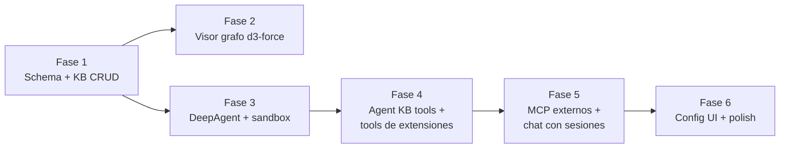

# Knowledge Agent — Fases de Migración

6 fases incrementales. Cada fase es independiente y entregable. Se implementa
tras la anterior sin rollback global (cada fase deja el sistema funcional).

## Diagrama de orden

## Fase 1: Schema + Knowledge Base CRUD

**Objetivo**: Knowledge base funcional con notas en PostgreSQL, embeddings
generados, editor básico.

**Entregables**:
- Crear extensión `knowledge-agent` con generador Hygen
  (`pnpm generate:extension`).
- Migraciones: `ext_ka_notes`, `ext_ka_note_links`, indexes (pgvector,
  `category_path`, `user_id`).
- Backend: CRUD service/controller para notas con `user_id` filter.
- Re-embed on create/update (`OllamaEmbeddings`).
- Frontend: editor TipTap + visor árbol básico (sidebar jerárquico).

**Criterio de salida**:
- [ ] CRUD de notas funciona (crear, leer, editar, soft delete).
- [ ] Embeddings se generan al crear/editar.
- [ ] `category_path` jerárquico navegable.
- [ ] Visor árbol expande/colapsa categorías.
- [ ] Tests backend pasan (≥ 80% cobertura módulo).

**Riesgos**: Q-01 (LTREE vs path string), Q-10 (TipTap extensions).

## Fase 2: Visor grafo d3-force

**Objetivo**: Grafo visual de notas con nodos, links, zoom/pan, panel lateral.

**Entregables**:
- Port de demo React + d3-force a Vue 3 component (`GraphView.vue`).
- Endpoint `GET /api/knowledge/graph` (nodos + edges).
- `forceLink`, `forceManyBody`, `forceCollide`, `forceX`/`forceY`.
- Zoom/pan con `d3-zoom`.
- Panel lateral con backlinks (vínculos bidireccionales).
- Search + filter por categoría.
- Hover: highlight vecinos, dim resto. Selected: halo glow.
- Drag para fijar posición.

**Criterio de salida**:
- [ ] Grafo renderiza notas como nodos con radio por degree.
- [ ] Hover/selected/drag funcionan.
- [ ] Zoom/pan fluido (≥ 30 FPS hasta 500 nodos).
- [ ] Panel lateral muestra backlinks al seleccionar nodo.
- [ ] Search + filter por categoría funcionan.

**Riesgos**: R-05 (SVG > 1000 nodos), Q-09 (canvas/WebGL si escala).

## Fase 3: DeepAgent runtime + sandbox

**Objetivo**: Agente ejecuta comandos aislados, carga config de DB.

**Entregables**:
- Instalar `deepagents` npm + dependencias LangChain (ver Q-06 antes).
- `build_agent(agent_config_id, userId)` factory (carga config de DB, construye
  agente con cache por config hash).
- Sandbox Node VFS + `isolated-vm`.
- `execute(command, args)` tool con permisos declarativos.
- Tabla `ext_ka_agent_configs` (agent.md dinámico en DB).
- Reconstrucción por request + cache por config hash.

**Criterio de salida**:
- [ ] Agente se construye desde config en DB.
- [ ] `execute` tool ejecuta comandos en working dir aislado.
- [ ] Permisos deny bloquean `.env`, creds, código del proyecto.
- [ ] `isolated-vm` evalúa scripts sin shell/network.
- [ ] Cache por config hash funciona (hit/miss logs).

**Riesgos**: Q-06 (nombres paquetes), Q-07 (Ollama Cloud URL), Q-08 (compat
Node.js).

## Fase 4: Agent KB tools + tools de extensiones

**Objetivo**: Agente busca, crea, edita y elimina notas. Tools de extensiones
se auto-discoverean.

**Entregables**:
- Tools: `search_notes_tree`, `search_notes_semantic`, `create_note`,
  `update_note`, `delete_note`.
- Re-embed on create/update desde tools del agente.
- Auto-discovery de `agent.tools.ts` en cada extensión (glob, mismo patrón que
  `ExtensionLoaderModule`).
- Merge tools nativas en agente como array unificado.

**Criterio de salida**:
- [ ] Agente busca notas por árbol (`search_notes_tree`).
- [ ] Agente busca notas semánticamente (`search_notes_semantic`, pgvector).
- [ ] Agente crea/edita/elimina notas vía tools.
- [ ] `delete_note` hace soft delete + auditoría.
- [ ] Tools de extensiones se auto-discoverean vía `agent.tools.ts`.
- [ ] Tools se mergean en array unificado en el agente.

**Riesgos**: R-01 (agente elimina notas importantes).

## Fase 5: MCP externos + chat con sesiones

**Objetivo**: Chat funcional con sesiones aisladas por usuario, MCP externo
configurable, streaming SSE.

**Entregables**:
- Tabla `ext_ka_mcp_servers` (config de servers externos).
- `MultiServerMCPClient` carga servers al construir agente.
- `PostgresSaver` checkpointer (sesiones persistentes en PostgreSQL).
- Tabla `ext_ka_chat_sessions` (con `user_id`, aislamiento por usuario).
- Streaming SSE desde NestJS (`stream_events v3`).
- Render rich frontend (`markdown-it` + `highlight.js` + `DOMPurify`).
- Verificar ownership en cada endpoint (403 si no match).

**Criterio de salida**:
- [ ] Chat funciona con streaming SSE.
- [ ] Sesiones aisladas por usuario (test cross-user → 403).
- [ ] `PostgresSaver` persiste sesiones.
- [ ] Render rich muestra código, HTML y markdown sanitizado.
- [ ] MCP server externo configurable y sus tools se mergean en el agente.
- [ ] Reanudar sesión carga historial previo.

**Riesgos**: R-02 (cross-user leakage), R-07 (paquetes MCP).

## Fase 6: Config UI + polish

**Objetivo**: Config completa de agente, modelos, proveedores y MCP servers
desde UI. RBAC aplicado.

**Entregables**:
- Tablas `ext_ka_model_providers`, `ext_ka_models`.
- UI para gestionar configs de agente (`system_prompt`, `model`, `provider`).
- UI para gestionar modelos y proveedores.
- UI para gestionar MCP servers.
- RBAC sobre todos los endpoints de config.
- Reconstrucción de agente al cambiar config (invalidate cache).

**Criterio de salida**:
- [ ] Admin cambia modelo/proveedor de agente desde UI.
- [ ] Agente se reconstruye con nuevo model string al cambiar config.
- [ ] `api_key_ref` guarda referencia (no valor plano).
- [ ] RBAC permite solo admin gestionar configs.
- [ ] Tests E2E de config UI pasan.

**Riesgos**: ninguno nuevo.

## Estrategia de rollback

- Cada fase es independiente: si Fase N falla, Fase N-1 queda funcional.
- Migraciones con `pnpm migration:revert` (una migración atrás).
- Soft delete en notas permite recuperación sin rollback.
- No hay migración de datos desde .md a DB (knowledge base nueva, vacía).