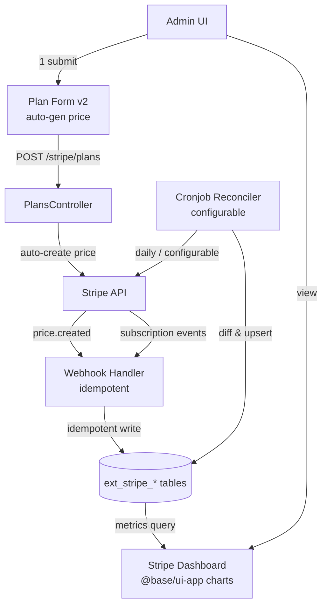

# Arquitectura

## Estado actual

Extensión **ya implementada** en `apps/back/src/extensions/stripe/` (manifest, module, config, provider, 5 entidades, 5 services, 8 controllers, PlanGuard). Front en `apps/front/extensions/stripe/` (alias `@stripe`), con `StripeDashboard.vue`, `useStripe.ts` (TanStack Query keys), página `/app/settings/stripe-test.vue`. E2E en `tests/e2e/stripe/`.

### Backend — componentes actuales

```
apps/back/src/extensions/stripe/
├── extension.module.ts            TypeOrmModule.forFeature(5 entities)
├── extension.manifest.ts          25 rutas, 5 entidades
├── extension.config.ts            registerAs('stripe')
├── stripe.provider.ts             Stripe SDK condicional (null si no keys)
├── services/
│   ├── stripe.service.ts          666 LOC — checkout, portal, webhooks, invoices
│   ├── products.service.ts
│   ├── prices.service.ts
│   ├── plans.service.ts
│   ├── subscriptions.service.ts
│   ├── webhooks.service.ts        15 LOC — delega a stripe.service
│   └── pdf-invoice.service.ts
├── controllers/
│   ├── products / prices / plans / subscriptions
│   ├── checkout / invoices / webhooks
│   └── stripe-test.controller.ts  Test mode (sin keys)
├── middleware/plan-guard.ts       PlanGuard + @RequiredFeature
└── infrastructure/persistence/entities/
    ├── product / price / plan / subscription / usage-record
```

### Frontend — componentes actuales

```
apps/front/extensions/stripe/
├── components/StripeDashboard.vue
├── composables/useStripe.ts       TanStack Query keys + hooks
└── pages/app/settings/stripe-test.vue
```

### Huecos detectados

| Hueco | Evidencia |
|-------|-----------|
| Sin dashboards de métricas | No hay `charts/` usage en stripe front |
| Sin auto-gen de price | `create-plan.dto` solo enlaza `priceId` FK ya existente |
| Sin cronjobs | No hay `@Cron`/`@Processor` en `apps/back` (grep vacío) |
| Sin idempotencia webhooks | `handleCheckoutCompleted` hace `findOne` pero no persiste `event.id` procesado |
| Sin reconciliación | No hay sync periódica local ↔ Stripe |

## Flujo de datos — actual + propuesto



## Componentes afectados

### Backend — nuevos

| Componente | Path propuesto | Rol |
|------------|----------------|-----|
| `MetricsService` | `apps/back/src/extensions/stripe/services/metrics.service.ts` | Agregaciones: MRR, ARR, churn, revenue por plan |
| `MetricsController` | `apps/back/src/extensions/stripe/controllers/metrics.controller.ts` | `GET /stripe/metrics/*` (admin) |
| `SyncService` | `apps/back/src/extensions/stripe/services/sync.service.ts` | Pull subscriptions/products desde Stripe, diff & upsert |
| `SyncSchedulerService` | `apps/back/src/extensions/stripe/services/sync-scheduler.service.ts` | `@Cron` configurable desde `ext_stripe_sync_config` |
| `WebhookEventEntity` | `apps/back/src/extensions/stripe/infrastructure/persistence/entities/webhook-event.entity.ts` | Tabla `ext_stripe_webhook_event` — idempotencia |
| `SyncConfigEntity` | `apps/back/src/extensions/stripe/infrastructure/persistence/entities/sync-config.entity.ts` | Tabla `ext_stripe_sync_config` — schedule + toggles |

### Backend — modificados

| Componente | Cambio |
|------------|--------|
| `PlansService` | `create()` recibe `productLookupKey` + price fields → crea Price en Stripe → enlaza `priceId` |
| `stripe.service.ts` | `handleWebhookEvent` chequea `WebhookEventEntity` antes de procesar (idempotencia) |
| `extension.module.ts` | Registra 2 nuevas entities + `@nestjs/schedule` module |
| `extension.manifest.ts` | Añade rutas `stripe/metrics/*`, `stripe/sync/*`, `stripe/sync/config` |

### Frontend — nuevos

| Componente | Path propuesto | Rol |
|------------|----------------|-----|
| `StripeMetricsPage` | `@stripe/pages/app/stripe/metrics.vue` | Dashboard admin con StatCard × 5, TrendChart, BarChart, Donut, Gauge |
| `PlanFormV2` | `@stripe/components/PlanFormV2.vue` | Form con `LinkedSelect` product→price + auto-gen toggle |
| `SyncConfigPanel` | `@stripe/components/SyncConfigPanel.vue` | `CronScheduleEditor` + `WeekdayPicker` para schedule |
| `useStripeMetrics` | `@stripe/composables/useStripe` (ext) | TanStack Query `useStripeMetricsQuery` |

### Frontend — modificados

| Componente | Cambio |
|------------|--------|
| `StripeDashboard.vue` | Añade sección "Métricas" → link a `metrics.vue` |

## Matriz de uso — componentes base-ui → Stripe

| Componente base | FR base | Uso en Stripe | Sección |
|-----------------|---------|---------------|---------|
| StatCard | FR-001 | MRR, ARR, subs activas, trials, fallos pago | Dashboard |
| TrendChart | FR-002 | MRR/ARR últimos 12 meses | Dashboard |
| BarChartCard | FR-003 | Revenue por plan | Dashboard |
| DonutChartCard | FR-004 | Distribución status suscripciones (active/past_due/canceled/trialing) | Dashboard |
| GaugeChartCard | FR-005 | Churn rate % | Dashboard |
| CronScheduleEditor | FR-010 | Schedule sync/reconciliación | SyncConfigPanel |
| WeekdayPicker | FR-011 | Sub-componente de CronScheduleEditor weekly mode | SyncConfigPanel |
| LinkedSelect | FR-021 | Product → Price en PlanFormV2 | Form automatizado |

## Decisiones técnicas

### D-01 — Idempotencia vía tabla `ext_stripe_webhook_event` (✅ Always)

Antes de procesar un evento, persistir `(event.id, status=processing)`. Si ya existe → no-op. Tras procesar → `status=done|failed`. Alternativa: idempotency key en Redis (descartada: añade infra obligatoria).

### D-02 — Sync schedule persistido en DB (✅ Always)

`ext_stripe_sync_config` (1 fila) guarda cron string, enabled, lastRunAt. `SyncSchedulerService` lee config en boot + expone refresh. Alternativa: env var estática (descartada: no configurable desde UI).

### D-03 — `@nestjs/schedule` para cron (⚠️ Ask first)

Dep nueva. Verificar si ya está en `apps/back/package.json` (grep no encontrado). Si no → añadir. Alternativa: Bull queue con job recurrente (más pesado, ya existe infra Bull en mono).

### D-04 — Auto-gen price en `PlansService.create` (✅ Always)

`POST /stripe/plans` con flag `autoGeneratePrice: true` → service crea product (si no existe) + price en Stripe, persiste local, enlaza. Si flag false → flujo actual (FK manual).

### D-05 — Dashboard metrics query directa a DB (✅ Always)

`MetricsService` hace queries SQL sobre `ext_stripe_subscription` + `ext_stripe_plan` + `ext_stripe_price`. No cache Redis (dataset pequeño, < 100k suscripciones). Agregación en query, no en memoria.