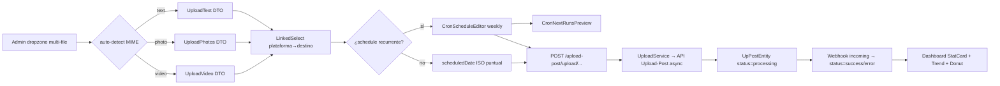

# Arquitectura

## Arquitectura actual

```
apps/back/src/extensions/upload-post/
├── extension.module.ts          NestJS module (auto-discovered)
├── extension.manifest.ts        43 rutas declaradas, 4 entidades
├── extension.config.ts          registerAs('upload-post') + env validation
├── upload-post.provider.ts      DI token para config
├── infrastructure/persistence/entities/
│   ├── up-post.entity.ts                  ext_uploadpost_post
│   ├── up-post-analytics-snapshot.entity.ts  ext_uploadpost_analytics_snapshot
│   ├── up-post-autodm-monitor.entity.ts      ext_uploadpost_autodm_monitor
│   └── up-post-content-idea.entity.ts        ext_uploadpost_content_idea
├── services/
│   ├── upload-post-client.service.ts      HTTP wrapper API Upload-Post (16kb)
│   ├── upload.service.ts                  Upload + sync local DB
│   ├── schedule.service.ts                List/update/cancel scheduled
│   ├── analytics.service.ts               Live + @Cron dailySnapshot 23:00
│   ├── autodm.service.ts                  AutoDM lifecycle
│   ├── webhooks.service.ts                Webhook config + incoming handler
│   ├── queue.service.ts                   Queue preview/next-slot/settings
│   ├── weekly-report.service.ts           @Cron reporte semanal + email
│   ├── platforms.service.ts               FB/LinkedIn/Pinterest/GBP pages
│   ├── instagram.service.ts               Media/comments/DMs
│   ├── content-ideas.service.ts           Ideas CRUD + reorder + status
│   └── monthly-analytics.service.ts       Resumen mensual + top posts
├── controllers/  (11, todos @Roles(admin) salvo webhooks/incoming público)
└── dto/  (upload, autodm, common, content-idea, update-content-idea-status,
           update-queue-settings)

apps/front/extensions/upload-post/
├── nuxt.config.ts              compatibilityVersion 4, components, imports
├── composables/useUploadPost.ts  API wrapper para TODOs los endpoints
├── types.ts
└── pages/app/upload-post/
    ├── index.vue      Calendar (scheduled + local posts)
    ├── upload.vue     Form manual de upload
    ├── analytics.vue  Métricas por plataforma (crudas)
    ├── monthly.vue    Resumen mensual
    ├── ideas.vue      Content ideas kanban-like
    ├── autodms.vue    AutoDM table
    ├── instagram.vue  IG media/comments/DMs
    ├── platforms.vue  Pages/boards/locations
    ├── queue.vue      Queue preview/settings
    └── webhooks.vue   Webhook config
```

**RBAC**: todos los controllers usan `@UseGuards(AuthGuard('jwt'), RolesGuard)` +
`@Roles(RoleEnum.admin)`. Frontend: `middleware: ['auth', 'admin']`. Único
endpoint público: `POST /upload-post/webhooks/incoming`.

**Crons activos** (`@nestjs/schedule`, registrado globalmente):

| Cron | Schedule | Origen |
|------|----------|--------|
| `dailySnapshot` | `0 23 * * *` | `AnalyticsService` |
| `cleanupOldSnapshots` | `0 2 * * 0` | `AnalyticsService` |
| `scheduledSendReport` | `UPLOAD_POST_WEEKLY_REPORT_CRON` (default `0 9 * * 1`) | `WeeklyReportService` |

**Colas Bull**: `@nestjs/bullmq` + `bullmq` instalados. La extensión NO usa colas
propias hoy — los uploads async se delegan a la API Upload-Post (que gestiona su
propio queue). Q-001 evalúa si mover el procesamiento local a una cola Bull para
retry/observabilidad.

## Flujo de datos (actual)

```
[Admin UI] POST /upload-post/upload/video
   └── UploadService.uploadVideo
        ├── persiste UpPostEntity status=pending|scheduled
        ├── UploadPostClientService.uploadVideo (asyncUpload: true)
        │      → API Upload-Post devuelve { request_id, job_id }
        ├── guarda request_id/job_id, status=processing
        └── catch → status=error + errorMessage

[Admin UI] GET /upload-post/upload/status?requestId=…
   └── UploadService.checkStatus
        ├── client.getUploadStatus
        └── sync local DB: success/error + results + publishedAt

[Upload-Post] POST /upload-post/webhooks/incoming  (público)
   └── WebhooksService.handleIncoming → evento (status, results)

[@Cron 23:00] dailySnapshot
   └── AnalyticsService: fetch analytics → upsert snapshot por plataforma

[@Cron 0 9 * * 1] scheduledSendReport
   └── WeeklyReportService.generate → renderEmailBody → QueuedMailerService
```

## Arquitectura propuesta (sobre la existente)

```
[Frontend] pages/app/upload-post/
├── index.vue        Dashboard uploads (StatCard + Trend + Bar + Donut)
├── analytics.vue    Dashboard analytics (StatCard + Trend + Bar + Donut)
├── upload.vue       Form automatizado (FormMultipleFile + auto-detect + LinkedSelect)
├── schedule.vue     NUEVA: editor visual de schedules recurrentes
│                    (CronScheduleEditor + WeekdayPicker + CronNextRunsPreview)
└── settings.vue     NUEVA: config de cron del reporte semanal + timezone

[Frontend] components/ (extensions/upload-post/components/)
├── UploadDropzone.vue        wrapper sobre FormMultipleFile + auto-detect MIME
├── PlatformDestinationSelect.vue  wrapper sobre LinkedSelect (plataforma→destino)
└── SchedulePreviewCard.vue   wrapper sobre CronNextRunsPreview + tz

[Backend] services/  (extensión puntual)
├── upload.service.ts           add: auto-extract metadata (título desde filename,
│                               caption desde EXIF/first-frame), auto-tag
├── schedule.service.ts         add: createRecurring(cron, content, untilDate)
├── dashboard.service.ts        NUEVO: agregaciones para StatCards/Trend/Bar/Donut
└── settings.service.ts         NUEVO: leer/escribir UPLOAD_POST_WEEKLY_REPORT_CRON
                                persistido (env override → DB config)

[Backend] controllers/
├── dashboard.controller.ts     NUEVO: GET /upload-post/dashboard/uploads
│                                       GET /upload-post/dashboard/analytics
└── settings.controller.ts      NUEVO: GET/PUT /upload-post/settings
```

## Componentes afectados

| Componente | Cambio | Tipo |
|------------|--------|------|
| `extensions/upload-post/pages/.../index.vue` | Añadir dashboard uploads | Modificar |
| `extensions/upload-post/pages/.../analytics.vue` | Añadir dashboard analytics | Modificar |
| `extensions/upload-post/pages/.../upload.vue` | Refactor a form automatizado | Modificar |
| `extensions/upload-post/pages/.../schedule.vue` | NUEVO | Crear |
| `extensions/upload-post/pages/.../settings.vue` | NUEVO | Crear |
| `extensions/upload-post/composables/useUploadPost.ts` | Añadir endpoints dashboard/settings/schedule-recurring | Modificar |
| `extensions/upload-post/types.ts` | Añadir tipos dashboard DTOs | Modificar |
| `services/dashboard.service.ts` | NUEVO | Crear (generador `pnpm generate:extension`) |
| `services/settings.service.ts` | NUEVO | Crear |
| `controllers/dashboard.controller.ts` | NUEVO | Crear |
| `controllers/settings.controller.ts` | NUEVO | Crear |
| `dto/dashboard.dto.ts` | NUEVO | Crear |
| `dto/settings.dto.ts` | NUEVO | Crear |
| `i18n/locales/{es,en}/upload-post.json` | NUEVO | Crear |
| `UpPostEntity` | Añadir `tags: string[]`, `autoMetadata: jsonb` | `pnpm add:extension-property` |

## Matriz de uso (FR base → upload-post)

| FR base | Componente | Dónde se consume |
|---------|------------|------------------|
| FR-001 | StatCard | `index.vue` (uploads hoy/sem/mes, programados, éxito%), `analytics.vue` (followers, reach, views, engagement) |
| FR-002 | TrendChart | `index.vue` (uploads 30d), `analytics.vue` (reach/views 30d) |
| FR-003 | BarChartCard | `index.vue` (uploads por día), `analytics.vue` (reach por plataforma) |
| FR-004 | DonutChartCard | `index.vue` (distribución status), `analytics.vue` (share impresiones) |
| FR-010 | CronScheduleEditor | `settings.vue` (cron reporte semanal), `schedule.vue` (schedule recurrente) |
| FR-011 | WeekdayPicker | sub de CronScheduleEditor en `schedule.vue` |
| FR-012 | TimeWindowPicker | `schedule.vue` (ventana horaria publicación) |
| FR-013 | CronNextRunsPreview | `settings.vue` + `schedule.vue` |
| FR-021 | LinkedSelect | `upload.vue` (plataforma → Pinterest board / Reddit subreddit / GBP location) |

## Diagrama del flujo (propuesto)

